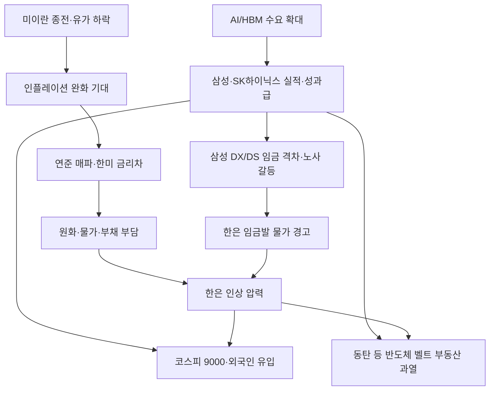

# 2026-06-19 Grok 심층 분석

## 분석 기준

- Gemini `01_gemini_phase1.md` Top 5(100·97·92·89·77점)를 임의 교체 없이 검증·보강
- 정부·공공기관·기업 공시·공식 발표 우선, Reuters·Bloomberg·CNBC 등 해외 경제 매체 및 국내 주요 언론 교차 확인
- 확인된 사실과 Grok 추론을 명시적으로 구분
- 분석 기준일: 2026-06-19 (KST)

---

## 1. 코스피 사상 첫 9000 돌파, AI 반도체 랠리 지속…1만 포인트 기대감 증폭

### Gemini 핵심 내용

- 6월 18일 코스피 장중·종가 9000선 돌파, 종가 9063.84
- 삼성전자(+4.62%), SK하이닉스(+6.51%) 주도, 시총 비중 약 60%
- 외국인 약 1조3000억원 순매수, 올해 상승률 115.1% G20 1위
- HBM4E 샘플 공급, 팀 쿡 메모리 가격 인상 발언, 금감원 레버리지 ETF 경보

### 추가 조사 결과

**AI 인프라 투자와 HBM 수요 (확인된 사실)**

- 엔비디아 회사채 발행, 구글·메타 유상증자 등 AI 데이터센터 투자 경쟁이 지속되고 있으며, 이는 HBM·고대역폭 메모리 수요의 구조적 동력으로 보도됨 (동아일보, 2026-06-18).
- SK하이닉스 HBM4E 12단 샘플을 주요 고객사에 공급 시작했다는 보도가 다수 매체에서 교차 확인됨 (동아일보, 2026-06-18).
- 팀 쿡 애플 CEO의 메모리 반도체 가격 폭등·제품 가격 인상 불가피 발언이 반도체 투자 심리에 긍정 요인으로 작용했다는 분석이 확인됨 (동아일보, 2026-06-18).
- 마이크론 6월 25일(현지) 실적 발표에서 장기공급계약(LTA) 구조 변화 여부가 메모리 산업 구조 전환의 관건으로 제시됨 (동아일보, 2026-06-18).

**코스피 1만 포인트 전망 (사실 + 추론)**

- 한국거래소 정은보 이사장이 9000 돌파 기념행사에서 "1만 포인트가 눈앞에 있다"고 발언 (더팩트, 2026-06-19).
- 증권가 1만~1만2천 포인트 전망은 Gemini와 일치하나, 이는 **전망치**이며 공식 전망이 아님.

**반도체 쏠림과 시장 건전성 (확인된 사실)**

- 6월 18일 코스피 상승 종목 112개, 하락 791개로 **상승 종목 비중 약 12.4%** (동아일보, 2026-06-18).
- 삼성전자·SK하이닉스 시총 비중 **56.9%** (동아일보, 2026-06-18) — Gemini의 "약 60%"와 근접하나 정확치는 56.9%.
- 코스닥은 3.01% 하락(1000.93)하며 코스피와 격차 확대 (동아일보, 2026-06-18).
- 금융감독원이 단일종목 레버리지 ETF에 소비자경보를 발령, "하루 최대 60% 손실" 가능성 경고 (매일경제 이슈, 2026-06-18).

### 교차 검증 및 수정 사항

| 항목 | Gemini | 교차 검증 결과 | 수정 |
|------|--------|----------------|------|
| 종가 | 9063.84 | 동아일보·더팩트 일치 | 유지 |
| 8000→9000 기간 | 16거래일(34일) | 동아일보: 16거래일, 34일 | 유지 |
| 외국인 순매수 | 약 1조3000억 | **1조2800억원** (동아일보) | **1조2800억으로 수정** |
| 시총 비중 | 약 60% | **56.9%** | **56.9%로 수정** |
| 상승 종목 비중 | 11.88% | 약 12.4%(112/903) | **12%대로 수정** |
| 올해 상승률 | 115.1% | 동아일보 일치 | 유지 |
| 삼성전자·SK하이닉스 등락 | +4.62%, +6.51% | 동아일보 일치 | 유지 |

### 국내외 보도 관점 차이

- **국내**: 9000 돌파를 AI·반도체 슈퍼사이클의 이정표로 환영, 1만 포인트 낙관론 확산.
- **해외·비판적 시각**: 아시아경제 등에서 "이러다 나만 빼고 다 부자" 조급한 개미 투자·외신 경고 보도. 쏠림·레버리지 ETF·빚투 리스크를 강조하는 관점 병존 (머니투데이, 2026-06-18).

### 시장 및 관련 기업 영향

- **주식**: 삼성전자(005930), SK하이닉스(000660), SK스퀘어, 삼성전기 등 AI 밸류체인 강세. 레버리지 ETF·파생상품 변동성 확대.
- **환율**: 연준 매파 기조에도 반도체 실적 기대가 외국인 유입을 견인. 달러 강세 시 수익 일부 상쇄 가능.
- **채권**: 고금리·한은 인상 기대 시 국채 금리 상방 압력, 다만 반도체 호황이 위험자산 선호를 유지.
- **원자재**: 메모리 가격 상승 사이클 지속 시 IT 기업 원가·마진 구조 변화.

### 투자자가 확인할 포인트

- 마이크론 6월 25일 실적과 LTA·메모리 가격 가이던스
- 금감원 레버리지 ETF 경보 후 투자자 보호 조치 추가 여부
- 외국인·기관 수급 지속성(개인 4200억·기관 7700억 순매도 vs 외국인 1조2800억 순매수)
- SK하이닉스 8월 ADR 상장 수급 모멘텀

### 위험 요인과 반대 관점

- **쏠림 리스크**: 지수와 개인 포트폴리오 수익의 괴리 심화.
- **금리 리스크**: 연준·한은 인상 시 밸류에이션 조정 가능.
- **레버리지 ETF**: 급락 시 개인 투자자 손실 확대.
- **반대 관점**: 메모리 사이클 정점 논쟁, AI 투자 지연 시 실적 모멘텀 둔화 가능.

### 출처

1. 동아일보, "美 금리 악재도 뚫었다… 사상 첫 '9000피' 시대", 2026-06-18, https://n.news.naver.com/mnews/article/020/0003727865
2. 중앙일보, "[속보] 코스피, 사상 첫 9000 돌파", 2026-06-18, https://n.news.naver.com/mnews/article/025/0003531424
3. 더팩트, "'9000피 시대' 열렸다…코스피 종가 기준 첫 9000선 안착", 2026-06-19, https://news.tf.co.kr/read/economy/2334175.htm
4. 매일경제, "워시 연준 금리 동결...석달전엔 인하, 이젠 인상 예고", 2026-06-18, https://n.news.naver.com/mnews/article/009/0005695355
5. 머니투데이, "9000피 축포, 근데 왠지 불안", 2026-06-18, https://n.news.naver.com/mnews/article/008/0005374155

---

## 2. 美 연준, 금리 동결 속 연내 인상 시사…韓 경제, 고금리 시대 부채 위험 고조

### Gemini 핵심 내용

- 6월 17일 FOMC 기준금리 3.50~3.75% 4회 연속 동결
- 워시 매파 기조, 점도표 중간값 3.8%, PCE 3.6%로 상향
- 한미 금리 역전 3년 11개월, 기업부채 111.3%·가계부채 88.6%(BIS)
- 중소기업 대출 연체율 0.90%

### 추가 조사 결과

**Fed 공식 결정 (확인된 사실)**

- FOMC, 6월 17일 기준금리 **3.50~3.75% 동결**, 성명서 130단어로 대폭 축소 (CNBC, 2026-06-17).
- **12-0 만장일치** 승인 (Fed Implementation Note, 2026-06-17).
- 점도표 연말 중간값 **3.8%**(3월 3.4%에서 상향). 9명 인상, 8명 동결, 1명 인하 예상 (CNBC, 2026-06-17).
- 2026년 헤드라인 인플레이션 전망 **3.6%**, 코어 **3.3%** (3월 2.7%에서 상향) (CNBC, 2026-06-17).
- 워시 의장, 점도표(dot) 미제출·연내 통신 방식 개편 검토 시사 (CNBC, 2026-06-17).
- CME FedWatch: 10월 인상 가능성, 연말까지 인상 확률 70%대 (매일경제, 2026-06-18).

**한국 부채·금리 (확인된 사실)**

- 한국 기준금리 **2.5%**, 미국 상단(3.75%)과 **1.25%p 격차** (프레시안, 2026-06-18).
- GDP 대비 기업부채 **111.3%**, 가계부채 **88.6%**(BIS) — Gemini 수치 일치 (프레시안, 2026-06-18).
- 중소기업 대출 연체율 **0.90%**, 1%대 진입 임박 (프레시안, 2026-06-18).
- 가처분소득 대비 가계부채 **171.1%**(나라살림연구소, 2026-06-17) — 구조적 취약성 추가 지표.
- **Grok 추론**: 한국은행 7월 0.25%p 인상 가능성이 시장에서 유력해짐 (동아일보·프레시안 보도 종합).

### 교차 검증 및 수정 사항

- Gemini "4회 연속 동결" → **정확**. 다만 이번은 **만장일치**로 이전 반대표 없음 (CNBC·Fed).
- Gemini "PCE 2.7%→3.6%" → CNBC·매일경제와 **일치**.
- Gemini "한미 역전 3년 11개월" → 프레시안 **일치**.
- **누락 보완**: 5월 CPI 4.2%, 근원 2.9% (매일경제). 5월 비농업 고용 +17.2만명 (매일경제).

### 국내외 보도 관점 차이

- **미국**: CNBC·WSJ 등은 워시의 매파 전환과 "인하 기대 제거"에 초점. 시장은 10월 인상 베팅 확대.
- **한국**: 프레시안·더팩트 등은 부채 뇌관과 금리 인상 딜레마(물가 vs 부실)를 강조. 증시는 반도체 랠리로 금리 악재 일부 희석.

### 시장 및 관련 기업 영향

- **환율**: 한미 금리차 확대 시 원화 약세·수입 물가 압력. 수출기업(반도체)에는 환차익, 내수·부채 보유 가계에는 부담.
- **채권**: 미·한 국채 금리 상방. 고레버리지 기업·부동산 PF 스프레드 확대 우려.
- **주식**: 금리 민감 성장주·부동산·금융주 변동성. 반도체는 실적 모멘텀이 금리 충격 완충.
- **원자재**: 달러 강세 시 원자재 가격(달러 표시) 하락 압력과 수입 물가 상승이 공존.

### 투자자가 확인할 포인트

- 한국은행 7월(5.28 이후) 금통위 금리 결정
- 미국 7~10월 FOMC 및 고용·CPI 데이터
- 중소기업 연체율 1% 돌파 여부
- 원·달러 환율 1500원대 지속 여부

### 위험 요인과 반대 관점

- **반대 관점**: 워시가 공급 충격(유가)을 관통(look-through)할 경우 실제 인상 폭은 제한적일 수 있음 (워시 과거 발언, CNBC 인용).
- **위험**: 가계·기업 동시 고부채에서 금리 인상 시 연쇄 부실. 부동산·PF와의 연계 리스크.
- **지정학**: 중동 재긴장 시 인플레이션 재상승 → 인상 가속.

### 출처

6. Federal Reserve, FOMC Statement, 2026-06-17, https://www.federalreserve.gov/monetarypolicy/files/monetary20260617a1.pdf
7. CNBC, "Fed interest rate decision June 2026", 2026-06-17, https://www.cnbc.com/2026/06/17/fed-interest-rate-decision-june-2026.html
8. Federal Reserve, Summary of Economic Projections, 2026-06-17, https://www.federalreserve.gov/monetarypolicy/files/fomcprojtabl20260617.pdf
9. 매일경제, "워시 연준 금리 동결...이젠 인상 예고", 2026-06-18, https://n.news.naver.com/mnews/article/009/0005695355
10. 프레시안, "빚더미 올라앉은 한국 경제 3주체", 2026-06-18, https://n.news.naver.com/mnews/article/002/0002445555

---

## 3. 美-이란 종전 합의, 국제유가 하락 및 뉴욕증시 상승…중동 리스크 완화 기대

### Gemini 핵심 내용

- 6월 17일(현지) 미·이란 종전 MOU 전자 서명
- 호르무즈 60일 무료 개방, 브렌트유 4% 이상 하락
- 뉴욕증시 상승, 인텔 9% 급등
- 이스라엘 네타냐후 반발, 핵·대리세력 문제는 추후 협상

### 추가 조사 결과

**합의 내용 (확인된 사실)**

- 트럼프·페제시키안, **6월 17일(현지) 전자 서명** 완료. 원래 19일 예정이 앞당겨짐 (강원도민일보, 2026-06-18).
- 호르무즈 해협 **60일간 통행료 면제**, 미 해상봉쇄 해제 (KBS, 2026-06-19).
- **60일 후속 협상** 6월 18일(현지) 시작, **8월 16일까지** 진행 예정 (KBS, 2026-06-19).
- JD 밴스 부통령: 간밤 **1250만 배럴** 호르무즈 통과, "전쟁 시작 후 최다" (KBS, 2026-06-19).
- 밴스: 호르무즈 유료 통행 시 **최종 합의 없을 것** 경고 (KBS, 2026-06-19).
- 이란 최고지도자·모즈타바: MOU **조건부 승인**, "미국 무리한 요구 수용 안 할 것" (연합뉴스 등, 2026-06-19).
- 이스라엘: "투쟁은 끝나지 않았다", 레바논 군사작전 유지 (Gemini·다수 매체 일치).

**유가·증시 (확인된 사실 + 수정)**

- 6월 17일(현지) 뉴욕증시: 다우 +0.70%, S&P500 +0.90%, 나스닥 +1.00% **상승 출발** (강원도민일보, 2026-06-18).
- 인텔 **+9.82%**(트럼프 애플-인텔 협력 언급), 웨스턴디지털 +10.95% (강원도민일보, 2026-06-18).
- WTI 7월물 **-2.06%**, 배럴당 74.73달러 (강원도민일보, 2026-06-18).
- **수정**: Gemini "브렌트 4% 이상 하락"은 시점·지표에 따라 다름. 18일 보도 기준 WTI는 약 2% 하락. 종전 직후 급락 보도와 장중 변동 혼재.

**국내 영향 (확인된 사실)**

- 산업통상부: 6차 석유 최고가격(휘발유 1934원/L 등) **당분간 연장** (KBS, 2026-06-18).
- 호르무즈·유가 변동성 감안 7차 최고가격은 추후 결정.

### 교차 검증 및 수정 사항

- MOU 서명일: **17일(현지) 전자 서명** 확인. 19일 스위스 서명식은 별도 행사로 보도됨.
- 유가 하락폭: **4% 일괄 적용보다 WTI 2%대 하락이 18일 기준 더 명확**.
- 뉴욕증시: FOMC 다음 날 **반등**(종전 모멘텀+저가 매수) 확인. 전일(17일) FOMC 직후 하락과 연속 관계 명시 필요.

### 국내외 보도 관점 차이

- **미국·긍정**: 밴스·트럼프 행정부, 합의 이행·유가 안정 강조.
- **비판**: 공화당 일부·국내 일부 언론, "60일만 무료·이란에 과다 양보" 비판 (프레시안·SBS, 2026-06-18~19).
- **이스라엘**: 합의 불만·레바논 작전 지속으로 **지정학 리스크 완전 해소 아님**.

### 시장 및 관련 기업 영향

- **유가·정유**: HD현대오일뱅크 등 정유 담합 수사 확대와 별개로, 유가 하락은 정유 마진·국내 유가 연동에 영향 (연합뉴스, 2026-06-18).
- **해운·물류**: 호르무즈 개방 시 운임·보험료 하락 기대. **Grok 추론**: 한국 선박 실제 통항 정상화 속도는 별도 확인 필요 (프레시안, 2026-06-18).
- **인플레이션**: 유가 안정은 미·한 인플레이션 완화에 우호적이나, 60일 한시성에 불확실성 잔존.
- **주식**: 에너지주 약세, 항공·크루즈·기술주 강세 (강원도민일보).

### 투자자가 확인할 포인트

- 60일 협상 진행(핵 프로그램·이스라엘·대리세력)
- 호르무즈 통행료 재부과 여부(8월 전후)
- 국내 7차 석유 최고가격 결정 시점
- 이란 원유 수출 재개 규모

### 위험 요인과 반대 관점

- **60일 임시 합의**: 영구 평화가 아닌 휴전·협상 기간.
- **이스라엘·이란 내부 강경파**: 합의 파기 시 유가 급등 재현 (전쟁 중 120달러 안팎 보도, 매일경제).
- **반대 관점**: 단기적으로는 인플레이션·증시에 우호, 장기적으로는 핵·지역 분쟁 미해결.

### 출처

11. 강원도민일보, "미·이란 종전 MOU 서명에 뉴욕증시 상승 출발", 2026-06-18, https://n.news.naver.com/mnews/article/654/0000186290
12. KBS, "미 '이란과 60일 협상 오늘부터'", 2026-06-19, https://n.news.naver.com/mnews/article/056/0012202912
13. KBS, "석유 최고가격 당분간 현행 유지", 2026-06-18, https://n.news.naver.com/mnews/article/056/0012202532
14. 프레시안, "호르무즈 통행 60일만 무료", 2026-06-18, https://n.news.naver.com/mnews/article/002/0002445549
15. 연합뉴스, "이란 모즈타바 MOU 조건부 승인", 2026-06-19, https://n.news.naver.com/article/469/0000937367

---

## 4. '반도체 벨트' 동탄 아파트값 2%대 급등, 수도권 부동산 과열…규제 가능성 증대

### Gemini 핵심 내용

- 6월 셋째 주 동탄구 매매가 전주 대비 2.22% 상승, 올해 누적 9.57% 전국 1위
- 계약 파기·신고가 속출, 정부 삼중 규제 검토
- 건산연 수도권 연 4.5% 상승 전망

### 추가 조사 결과

**한국부동산원 공식 수치 (확인된 사실)**

- 6월 셋째 주(6월 15일 기준) 화성시 동탄구 매매가 **전주 대비 2.22%** 상승 (SBS·한국부동산원, 2026-06-18).
- 동탄구 올해 누적 **9.57%**, 자치구 출범 이후 집계 기준 **전국 1위** (SBS, 2026-06-18).
- 전주 상승률 1.98%보다 가팔라짐 → **과열 가속** (SBS).
- 인근 확산: 용인 수지구 0.44%, 기흥 0.31%, 화성 병점 0.43%, 수원 영통 0.34% (SBS).
- 동탄 전세가 **0.87%** 주간 상승, 매매와 동반 강세 (SBS).
- 비수도권 **3주째 보합(0.00%)** — 수도권·지방 양극화 (SBS).

**정부·정책 (확인된 사실 + 추론)**

- 동탄 등 과열 지역 **규제지역·토지거래허가구역 추가 지정 가능성** 매체 공통 보도 (SBS, 2026-06-18).
- 건산연: 하반기 수도권 아파트값 **연 4.5%**, 지방 **0.5%** 상승 전망 (Gemini·매일경제 이슈 교차).
- **Grok 추론**: 삼중 규제(조정대상지역+투기과열지구+토지거래허가) 시 LTV·세금 강화로 단기 거래량 위축, 중기적으로는 공급 부족 지역에서는 가격 조정 폭 제한적일 수 있음.

**현장 동향 (확인된 사실)**

- 계약금 배액 배상 후 계약 파기, 신고가 경신 사례 (SBS·Gemini 근거 기사 일치).
- 우리은행 연구원: 동탄 매도자의 **갈아타기 수요**가 분당·안양 등 인기 규제지역으로 이동 (SBS).

### 교차 검증 및 수정 사항

- Gemini 2.22%·9.57%·전국 1위 → 한국부동산원 경유 SBS 보도와 **일치**.
- "삼성닉스 효과" 인과관계는 **추론**이며, 부동산원·우리은행은 "반도체 경기 기대·갈아타기" 정도로 표현.

### 국내외 보도 관점 차이

- **국내 경제지**: 반도체 호황의 부수 효과로 서술, 규제 임박 경고.
- **비판·현장**: 평택·이천 등 fab 인근은 상대적 외면받는다는 보도도 있어(매일경제, 2026-06-18), **동탄 쏠림이 반도체 벨트 전체와 동일하지 않음**.

### 시장 및 관련 기업 영향

- **건설·부동산**: 동탄·용인·화성 관련 건설사, 리츠, 부동산 신탁 수혜 기대. 규제 시 거래량 감소.
- **금융**: 주택담보대출 쏠림, 규제지역 지정 시 스트레스 DSR 강화.
- **주식**: 반도체주 강세와 부동산주(건설)는 디커플링 가능 — 고금리·규제는 건설주 부담.
- **지역 경제**: 반도체 종사자 소득·성과급이 주택 수요의 실질 동력 (한은·더팩트 연계).

### 투자자가 확인할 포인트

- 국토부 규제지역·토지거래허가구역 지정 공식 발표
- 동탄·용인 공급 물량(입주·분양) 일정
- 한은 금리 인상과 주담대 금리 연동
- 전세·월세 전환율(동탄 전세 0.87% 급등)

### 위험 요인과 반대 관점

- **규제 발표 시 단기 조정** 가능.
- **반대 관점**: 반도체 사이클 정점 이후 동탄 급등 지속성 의문.
- **금리·부채**: 고금리 시 레버리지 구매자 이탈.
- **지방**: 비수도권 3주 보합 — 전국 평균 상승이 아닌 **수도권 편중**.

### 출처

16. SBS, "동탄 아파트값 한 주 만에 2.2%↑", 2026-06-18, https://n.news.naver.com/mnews/article/055/0001365431
17. SBS, "계약금 배로 물어주고 계약 안 해요", 2026-06-18, https://n.news.naver.com/mnews/article/055/0001365544
18. 매일경제, "건산연 수도권 집값 올해 4.5% 오른다", 2026-06-18, https://n.news.naver.com/mnews/article/009/0005695841
19. 더팩트, "수도권은 과열·지방은 침체", 2026-06-19, https://n.news.naver.com/mnews/article/629/0000508834

---

## 5. 삼성전자 성과급 격차에 노노 갈등 심화, SK하이닉스 학력 철폐…반도체 인력 경쟁 가열

### Gemini 핵심 내용

- 삼성 DX vs DS 성과급 최대 100배 격차, 검은 옷 시위·동행노조 급성장
- SK하이닉스 학력 요건 철폐, 삼성은 1995년부터 열린 채용
- 한은: IT 특별급여 +60.6%, 임금발 물가 압력 가능

### 추가 조사 결과

**삼성전자 노사 (확인된 사실)**

- 5월 노사 합의: DS 부문 영업이익 10.5% 재원 **특별경영성과급** 신설 (이데일리, 2026-06-18).
- DS 메모리 직원(연봉 1억 가정) **최대 6억원**, DX 직원 **약 600만원** 추산 — **최대 100배 격차** (이데일리, 2026-06-18).
- 6월 18일 DX 부문 수원 본사 **검은 옷 출근·침묵시위** (이데일리, 2026-06-18).
- 동행노조 조합원 **2만6117명**(DX 전체 5만1717명의 50.5%), 한 달 만에 10배 이상 증가 (이데일리, 2026-06-18).
- 초기업노조 조합원 7만6000명→**5만6450명**으로 감소, 과반 지위 상실 (이데일리, 2026-06-18).
- 시스템LSI·파운드리 부문도 메모리 독식 불만 (이데일리).

**SK하이닉스·채용 (확인된 사실)**

- SK하이닉스, 신입 채용 **4년제 학사 이상 요건 철폐** (국민일보·한국경제 등, 2026-06-18).
- 삼성전자, **1995년부터** 학력 제한 없는 채용 시행 강조 (국민일보, 2026-06-18).
- SK하이닉스 직원 억대 성과급 기부 사례 (SBS, 2026-06-18).

**한은 임금·물가 분석 (확인된 사실)**

- 2026년 1분기 IT 부문 특별급여 **전년동기 +60.6%** (더팩트, 2026-06-19).
- 명목임금 상승 기여도 **1.3%p**, 2012~2025 분포 **97분위** (더팩트).
- 고액 특별급여 지급 사업체 비중 확대 시 **약 5개월 후 CPI +0.05%p** (과거 추정, 조건부) (더팩트).
- 신현송 총재: "수요 측 물가 압력이 5월 때보다 조금 더 강할 수 있다" (더팩트, 2026-06-19).
- 5월 취업자 **2912만명(-4만 YoY)**, 제조업 **-14만명**(7년3개월 만에 최대 감소) — 고용과 임금의 디커플링 (더팩트, 2026-06-19).

### 교차 검증 및 수정 사항

- Gemini 100배·검은 옷 시위·동행노조 10배 증가 → 이데일리 **일치**.
- 한은 60.6%·1.3%p 기여도 → 더팩트 **일치**.
- **추가 맥락**: 고용은 꺾였으나 IT 성과급만 급등하는 **K자형 회복** 프레임이 한은·국가데이터처 데이터로 공식화됨.

### 국내외 보도 관점 차이

- **경제지**: 인재 확보 경쟁·임금 격차를 반도체 슈퍼사이클의 필연적 결과로 해석.
- **노동·비판**: 삼성 내부 "초상집 분위기"(서울신문), DX·DS 이원화 노조 구도 붕괴를 구조적 갈등으로 봄.
- **한은**: 임금 인상 자제 요구가 아니라, **파급 경로 분석**(숙련이동·준거임금·소비) 중립 보고.

### 시장 및 관련 기업 영향

- **삼성전자**: 노사 불안·이미지 리스크. DS 수익성은 주가 지지, DX 갈등은 비반도체 부문 투자 심리에 부담.
- **SK하이닉스**: 채용 문턱 낮춤으로 인재 풀 확대, 삼성과 인재 경쟁 심화.
- **물가·금리**: IT 성과급이 서비스업 임금·물가로 전이 시 한은 인상 명분 강화 (더팩트·KB금융연구소).
- **노동시장**: 비IT 업종 인력 유출·임금 상승 요구 압력.

### 투자자가 확인할 포인트

- 삼성 동행노조 소송·총회 무효 확인 진행
- 초기업노조 최승호 위원장 재신임 투표(6/24~30)
- SK하이닉스·삼성 하반기 채용 규모 및 경쟁률
- 한은 7월 통화정책에서 임금·물가 언급 강도

### 위험 요인과 반대 관점

- **생산 차질**: 시위 확대 시 DX 부문 운영 리스크.
- **임금 전이 불확실**: KB금융연구소, "단기간 광범위 파급 제한적", 성과급은 저축·자산화 가능 (더팩트 인용).
- **반대 관점**: 성과급 격차는 사업부별 P&L 반영 결과로, DS 호황 종료 시 격차 자연 축소 가능 (**추론**).

### 출처

20. 이데일리, "성과급 6억 vs 600만 격차에 침묵시위", 2026-06-18, https://n.news.naver.com/mnews/article/018/0006309420
21. 더팩트, "고용은 꺾였는데 임금발 물가 압력", 2026-06-19, https://n.news.naver.com/mnews/article/629/0000508835
22. 한국경제, "SK하닉 학력 철폐에 삼성 30년 전 없앴는데", 2026-06-18, https://n.news.naver.com/mnews/article/015/0005300478
23. 서울신문, "삼성전자 초상집 분위기", 2026-06-18, https://n.news.naver.com/mnews/article/081/0003653929

---

## Top 5 종합 결론

2026년 6월 18~19일 국내 경제의 지배 서사는 **"AI·반도체 슈퍼사이클이 글로벌 긴축·지정학 리스크를 압도한다"**는 양상이다. 코스피 9000 돌파는 연준의 연내 인상 시사와 동시에 나타났으며, 반도체 실적·HBM 수요 기대가 금리 민감도를 낮춘 것으로 해석된다.

동시에 **시장 내부 양극화**가 극심하다. 지수는 사상 최고치인데 상승 종목은 12%대, 삼성·SK하이닉스 시총 비중 57%에 달한다. 고용은 제조업 중심으로 약화되는데 IT 성과급만 급등해 한은이 임금발 물가 압력을 공식 경고했다.

미·이란 종전 MOU는 유가·인플레이션 완화에 우호적이나 **60일 임시 합의**이며, 이스라엘 반발과 호르무즈 통행료 재논의가 변수다. 부동산은 동탄을 중심으로 반도체 벨트 과열이 수도권 집중 현상으로 이어지고, 규제 카드가 임박했다.

투자 관점에서 단기 모멘텀은 반도체·AI에 쏠려 있으나, 중기적으로는 **금리·부채·쏠림·노사 갈등** 네 가지가 동시에 작동하는 국면이다.

---

## 주제 간 연결 관계

- **반도체 호황**이 증시·부동산·임금을 동시에 끌어올리는 **공통 동력**.
- **고금리·부채**는 증시·부동산의 **공통 제동 장치**.
- **종전 MOU**는 인플레이션 완화로 금리 경로에 영향, 반도체 랠리와 **방향은 상충 가능**(금리 인하 기대 약화 vs 유가 하락).
- **노사·임금** 이슈는 한은 통화정책과 **직접 연결**.

---

## 추가 확인이 필요한 사항

1. **한국은행 7월 금리 결정** — 연준·물가·임금 압력 종합 판단
2. **동탄·경기남부 규제지역 지정** 공식 일정·강도
3. **미·이란 60일 협상** 중간 진척(핵·이스라엘·호르무즈)
4. **삼성전자 노사** 소송·총회·재신임 투표 결과
5. **마이크론 실적(6/25)** 과 LTA·메모리 가격 가이던스
6. **코스피 수급** 외국인 순매수 지속 여부 vs 금리·환율 역풍
7. **제조업 고용** 추가 악화 시 K자 회복 심화 여부

---

*본 문서는 2026-06-19 KST 기준 공개 자료를 바탕으로 작성되었으며, 전망·시나리오는 별도 표기 없는 한 Grok 추론을 포함한다.*