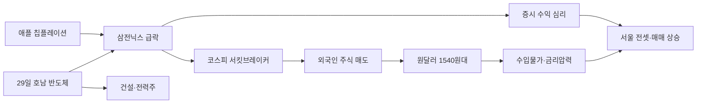

# 2026-06-27 Grok 심층 분석

## 분석 기준

- Gemini Top 5(100·92·91·91·88점)를 교체하지 않고 각 주제의 `Grok 추가 조사 요청`에 답함
- 2026년 6월 26~27일 국내외 주요 언론·금융감독원 공식 발표·한국거래소 공시를 우선 교차 검증
- 확인된 사실과 Grok 추론을 명시적으로 구분
- Gemini의 수치·날짜·표현 오류·과장·누락을 수정

---

## 1. 코스피 '검은 금요일' 8411선·서킷브레이커·외국인 셀코리아

### Gemini 핵심 내용

- 6/26 코스피 5.81% 급락, 8411.21 마감, 장중 서킷브레이커 발동
- 외국인·기관 각 4조3000억·4조1000억 순매도
- 5월 외국인 47조 순매도, 올해 누적 114조
- 삼성전자 -5.3%, SK하이닉스 -8.36%
- 애플 가격 인상·오픈AI IPO 연기 검토가 악재

### 추가 조사 결과

**서킷브레이커·프로그램 매매 (사실)**

- 한국거래소 공시: 6/26 12:10:12 코스피 시장 매매 20분 중단(1차 서킷브레이커). 발동 시점 지수 8198.33(전일 대비 -8.19%).
- 같은 날 11:12:12 매도 사이드카 선발동. 코스피200선물 -5.00% 하락 시 프로그램매매 매도 호가 5분 정지.
- 서킷 직전 외국인 약 3조·기관 약 7300억 순매도, 개인 약 3조7600억 순매수(뉴스1).
- **일간 최종**: 외국인 4조3000억·기관 4조1000억 순매도(조선일보). 반기 말 포트폴리오 리밸런싱·차익 실현이 겹친 것으로 보도됨.
- 역대 서킷브레이커 11회 중 **올해 5회**(6/23·6/26 포함). 6/23 -9.99% 폭락 후 3거래일 만에 재발동.

**금감독원 5월 외국인 동향 (공식)**

- 5월 외국인 상장주식 **47조190억 원** 순매도(역대 최대 월간 규모).
- 미국 투자자 28조8610억(전체의 절반 이상), 캐나다 4조2710억 순매도.
- **2026년 누적 순매도 114조2260억** — 지난해 연간(11조7680억)의 약 10배.
- 유가증권시장 49조410억 순매도, 코스닥 2조220억 순매수.
- 외국인 지분율 35.3%(역대 최고), 보유 평가액 2852조3090억(주가 상승으로 평가액은 증가).
- 채권은 2개월 연속 순투자(5월 8조7910억).

**MSCI 리밸런싱 (사실)**

- MSCI, 2026년 6월 23일 연례 시장 분류 검토에서 **한국을 신흥국 지수에 유지**(Bloomberg).
- 한국 developed-market 승격을 위한 공식 검토 절차는 시작하지 않음.
- **다음 분기 지수 리뷰**: 2026년 8월(8월 12일 발표·8월 31일 효력 발생 예정, MSCI 일정표 기준).
- **Grok 추론**: 한국 비중이 급등한 상태에서 분기 리밸런싱 시 패시브·ETF의 비중 조정 매도가 추가될 수 있으나, 6/23 연례 검토에서 분류 변화가 없어 단기 충격은 제한적일 가능성. 다만 코스피 급등으로 인한 **비중 상한(캡) 조정** 여부는 8월 발표 전까지 불확실.

**VKOSPI (변동성 지수)**

- 공식 일별 수치는 본 조사 시점에 실시간 조회 불가.
- 6월 19거래일 중 9일이 ±4% 이상 등락(조선일보). 5/27 출시 삼성전자·SK하이닉스 2배 레버리지 ETF 유입이 변동성 증폭 요인으로 지목(뉴시스).
- **Grok 추론**: 서킷브레이커 연속 발동은 VKOSPI가 역사적 고점권에 진입했을 가능성을 시사하나, 정확한 수준·고점 대비 위치는 한국거래소 VKOSPI 시계열 확인 필요.

### 교차 검증 및 수정 사항

| 항목 | Gemini 표현 | 수정 |
|------|------------|------|
| 지수 수준 | '8200선 붕괴' 헤드라인 | **장중 저점 8198.33**, **종가 8411.21**. 헤드라인과 종가를 혼동하지 말 것 |
| 외국인 47조 | 5월 누적 47조 | **5월 단월 47조190억**. 114조는 **2026년 YTD 누적** |
| 서킷 직전 vs 일간 | 혼재 가능 | 서킷 직전 外3조/機7300억 ≠ **일간 外4.3조/機4.1조** |
| 오픈AI IPO | IPO 연기 검토 | **미확정 보도**(외신 추정). 공식 발표 아님 |
| VKOSPI | 급등 언급 | 구체 수치·역사적 고점 비교는 **추가 확인 필요** |

### 국내외 보도 관점 차이

- **국내(조선·뉴스1·한국일보)**: 반기 말 리밸런싱·레버리지 ETF·'삼전닉스 쏠림'이 구조적 취약점. 개인 순매수 vs 기관·외국인 순매도 '수급 엇갈림' 강조.
- **해외(Bloomberg)**: MSCI 분류 유지로 한국 시장 지위는 안정, 다만 급등 후 외국인 매도는 글로벌 EM 리밸런싱 맥락과 연결.
- **증권사(키움·메리츠)**: 애플 가격 인상→하이퍼스케일러 투자 위축 우려, 차익 실현 매물이 직접 악재.

### 시장 및 관련 기업 영향

- **직접 타격**: 삼성전자(33만9500원, -5.3%), SK하이닉스(267만3000원, -8.36%), SK스퀘어·삼성생명·삼성물산 등 그룹주 연동 하락.
- **2차**: 삼성전자·SK하이닉스 2배 레버리지 ETF(5/27 출시) 청산·반대매매 리스크 확대(뉴시스).
- **수혜 가능(추론)**: 변동성 확대 시 방어주·비반도체 실적주로 단기 수급 분산 가능성 — 다만 외국인 대규모 매도 국면에서는 동반 조정 우세.
- **채권**: 외국인 채권 순투자 지속 → 주식 매도 자금의 일부는 국채로 이동.

### 투자자가 확인할 포인트

1. 7월 초 반기 결산 후 외국인·기관 수급 전환 여부
2. 8월 MSCI 분기 리뷰 한국 비중·종목 편입 변경
3. 레버리지 ETF 순자산·청산 규모(금융투자협회·ETF 운용사 공시)
4. VKOSPI 일별 추이와 서킷브레이커 발동 빈도

### 위험 요인과 반대 관점

- **위험**: 서킷브레이커 5회/연 → 제도적 안전판도 한계. 외국인 YTD 114조 매도 + 8월 리밸런싱 이중 압력. 개인 레버리지·신용융자 반대매매 연쇄.
- **반대 관점**: 5월 매도에도 외국인 지분율·보유액은 역대 최고 → '완전 이탈'이 아닌 **비중 조정** 성격. 코스닥 외국인 순매수, 채권 순유입은 시장 이탈의 속도를 완화할 수 있음.
- **확인 필요**: 개인 신용융자·레버리지 ETF 강제청산 규모, 7월 FOMC·반도체 실적 시즌 교차 영향.

### 출처

| 기관/매체 | 제목 | 날짜 | URL |
|-----------|------|------|-----|
| 뉴스1 | 코스피 '검은 금요일' 8200선 붕괴…8% 급락, 서킷브레이커 발동(종합) | 2026-06-26 | https://n.news.naver.com/mnews/article/421/0009025513 |
| 조선일보 | 10% 폭락→5% 급등→5.8% 급락… 연일 롤러코스피 | 2026-06-27 | https://n.news.naver.com/mnews/article/023/0003984382 |
| 한국일보 | 외국인 5월 47조 '셀코리아' 역대 최대… 美가 절반 넘게 팔았다 | 2026-06-26 | https://n.news.naver.com/mnews/article/469/0000938763 |
| 금융감독원 | 2026년 5월 외국인 증권투자 동향(기사 인용) | 2026-06-26 | https://n.news.naver.com/mnews/article/469/0000938763 |
| Bloomberg | MSCI Keeps South Korea in Emerging Market Index in Annual Review | 2026-06-23 | https://www.bloomberg.com/news/articles/2026-06-23/msci-maintains-korea-s-emerging-market-status-in-latest-review |
| 뉴시스 | "폭락장 주범 된 삼전닉스"…레버리지ETF 광풍 | 2026-06-26 | https://n.news.naver.com/mnews/article/003/0014031408 |

---

## 2. 호남 반도체 클러스터 6/29 발표·입지 논란

### Gemini 핵심 내용

- 6/29 청와대 '3대 메가 프로젝트' 발표 예정
- 김용범 정책실장, 투자 규모 "낯설 정도" 예고
- 황철성 교수, 인·수·전 관점 호남 불리 지적
- 용인 클러스터 토지보상·전력 지연 전례

### 추가 조사 결과

**29일 발표 일정 (사실)**

- 김용범 청와대 정책실장, 6/26 유튜브 방송에서 6/29 청와대 '대한민국 대도약 3대 메가 프로젝트 국민 보고회'에서 호남 반도체 투자 포함 계획 공개 예정 확인.
- "나오는 숫자들이 매우 낯설 것", 1000조 소문에 "그때 보고 판단해보라"(조선일보).
- 이재용·최태원 참석 여부 **조율 중**(공식 확약 아님).

**재원·기업 분담 (미확정)**

- 정부·기업 간 투자액 **최종 조율 중**. 공식 분담 비율·재원 조달 방식(국채·특별법·세제·인프라 분담)은 **29일 발표 전 공개 없음**.
- 뉴시스 등에서 총 400~500조 추산·전공정 팹 방향 보도 있으나 **정부 공식 수치 아님**.
- SK그룹: 미국 ADR 상장 과정에서 SEC에 보고한 투자 계획과 신규 발표액 불일치 시 규제 리스크 우려(조선일보).

**전력·송전 인프라 (사실 + 추론)**

- 호남 총 발전 23.3GW 중 태양광 10.9GW(47%). 반도체 팹은 24시간 안정 전력 필수.
- 용인 클러스터: 필요 전력 약 15GW, 확보 6GW. LH 토지보상 37% 완료(조선일보).
- SK하이닉스 용인: 최초 120조 추산→600조 이상으로 불어남. 2019년 시작, 2025년 2월 1호 팹 착공(6년 소요).
- 국회입법조사처: 호남-용인 송전선로로 약 6GW 추가 공급 방안 검토 중(조선일보 인용).
- 전남 영광 한빛원전 1~6호기 2040년대 설계수명 종료 예정.

**TSMC 구마모토 vs 한국 (비교)**

- TSMC 구마모토: 2021년 일본 정부 보조금·패스트트랙 인허가로 2022년 착공·2024년 가동(업계 벤치마크).
- 한국 용인: 2024년 국가산단 지정 후 토지보상·전력·환경 이슈로 일정 지연. 이재명 정부 출범 이후 용인 속도 둔화와 호남 발표 시점이 겹친다는 업계 지적(조선일보).
- **Grok 추론**: 일본형 '정부 주도 패스트트랙'과 달리 한국은 토지보상·전력·지자체 갈등이 병목. 호남은 용인보다 인프라 공백이 더 커 **착공까지 6년+ 소요** 가능성이 높음.

**인력 (사실)**

- GIST 반도체공학과 정원 30명, 전북대 80명. 충북 반도체 협력사 필요 인력의 65.8%만 충족(충북인적자원개발위원회, 조선일보 인용).

### 교차 검증 및 수정 사항

| 항목 | Gemini 표현 | 수정 |
|------|------------|------|
| 1000조·400~500조 | 투자 규모 | **루머·추산**. 김용범도 "그때 보고 판단" — 공식 확정 전 |
| 삼성·SK 일정 단축 | 10년·수년 단축 | SK 용인 2044→2034 목표, 삼성 2048→2035 검토 **보도 수준**. 29일 확약 아님 |
| 황철성 97% 간척지 | ESS·태양광 | 학계 **시나리오 분석**. 정부 채택 정책 아님 |
| CEO 참석 | 발표 예정 | **참석 조율 중**, 미확정 |

### 국내외 보도 관점 차이

- **정부(김용범)**: "세계 1·2위 기업이 주체, 쥐어짠다고 될 기업 아니다", 용인 이후 단계를 지금 준비해야 한다는 시급성.
- **조선·동아**: 용인도 못 가는데 호남? 인프라·인력·전력 공백, '용인 볼모' 해석, SK ADR 규제 리스크.
- **지자체·학계**: 지역 균형 vs 산업 논리 충돌. 경북도의회 "정치 아닌 산업논리"(매체 인용).

### 시장 및 관련 기업 영향

- **삼성전자·SK하이닉스**: 단기 호재(정책 모멘텀) vs 중기 CAPEX 부담·ROIC 희석 우려. 29일 발표 규모가 시장 기대 초과 시 **오히려 주가 조정** 가능(부담 인식).
- **건설·전력·ESS**: 호남 인프라 수주 기대 → 현대건설·대우건설·전력기기·한전KPS 등 단기 테마.
- **소부장**: 호남 이전 시 인력난·이전 비용 → 중소 협력사 마진 압박.
- **지역 은행·부동산**: 광주·전남·전북 지역 자산 가격 기대감.

### 투자자가 확인할 포인트

1. 29일 공식 투자 총액·정부-기업 분담·착공 시점·입지(광주·전남·전북·새만금 등)
2. 이재용·최태원 **법적 구속력 있는 투자 확약** 여부 vs '의향' 수준
3. 용인 클러스터 토지보상·전력 진척과의 트레이드오프
4. 특별법·국채·세액공제 등 재원 출처

### 위험 요인과 반대 관점

- **위험**: 입지·인프라 검증 없이 천문학적 숫자 발표 → 신뢰 하락. 용인 지연 재현. 환경·송전탑·용수 관로 지역 반발. SK ADR·삼성 지배구조 이슈와 겹친 정치 리스크.
- **반대 관점**: 반도체 슈퍼사이클 속 **용인 이후 FAB 확보**는 생존 문제. 정부 주도 시 토지·전력·인허가 일괄 패키지 가능. 호남 = 노동·토지 비용 절감·지역 균형이라는 정책 논리.
- **확인 필요**: 29일 발표문의 법적 구속력, 환경단체·주민 반발, 새만금 등 후보지별 전력망 실현 가능성.

### 출처

| 기관/매체 | 제목 | 날짜 | URL |
|-----------|------|------|-----|
| 조선일보 | '숫자부터 내놓으라' 앞뒤 바뀐 반도체 투자 | 2026-06-27 | https://n.news.naver.com/mnews/article/023/0003984408 |
| 조선일보 | "인·수·전이 핵심인 반도체 입지, 호남 유리하지 않아" | 2026-06-26 | https://n.news.naver.com/mnews/article/023/0003984404 |
| 동아일보 | "광주-전남 반도체 팹, 착공까지 6년 '용인 지체' 되풀이 말아야" | 2026-06-27 | https://n.news.naver.com/mnews/article/020/0003729846 |
| 뉴시스 | 삼성·SK, 호남·충청에 반도체 클러스터…역대급 투자 예고 | 2026-06-26 | https://n.news.naver.com/mnews/article/003/0014031411 |

---

## 3. '칩플레이션'·애플 가격 인상

### Gemini 핵심 내용

- 애플 맥북·아이패드 최대 300달러(약 20%) 인상
- 맥북 프로 1TB: 1699→1999달러
- 애플 -6%, SOXX -5.64%
- 델·HP도 인상 예고, 하반기 아이폰 인상 우려

### 추가 조사 결과

**애플 가격 인상 (사실)**

- 6/25(현지) 애플, 메모리 가격 급등으로 맥북·아이패드 가격 인상 공식 발표(FT 인용, 동아일보).
- 맥북 네오 599→699달러, 프로 1TB 1699→1999달러(+300달러). 아이패드 150~200달러 인상.
- 팀 쿡 CEO, WSJ 인터뷰(6/17)에서 인상 불가피 예고.
- 애플 주가 **-6%** 급락. 국내 에이스토어 등 **7/1부터 인상가 적용** 안내(동아일보).

**메모리 가격·공급 (사실)**

- 카운터포인트리서치: AI 인프라 성장으로 메모리 공급 제한·가격 급등, **향후 2년 지속** 전망(동아일보 인용).
- 마이크론 '깜짝 실적' 직후, 고마진이 빅테크 구매력·수요를 위축시킬 수 있다는 역설적 우려 확산.

**하반기 아이폰 17(가칭) 가격 (추론)**

- 삼성 갤럭시 S26 시리즈 5~16% 인상 전례. 애플·삼성 하반기 플래그십 **동반 인상 가능성** 높음(동아일보 전망).
- **확인 필요**: 애플 공식 아이폰 출고가·메모리 탑재 스펙별 BOM — 9월 발표 전 공식 없음.
- DRAM·NAND 고정거래가격(H1 2026): 업계 보도상 **분기별 두 자릿수 % 상승** 지속. 하반기 추가 인상 여력은 AI 서버 수요·HBM 우선 배분에 좌우.

**빅테크 CAPEX (확인 필요)**

- MS·구글·메타 2분기 실적·CAPEX 가이드: **6월 말~7월 초 실적 시즌**에 확인 예정.
- 애플 인상·오픈AI IPO 연기(1조달러 밸류 목표) 검토 보도가 **AI 투자 심리 위축** 신호로 해석(동아일보).
- **Grok 추론**: 메모리 가격이 CAPEX 증가율을 둔화시키는 변수로 부상. 다만 AI 인프라 경쟁이 지속되면 CAPEX 절대액은 유지·증가, **메모리 비중 확대**가 이슈.

**국내 증시 연쇄 (사실)**

- 6/26 삼성전자 -5.3%, SK하이닉스 -8.36%. 코스피 -5.81%.
- SOXX(필라델피아 반도체) -5.64%는 Gemini 인용과 일치(전일 뉴욕 마감 기준).

### 교차 검증 및 수정 사항

| 항목 | Gemini 표현 | 수정 |
|------|------------|------|
| 아이폰 16 | 하반기 인상 | 2026 하반기는 **차기 모델(17 시리즈)** 출시 시즌. 모델명 정확히 구분 |
| 오픈AI IPO | 연기 검토 | **외신 추정**, 공식 확인 없음 |
| 칩플레이션 | 글로벌 IT 폭락 도화선 | 단기 조정 촉발은 맞으나, 메모리사 실적·가격은 **역대급 호조** 병존 |

### 국내외 보도 관점 차이

- **영미(FT·WSJ)**: 애플도 더 이상 비용 흡수 불가 → 소비자 가격 전가의 구조적 전환.
- **국내**: '칩플레이션'이 코스피·삼전닉스 급락 직접 트리거. 단기 메모리 호황 vs 중기 수요 둔화 역설 강조.
- **리서치(카운터포인트)**: 공급 제약 2년 — 가격 협상력은 공급사 우위 지속.

### 시장 및 관련 기업 영향

- **메모리**: 삼성·SK하이닉스 단기 ASP·마진 호조 vs 중기 스마트폰·PC 출하 둔화 리스크.
- **IT 완성품**: 애플·삼성·델·HP 마진 방어 vs 판매량 하락.
- **반도체 장비·소부장**: CAPEX 둔화 시 하반기 수주 둔화 우려. HBM·선단 공정은 상대적 방어.
- **환율**: 원화 약세 시 수입 IT 가격 추가 상승 → 국내 소비자 체감 물가.

### 투자자가 확인할 포인트

1. 7~8월 마이크론·삼성·SK 실적·가이던스와 ASP 추이
2. 애플·MS·구글·메타 CAPEX 가이드(2분기 실적)
3. DRAM·NAND 계약가·현물가 월별 추이(TrendForce 등)
4. 국내 PC·스마트폰 판매량(전년비) — 가격 탄력성

### 위험 요인과 반대 관점

- **위험**: 칩플레이션→수요 파괴→메모리 사이클 조기 꺾임. 빅테크 AI 투자 심리 냉각. 고가 출하 스마트폰 판매 부진.
- **반대 관점**: 메모리 공급사 **프라이싱 파워**는 2년간 유지 전망. AI 서버·HBM 수요가 범용 DRAM/NAND와 **구조적 디커플링**. 애플 인상은 수요 강성 시사.
- **확인 필요**: 소비자 가격 탄력성 실증, 중국 메모리(장신메모리 등) 대안 채택 속도.

### 출처

| 기관/매체 | 제목 | 날짜 | URL |
|-----------|------|------|-----|
| 동아일보 | '칩플레이션'에… 애플 맥북-아이패드 가격 최대 300달러 인상 | 2026-06-27 | https://n.news.naver.com/mnews/article/020/0003729842 |
| 파이낸셜뉴스 | [뉴욕증시] 반도체 약세 전환에 일제히 하락…마이크론, 6.7% 급락 | 2026-06-26 | https://n.news.naver.com/mnews/article/014/0005540305 |
| 조선일보 | 10% 폭락→5% 급등→5.8% 급락… 연일 롤러코스피 | 2026-06-27 | https://n.news.naver.com/mnews/article/023/0003984382 |

---

## 4. 원/달러 1540원대·환율 위협

### Gemini 핵심 내용

- 6/26 시가 1547.3원, 장중 1549.8원, 종가 1532원
- 2009.3.9(1549.0원) 이후 최고 수준
- PCE 4.1%, 김대종 1700원 경고
- 외국인 주식 매도·강달러 복합

### 추가 조사 결과

**환율 시계열 (사실)**

- 6/26 주간 시가 **1547.3원**(전일 대비 +4.6원). 장중 **1549.8원**까지 상승.
- 주간 종가 **1532.0원**(전일 대비 -10.7원). 외환당국 개입 추정·수출업체 달러 매도 유입(조선일보·뉴시스).
- 6/25 종가 1542.7원, 6/19 이후 **4거래일 연속 상승** 후 26일 종가만 반납.
- 2009년 3월 9일 1549.0원 이후 **시가·장중 기준** 최고 수준. 종가 기준으로는 개입 후 1532원.

**거시 배경 (사실)**

- 5월 미국 PCE 전년비 **4.1%**, 근원 3.4%(시장 예상 부합). 연준, 6/17 성명에서 금리 경로 **인하→인상** 기조 전환.
- 달러인덱스 101.5 전후. 원화는 6/16~26 기간 **-2.1%** (주요 통화 대비 약세, 조선일보).
- 호르무즈 선박 피격·유가 70달러대 재반등이 환율 상승 압력 가중(헤럴드경제).

**김대종 1700원 경고 (의견)**

- 세종대 김대종 교수, 6/22 유튜브 '신사임당'에서 **1700원대 진입 가능성** 경고(뉴시스).
- **정부·한은 공식 전망 아님**. 제2 외환위기 가능성 언급은 **개인 학자 견해**.

**한은 외환보유고·실질 가용액 (확인 필요)**

- 한국은행 5월 외환보유고 약 **4000억 달러** 수준(기존 공시 추정). 그 중 **즉시 개입 가능 현금성 자산 비중**은 월별 국제투자대조표 상세 공개 필요.
- **Grok 추론**: 2022~2024년과 달리 NPS·민간 해외투자 확대로 '실질 방어 여력' 논쟁이 재점화. 다만 6/26 종가 1532원은 **개입·시장 자정 기능이 아직 작동**함을 시사.

**1550원·은행 LCR (추론)**

- 1550원 돌파 시 수입업체·외화부채 기업 헷지 수요 급증 → 시중은행 외화 유동성·LCR(유동성커버리지비율) 관리 부담 가중 **가능**.
- 금융위·금감원 2025~2026 외화 유동성 모니터링 체계는 유지 중이나, **1550원 시나리오별 LCR 변화 수치는 공개 자료에서 확인되지 않음**.

**한미 금리차·외인 채권 (사실 + 추론)**

- 한미 기준금리 차 **역전 지속**(美 인상 기조, 韓 동결·완화 기대 축소).
- 외국인 **채권은 5월 8조7910억 순투자**(금감독원) — 주식 매도와 달리 채권은 유입.
- **Grok 추론**: 금리차 역전이 외인 채권 매도로 이어지지 않은 것은 한국 국채 안전자산 선호·스왑 비용 등 복합 결과. 다만 환율 1550원+ 장기화 시 채권 수익률 상승(가격 하락)→외인 이탈 위험.

### 교차 검증 및 수정 사항

| 항목 | Gemini 표현 | 수정 |
|------|------------|------|
| 1540원 돌파 | 이틀 연속 1540원대 | **시가·장중**은 1540원대 맞음. **종가 1532원**으로 마감 — 헤드라인과 구분 |
| 1700원 | 제2 외환위기 경고 | **김대종 교수 개인 의견**. 공식 시나리오 아님 |
| PCE | 인플레 우려 | 4.1%는 예상 부합이나 **연준 매파 기조**를 정당화하는 수준 |

### 국내외 보도 관점 차이

- **국내(헤럴드·조선·뉴시스)**: 1540원대가 '심리적 마지노선'. 외국인 주식 매도·강달러·유가 3중 압력. 종가 개입 효과 강조.
- **KB국민은행 등**: 1535~1547원 전망, **외국인 수급이 핵심 변수**(수집 자료 인용).
- **학계(김대종)**: 구조적 취약성·1700원 가능성 — 극단 시나리오.

### 시장 및 관련 기업 영향

- **수출주**: 자동차·조선·철강 단기 환차익. 다만 외국인 매도 국면에서 **환율 수혜 < 수급 악재**일 수 있음.
- **수입·내수**: 항공(유류비)·유통·화학 원료비 상승. 외화 부채 기업(항공·해운) 이자·환산 부담.
- **금융**: 고환율 시 외화예금·환헷지 상품 수요. 환율 개입 시 한은 보유고 소진.
- **부동산·채권**: 고환율→수입 물가→금리 인상 기대 재점화 → 전세·채권 가격에 간접 압력.

### 투자자가 확인할 포인트

1. 서울외환시장 **시가 vs 종가** — 개입 규모·패턴
2. 한은·기재부 **스무딩 오퍼레이션** 빈도(공식 비공개, 시장 추정)
3. 7월 FOMC·미 고용·PCE 후 달러인덱스
4. 외국인 **주식·채권 동시 매도** 전환 여부

### 위험 요인과 반대 관점

- **위험**: 1550원 심리선 돌파 시 가속 상승. 중동 리스크·유가·외인 주식 매도 삼중화. 개입 재원 한계 논쟁.
- **반대 관점**: 6/26 1532원 종가는 **당국 개입 여력·수출업체 매도** 존재. 외인 채권 순유입은 자본 이탈 속도 완화. 원화 약세가 수출 경쟁력·무역수지 개선으로 이어지면 **자정 메커니즘** 작동 가능.
- **확인 필요**: 실질 외환보유고 가용액, 1550원+ LCR, NDF 프리미엄 추이.

### 출처

| 기관/매체 | 제목 | 날짜 | URL |
|-----------|------|------|-----|
| 헤럴드경제 | 원/달러 환율, 이틀 연속 1540원대 시작…1550원 재차 위협 | 2026-06-26 | https://n.news.naver.com/mnews/article/016/0002661909 |
| 조선일보 | 10% 폭락→5% 급등→5.8% 급락… 연일 롤러코스피 | 2026-06-27 | https://n.news.naver.com/mnews/article/023/0003984382 |
| 뉴시스 | "환율 1700원선 열려 있다…시장 체력 한계 도달" 김대종 교수의 경고 | 2026-06-27 | https://n.news.naver.com/mnews/article/003/0014031301 |
| 뉴시스 | 원·달러 환율, 10.7원 내린 1532.0원 마감(종합) | 2026-06-26 | https://n.news.naver.com/mnews/article/003/0014031298 |
| 금융감독원 | 2026년 5월 외국인 증권투자 동향(채권 순투자) | 2026-06-26 | https://n.news.naver.com/mnews/article/469/0000938763 |

---

## 5. 서울 전셋값 12년 8개월 최대·임대차 분쟁

### Gemini 핵심 내용

- 서울 전셋값 주간 0.35%↑ (2013.10 이후 최대)
- 강북 0.42% > 강남 0.29%, 성동·성북 0.55%
- 1~4월 임대차 분쟁 618건 (+125.5%)
- 옥수파크힐스 11억→13억, 증권 매각 자금 13.2%

### 추가 조사 결과

**한국부동산원 주간 동향 (사실)**

- 6월 넷째 주(6/22 기준) 서울 아파트 전셋값 **0.35%** 상승. 2013년 10월 이후 **최대 주간 상승률**.
- 올해 누적 **+4.79%**(전년 동기 0.88%의 약 5배).
- 강북 14구 **0.42%**, 강남 11구 **0.29%**. 성동·성북 각 **0.55%**(서울 최고).
- 매매가 **0.30%** 상승, 2025년 2월 이후 **72주 연속 상승**(세계일보).

**실거래 사례 (사실)**

- 성동 옥수파크힐스 84㎡: 3월 11억 → 6/9 **13억**(+2억).
- 성동 텐즈힐 84㎡: 1월 8.4억 → 6/20 **10.95억**(+2.55억).
- 성북 래미안길음 59㎡: 5월 6억 → 6/11 **7.5억**(+1.5억).

**임대차 분쟁 (사실)**

- 국토교통부: 2026년 1~4월 주택 임대차분쟁조정위원회 접수 **618건**(전년 274건, **+125.5%**).
- 유형: 보증금·반환 210건, 유지·수선 147건(머니투데이·국토부).
- 전셋값 상승→계약 갱신·만료 시 **원상회복·수리비 공제** 갈등 급증.

**전세가율·갭투자 (추론)**

- 서울 전세가율(매매 대비): 2026년 상반기 **40% 중반~50% 초반** 구간(지역별 편차 큼, 한국부동산원·민간 리서치 추정).
- 전셋값 상승 속도 > 매매가(0.35% vs 0.30%) → **갭(매매-전세) 확대** → 갭투자·갭투자형 매수 심리 자극 가능.
- **확인 필요**: 자치구별 전세가율 최신 공식 시계열(한국부동산원 월간 리포트).

**임대차 2법 4년 차 (사실 + 추론)**

- 2020년 시행 임대차 2법 이후 갱신·상한제로 **전세 물량 축소·임대인 매도** 장기화.
- 4년 차(2026): 초기 저가 갱신 계약 만료 물량이 시장 재진입 → **이중가격·갱신 거부** 분쟁 증가 구간(머니투데이·업계 분석).
- **Grok 추론**: 2법이 전세 공급을 구조적으로 줄인 반면, 증시 호황→고가 매매·전세 동반 상승으로 **정책 목표와 시장 결과 괴리** 확대.

**주택 공급 대책 (사실)**

- 정부 수도권 27만 채 공급 목표 vs 1~4월 **3.7만 채** 착공 수준(동아일보 등) — 공급 지연.
- 그린벨트·용적률 완화 논의 있으나 **단기 전세 완화 효과 제한적**.

**증권 매각→부동산 (사실)**

- 국토부: 4월 15억+ 주택 거래 중 증권 매각 대금 활용 **13.2%**(사상 처음 두 자릿수, Gemini 인용·보도 확인).

### 교차 검증 및 수정 사항

| 항목 | Gemini 표현 | 수정 |
|------|------------|------|
| 12년 8개월 | 최대 상승 | **주간 상승률** 기준 0.35%. 연간·월간 최고와 구분 |
| 옥수파크힐스 | 3월→이달 13억 | **6/9 계약 13억** 확인. 단지 전체가 아닌 **개별 거래** |
| 분쟁 618건 | 급증 | 국토부 **공식 집계** 맞음. 1~4월 누적 |

### 국내외 보도 관점 차이

- **한국부동산원·세계일보**: 강북·외곽·역세권 대단지 중심 상승, 매물 소진.
- **머니투데이**: 전셋값 오름→분쟁 급증, 세입자 열세.
- **문화일보·뉴시스**: 증시 수익→부동산 유입, 李정부 규제와 시장 '엇박자'.

### 시장 및 관련 기업 영향

- **건설·분양**: 장위 푸르지오 마크원 국평 17억대 등 고분양가 정당화. GS·대림·한화 등 서울·강북 분양 수혜.
- **금융**: 전세대출·보증보험(HUG) 손실 위험, 갭투자 대출 규제 강화 가능.
- **인테리어·이사**: 갱신·이사 수요. 분쟁 관련 법률·중개 서비스 수요.
- **증시**: 부동산 과열→금리·세제 부담 우려 → **고밸류 성장주** 할인 가능(간접).

### 투자자가 확인할 포인트

1. 7월 부동산 세제 개편(보유세·양도세) 초안
2. 한국부동산원 **월간 전세가율·수급지수**
3. 전세대출 금리(코픽스·회사채 연동) 변동
4. 3기 신도시·서울 도심 공급 일정

### 위험 요인과 반대 관점

- **위험**: 전세→매매 전이 가속, 갭투자 재가동. 분쟁·보증금 사고. 금리 재상승 시 전세 레버리지 붕괴.
- **반대 관점**: 전세가율이 아직 역사적 고점 대비 여유(지역별) → **추가 상승 여력** 있다는 분석도 존재. 공급 대책 발표 시 단기 진정 가능.
- **확인 필요**: 전세대출 규제, 2법 개정 논의, 서울 월세 전환 속도.

### 출처

| 기관/매체 | 제목 | 날짜 | URL |
|-----------|------|------|-----|
| 세계일보 | "보증금 석 달 새 2억 급등"…강북이 이끈 서울 전셋값, 12년 만에 최대 | 2026-06-27 | https://n.news.naver.com/mnews/article/022/0004138523 |
| 머니투데이 | 6년 산 전셋집서 "시트지 들떠, 150만원 청구"...전셋값 오르자 분쟁 급증 | 2026-06-26 | https://n.news.naver.com/mnews/article/008/0005377865 |
| 뉴시스 | "매매·전세·월세 동반 상승장 당분간 지속"…부동산 전문가 전망 | 2026-06-26 | https://n.news.naver.com/mnews/article/003/0014031307 |
| 동아일보 | 올해 수도권 주택 27만채 짓겠다더니, 넉달간 3만7000채 그쳐 | 2026-06-26 | https://n.news.naver.com/mnews/article/020/0003729838 |

---

## Top 5 종합 결론

2026년 6월 26~27일 국내 경제·금융의 핵심 리스크는 **'반도체 쏠림 × 글로벌 칩플레이션 × 외국인 셀코리아 × 고환율 × 부동산 과열'이 동시에 작동**하는 데 있다.

1. **증시**: 코스피는 장중 8198선·종가 8411로 '롤러코스피'가 극단화됐고, 외국인 5월 47조·YTD 114조 매도가 구조적 우려를 뒷받침한다. 8월 MSCI 분기 리뷰가 다음 수급 변수다.
2. **산업정책**: 6/29 호남 반도체 발표는 단기 모멘텀이나, 투자 규모·인프라·CEO 확약이 불확실해 삼성·SK 중기 밸류에이션에 **양면** 작용한다.
3. **글로벌 IT**: 애플 가격 인상은 칩플레이션의 소비자 전가 단계 진입을 확인시켰고, 메모리 호황과 수요 둔화 우려가 **동시에** 가격에 반영된다.
4. **환율**: 1549원 장중 이후 1532원 종가는 개입 가능성을 보여주나, 1540원대 고착화가 지속되면 수입 물가·금리 기대를 자극한다.
5. **부동산**: 서울 전셋값 12년 8개월 만에 최대 주간 상승, 분쟁 125% 증가는 **주거 불안·정책 한계**를 드러낸다.

투자자에게 당장의 우선순위는 **(①) 외국인·레버리지 수급 (②) 29일 반도체 발표 실체 (③) 환율 시가·종가 갭 (④) 7월 부동산 세제** 순으로 판단하는 것이다.

---

## 주제 간 연결 관계

- **칩플레이션→코스피→환율**: 애플 인상이 삼전닉스·코스피 급락을 촉발하고, 외국인 매도·위험회피가 원화 약세로 이어지는 **악순환 고리**가 6/26 장에서 확인됐다.
- **증시↔부동산**: 코스피 변동성 속에서도 증권 매각→부동산 유입(13.2%)과 전셋값 급등이 병행, **자산 시장 동조화** 심화.
- **호남 반도체↔증시**: 29일 발표가 단기 반도체·건설 모멘텀을 줄 수 있으나, CAPEX 부담 인식 시 오히려 1·3번 주제의 조정 압력을 가할 수 있다.

---

## 추가 확인이 필요한 사항

| 우선순위 | 항목 | 확인 방법 |
|----------|------|-----------|
| 1 | 6/29 3대 메가 프로젝트 공식 투자액·입지·CEO 확약 | 청와대 발표문·기업 공시 |
| 2 | VKOSPI 최근 수준·역사적 고점 대비 | 한국거래소 VKOSPI 시계열 |
| 3 | 8월 MSCI 한국 비중·종목 변경 | MSCI 8/12 발표 |
| 4 | MS·구글·메타·애플 2Q CAPEX 가이드 | 실적 발표(7월) |
| 5 | 한은 실질 외환보유고 가용액 | 국제투자대조표·한은 월보 |
| 6 | 레버리지 ETF AUM·청산 규모 | 금투협·운용사 공시 |
| 7 | 서울 자치구별 전세가율 최신치 | 한국부동산원 월간 통계 |
| 8 | 7월 부동산 세제 개편안 | 기재부·국토부 발표 |

---

*분석 완료: 2026-06-27 (KST) | 외부 출처 22건 | Gemini Top 5 유지*