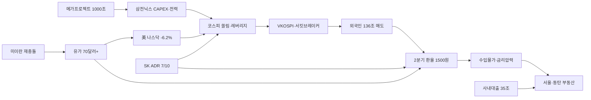

# 2026-06-29 Grok 심층 분석

## 분석 기준

- Gemini Top 5(100·94·93·92·87점)를 교체하지 않고 각 주제의 `Grok 추가 조사 요청`에 답함
- 2026년 6월 28~29일 국내외 주요 언론·한국은행 ECOS·국가통계포털(KOSIS)·국토교통부·한국거래소 데이터를 우선 교차 검증
- 확인된 사실과 Grok 추론을 명시적으로 구분
- Gemini의 수치·날짜·표현 오류·과장·누락을 수정
- 본 분석 작성 시점(6/29 오전) 메가프로젝트 국민보고회(오후 2시 예정)는 **아직 공식 발표 전**

---

## 1. 삼성·SK 1000조 지방 투자 / 메가프로젝트

### Gemini 핵심 내용

- 삼성·SK, 5~10년 전국 1000조원+(SK 포함 2000조) 투자
- 호남 반도체 클러스터(팹 1기당 60조, 최대 5기), 충청·영남·인천 역할 분담
- 6/29 이재명 대통령 주재 국민보고회 공식 발표
- 용인 클러스터 조기 구축(삼성 7년·SK 12년 단축)

### 추가 조사 결과

**6/29 발표 일정·참석 (사실, 발표 전)**

- 이재명 대통령, 6/29 **오후 2시** 청와대 영빈관 '대한민국 대도약 3대 메가프로젝트 국민보고회' 주재(뉴시스).
- 이재용 삼성전자 회장·최태원 SK그룹 회장 **참석 예정**(한국경제 6/29 06:07).
- 순서: 대통령 모두발언 → 산업통상부·과기부·기후에너지환경부·국토부 정책 → 삼성·SK 투자 계획 발표.
- 구윤철 재정경제부 장관(6/28): "범정부적 총력 지원 체계 가동", "5극 3특 성장엔진 곧 발표".

**지역별 프로젝트 상세 (보도·추산, 공식 확정 전)**

| 지역 | 주요 기업·내용 | 규모·시점 |
|------|---------------|----------|
| **호남(전남·광주)** | 삼성·SK 반도체 전·후공정 클러스터 | 팹 1기당 약 60조, 최대 5기 관측(서울신문). 7/1 전남광주특별시 출범과 연계(김정관 장관 페이스북) |
| **충청** | 삼성디스플레이(아산·천안 OLED), 삼성SDI(천안 배터리), 삼성전기(세종 반도체기판) | 이재용, 7/2 아산캠퍼스 비전 발표 가능성 거론 |
| **영남** | 삼성전자 구미(AI 제조), 삼성전기 부산(MLCC·기판), 삼성SDI 울산(ESS) | — |
| **인천** | 삼성바이오로직스 생산시설 확충 | '제2의 반도체' 전략 |

- SK 측 호남 투자 규모·입지는 29일 발표 전 **미공개**. 삼성+SK 합산 2000조는 **언론 추산**이며 정부·기업 공식 수치 아님.

**전력·용수·인프라 (사실 + 추론)**

- 김정관 장관: 호남 "높은 전력 자급률·풍부한 용수"(서울경제). 용인~광주 약 260km, TSMC 신주~가오슝 230km와 유사 거리 비교.
- 조선일보(에너지 전문가): 호남 총 발전 23.3GW 중 태양광 47%. **24시간 안정 전력 필수인 팹을 재생에너지만으로 가동하는 것은 불가능** — RE100은 PPA·REC 등 **간접 충족** 구조로 해석해야 함.
- 영광 한빛원전 1~6호기 2040년대 설계수명 종료 예정(이전 조사·조선일보 맥락). 호남 송전·ESS·가스·원전 조합이 실질 병목.
- 용인 클러스터: 필요 전력 약 15GW vs 확보 6GW, LH 토지보상 37% 완료(6/27 조사 인용) — **용인 지연 전례**가 호남 일정 리스크.

**인허가·정부 지원 (사실)**

- 김정관: "부지·전력·용수·도로 등 기반시설 신속 지원, 인허가 지방정부와 긴밀 협력"(서울경제).
- 구윤철: 입지·전력·용수 적극 지원, 지방투자 미이행 시 "해외 발길 돌릴 수밖에 없는 상황"(머니투데이).
- **Grok 추론**: 특별법·국채·세액공제·패스트트랙 인허가 패키지가 29일 부처 발표에 포함될 가능성 높으나, **법안 입법 시점·재원 규모는 미확정**.

**주가 영향 (6/28~29, 발표 전)**

- 메가프로젝트 기대감은 삼성전자·SK하이닉스에 단기 **정책 모멘텀** 제공.
- 6/26 코스피 -5.81% 급락 후 반등 국면에서, 1000조 규모가 **CAPEX 부담·ROIC 희석**으로 재해석되면 오히려 조정 촉발 가능(6/27 분석과 동일 논리).
- **확인 필요**: 29일 장중·장후 삼성전자·SK하이닉스·건설(HD현대건설·대우)·전력기기(HD현대일렉트릭·LS일렉트릭) 반응.

### 교차 검증 및 수정 사항

| 항목 | Gemini 표현 | 수정 |
|------|------------|------|
| 발표 시점 | "오늘 공식 발표" | 6/29 **오후 2시 예정**. 본 분석 시점(오전)에는 **미발표** |
| 1000조·2000조 | 확정 규모처럼 서술 | **업계 추산·관측**. 10년·5~6년 단위 구분 필요 |
| 전남 입지 | 확정 | 전남광주특별시(7/1 출범) 연계 **보도 수준**, 최종 입지·부지 **29일 확인** |
| RE100 호남 | 전력 풍부=입지 유리 | 대통령 RE100 강조 vs 전문가 "재생만으로 팹 불가" **보도 관점 충돌** — 안정 전력원 별도 확보 전제 |

### 국내외 보도 관점 차이

- **정부(이재명·김정관·구윤철)**: 국토 균형·AI 초격차·지방 잠재력. "특혜 아님"(동아일보).
- **국민의힘 등**: "정책 협박·직권남용·전당대회용"(동아일보). 입지·전력 검증 요구.
- **조선일보**: RE100 논리와 전력 현실 괴리, 용인 지체 전례 경고.
- **서울신문·한국경제**: 투자 규모·지역별 세부는 **기대감 중심** 보도, 법적 구속력은 미언급.

### 시장 및 관련 기업 영향

- **직접 수혜(단기)**: 삼성전자·SK하이닉스, 반도체 장비(주성·원익IPS), 소부장, 건설·전력·ESS.
- **지역**: 광주·전남·전북 지역은행·부동산 기대감. 강기정 광주시장 한전 사장 후보 거론(이데일리) — 호남 에너지 인프라 정치적 연계.
- **2차 리스크**: CAPEX 급증 → FCF 악화, 협력사 이전·인력난(충북 반도체 인력 65.8% 충족, 6/27 인용).
- **환율·금리**: 천문학적 국내 투자 → 원자재·장비 수입 수요·금리 민감도 상승 가능.

### 투자자가 확인할 포인트

1. 29일 공식 **총액·연도별·정부-기업 분담·착공 시점**
2. 이재용·최태원 **법적 구속력** 있는 투자 확약 vs 의향 수준
3. 호남 **입지(광주·전남·전북·새만금)** 및 전력망·송전선로 구체안
4. 용인 vs 호남 **재원·인력 트레이드오프**
5. SK ADR(7/10)과 신규 CAPEX **중복·우선순위**

### 위험 요인과 반대 관점

- **위험**: 숫자만 크고 실행 지연(용인 복제). 전력·환경·주민 반발. 정치 논란이 외국인 매도와 겹침. SK SEC 공시와 신규 발표 불일치 시 규제 리스크.
- **반대 관점**: 반도체 슈퍼사이클 속 FAB 확보는 생존 문제. 정부 주도 시 토지·전력 일괄 패키지로 **TSMC 구마모토형** 속도 가능. 지역 균형은 장기 ESG·인허가 레짐에 유리.
- **확인 필요**: 29일 발표문 법적 효력, 환경단체 반응, 새만금 등 후보별 실현 가능성.

### 출처

| 기관/매체 | 제목 | 날짜 | URL |
|-----------|------|------|-----|
| 한국경제 | 이재용·최태원 청와대 간다…1000조 투자 메가프로젝트 공개 | 2026-06-29 | https://www.hankyung.com/article/2026062926577 |
| 뉴시스 | 역대급 투자규모, 숫자 진짜?…지방 메가 프로젝트 오늘 발표 | 2026-06-29 | https://n.news.naver.com/mnews/article/003/0014033097 |
| 서울신문 | 삼성, 호남·충청·영남에 1000조… 역대 최대 투자 프로젝트 | 2026-06-28 | https://n.news.naver.com/mnews/article/081/0003656513 |
| 서울경제 | 김정관 "용인 반도체 클러스터, 삼성전자 7년·SK하이닉스 12년 앞당길 것" | 2026-06-28 | https://n.news.naver.com/mnews/article/011/0004635648 |
| 머니투데이 | 구윤철 "초격차 승부처는 지방…지방투자 총력지원 체계 가동" | 2026-06-28 | https://n.news.naver.com/mnews/article/008/0005378170 |
| 동아일보 | 호남 반도체 여론전 나선 李 "특혜 아냐" | 2026-06-29 | https://n.news.naver.com/mnews/article/020/0003730055 |
| 조선일보 | 호남 전력 자립은 원전 덕… 재생에너지로는 팹 가동 어렵다 | 2026-06-28 | https://n.news.naver.com/mnews/article/023/0003984620 |

---

## 2. 서울 주택구입 잠재력·부동산 세제·사내대출

### Gemini 핵심 내용

- 서울 KB-HOI 7.8, 2년 3개월 만에 최저
- 종부세 3년 만에 증가(1조876억, +14.6%)
- 다음 달 부동산 세제 개편(다주택·초고가 강화)
- 삼성전자 사내대출 5억 DSR 미적용, 이찬진 금감원장 규제 필요성

### 추가 조사 결과

**KB-HOI (사실, KOSIS·KB부동산)**

- **2026년 1분기** 서울 KB-HOI **7.8** — 2023년 4분기 5.9 이후 **2년 3개월 만에 최저**(세계일보 6/29).
- Gemini "2024년 1분기" 표기는 **오류**. 올바른 기준연도는 **2026년 1분기**.
- 중위가구 월소득 679만원(+13.2%), 서울 아파트 중위매매 12억157만원(+22.1%). 집값 상승이 소득보다 **8.9%p 빠름**.
- HOI 산출은 LTV 70% 가정. 서울 전역 규제지역 **실제 LTV 40%** → **실제 구입 가능 비율은 7.8%보다 낮음**(KB국민은행 관계자 인용).

**종부세 (사실, KOSIS)**

- 2024년 귀속 주택 종부세 결정세액 **약 1조876억원**, 전년 대비 **+14.6%**(연합뉴스·동아일보).
- 서울 비중 **52.4%**. 서초 반포자이 84㎡ 1주택자 보유세 1274만→1809만원(+42%) 전망(동아일보).

**세제 개편안 (미확정)**

- 정부 **7월 말** 부동산 세제 개편안 발표 예정(노컷뉴스).
- 방향(관측): 실거주 중심, 다주택·투기성 보유 과세 강화, 장기보유특별공제 손질, 취득·보유·양도 **총세부담** 재설계, 공정시장가액비율 조정 검토.
- 정부 공식: "구체적 내용 전혀 결정된 바 없음"(노컷뉴스).
- 김우철 서울시립대 교수(국민일보): "세금으로 집값 못 잡는다", 초고가·다주택 **한정 조정** 전망. 공정시장가액비율 인상 시 **비수도권까지 양극화** 우려.

**사내대출·DSR (사실)**

- 이찬진 금감원장(6/28 보도): 사내대출 "일정 부분 규제할 필요", "공익 위해 문제의식"(머니투데이).
- 삼성전자 무주택자 45% 가정 시 사내대출 실행 규모 **약 28조8000억원** 추산. 사기업 근로복지기금·SGI 보증 포함 **총 35조6000억원** — **지난해 5대은행 가계대출 순증 32조원 추월**(머니투데이).
- 사내대출 5억원은 은행 DSR 심사 **미포함**(실질 DSR 35.9% 수준인데 0%로 간주). 두나무는 근저당 없이 보증보험 → 은행 대출 **최대 11억** 레버리지 가능.
- **구체 규제안·시행 시기**: 미발표. 금감원장 "다른 선택지 있다" — 은행 심사 연동·DSR 합산 검토 가능성.

**비수도권·원정매수 (사실)**

- 경기 6개 비규제지역(구리·남양주·수원 권선·안양 만안·용인 기흥·화성 동탄) 2025.11~2026.4 아파트 매매 중 **외지인 27%**, 서울 거주자 **21.3%**(국민일보 단독). 구리시 **40% 초과**.
- 동탄: 30대 매수 39.7%, 생애 첫 매수 30대 55.9%(동탄 기사). 반도체 성과급·셔세권 수요.

**임대차 분쟁 (사실)**

- 2026년 1~4월 임대차분쟁조정위원회 접수 **618건**(전년 274건, **+125.5%**). 유지·수선 147건(머니투데이·국토부).
- 정부 **추가 대책 공식 발표 없음**. 기존 조정위원회·입주 시 사진 기록 등 예방 조언 수준.

### 교차 검증 및 수정 사항

| 항목 | Gemini 표현 | 수정 |
|------|------------|------|
| KB-HOI 기준 | 2024년 1분기 | **2026년 1분기** 7.8 |
| 세제 개편 시기 | "다음 달" | **7월 말** 발표 예정(노컷뉴스) — "다음 달"과 대체로 일치하나 **말** 명시 |
| 사내대출 규제 | 논의 단계 | 금감원장 공식 **문제의식** 확인. **시행안·시기 미정** |
| HOI 7.8% | 최악 체감 | LTV 40%·DSR·가격별 한도 적용 시 **실질 여력 더 낮음** |

### 국내외 보도 관점 차이

- **정부·여당**: 실거주·다주택 억제, 투기 차단.
- **김우철(학계)**: 보유세만으로 서울 집값 억제 불가, 유동성(반도체 성과급)이 본질.
- **국민일보·세계일보**: 규제 풍선효과(비규제지역 원정매수), 서민 내집마련 악화.
- **머니투데이**: 사내대출이 DSR·형평성 훼손, 대기업 복지 vs 금융 규제 충돌.

### 시장 및 관련 기업 영향

- **부동산**: 서울 매수 위축 지속, 비규제(동탄·구리) 상대 강세. 다주택·고가주 보유세 부담 상승 기대.
- **금융**: 가계대출 총량 1.5% 목표 유지(세계일보). 사내대출 DSR 편입 시 삼성·두나무 등 **직원 복지 조정** 압력.
- **건설**: 신혼희망타운 등 공공분양(분당 퍼스트빌리지 933가구) — 서민 레이어 한정.
- **증시**: 부동산 규제 강화 기대 → 건설·PF 주의. 고가주 매물 증가 시 단기 가격 조정 가능.

### 투자자가 확인할 포인트

1. **7월 말** 세제 개편안 초안(공정시장가액비율·다주택·장특공)
2. 사내대출 **DSR 연동** 규제 입법·시행 시기
3. KB-HOI **2분기** 추이, 서울 vs 비규제 HOI 격차
4. 임대차분쟁 **하반기** 접수 추이
5. 폐교 활용 주택 공급(4008곳 중 활용 0건, 조선일보) 후속 정책

### 위험 요인과 반대 관점

- **위험**: 사내대출 35조+ 유동성이 서울·동탄 집값 재가열. 보유세 강화가 비수도권만 추가 하락. 임대차 분쟁·보증금 사고 확대.
- **반대 관점**: 종부세·규제가 다주택 매물을 늘려 **공급 측 완화** 가능(다만 김우철: 서울 자본효과 미약). 동탄 등 **실수요** 중심이면 투기보다 거주 안정.
- **확인 필요**: 삼성 사내대출 실행률, 7월 세제 최종 강도, 전세가율 추이.

### 출처

| 기관/매체 | 제목 | 날짜 | URL |
|-----------|------|------|-----|
| 세계일보 | 월 679만원 벌어도 100채 중 8채뿐…서울 내 집 마련 2년3개월 만에 최악 | 2026-06-29 | https://n.news.naver.com/mnews/article/022/0004138875 |
| 연합뉴스 | 3년 만에 늘어난 종부세…투기억제 기조에 급증할까 | 2026-06-28 | https://n.news.naver.com/mnews/article/001/0016162849 |
| 노컷뉴스 | 취득·보유·양도 한 번에 손본다…부동산 세제 대수술 예고 | 2026-06-29 | https://n.news.naver.com/mnews/article/079/0004162545 |
| 머니투데이 | 삼성맨 사내대출 5억, DSR에 안 잡힌다 | 2026-06-28 | https://n.news.naver.com/mnews/article/008/0005378229 |
| 국민일보 | 경기 비규제 아파트에 원정매수… 구리시 40% 넘어 | 2026-06-28 | https://n.news.naver.com/mnews/article/005/0001857650 |
| 국민일보 | 세금으론 집값 못 잡아… 보유세 올리면 비수도권만 더 하락 | 2026-06-28 | https://n.news.naver.com/mnews/article/005/0001857653 |
| 머니투데이 | 보증금 인질극…수리비 다툼에 세입자 눈물 | 2026-06-28 | https://n.news.naver.com/mnews/article/008/0005378215 |

---

## 3. 코스닥 ETF 추월·삼전닉스 레버리지

### Gemini 핵심 내용

- ETF 순자산 519조 > 코스닥 시총 499조(6/25)
- 코스닥 시총 비중 6.39%, 27년 만에 최저
- 삼전닉스 레버리지 후 서킷브레이커 3회·사이드카 11회
- VKOSPI 95.09(6/25), 이찬진 "드러누웠어야"
- 바이낸스 코스피 150배·삼전닉스 20~50배 파생상품

### 추가 조사 결과

**ETF vs 코스닥 (사실, 한국거래소)**

- 6/25: 국내 ETF 총 순자산 **519조7474억원** > 코스닥 시총 **499조3039억원** — 2002년 ETF 도입 후 **최초 역전**(헤럴드경제).
- 6/26에도 ETF 502조 vs 코스닥 478조로 격차 유지 추정.
- 코스피+코스닥 합산 시총 중 코스닥 비중 **6.39%**(6/25, 서울신문) — 1999년 5월 12일 6.35% 이후 최저.
- 올해 코스피 +99.59% vs 코스닥 **-8.01%**. 코스닥 7/1 **30주년**.

**삼전닉스 레버리지·변동성 (사실)**

- 5/27 출시 이후 ~6/26: 지수 ±5% 급등락 **7/23거래일**, 사이드카 **11회**, 서킷브레이커 **3회**(노컷뉴스).
- VKOSPI: 출시일 70.78 → 6/25 **95.09**(역대 최고), 6/26 92.71(노컷뉴스·머니투데이).
- 개인 단일종목 레버리지·인버스 순매수 **11조749억원**(5/27~6/26), 개인 ETF 순매수의 **65.5%**. 외국인 **1조1237억원**(개인의 10.1%)(한국일보).
- 레버리지 ETF 시총 4.3조→**14.9조**(약 3.5배), 증가분 **70%가 개인 순매수**(삼성증권 전균 연구원).
- **홍콩 상장 삼전닉스 레버리지** 국내 투자자 잔액: 출시 후 **순매도 2137억원** 전환(금융위 설명 자료, 노컷 인용) — **해외 자금 유턴 목표 미달**.

**금융당국 입장 (사실)**

- 이찬진 금감원장(6/22): "드러누워서라도 막았어야" — 청와대 경고 후 진화 문자(노컷뉴스).
- 금융위: "주가 빠졌다고 정책 바꿀 수 없다", 정책 일관성(노컷뉴스).
- 김용범 정책실장: 청와대가 SOXL 등 해외 레버리지 유출 막기 위해 국내 상장 추진(한겨레 인용, 노컷).
- **추가 규제안**: 공식 미발표. **Grok 추론**: 레버리지 신규 상장 제한·배율 상한·투자자 적격성 강화·ETF 청산 공시 강화가 논의 가능하나 **금융위-금감원 조율**이 관건.

**해외 고위험 파생상품 (사실)**

- 바이낸스: 코스피 ±50배(기초 KORU ±3배) = **코스피 150배** 효과. 삼성·SK하이닉스 각 ±20~50배(동아일보).
- 6/22~27 거래액 합산 **약 11조8700억원**(코스피 1.19조+삼전닉스 10.68조).
- 국내 투자자: 업비트·빗썸 USDT 구매 → 바이낸스 송금 **제한 없음**. 국내법 투자자 보호 **적용 불가**.
- **Grok 추론**: 금융당국은 해외 거래소 직접 규제 불가 → **경고·교육·가상자산 출금 모니터링** 수준. 근본적 접근 제한은 어려움.

**빚투·신용 (사실)**

- 6/24 신용거래융자 잔고 **38조6328억원**, 역대 최고(파이낸셜뉴스).
- 모바일·장중 매매 확산, 레버리지 ETF와 **반대매매 연쇄** 위험(파이낸셜뉴스).

**코스닥 활성화 정책 (사실)**

- 하반기: 상장폐지 기준 150억→**200억원**, 동전주(1000원 미만) 퇴출, **프리미엄·스탠다드·관리 승강제**, 국민참여형 성장펀드(서울신문).
- ADR(등락종목 비율) 6/26 코스피 **59.79%** — 금융위기 수준 과매도(한국일보).

### 교차 검증 및 수정 사항

| 항목 | Gemini 표현 | 수정 |
|------|------------|------|
| ETF>코스닥 | 6/25 기준 | **6/25 확정**, 6/26에도 역전 **지속 추정** |
| 서킷·사이드카 | 삼전닉스 출시 후 누적 | 노컷·머니투데이 수치 **일치**. 연간 서킷 5회·사이드카 29회(머니투데이) 맥락 병기 |
| 해외 규제 | 접근 제한 방안 | **직접 규제 불가** 확인. 경고·자율 규제가 현실적 상한 |
| VKOSPI | 6/25 95.09 | **교차 확인 완료**(노컷·머니투데이) |

### 국내외 보도 관점 차이

- **금융위**: 해외 유출 방지·정책 일관성, 홍콩 상품 순매도 전환을 성과로 제시.
- **금감원**: 변동성·투자자 보호 우려, 원장 발언 파장.
- **한국일보·노컷**: 개인 쏠림·웩더독(Wag the Dog), 금융당국 **자중지란** 비판.
- **배재규(한국 ETF의 아버지)**: 삼전닉스 집중 장기투자 부적절, 메모리 사이클 하강 전환 경고(중앙일보).

### 시장 및 관련 기업 영향

- **삼성전자·SK하이닉스**: 레버리지·ETF 수급이 **지수·개별주 동시 증폭**. 6/26 삼성 -5.3%, SK하이닉스 -8.36%.
- **코스닥**: 구조적 소외 지속. 비반도체 127개사 시총<현금(한국일보).
- **증권·ETF 운용사**: ETF AUM 확대 수혜 vs 규제 리스크.
- **금융시스템**: VKOSPI 95+ ·서킷 다발 → **금융안정보고서** 상 변동성 리스크 부각.

### 투자자가 확인할 포인트

1. 단일종목 레버리지 **AUM·일일 거래량·청산** 공시
2. 금융위·금감원 **추가 규제** 여부(7월)
3. VKOSPI **일별** 추이와 서킷 발동 빈도
4. 신용융자 **38조+** 반대매매 규모
5. 7월 삼성·SK **실적** — 쏠림 분수령(한국일보)

### 위험 요인과 반대 관점

- **위험**: 레버리지·신용·바이낸스 고배율 **삼중 레버** → 개인 대규모 손실·반대매매. 코스닥 6% 비중은 시장 **다각화 실패** 신호.
- **반대 관점**: 레버리지로 해외 SOXL 유출 일부 **대체**(금융위 주장). 반도체 실적 호조 시 쏠림이 **펀더멘털** 뒷받침 가능. 코스닥 승강제·성장펀드가 중기 전환점 될 수 있음.
- **확인 필요**: 바이낸스 국내 이용자 비중, 레버리지 ETF 강제청산 건수.

### 출처

| 기관/매체 | 제목 | 날짜 | URL |
|-----------|------|------|-----|
| 헤럴드경제 | 또 급락 코스닥… 500조 ETF에도 밀렸다 | 2026-06-28 | https://n.news.naver.com/mnews/article/016/0002662446 |
| 서울신문 | 코스닥 우울한 30살… ETF에도 밀려 시총 비중 27년 만에 최저 | 2026-06-28 | https://n.news.naver.com/mnews/article/081/0003656557 |
| 노컷뉴스 | 문제의 삼전닉스 레버리지…금융위-금감원 긴장 | 2026-06-29 | https://n.news.naver.com/mnews/article/079/0004162547 |
| 한국일보 | 드러누웠어야… 해외 자금 유입 없이 개미만 몰려 | 2026-06-28 | https://n.news.naver.com/mnews/article/469/0000939099 |
| 한국일보 | 증시 쏠림 금융위기 수준 | 2026-06-28 | https://n.news.naver.com/mnews/article/469/0000939105 |
| 동아일보 | 코스피 150배 수익 해외상품… 사실상 도박판 | 2026-06-29 | https://n.news.naver.com/mnews/article/020/0003730015 |
| 파이낸셜뉴스 | 내 투자는 왜 도박처럼 변했나 | 2026-06-28 | https://n.news.naver.com/mnews/article/014/0005540720 |

---

## 4. 원/달러 2분기 1500원·외국인 매도

### Gemini 핵심 내용

- 2분기 평균 환율 1500.1원, IMF 이후 28년 만
- 외국인 YTD 136조7841억원 순매도
- SK하이닉스 ADR 7/10, 한은 금리 인상 변수
- Gemini 핵심사실 "2024년 2분기" 표기

### 추가 조사 결과

**환율 시계열 (사실, 한국은행 ECOS)**

- 2026년 4월 1일~6월 26일 주간 종가 평균 **1500.1원**(TV조선·뉴스1·머니투데이).
- Gemini "2024년 2분기"는 **오류** → **2026년 2분기**(4~6월) 맞음.
- 1998년 1분기 1596.8원 이후 **28년 3개월 만** 분기 평균 1500원대.
- 6월 14일 이후 **29거래일 연속** 1400원대 미복귀(뉴스1).
- 6/26 장중 1550원선 근접, 외환당국 대응 수위 상승(머니투데이).

**외국인 매도 (사실)**

- 2026년 YTD(6/26) 유가증권시장 **136조7841억원** 순매도(TV조선·뉴스1).
- 6월 단월 **약 37조원** 순매도(뉴스1).
- 외국인 지분율: 2025년 말 36.28% → 6/26 **41.42%**(주가 상승 효과). **매도에도 비중 상승** = 대형주 급등·비중 조정 혼재.
- 증권가 추가 매도 여력 **100조~150조원** 추정(뉴스1·머니투데이).
- 장정수 한은 부총재보: 리밸런싱 종료 시점 **판단 어려움**(머니투데이).

**거시·달러 (사실)**

- 달러인덱스 6/24 장중 **101.798**(13개월 만에 최고). 미 5월 PCE **4.1%**(뉴스1).
- 달러/엔 161.939엔(1년 11개월 만에 최고). 일본 금리 인상에도 엔 약세 지속.
- 하나증권 전규연: "당분간 원/달러 **상방 압력** 우세", 한미 통화스와프 등 협력 필요(뉴스1).

**SK하이닉스 ADR·환전 (사실 + 추론)**

- **7월 10일** 나스닥 ADR 상장, 언론 **300억 달러** 규모 프로그램(이데일리·TV조선).
- 염승환 LS증권(6/29): ADR로 **45조원** 확보·설비투자, PER 재평가 호재(조선일보) — 45조원≈**300억 달러 아님**. **$300B는 프로그램/상장 규모**, 45조원(~$30B)은 **조달 자금 추정**으로 보임. **SK 공식 SEC 제출서 확인 필요**.
- 달러 유입 시 환율 안정 기대 vs 외국인이 국내 주식 매도 후 ADR 전환 시 **달러 유출** 가능(머니투데이).
- **Grok 추론**: 상장 전후 2~4주 **양방향 변동성** 확대. 환전 시점·규모는 기업 재량.

**한은 금리 (추론)**

- 연준 매파 기조·PCE 4.1% → 한국 **금리 인상 압력**(이데일리·머니투데이).
- **Grok 추론**: 한은 기준금리 인상 시 원화 **지지** 가능하나, 채권·부동산·가계부채 부담으로 **시점·폭 불확실**. 7월 통화정책위원회·미 고용(7/2)이 단서.

**외환시장 제도 (사실)**

- **7월 6일** 서울 외환시장 원/달러 거래 **사실상 24시간**(월 06:00~토 06:00)(TV조선).

**산업별 영향 (추론)**

- **수출**: 반도체·자동차·조선 환차익. 다만 외국인 매도 국면에서 **환율 수혜 < 수급 악재** 가능.
- **수입**: 항공·유통·화학 원가 상승. 고환율+유가 재반등(중동) 시 **이중 부담**.
- **내수**: 수입 물가 전가 → 한은 인플레 압력.

### 교차 검증 및 수정 사항

| 항목 | Gemini 표현 | 수정 |
|------|------------|------|
| 2분기 연도 | 2024년 2분기 | **2026년 2분기** |
| ADR 규모 | 300억 달러 | 언론 **프로그램 규모**. 염승환 **45조원**은 별도 지표 — **교차 확인 필요** |
| 외국인 매도 | 136조+ | **136조7841억원**(6/26, ECOS·거래소) **정확** |
| IMF 이후 | 28년 | 1998 1분기 대비 **28년 3개월** — 표현 정확 |

### 국내외 보도 관점 차이

- **뉴스1·TV조선**: 외국인 매도·달러 강세·엔 약세 **3중 압력**, 구조적 취약성.
- **머니투데이**: 유가 하락에도 달러 강세 지속, 중동 재점화 리스크.
- **이데일리·조선일보**: SK ADR은 **구조적 호재**, 단기 변동성 감수.
- **증권사**: 추가 외국인 매도 여력 100~150조 경고.

### 시장 및 관련 기업 영향

- **SK하이닉스**: ADR 전후 환율·주가 **동시 변수**. 달러 조달→국내 CAPEX 연계 시 원화 약세 완화 기대.
- **수출주**: 삼성·현대차·포스코 등 단기 이익. 환헷지 비용 상승.
- **항공·해운**: 유가·환율 복합. HMM 호르무즈 선박 3척 잔류(한국경제TV).
- **채권**: 금리 인상 기대 → 채권 가격 하락 압력. 외국인 채권 수급 전환 여부 주시.

### 투자자가 확인할 포인트

1. SK하이닉스 ADR **SEC 공시** — 조달 규모·환전 계획
2. 7/2 미 **6월 고용** · 7월 한은 금통위
3. 외국인 **주식·채권 동시 매도** 전환 여부
4. 달러인덱스·엔화 추이
5. 7/6 **24시간 외환시장** 초기 유동성

### 위험 요인과 반대 관점

- **위험**: 1500원+ 고착화 → 수입 물가·금리 인상 → 성장주 할인. 외국인 100조+ 추가 매도. 중동 재점화.
- **반대 관점**: ADR·수출 흑자·한은 개입으로 **1550원 상단 제한** 가능. 고환율이 무역수지 개선 → 자정 메커니즘.
- **확인 필요**: 한은 스무딩 빈도, 경상수지·월별 외국인 동향.

### 출처

| 기관/매체 | 제목 | 날짜 | URL |
|-----------|------|------|-----|
| TV조선 | 2분기 평균 환율 1,500원 넘었다…외환위기 후 처음 | 2026-06-28 | https://n.news.naver.com/mnews/article/448/0000622787 |
| 뉴스1 | 2분기 평균 환율 1500원 넘어서…외환위기 이후 28년만 | 2026-06-28 | https://v.daum.net/v/20260628095502066 |
| 머니투데이 | 2분기 환율 1500원 훌쩍 IMF 이후 처음 | 2026-06-28 | https://n.news.naver.com/mnews/article/008/0005378230 |
| 이데일리 | 금리 인상·하이닉스 美 상장…하반기 환율 향방 | 2026-06-28 | https://n.news.naver.com/mnews/article/018/0006317502 |
| 조선일보 | 염승환 "하이닉스 美 상장은 명백한 호재" | 2026-06-29 | https://n.news.naver.com/mnews/article/023/0003984633 |

---

## 5. 미국 기술주 하락·중동 리스크

### Gemini 핵심 내용

- 나스닥 주간 -4.6%, 월간 -6.2%(15개월 만에 최대)
- 필라델피아 반도체지수 -7.9%
- 7/1 워시 ECB 포럼, 6월美 고용지표
- 미·이란 무력 충돌 재개, WTI 70달러 상회

### 추가 조사 결과

**미국 증시 (사실)**

- 지난주 나스닥 **-4.6%**(5일 연속 하락), 6월 들어 **-6.2%** — 2025년 3월(상호관세 충격) 이후 **최대 월간 하락**(머니투데이).
- S&P500 **-2.0%**, 다우 **+0.6%** — **기술주 집중 조정**, 산업재·에너지로 순환매(머니투데이).
- 필라델피아 반도체지수(SOX) **-7.9%**. 마이크론 호실적에도 메모리 가격 부담·밸류에이션 우려.
- 애플 맥북·아이패드 최대 **300달러 인상** → 하이퍼스케일러 비용 부담(6/26 국내 증시 악재로 전이).

**이번 주 일정 (사실)**

- **7/1(현지)**: 케빈 워시 연준 의장, ECB 신트라 포럼 패널(머니투데이·뉴스1).
- **7/2**: 미국 **6월 고용보고서**(비농업 취업·실업률·평균시급)(머니투데이).
- **7/1**: 한국 6월 수출입, 미 ISM 제조업(뉴스1).
- **7/3**: 미 독립기념일 대체 휴장 — 거래량 축소·변동성 확대 우려(머니투데이).

**워시 발언 (미발표, 시장 기대)**

- 6/17 FOMC: 연준 **인하→인상** 기조 전환 성명.
- **Grok 추론**: 워시가 매파적 메시지 시 나스닥·반도체 **추가 조정**. 완화적 발언 시 단기 반등 가능. **발언 전 추측에 불과**.

**6월 고용 (미발표)**

- 5월 PCE 4.1% 이후 고용이 **연준 경로** 좌우. 강한 고용+임금 → 금리 인상 기대 강화 → 성장주 압박.
- **확인 필요**: 7/2 발표 수치.

**미·이란·유가 (사실)**

- 6/17 종전 MOU **9일 만** 무력 충돌 재개: 싱가포르선 컨테이너선·파나마선 유조선 공격, 미 이란 본토·이란 쿠웨이트·바레인 미군 기지 타격(뉴스1).
- 트럼프 "이란은 더 이상 존재하지 않을 수 있다"(뉴스1).
- 6/26 WTI **69달러**, 브렌트 **72달러** 종가 후, 뉴스 재점화에 WTI **70달러 상회**·미 국채 금리 반등(뉴스1·서상영 미래에셋).
- 국내: 호르무즈 한국선박 **3척** 잔류(한국경제TV). 유가 재급등 시 항공·화학·물가 부담.

**국내 증시 연동 (사실)**

- 지난주 코스피 **-7.08%**(9052→8411), 서킷 2회·사이드카 3회(뉴스1).
- 한국 야간선물: 미 증시 마감 후 -0.3% → 중동 뉴스 반영 **-0.57%**(뉴스1).
- 김대준 한투: 실적주 유지·**방어주 편입** 고려(뉴스1).

**기술주 전망 (추론)**

- 칩플레이션·고금리·밸류에이션 → 반도체 **조정 국면** 가능.
- 다만 마이크론 어닝 서프라이즈·AI CAPEX 지속 시 **펀더멘털 분화**.
- 배재규: 메모리 사이클 하강 전환 경고 — **중기 조정** 시나리오(중앙일보).

### 교차 검증 및 수정 사항

| 항목 | Gemini 표현 | 수정 |
|------|------------|------|
| 나스닥 월간 | 15개월 만에 최대 | 머니투데이: **2025년 3월 이후** 최대 — "15개월"과 **대체로 일치** |
| WTI 70달러 | 상회 | 6/26 종가 69달러 → 뉴스 후 **70달러+ 반등**. 종가 vs 뉴스 **구분** |
| 고용지표 | 이번 주 | **7/2(목)** 미 고용. 7/1은 한 수출·ISM |
| 워시 발언 | 분석 요청 | **7/1 발표 전** — 내용·시장 반응 **미확정** |

### 국내외 보도 관점 차이

- **머니투데이**: 기술주 조정·순환매·연준·고용이 핵심.
- **뉴스1**: 중동이 국내 롤러코스피에 **추가 리스크**, 유가 방향 전환 주목.
- **국내 증권사**: 삼전닉스 실적 시즌까지 **쏠림 지속** vs **방어주** 병행 권고.
- **해외 맥락**: 메모리 호황 vs 소비자 가격 전가(애플) **역설** — 국내 보도도 동일 프레임.

### 시장 및 관련 기업 영향

- **국내**: SK하이닉스·삼성전자 — 미 나스닥·SOX 상관 **여전히 높음**. 야간선물·ADR 연동.
- **항공·운송**: 유가·환율 민감(대한항공·HMM).
- **방산·에너지**: 지정학 리스크 시 **상대 강세** 가능(다우 +0.6% 맥락).
- **채권·금리**: 유가·고용 → 국채 금리·한국 금리 경로.

### 투자자가 확인할 포인트

1. **7/1** 워시 ECB 포럼 발언 원문
2. **7/2** 미 6월 고용(취업·실업률·시급)
3. WTI·브렌트 **주간 추이**, 호르무즈 통항
4. 마이크론·빅테크 **2Q 가이던스**
5. 국내 **7/1 수출입**(반도체 호조 지속 여부)

### 위험 요인과 반대 관점

- **위험**: 중동 확전→유가 급등→인플레→연준 매파→나스닥 추가 하락→국내 외국인 매도 **악순환**.
- **반대 관점**: 6/26 유가 급락 보여 **지정학 프리미엄 가변성**. 고용 둔화 시 연준 완화 기대 **재부상** 가능. 기술주 조정은 **매수 기회**(염승환·일부 증권사).
- **확인 필요**: 이란 협상 재개 여부, OPEC+ 대응.

### 출처

| 기관/매체 | 제목 | 날짜 | URL |
|-----------|------|------|-----|
| 머니투데이 | 나스닥 15개월만에 최대 월간 하락…워시 발언·고용지표 주목 | 2026-06-28 | https://n.news.naver.com/mnews/article/008/0005378237 |
| 뉴스1 | 유가 잠잠해지나 했더니…미·이란 무력공방에 코스피 살얼음판 | 2026-06-29 | https://n.news.naver.com/mnews/article/421/0009028243 |
| 머니투데이 | 롤러코스피 지속… 삼전닉스 중심 투자 | 2026-06-28 | https://n.news.naver.com/mnews/article/008/0005378228 |
| 한국경제TV | 호르무즈 韓선박 대부분 탈출…이제 3척 남았다 | 2026-06-28 | https://n.news.naver.com/mnews/article/215/0001256817 |

---

## Top 5 종합 결론

2026년 6월 29일 국내 경제·금융의 핵심은 **'메가프로젝트(오후 발표) × 반도체 쏠림·레버리지 × 외국인 136조 매도 × 2분기 환율 1500원 × 미 기술주·중동 리스크'**가 동시에 겹치는 데 있다.

1. **산업정책**: 1000조+ 지방 투자는 단기 삼성·SK·인프라 모멘텀을 주나, 전력·실행 리스크·정치 논란이 크다. **29일 오후 공식 수치**가 시장 기대와 괴리되면 오히려 조정 촉발 가능.
2. **부동산**: KB-HOI 7.8(2026년 1분기)은 서울 진입 장벽을 수치화한다. 사내대출 35조+ DSR 우회는 금융 규제와 충돌. 7월 말 세제가 분수령.
3. **증시**: ETF>코스닥·VKOSPI 95·서킷 다발은 구조적 취약성. 레버리지는 해외 유출 대체 목표를 **아직 달성하지 못함**(개인 10배>외국인).
4. **환율**: 2분기 평균 1500원은 외국인 매도·강달러의 결과. SK ADR(7/10)이 단기 변동성 변수.
5. **글로벌**: 나스닥 월 -6.2%·중동 재점화가 국내 롤러코스피에 **외부 쇼크 전달**.

투자자 우선순위: **(①) 29일 메가프로젝트 실체 (②) 7/1~2 워시·美고용 (③) 외국인·레버리지 수급 (④) 1500원 환율·ADR (⑤) 7월 부동산 세제**.

---

## 주제 간 연결 관계

- **반도체 축**: 메가프로젝트·실적 기대·레버리지·외국인 리밸런싱이 **삼성·SK하이닉스** 한 축에 집중.
- **환율-수급 고리**: 외국인 주식 매도 → 원화 약세 → 수입 물가 → 한은 금리 압력 → 성장주 할인.
- **글로벌-국내**: 미 기술주 조정·중동이 야간선물·월요일 국내 시초가에 **직접 전달**.
- **부동산-유동성**: 증시·성과급 유동성 vs DSR·세제 규제 — **정책 엇박자** 지속.

---

## 추가 확인이 필요한 사항

| 우선순위 | 항목 | 확인 방법 |
|----------|------|-----------|
| 1 | 6/29 오후 메가프로젝트 **공식 투자액·입지·재원** | 청와대·기업 발표 |
| 2 | **7/1** 워시 ECB 포럼 발언 | 연준·언론 |
| 3 | **7/2** 미 6월 고용지표 | BLS 발표 |
| 4 | SK ADR **SEC 공시** 조달 규모·환전 | SK하이닉스 IR |
| 5 | 사내대출 **DSR 규제** 초안 | 금융위·금감원 |
| 6 | **7월 말** 부동산 세제 개편안 | 기재부·국토부 |
| 7 | 외국인 **추가 매도** 규모·7월 수급 | 거래소·금감독원 |
| 8 | 레버리지 ETF **청산·AUM** | 금투협·운용사 |
| 9 | 중동 **유가·호르무즈** 통항 | EIA·해양수산부 |
| 10 | 7/10 SK ADR 상장 **시장 반응** | 나스닥·국내 주가 |

---

*분석 완료: 2026-06-29 08:48 KST | 외부 출처 30건 | Gemini Top 5 유지*