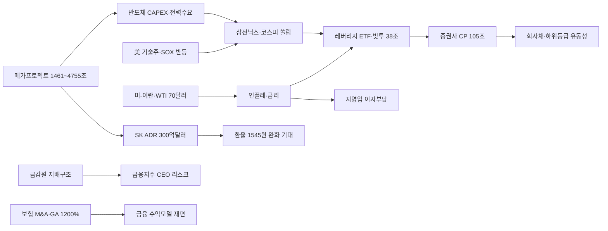

# 2026-06-30 Grok 심층 분석

## 분석 기준

- Gemini Top 5(98·88·83·81·75점)를 교체하지 않고 각 주제의 `Grok 추가 조사 요청`에 답함
- 2026년 6월 29~30일 국내외 주요 언론·청와대 국민보고회·한국은행·국세청·금융감독원·금융투자협회 자료를 우선 교차 검증
- 확인된 사실과 Grok 추론을 명시적으로 구분
- Gemini의 수치·날짜·표현 오류·과장·누락을 수정
- 본 분석 작성 시점: 2026-06-30 (6/29 국민보고회 공식 발표 **이후**)

---

## 1. 정부-기업 4700조원 규모 반도체·AI 메가프로젝트

### Gemini 핵심 내용

- 6/29 '대한민국 대도약 3대 메가프로젝트' 국민보고회 발표
- 삼성 2655조·SK 2100조, 합산 4700조원 10년 투자
- 호남 800조·팹 4기, 충청 HBM 81조, AIDC 550조
- 코스피 쏠림 완화·소부장 순환매 기대

### 추가 조사 결과

**6/29 국민보고회 (사실)**

- 이재명 대통령 주재, 청와대 영빈관 오후 2시 개최(연합뉴스·매일경제).
- 이재용 삼성전자 회장·최태원 SK그룹 회장 투자 계획 발표.
- 정부 전략: 반도체 '3S+1F'(속도전·거점전·선도전+총력 지원)(매일신문).

**투자 규모 집계 차이 (사실 — SBS·노컷뉴스)**

| 구분 | 규모 | 포함 범위 |
|------|------|----------|
| **정부 발표** | **1461조**(반올림 1500조) | 호남 팹 800조, 충청 HBM 81조, AIDC 550조, 차세대 R&D 30조 등 **신규·지방 중심** |
| **삼성** | 2655조 | 2026~2040 전국(용인·평택 2030조+지방 625조), 디스플레이·배터리·로봇 포함 |
| **SK** | 2100조 | 반도체 1100조+AIDC 1000조, 용인 600조·청주 100조·서남권 400조 등 |
| **기업 합산** | **약 4755조** | 수도권 기존 CAPEX·계열사 투자 **포함** |

- Gemini "4700조 단일 수치"는 **기업 합산 근사치**이나, 정부 수치(1461조)와 **혼용하면 과장**으로 읽힌다.

**지역별 프로젝트 상세 (사실)**

| 지역 | 핵심 내용 | 규모(보도) |
|------|----------|-----------|
| **호남** | 삼성 광주 후보지·SK 서남권, 팹 각 2기(총 4기) | 팹 800조, **지역 합산 896조**(노컷뉴스) |
| **충청** | 삼성 천안·온양 HBM 56조, SK 청주 낸드 100조 | 지역 합산 **392조** |
| **영남** | 삼성 구미 AI제조·삼성전기 부산·SDI 울산 ESS, 소부장 거점 | **270조**(잠정) |
| **피지컬 AI** | 새만금·대경권 거점, 현대차 새만금 9조(뉴시스) | — |
| **AIDC** | SK 15GW(1단계 5GW), GS 동해 2.4GW, 네이버 세종 1GW | 정부 550조 |

- 6/30 광주 '서남권 투자계획 국민보고회'에서 **최종 부지** 추가 공개 예정(매일신문 6/29).

**전력·용수·인프라 (사실 + 추론)**

- 김성환 기후부 장관: 원전·재생·SMR·LNG 수소전환 **총동원**, 한빛원전 수명연장, 하수 재처리(서울경제).
- AIDC만 **18.4GW** 규모, 호남 반도체+AIDC 전력·용수 **총력전**(서울경제).
- 이 대통령: "서남 해안 용수·신재생 풍부"(서울신문).
- **Grok 추론**: 팹 4기 완공 시 전력 6.3GW·일 용수 65만t 필요 수준(연합뉴스 등 보도 인용)은 **인프라 병목** 검증 지표. 용인 클러스터 지연 전례(전력 15GW 필요 vs 확보 6GW)가 호남 일정 리스크.

**장기 경제 효과 (추론)**

- 노컷뉴스: 기업 발표 1558조 = 2025년 명목 GDP **58.5%**.
- **Grok 추론**: 직접 고용·지역 GDP는 호남·충청에 크지만, 실제 GDP 기여는 **착공·가동 시점**(7~12년 단축 목표)과 글로벌 메모리 사이클에 좌우. 10년 CAPEX가 FCF·배당을 압박하면 시장은 단기 **조정** 가능(6/29 코스피 -0.20%).

### 교차 검증 및 수정 사항

| 항목 | Gemini 표현 | 수정 |
|------|------------|------|
| 총 투자액 | 4700조 단일 확정 | **정부 1461조 vs 기업 4755조** — 집계 범위 상이(SBS) |
| 호남 | 800조 | 팹 800조 맞으나 **지역 합산 896조**(AIDC·에너지 포함) |
| 발표일 | 오늘(6/30) | **6/29 오후 2시** 국민보고회 완료 |
| 시장 반응 | 수혜 기대만 강조 | 6/29 코스피 **-0.20%**, 외국인 **7조7332억 순매도**(디지털타임스) — 선반영+미국 악재 |

### 국내외 보도 관점 차이

- **정부·재계 6단체**: 균형발전·인프라 적기 지원 환영(연합뉴스).
- **증권가**: 직접 수혜는 장비·소부장·건설·전력, 삼전닉스는 투자 주체(뉴스1).
- **노컷뉴스**: 용두사미 방지 위해 **인프라 선행** 필수.
- **금융위**: 블룸버그 '투자 발표→급락' 연결은 **오번역**, 강경 대응(노컷뉴스).

### 시장 및 관련 기업 영향

- **단기**: 6/29 광주 지역건설(금호건설·다스코 등) 상한가, 삼성전자 -4.86%·SK하이닉스 -1.68%(연합뉴스).
- **중기 수혜**: 반도체 장비(주성·원익IPS), 소부장, 건설·전력(HD현대일렉트릭·LS일렉트릭), ESS·재생에너지.
- **환율**: SK ADR(7/10) 최대 300억달러 조달 → 달러 공급·환율 완화 기대(이데일리). 메가 CAPEX와 **중복** 시 환전 타이밍이 변수.
- **채권**: 대규모 국채·회사채 수요 증가 가능.

### 투자자가 확인할 포인트

1. 6/30 광주 서남권 보고회 **최종 입지·전력망**
2. 정부-기업 **연도별·법적 구속력** 있는 투자 확약 vs 의향
3. 용인·평택 vs 호남 **재원·인력 우선순위**
4. 7/10 SK ADR과 신규 CAPEX **중복 여부**
5. 외국인 7거래일 연속 순매도 **반전 시점**

### 위험 요인과 반대 관점

- **위험**: 숫자만 크고 인허가·전력·환경 지연(용인 복제). CAPEX → ROIC 희석. 정치 논란·외국인 매도 겹침.
- **반대 관점**: AI 메모리 슈퍼사이클 속 FAB 확보는 생존 문제. 정부 패키지 시 **TSMC형 속도** 가능. 코스닥 8.13% 급등은 순환매 시작 신호(연합뉴스).
- **확인 필요**: 특별법·재원 규모, 환경단체 반응, 호남 최종 부지.

### 출처

| 기관/매체 | 제목 | 날짜 | URL |
|-----------|------|------|-----|
| 연합뉴스 | 경제계 "3대 메가프로젝트 환영…인프라·제도 적기 지원해야" | 2026-06-29 | https://n.news.naver.com/mnews/article/001/0016165671 |
| 매일경제 | SK 최태원 "AI데이터센터 1000조·반도체 1100조 투자" | 2026-06-29 | https://n.news.naver.com/mnews/article/009/0005700195 |
| SBS | 삼성·SK는 4천700조, 산업부는 1천500조…투자액 차이 왜 | 2026-06-29 | https://n.news.naver.com/mnews/article/055/0001368267 |
| 서울신문 | 호남에 896조… 반도체 메가시티 뜬다 | 2026-06-29 | https://n.news.naver.com/mnews/article/081/0003656857 |
| 노컷뉴스 | 호남 반도체 투자액만 800조…'삼전닉스 메가투자' 순항 관건은 | 2026-06-29 | https://n.news.naver.com/mnews/article/079/0004163003 |
| 서울경제 | 서남권 반도체 전력·용수 총력전 | 2026-06-29 | https://n.news.naver.com/mnews/article/011/0004636245 |
| 뉴스1 | 메가프로젝트에 '삼전닉스' 쏠림 완화…소부장·AI로 순환매 | 2026-06-29 | https://n.news.naver.com/mnews/article/421/0009030498 |
| 뉴시스 | 현대차, '새만금 프로젝트' 탄력받나 | 2026-06-30 | https://n.news.naver.com/mnews/article/003/0014035586 |

---

## 2. 코스피 변동성·빚투 38조·레버리지 ETF

### Gemini 핵심 내용

- VKOSPI 역대 최고 97.99
- 신용융자 37조7616억원, 위탁매매 미수금 2조원+
- 삼전·닉스 시총 비중 57.1%, 단일종목 레버리지 ETF
- 증권사 CP·전단채 105조원

### 추가 조사 결과

**VKOSPI (사실 — 한겨레·연합뉴스)**

- 6/29 **장중 최고 97.99**, **종가 96.94**(전일 대비 +4.56%).
- 2009년 지수 공식 산출 이후 **종가 기준 역대 최고**.
- Gemini "97.99 기록"은 **장중 고점**이며, 공식 비교는 **종가 96.94**가 맞다.

**빚투·레버리지 (사실 — 금융투자협회·파이낸셜뉴스)**

- 6/26 기준 신용융자 **37조7616억원**(연초 +10.5조).
- 유가증권시장 신용융자 29조3296억(+70%), 코스닥은 **감소**(8조4319억).
- 위탁매매 미수금 6/25 **2조688억원** 피크, 6/26 1조5632억원.
- 단일종목 레버리지 ETF 순유입 **13조2천억**(5/27~6/26), 기존 반도체 ETF **6조6천억 순유출**(한겨레).

**과거 조정기 빚투 영향 (추론)**

- 2020·2022 조정 시 신용잔고 급증 후 **반대매매 가속** 사례 다수.
- 현재 VKOSPI 96대 + 신용잔고 역대급 → **조정 시 레버리지 매도 연쇄** 위험 상회.
- 다만 투자자예탁금 동반 증가 시 **절대 과열 아님**일 수 있음(파이낸셜뉴스).

**증권사 단기채 → 채권시장 (사실 — 이데일리)**

- 6/26 CP+전단채 **105조3178억원**(2024년 초 37조 → +68조).
- MMF·기관 자금이 증권채로 쏠리면 **회사채·여전채 투자 여력 약화**.
- 하위등급 CP 차환 **취약**(JTBC 디폴트 206억 사례 인용).
- 7월 삼성증권 6000억·신한투자 5000억 **회사채** 추가 발행 예정.

**포모·조모 (사실 — 세계일보)**

- 썸트렌드: 2026년 5월 포모 언급 **1만2767건** 역대 최다.
- 조모(JOMO) 언급 **+152%** — 레버리지 진입 전 심리 분화.

### 교차 검증 및 수정 사항

| 항목 | Gemini 표현 | 수정 |
|------|------------|------|
| VKOSPI | 97.99 역대 최고 | **장중 97.99, 종가 96.94**가 역대 최고 |
| 코스피 | 변동성만 강조 | 6/29 **820개 상승 vs 88개 하락**, 코스닥 **+8.13%** — 순환매 병행 |
| 레버리지 손익 | 미언급 | 상품 출시 **약 1개월**, 개별 투자자 손익 통계 **아직 부재** |

### 국내외 보도 관점 차이

- **신영·한국투자증권**: 실적 모멘텀 유지 시 빚투는 연료, 꺾이면 뇌관(파이낸셜뉴스).
- **금융위**: 단일종목 2배 ETF **하루 최대 60% 손실** 가능 경고.
- **조선일보(염승환)**: 변동성 장세에서도 **반도체 주도** 유지, 소외주 집착 비추.

### 시장 및 관련 기업 영향

- **코스피**: 삼성전자·SK하이닉스 움직임에 지수 **사실상 연동**(한겨레).
- **코스닥**: 제약·이차전지·메가프로젝트 기대 **순환매**(연합뉴스).
- **증권주**: 신용잔고 확대 → **업황 단기 수혜**, 단기채 조달비용·신용리스크 부담.
- **채권**: 크레딧 스프레드 확대 지속, 하위등급 **차별화**(이데일리).

### 투자자가 확인할 포인트

1. 2·4분기 실적 시즌 **차익실현**과 VKOSPI 연동
2. 단일종목 레버리지 ETF **괴리율·음의 복리** 체감 여부
3. 증권사 CP 발행 **조달금리**와 회사채 스프레드
4. 외국인 순매도 **7거래일** 반전(6/29 7조7332억)
5. 금융위 **레버리지·리딩방** 추가 규제

### 위험 요인과 반대 관점

- **위험**: Fed 추가 금리 인상·AI 수익성 의구심 → VKOSPI 급등 + 빚투 = **반대매매 폭탄**.
- **반대 관점**: 반도체 실적 서프라이즈 시 신용잔고는 **상승장 연료**(김대준 한국투자증권).
- **확인 필요**: 7월 실적, 개인 예탁금 추이, ETF 순유입 지속 여부.

### 출처

| 기관/매체 | 제목 | 날짜 | URL |
|-----------|------|------|-----|
| 한겨레 | 레버리지 ETF 출시 후 삼전·닉스 쏠림 심화 | 2026-06-29 | https://n.news.naver.com/mnews/article/028/0002811842 |
| 파이낸셜뉴스 | 38조원 '빚투' 돌아왔다 | 2026-06-29 | https://n.news.naver.com/mnews/article/014/0005541339 |
| 연합뉴스 | 코스피 내린 틈에…코스닥 8%↑ | 2026-06-29 | https://n.news.naver.com/mnews/article/001/0016165690 |
| 이데일리 | 증권사 단기채 100조 훌쩍..채권시장 흔든다 | 2026-06-29 | https://n.news.naver.com/mnews/article/018/0006318409 |
| 파이낸셜뉴스 | '조바심' 자극…2배 ETF | 2026-06-29 | https://n.news.naver.com/mnews/article/014/0005541317 |
| 세계일보 | 포모에 지친 직장인들 '조모' | 2026-06-29 | https://n.news.naver.com/mnews/article/022/0004139169 |

---

## 3. 글로벌 기술주 반등·유가·미-이란

### Gemini 핵심 내용

- 다우 52000선, 알파벳·테슬라·스페이스X 급등
- 필라델피아 반도체지수 +3.58%
- 미-이란 충돌 중단 합의, WTI 70.56달러

### 추가 조사 결과

**뉴욕증시 6/29 현지 (사실)**

| 지수 | 종가 | 등락 |
|------|------|------|
| 다우 | **52,182.74** | +0.59% |
| S&P 500 | 7,440.43 | +1.18% |
| 나스닥 | 25,820.14 | +2.07% |
| 필라델피아 반도체(SOX) | — | **+3.58%** |

- 알파벳: 다우 **첫 거래일 +4.82~4.96%**
- 테슬라: **+8.46%**, 머스크 순자산 재조달러(포브스)
- **스페이스X +7.04~7.15%**: 나스닥 **7/7부터 나스닥100 편입** 발표(뉴스1·디지털타임스) — **비상장 2차시장 밸류에이션** 변동으로 해석 필요, 일반 상장주 급등과 다름
- KLA +12%, AMAT +11%, Astera Labs +16%

**미-이란 (사실 — 블로터·한국경제TV)**

- 6/17 MOU 이후에도 6/27~28 호르무즈 긴장·보복 공격.
- 6/29 **군사적 충돌 일시 중단** 합의(CNBC 인용 미 정부 관계자).
- 트럼프: **6/30 카타르 도하** 평화협상, "이란이 회담 요청"(트루스소셜).
- **이란 측 공식 확인 없음** — 협상 일정 **일방 발표**에 가까움.
- ING: 시장이 지정학 리스크 **과소평가**, 유가 **상승 위험** 경고.

**국제유가 (사실)**

- WTI **70.56달러**(+1.9%), 브렌트 **72.91달러**(+1.3%)(블로터 6/29).
- 한국경제TV 8월물: WTI 70.75, 브렌트 73.15달러.
- **충돌 완화에도 상승** — 공급 정상화 낙관 vs 실제 리스크 괴리.

**국내 반도체 연동 (사실 + 추론)**

- 6/29 미국 반도체 반등에도 삼성전자 -4.86%·SK하이닉스 -1.68%(디지털타임스).
- **Grok 추론**: 메가프로젝트 CAPEX 우려·외국인 매도가 **글로벌 랠리 상쇄**. 단기 반등 시 **베타 1.2~1.5** 수준 동조 예상.

**랠리 지속 요인 vs 위험 (추론)**

- **지속**: AI 저가 매수, 알파벳 다우 편입, 실적 시즌 기대.
- **위험**: Fed 매파·독립기념일 단축주(금요일 휴장) **유동성 축소**, 분기말 차익실현(CNBC), 중동 재격화.

### 교차 검증 및 수정 사항

| 항목 | Gemini 표현 | 수정 |
|------|------------|------|
| 다우 | 52000선 | **52,182.74** (정확 종가) |
| 스페이스X 7.04% | 상장주 급등 | **나스닥100 편입 발표**에 따른 2차시장 가격 변동 |
| 미-이란 | 충돌 중단 합의 | **일시 중단 보도** 있으나 이란 미확인, 도하 회담 **트럼프 일방** |
| 유가 | 중단에도 상승 누락 강조 부족 | WTI 70달러 재돌파는 **리스크 프리미엄 잔존** 신호 |

### 국내외 보도 관점 차이

- **블룸버그**: AI 매도는 저가 매수 기회(뉴스1 인용).
- **카로바캐피털 CIO**: 중동 움직임을 **전술적**으로 간주, 구조적 해법 없으면 베팅 축소(한국경제TV).
- **ING**: 유가 안일함 비판(블로터).

### 시장 및 관련 기업 영향

- **국내**: 삼성전자·SK하이닉스·삼성전기 **미국 장비주 동조**는 장비·소부장에 우선 전달.
- **환율**: 중동 완화에도 원화 약세(6/29 **1545.2원**) — 달러 강세·외국인 매도가 **유가보다 우세**(이데일리).
- **에너지**: WTI 70달러+ → 국내 정유·화학 **원가 부담**, 인플레 재점화 우려.

### 투자자가 확인할 포인트

1. 6/30 도하 회담 **실제 개최·이란 참여** 여부
2. 호르무즈 상선 **자유 통항** 지속
3. 7/3~7/10 미 증시 단축주 **변동성**
4. 국내 7/1 6월 수출·7/2 고용보고서(뉴스1 인용)
5. 엔비디아·마이크론 실적 가이던스

### 위험 요인과 반대 관점

- **위험**: 도하 회담 결렬 → 유가 급등·글로벌 기술주 조정 → 국내 외국인 매도 가속.
- **반대 관점**: 기술주 조정은 **건강한 되돌림**, SOX 반등은 사이클 지속 신호.
- **확인 필요**: 이란 외교부 입장, OPEC+ 증산, Fed 7월 FOMC.

### 출처

| 기관/매체 | 제목 | 날짜 | URL |
|-----------|------|------|-----|
| 디지털타임스 | 美 증시 3대 지수 동반 상승, 다우 52000선 | 2026-06-29 | https://n.news.naver.com/mnews/article/029/0003034330 |
| 뉴스1 | 美 필라델피아 반도체지수 3.6%↑ | 2026-06-29 | https://n.news.naver.com/mnews/article/421/0009030466 |
| 블로터 | 국제유가, 중동 긴장 재고조에 상승 | 2026-06-29 | https://n.news.naver.com/mnews/article/293/0000086959 |
| 한국경제TV | 美증시 다우 사상 최고치…테슬라 8%↑ | 2026-06-29 | https://n.news.naver.com/mnews/article/215/0001256996 |
| 파이낸셜뉴스 | 머스크, 사흘 만에 다시 '조만장자' | 2026-06-29 | https://n.news.naver.com/mnews/article/014/0005541327 |

---

## 4. 자영업자 대출·부동산

### Gemini 핵심 내용

- 1분기 자영업자 대출 1095조·연체 20조+
- 재건축 공사비 27% 상승, 장특공제 서울 90%
- 다주택자 종부세·동탄 광비콤 갈등

### 추가 조사 결과

**자영업자 대출 (사실 — 한국은행·연합뉴스 6/30)**

- 1분기 말 대출 **1095조5000억원**(2012년 통계 이래 최대).
- 사업자대출 745조5000억 + 가계대출 350조.
- 연체액 **20조원 초과**, 연체율 **2%대**(10년 9개월 만 최고).
- 2금융: 저축은행 11년·여전사 12년 만 최고 연체율.
- 기준금리 +0.25%p 시 1인당 이자 부담 **+56만원** 추산.
- **통계 주의**: 한은 패널(235만인) 기반. 신용보증기금(KCD) 등 **별도 통계**와 직접 비교 불가.

**금융권 부실 전이 (추론)**

- 연체율 2%대는 아직 **시스템 리스크 임계** 아님이나, 2금융·영세 자영업자 **선행 지표**.
- 금리 인상·소비 둔화 시 **연쇄 부실** 가능. 저축은행·캐피탈 **충격 흡수** 관건.

**재건축·공사비 (사실 — 매일경제)**

- 금호16구역: 2년 만에 공사비 **27%↑**(1711억→2176억).
- 명품 재건축·고급 마감 경쟁, 중동전쟁 **자재 수급** 부담.
- **Grok 추론**: 공사비 상승 → 분양가·조합원 부담 ↑ → **일반분양 물량 축소**·서울 외곽 전매 가속 가능.

**세제 (사실 — 연합뉴스·이데일리)**

- 고가주택(12억+) 장특공제 **8638억원**, 서울 **90.6%**.
- 30억 초과 양도 **44.3%** 집중.
- 종부세: 다주택자 23만6872명이 세액 **67%** 부담. 11채+ 2만1908명 → 종부세 **30%**.
- 이 대통령: "여러 채 보유 시 **상응하는 부담**"(취임 1주년 기자회견).

**동탄 광비콤 (사실 — 이데일리)**

- LH: 광비콤 일부에 **주상복합 2000가구** 추진.
- 정명근 화성시장·주민 **공개 반대** — '태릉CC 시즌2' 우려.
- 개발 방향 **미확정**.

### 교차 검증 및 수정 사항

| 항목 | Gemini 표현 | 수정 |
|------|------------|------|
| 연체액 | 20조원 초과 | 한은 기준 **20조 초과·2%대** 확인, **정확 연체액 공개 수치는 기사 본문에 미기재** |
| 대출 | 1095조 | **1095조5000억원**(한은, 6/30 연합뉴스) |
| 서울 집값 | 미언급 | 5월 전국 아파트 매매가 **+0.25%**, 서울 **72주 연속 상승**(이데일리) |

### 국내외 보도 관점 차이

- **정부**: 다주택·초고가 보유세 강화 검토, 실거주 중심(연합뉴스).
- **지자체(화성)**: 자족도시 기능 우선, 주택 공급 **보류 압력**.
- **한은 연구**: 주택 기대심리 과열 → 7~8개월 후 **가계대출·실질가격** 상승(세계일보 인용).

### 시장 및 관련 기업 영향

- **금융**: 저축은행·여전사 **추가 충당금**, 2금융주 **밸류에이션 할인**.
- **건설**: 재건축·재개발 **마진 압박**, 고급화 수주는 **단기 실적** vs **원가 리스크**.
- **부동산**: 다주택자 매물 **점진적 출회** 가능, 서울 전셋값 12년8개월 만 **최대 상승률**(이데일리).

### 투자자가 확인할 포인트

1. 하반기 **세법개정안** 다주택·공정시장가액비율
2. 저축은행 **연체율 분기** 추이
3. 광비콤 **정부-LH-화성시** 협의 결과
4. 재건축 **분양가 상한·공사비** 추가 인상
5. 기준금리 **동결 vs 인상** 경로

### 위험 요인과 반대 관점

- **위험**: 금리 인상 → 자영업 연체 **폭증** → 2금융 M&A·정리 필요.
- **반대 관점**: 자영업 대출 증가가 **경기 회복**의 후행 지표일 수 있음(절대규모 대비 완만한 증가 +2.6조/분기).
- **확인 필요**: KCD·금감원 공식 연체 통계, 보유세법 입법 시점.

### 출처

| 기관/매체 | 제목 | 날짜 | URL |
|-----------|------|------|-----|
| 연합뉴스 | '위기의 자영업자' 대출·연체액 최대 | 2026-06-30 | https://n.news.naver.com/mnews/article/001/0016166091 |
| 연합뉴스 | 고가주택 장특공제 90%가 서울 집중 | 2026-06-29 | https://n.news.naver.com/mnews/article/001/0016166090 |
| 매일경제 | 명품 재건축 경쟁에 공사비·분양가 폭주 | 2026-06-29 | https://n.news.naver.com/mnews/article/009/0005700435 |
| 이데일리 | '11채 이상' 다주택자 2만명, 종부세 30% | 2026-06-29 | https://n.news.naver.com/mnews/article/018/0006318405 |
| 이데일리 | 동탄 '광비콤' 주택공급 놓고 여권 내 충돌 | 2026-06-29 | https://n.news.naver.com/mnews/article/018/0006318402 |

---

## 5. 금감원 지배구조·보험 M&A·GA 1200%룰

### Gemini 핵심 내용

- 금감원 8대 금융지주 CEO 승계 불공정 지적
- 롯데손보·예별손보·KDB생명 M&A, 매수자 우위
- 7월 GA 1200%룰 시행

### 추가 조사 결과

**지배구조 점검 (사실 — 서울경제 6/30)**

- 8대 지주(KB·신한·하나·우리·농협·iM·BNK·JB)·20개 은행 대상 **연초 특별점검** 결과 **최초 공개**.
- 이사회가 **現 CEO 참호 구축**에 이용, 승계 절차 **現 CEO 유리**하게 변경.
- 친CEO 사외이사 승계 참여, 사외이사 **내부추천 편중**.
- 개선안 **7월 발표** 예상. 이찬진 원장: **3연임 제한** 논의 마무리, KB 회장 쇼트리스트(7/3) 전 발표.

**보험 M&A (사실)**

| 매물 | 매수 후보 | 핵심 조건 |
|------|----------|----------|
| **예별손보** | 흥국화재·한국투자금융(본입찰 6/30) | 예보 지원 **최대 1.2조**, 교보생명·IBK 불참 |
| **롯데손보** | 한국투자금융(공시)·신한금융 검토 | 희망가 **2조→1조** 하향 관측, JKL 77.04% |
| **KDB생명** | 산업은행 매각 전 자본확충 협의 | 장기부채·확정금리 부담 |

- 롯데렌탈: 공정위 **독과점 불허** → 어피니티 매각 무산, **재매각 난항**(동행미디어).
- 매수자는 3개 매물 **비교 입찰** → 매도자 가격·지원 **현실화** 압력.

**GA 1200%룰 (사실 — 동행미디어 6/30)**

- **7/1부터** GA 소속 설계사에 적용(기존 전속·보험사→GA 지급에는 이미 적용).
- 첫해 보상 **월납 12개월분 이내**(모집수수료+정착지원금+시책 포함).
- 대형 GA 4사 설계사 **+11.8%**(1분기), 정착지원금 **+7.4%** — 시행 전 **영입 경쟁**.
- 단기 **신계약 둔화** 우려, 장기 **부당승환·먹튀** 감소 기대.
- 금감원: 우회 지급·**13회차 이후 시책** 감시 강화.

### 교차 검증 및 수정 사항

| 항목 | Gemini 표현 | 수정 |
|------|------------|------|
| 지배구조 | 일반적 지적 | **8대 지주·20은행** 점검, **7월 개선안** 구체 일정 확인 |
| 예별손보 | 인수 추진 | **6/30 본입찰 마감**, 흥국·한투 참여·교보 불참 **확정**(서울경제) |
| GA 시행 | 7월 | **7월 1일(내일)** 시행(D-1 보도 기준) |

### 국내외 보도 관점 차이

- **금감원**: 형식적 모범관행 개선은 됐으나 **편법 운영** 잔존(서울경제).
- **보험업계**: M&A 매수자는 **지원 규모·정상화 비용** 따져 **선택적 입찰**.
- **GA**: 설계사는 초기 수수료 **감소 부담**, 업계는 영업 **질적 전환** 기대.

### 시장 및 관련 기업 영향

- **금융지주**: 지배구조 개선 → CEO 교체 불확실성·**지배구조 할인** 단기 확대, 장기 **투명성 프리미엄**.
- **보험**: 예별·롯데손보 인수 시 한투·흥국·신한 **종합금융** 강화. 실패 시 **밸류에이션 재하향**.
- **GA 의존 보험사**: 7~8월 신계약 **일시 감소** → 실적 모멘텀 둔화 가능.

### 투자자가 확인할 포인트

1. 7월 금감원 **지배구조 개선안** 전문·3연임 규정
2. 예별손보 **6/30 본입찰** 결과·7월 우선협상자
3. 롯데손보 **가격 협상**(1조 관측)
4. GA 1200%룰 **우회 지급** 적발 여부
5. KB금융 **7/3 회장 쇼트리스트**

### 위험 요인과 반대 관점

- **위험**: 개선안이 **선언 수준**, 보험 M&A **가격 이견**으로 연기·무산.
- **반대 관점**: 매수자 우위는 **낮은 프리미엄 인수** 기회. GA 규제는 **계약 유지율·손해율** 개선으로 중장기 수익성 제고.
- **확인 필요**: 각 지주별 **점검 지적 개별 대응**, 공정위 롯데렌탈 재매각 일정.

### 출처

| 기관/매체 | 제목 | 날짜 | URL |
|-----------|------|------|-----|
| 서울경제 | 금감원 "現 CEO에 유리한 승계 사례 확인" | 2026-06-29 | https://n.news.naver.com/mnews/article/011/0004636260 |
| 서울경제 | 흥국화재, 예별손보 인수 추진 | 2026-06-29 | https://n.news.naver.com/mnews/article/011/0004636115 |
| 동행미디어 | 꽃놀이패 쥔 매수자들…보험사 매각전 | 2026-06-29 | https://n.news.naver.com/mnews/article/417/0001149534 |
| 동행미디어 | GA 1200%룰 시행 D-1 | 2026-06-29 | https://n.news.naver.com/mnews/article/417/0001149535 |
| 동행미디어 | 롯데렌탈 재매각 난항 | 2026-06-29 | https://n.news.naver.com/mnews/article/417/0001149538 |

---

## Top 5 종합 결론

6/29 **3대 메가프로젝트**는 한국 경제의 단기 화제이자 중장기 **산업 지도 재편**의 출발점이다. 다만 **정부 1461조와 기업 4755조**를 구분하지 않으면 투자 규모가 과장되고, 6/29 장중 **외국인 7조 순매도**·코스피 소폭 하락은 "발표=즉시 랠리" 논리를 반박한다. 동시에 코스닥 **8% 급등**과 지역 건설주 강세는 **순환매 초입** 신호로 읽을 여지가 있다.

**변동성·빚투·레버리지**는 VKOSPI 종가 **96.94**와 신용융자 **38조**가 맞물린 **양날의 검**이다. 반도체 실적이 버티면 연료, AI 의구심·금리 충격이면 **반대매매 트리거**. 증권사 CP 105조는 주식시장과 **채권시장을 동시에** 조여 하위등급 자금조달에 경고등이 켜졌다.

**글로벌 기술주 반등**은 다우 **52,182**·SOX +3.6%로 확인됐으나, **미-이란 합의는 일방 보도** 성격이 강하고 유가는 70달러+를 유지한다. 국내 반도체는 글로벌 랠리 대비 **약한 반응**(메가 CAPEX·외국인 매도) — 단기 **디커플링**, 실적 시즌에 **재동조화** 가능.

**자영업자 부채·부동산**은 거시 안정성의 **은밀한 취약점**이다. 연체율 2%대·재건축 공사비 폭주·다주택 보유세 강화 기대가 겹치면 **2금융·서울 재건축·다주택 매물**에서 순차적 스트레스가 드러날 수 있다.

**금융 지배구조·보험 M&A·GA 규제**는 금융 산업 **질적 전환기**다. CEO 승계 견제·보험사 매수자 우위·GA 수수료 상한은 단기 **이벤트 리스크**이나, 장기적으로는 **지배구조 프리미엄·보험 밸류체인 효율화**의 분기점이 될 수 있다.

---

## 주제 간 연결 관계

- **메가프로젝트 ↔ 변동성**: 대형 CAPEX 발표가 오히려 삼성전자 조정·VKOSPI 급등을 동반(6/29).
- **글로벌 랠리 ↔ 국내 디커플링**: 외국인 매도·CAPEX 우려가 **글로벌 베타 상쇄**.
- **유가·금리 ↔ 자영업·빚투**: 이자 부담이 **자영업 연체**와 **신용융자**를 동시에 압박.
- **SK ADR ↔ 메가프로젝트**: 달러 조달과 국내 투자 집행이 **환율·반도체 CAPEX**를 연결.

---

## 추가 확인이 필요한 사항

1. **6/30 광주 서남권 보고회** — 호남 팹 최종 부지·전력 6.3GW·용수 65만t 공식 수치
2. **6/30 도하 미-이란 회담** — 이란 참석 여부·호르무즈 통항
3. **예별손보 6/30 본입찰** 결과·7월 우선협상 대상자
4. **7월 금감원 지배구조 개선안** 및 KB금융 7/3 회장 쇼트리스트
5. **7/1 GA 1200%룰** 시행 후 7월 신계약·우회 지급 모니터링
6. **7/10 SK하이닉스 ADR** — 달러 환전 규모·메가프로젝트 CAPEX와의 배분
7. **하반기 세법개정안** — 다주택·공정시장가액비율·동탄 광비콤 최종 결정
8. **2·4분기 반도체 실적** — VKOSPI·신용융자 지속 가능성의 분기점