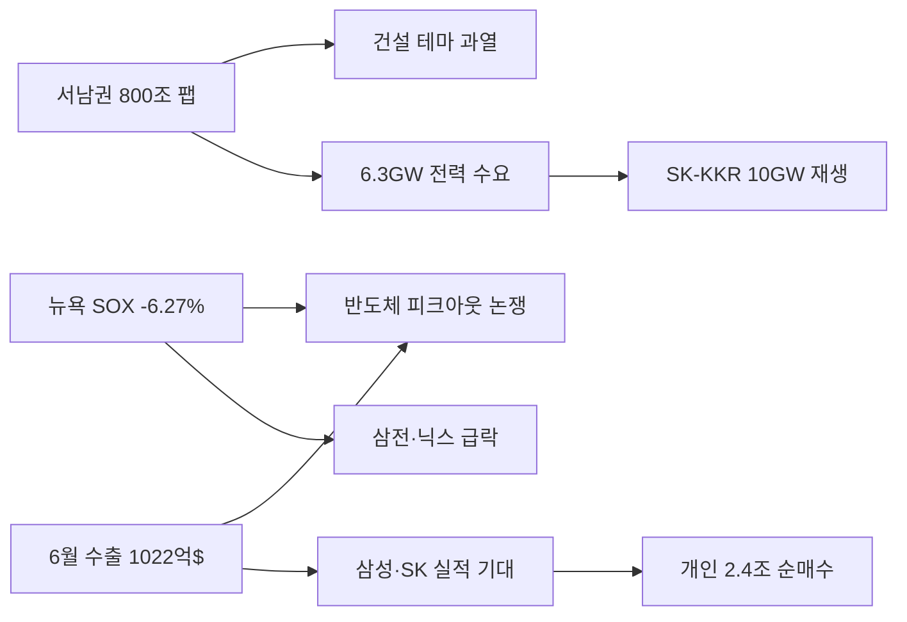

# 2026-07-02 Grok 심층 분석

## 분석 기준

본 보고서는 2026년 7월 1~2일 발표된 국내 주요 경제·증시 소식을 산업통상부·청와대 정책브리핑·한국거래소·뉴욕증시 마감 데이터 등 공식·1차 자료와 국내외 주요 언론 보도를 교차 검증해 작성했다. Gemini Top 5 주제를 유지하며, 수치·날짜·인과관계 오류를 수정하고 사실과 추론을 구분했다.

---

## 1. 한국 월 수출액 사상 첫 1000억 달러 돌파, 글로벌 4강 진입 기대감 고조

### Gemini 핵심 내용

- 6월 수출액 1023억 달러(YoY +70.9%), 월 1000억 달러 돌파는 세계 4번째 기록.
- 반도체 수출 448억 달러(YoY +199.5%), 사상 첫 월 400억 달러 돌파.
- 상반기 누적 수출 4967억 달러, 연간 1조 달러·수출 4강 진입 기대.

### 추가 조사 결과

- **공식 수출 통계(산업통상부, 2026-07-01)**: 6월 수출 1022억 5000만 달러(YoY +70.9%), 수입 661억 달러(YoY +30.1%), 무역수지 흑자 361억 5000만 달러. 무역수지는 월간 기준 처음으로 300억 달러를 돌파했다.
- **반도체·비반도체 동반 성장**: 반도체 수출 448억 2000만 달러(YoY +199.5%), 반도체 외 품목 +28%. 컴퓨터(SSD) 54억 1000만 달러(+308.8%), 자동차 67억 1000만 달러(+5.8%), 철강 21억 4000만 달러(+9.6%, 14개월 만에 플러스), 화장품 13억 4000만 달러(+42.5%).
- **지역별**: 대중국 +92.1%(200억 3000만 달러), 대미국 +78.6%(200억 2000만 달러), 대아세안 +86.6%(183억 달러, 5개월 연속 월 역대 최대).
- **상반기 누적**: 수출 4967억 달러(+48.4%), 반도체 1924억 달러(+162.6%)로 **이미 2025년 연간 반도체 수출(1734억 달러)을 상회**.
- **고용·하반기 전망(추론)**: 산업부 장관은 미 관세·중동 물류 불안·보호무역 확산 속에서도 AI 서버향 반도체가 상반기 역대 최대 실적을 견인했다고 평가했다. 수출 호조는 반도체·조선·화학 등 수출 기업의 생산·투자 확대로 이어져 제조업 고용에 긍정적이나, **반도체 편중도가 높아 특정 품목 둔화 시 고용 파급이 비대칭적**일 수 있다.
- **하반기 리스크**: 산업부는 하반기 미 관세조치, 유가 변동성, 글로벌 경기 둔화 가능성을 경고했다. EU 철강 무관세 쿼터 축소, 미국 관세 리스크가 자동차(-2.4% 부품) 등에 이미 부분 반영 중이다.

### 교차 검증 및 수정 사항

- **수출액 표기**: 공식 수치는 **1022억 5000만 달러**이며, Gemini의 '1023억 달러'는 반올림 수준이다. 실질적 오류는 아니다.
- **'세계 4번째' 근거**: 독일·중국·미국에 이어 한국이 월 1000억 달러를 돌파한 네 번째 국가라는 산업부 발표와 일치한다. 일본·네덜란드 역대 최대 월 수출은 700~800억 달러대.
- **무역수지**: Gemini '361억 5000만 달러'는 정확하다. 전년 동월 대비 +271억 4000만 달러 증가.
- **원화 강세 압력**: 수출 급증은 이론상 원화 강세 요인이나, 7월 1일 원/달러는 1554.90원으로 **2009년 이후 최고치**를 기록해 환율 효과는 제한적이다.

### 국내외 보도 관점 차이

- **국내 언론**: '수출 4강'·'반도체 초호황'·'연간 1조 달러 가능성'을 전면 보도하며 경기 회복 내러티브를 강조.
- **외신·글로벌 시장**: 한국 수출을 AI 투자 사이클의 선행지표로 평가하나, 7월 1일 뉴욕 반도체주 급락과 맞물려 **'수출은 최고, 주가는 조정'** 이중 해석이 공존한다.

### 시장 및 관련 기업 영향

- **반도체**: 삼성전자·SK하이닉스·마이크론 수혜. HBM·SSD·서버 메모리 밸류체인(삼성전기 MLCC, 디자인하우스) 동반 수혜.
- **수출 다변화 수혜**: 조선(LNG선 고부가), 화장품, 농수산식품(+16.8%), 철강(14개월 만에 플러스).
- **환율·채권**: 고환율은 수출 기업의 원화 환산 실적에 우호적이나, 원자재 수입 기업·내수 소비에는 부담. 수출 호조가 금리 인하 기대를 늦출 경우 국채 금리 상방 압력 가능.

### 투자자가 확인할 포인트

- **7월 수출 추세**: 6월은 반도체 가격·물량 동반 급증이 겹친 특수 요인이 크다. 7~8월 관세·물류 변수와 메모리 가격 둔화 여부를 월간 수출 통계로 확인해야 한다.
- **품목 편중도**: 상반기 반도체가 전체 수출의 약 39%를 차지. 반도체 외 품목(+16%) 성장세가 지속되는지가 '질적 성장' 판단의 핵심이다.
- **고용 지표**: 6월 제조업 생산·수출이 고용으로 전환되는 데 1~2분기 시차가 있다. 8월 고용동향의 제조업 취업자 수 추이를 함께 볼 것.

### 위험 요인과 반대 관점

- **반도체 의존 심화**: 상반기 반도체 수출이 이미 전년 연간을 넘어섰다는 점은 호황이면서 동시에 **기저효과·피크아웃 리스크**를 키운다.
- **대외 불확실성**: 미 관세, 중동 물류, EU 철강 쿼터 등이 하반기 수출 증가율을 급격히 둔화시킬 수 있다.
- **반대 관점**: 일부 증권가는 AI 인프라 투자가 2027년까지 지속되면 한국 메모리 수출은 2026~2027년에도 고성장이 가능하다고 본다.

### 출처

- [공식] 산업통상부, '2026년 6월 수출입 동향', 2026-07-01, https://www.korea.kr/news/policyNewsView.do?newsId=148967445
- [교차] 이데일리, '월수출 첫 1000억달러 獨·中·美 이어 네번째', 2026-07-01, https://n.news.naver.com/mnews/article/018/0006320321
- [교차] 뉴스핌, 'AI 반도체가 쓴 수출 신기록', 2026-07-01, https://www.newspim.com/news/view/20260701000979

---

## 2. 뉴욕증시, AI 반도체주 급락하며 3분기 시작…차익실현 및 메타 변수 영향

### Gemini 핵심 내용

- 7월 1일(현지) 뉴욕 3대 지수 하락, 필라델피아 반도체지수(SOX) -6.27%.
- 마이크론 -10.57%, 샌디스크 -10.62%, 인텔 -8.99%, AMD -7.34%.
- 메타 AI 클라우드 사업 추진과 워시 연준 의장 매파 발언이 악재.

### 추가 조사 결과

- **뉴욕증시 마감(7월 1일 현지)**: 다우 -0.03%(52,305.24), S&P500 -0.22%(7,483.23), 나스닥 -0.66%(26,040.03). SOX -6.27%.
- **차익실현이 핵심**: 상반기 SOX +80% 이상, 마이크론 연초 대비 +250%, 샌디스크 상반기 +850% 수준. KKM파이낸셜 CEO는 "기술주 차익실현 자금이 다우 우량주로 이동하는 **대순환 거래**가 3분기에도 이어진다"고 평가했다.
- **메타 변수 재해석**: 메타플랫폼스는 잉여 AI 컴퓨팅 파워를 외부에 판매하는 클라우드 사업 추진 보도 후 **+8.81% 급등**했다. 반도체주 하락의 직접 원인으로 메타 뉴스를 단정하기 어렵고, **'AI 인프라 수요 둔화' 우려**와 **'메타 수익화 긍정'** 해석이 공존한다.
- **워시 연준 의장**: ECB 포럼에서 "물가가 여전히 너무 높다"고 했으나 금리 방향은 선제 안내하지 않았다. 시장은 연내 최소 1회 금리 인상 가능성을 여전히 반영 중이다.
- **경기 지표**: ISM 6월 제조업 PMI는 둔화했으나 견조. ADP 6월 민간 고용 +9.8만 건(기대 12.2만 건 하회). 7월 2일(현지) 고용보고서와 7월 14일 CPI가 다음 변곡점.

### 교차 검증 및 수정 사항

- **인텔·AMD 수치**: Gemini 수치와 뉴스핌·국내 보도가 대체로 일치. 엔비디아(-1.25%), 브로드컴(-2.23%)는 상대적 방어.
- **메타 인과관계 수정**: Gemini는 "메타 클라우드 소식이 AI 인프라 수요 둔화 우려를 자극"했다고 했으나, 당일 메타 주가는 급등했다. 반도체 급락의 1차 설명은 **상반기 급등 후 차익실현**이 더 타당하다.
- **3분기 실적 전망**: 마이크론 등 메모리 업체 3분기 컨센서스는 AI 서버 수요로 여전히 상향 조정 중이나, 단기 주가는 밸류에이션·포지션 조정에 민감하다.

### 국내외 보도 관점 차이

- **국내**: '반도체 조정 시작'·'피크아웃 신호' 프레임과 '건전한 차익실현' 프레임이 혼재.
- **미국**: 월스트리트 다수는 대순환 장세 지속을 강조. 소프트웨어주(세일즈포스 등)로 자금 이동이 뚜렷했다.

### 시장 및 관련 기업 영향

- **한국 반도체**: 7월 1일 삼성전자 -5.84%, SK하이닉스 -3.40%로 뉴욕 조정이 즉시 전이됐다.
- **환율**: 미 금리 매파 기대와 안전자산 선호로 달러 강세·원화 약세 압력 지속.
- **섹터 로테이션**: 반도체 대비 소프트웨어·대형 기술주·다우 우량주 상대 강세.

### 투자자가 확인할 포인트

- **SOX 6.27% 하락의 성격**: 2020년 이후 분기 최고 상승 뒤 첫 거래일 조정 패턴과 유사. 추세 전환인지 조정인지는 2~3주 거래대금·실적 가이던스로 판별.
- **메타 클라우드의 2차 효과**: 빅테크 자체 인프라 활용이 늘면 외부 GPU·메모리 발주 구조가 바뀔 수 있어, 중장기 공급망 재편 리스크를 모니터링해야 한다.
- **7월 CPI·FOMC**: 워시 체제 하 인플레이션 경로가 기술주 밸류에이션의 핵심 변수.

### 위험 요인과 반대 관점

- **AI 사이클 둔화 시나리오**: 메타·구글·마이크로소프트의 내부 인프라 효율화가 외부 장비 투자를 줄이면 메모리 슈퍼사이클이 조기 둔화될 수 있다.
- **반대 관점**: 마이크론 연초 대비 +250%에도 추가 상승 여력이 있다는 주장. 실적 기반 랠리가면 조정은 매수 기회.
- **금리 리스크**: 연내 금리 인상이 현실화되면 고밸류 기술주 전반 재평가 가능.

### 출처

- [교차] 뉴스핌, '뉴욕증시, 반도체 차익실현 속 일제히 하락…나스닥 0.66%↓', 2026-07-02, https://www.newspim.com/news/view/20260702000021
- [교차] 뉴스핌, '[미국 특징주] 메타, 클라우드 인프라 시장 진출 추진 보도에 6% 강세', 2026-07-01, https://www.newspim.com/news/view/20260701001476
- [교차] 파이낸셜뉴스, '[뉴욕증시] 다우지수, 막판 약세 전환…마이크론 10.4% 급락', 2026-07-01, https://n.news.naver.com/mnews/article/014/0005542636

---

## 3. 삼성전자·SK하이닉스 급락에도 개인 투자자 '저가 매수'…반도체 피크아웃 논란 가열

### Gemini 핵심 내용

- 7월 1일 삼성전자 -5.84%, SK하이닉스 -3.40%. 개인 순매수 2조 4000억 원 이상.
- D램·SSD 수출단가 전월 대비 4~5% 하락, 피크아웃 우려.
- 애플 메모리 단가 인상·제품 가격 인상도 악재.

### 추가 조사 결과

- **거래소 수급(7월 1일)**: 개인 삼성전자 순매수 1조 6520억 원, SK하이닉스 7664억 원, 합계 **2조 4184억 원**. 코스피 -2.04%(8303.41), 코스닥 +1.44%(929.35).
- **누적 개인 매수**: 2026년 1월 2일~6월 30일 개인은 삼성전자 45조 5982억 원, SK하이닉스 40조 8212억 원 순매수(합계 **86조 4194억 원**).
- **증권가 목표가**: 한화투자증권 SK하이닉스 430만 원, 신한투자증권 삼성전자 59만 원 등 상향 사례가 FOMO를 강화.
- **실적 컨센서스**: NH투자증권 등은 "반도체 랠리가 실적 개선에 기반"한다고 평가. 마이크론 영업이익 전망 상향이 국내 2~4분기 컨센서스 상향으로 이어지는 흐름.
- **피크아웃 논쟁**: 6월 반도체 수출은 역대 최대인 반면, 일부 보도는 D램·SSD **수출단가 전월 대비 4~5% 하락**을 근거로 고점 논쟁을 제기. TrendForce 등 업황 리서치는 2026년 상반기 DRAM 가격 급등 후 완만한 조정 가능성을 언급하나, AI 서버용 고대역폭 메모리(HBM)는 별도 강세 구간.
- **애플 변수**: 애플의 메모리 단가 상승을 이유로 한 제품 가격 인상은 단기적으로 메모리 수요 신호이기도 하며, 단순 악재로만 해석하기 어렵다.

### 교차 검증 및 수정 사항

- **개인 순매수 규모**: Gemini '2조 4000억 원 이상'은 거래소 집계와 일치(정확히 2조 4184억 원).
- **코스피 하락 원인**: 반도체 대형주 급락 + 연기금 매도 이슈 + 고환율(1554.90원) 복합. 개인 매수만으로 지수 방어는 실패.
- **피크아웃 단정 불가**: 월 수출액 최대와 단가 소폭 하락은 공존 가능. **물량·가격·제품 믹스(HBM 비중)** 를 분리해 봐야 한다.

### 국내외 보도 관점 차이

- **국내**: '개미의 승부수'·'FOMO'·'레버리지 ETF'를 강조하는 투자심리 보도가 많다.
- **해외**: 한국 반도체 수출 실적은 강세지만, 뉴욕 반도체 조정이 한국 대형주 프리미엄 축소 요인으로 거론된다.

### 시장 및 관련 기업 영향

- **코스피**: 삼성전자·SK하이닉스 시가총액 비중이 커서 두 종목 변동이 지수 전체를 좌우.
- **레버리지 ETF**: 삼성전자·SK하이닉스 레버리지 ETF 거래대금 급증, 단기 변동성 확대.
- **중소형 반도체**: 수급 쏠림으로 소형 반도체·코스닥 반도체는 상대 소외 가능.
- **외국인·기관**: 개인 매수와 대형주 매도가 동시에 나타나 수급 양극화 심화.

### 투자자가 확인할 포인트

- **2·4분기 실적 발표**: 7~8월 실적 시즌에 HBM·범용 DRAM 믹스와 마진 가이던스가 피크아웃 논쟁의 분수령.
- **개인 매수 지속성**: 86조 원 누적 순매수 이후 추가 유입 여력·레버리지 롤오버 비용.
- **연기금 매도**: 연금공단 "매도 폭탄" 논란에 대해 공식 해명이 나왔으나, 대형주 수급 변수는 잔존.

### 위험 요인과 반대 관점

- **쏠림·FOMO 리스크**: 개인 자금 집중은 조정 시 변동성 증폭. 레버리지 ETF 장기 보유 시 롤오버 비용 부담.
- **피크아웃 현실화 시**: D램 가격 하락이 2분기 이상 지속되면 목표주가 상향 논리가 약화.
- **반대 관점**: AI 데이터센터·서남권 투자 확대로 2027년까지 메모리 수요 견조. 조정은 분할 매수 기회.

### 출처

- [교차] 파이낸셜뉴스, '"돈 잃는 것보다 못 산 게 더 무섭다"…급락에도 삼전·닉스 담은 개미들', 2026-07-02, https://n.news.naver.com/mnews/article/014/0005542649
- [교차] 뉴스1, '반도체 최대 수출에도 삼전닉스 털썩…피크 아웃 우려 vs 매수 기회', 2026-07-01, https://n.news.naver.com/mnews/article/421/0009036054
- [공식] 산업통상부, '2026년 6월 수출입 동향(반도체 448억 달러)', 2026-07-01, https://www.korea.kr/news/policyNewsView.do?newsId=148967445

---

## 4. 정부, 서남권 800조원 반도체 클러스터 투자 발표…건설·부동산 시장 기대감 속 투기 주의보

### Gemini 핵심 내용

- 3대 메가 프로젝트 1500조 원, 삼성·SK 서남권 800조 원·팹 4기.
- 호남권 건설사(금호건설, 남화토건 등) 급등·투자경고 지정.
- 기업 신중·정부 속도전, 실제 가동까지 시차.

### 추가 조사 결과

- **정부 공식(6월 29~30일)**: '대한민국 대도약 3대 메가프로젝트'—서남권 반도체 800조 원(팹 4기), 충청권 패키징 81조 원, AI 데이터센터 550조 원(18.4GW). 6월 30일 서남권 국민보고회에서 SK·삼성·앰코 MOU 체결, **서남권 기업 합산 투자 896조 원**(SK 470조, 삼성 425조, 앰코 1조) 발표.
- **인프라 계획**: 산업단지 조성 5년 이내 단축, 메가특구 지정, 전력·용수·송전망 패스트트랙. 서남권 반도체 단지에 **6.3GW** 전력 필요(전체 메가프로젝트 24.7GW 확충).
- **부지·착공**: 광주 군공항 이전 부지, 광주 미래차 산업단지, 해남 솔라시도 등 후보지 시찰 완료. **구체 착공 시점·최종 부지는 조율 중**.
- **건설주 과열(7월 1일)**: 코스피 -2% 날 금호건설·남화토건 상한가, 금호전기 +18.31%. 거래소, 남화토건·금호전기·금호건설(보통·우선) **투자경고** 지정.
- **1분기 건설공사 계약**: 전년 대비 +23.4%, 민간(반도체·데이터센터)이 견인.
- **부동산**: 호남 미분양 해소 기대와 '발표만으로 토지 가격 선반영' 우려가 공존. 과거 첨단단지(화성·용인)는 **공장 가동까지 5~10년** 소요 사례 다수.

### 교차 검증 및 수정 사항

- **800조 vs 896조**: 800조 원은 삼성+SK 반도체 투자 규모, 896조 원은 앰코 등 포함 서남권 **전체 MOU 금액**. Gemini 표기는 핵심 반도체 투자 관점에서 타당하나, 공식 합산은 896조 원임을 보완.
- **1500조 원 성격**: 민간 투자 포함 **누적·장기** 금액으로, 단기 건설사 실적에 즉시 반영되지 않는다.
- **메가특구법**: 산업부 설명자료(7월 1일)에 따르면 가칭 메가특구특별법 **구체 내용은 아직 미확정**.

### 국내외 보도 관점 차이

- **국내**: '호남 대도약'·'국토 균형'·'SOC 훈풍' 보도가 많고, 교육·의료 인프라 보완 필요성도 제기.
- **외신·전문가**: 송전선로 주민 수용성, 용수(일 50만 톤급), 인허가 지연이 핵심 리스크로 지적.

### 시장 및 관련 기업 영향

- **건설·플랜트**: 삼성물산·SK ecoplant 등 캡티브 건설사가 대규모 수주 유력. 지역 중견 건설사는 테마성 급등락.
- **전력기기**: LS일렉트릭·HD현대일렉트릭·효성중공업 등 송배전 수요 확대.
- **부동산**: 광주·전남·해남 등 토지·산업용지 관심 증가. 실거주·인구 유입은 공장 가동 이후.
- **철강·시멘트**: 산업단지 조성 초기 수요 증가.

### 투자자가 확인할 포인트

- **MOU vs 실질 투자**: MOU는 의향서이며, 이행계획·환경평가·부지 확정이 실적 가시화의 분기점.
- **투자경고 종목**: 금호건설·남화토건 등은 추격 매수 리스크 극대. 4연속 상한가 후 급락 전례(과거 테마주).
- **7월 1일 전남·광주 통합특별시 출범**: 행정 역량이 인허가 속도에 영향.

### 위험 요인과 반대 관점

- **시차·투기**: 발표 직후 주가·토지 가격만 선반영되고 실물 투자는 지연될 수 있다.
- **인프라 병목**: 송전망·용수·인허가가 5년 단축 목표를 깨뜨릴 수 있다.
- **반대 관점**: 반도체 특별위원회(대통령 주재)와 패스트트랙이 과거 용인 사례보다 빠른 추진 가능.

### 출처

- [공식] 산업통상부, '서남권에 800조 원 규모 반도체 팹 건설', 2026-06-29, https://www.korea.kr/news/policyNewsView.do?newsId=148967294
- [공식] 정책브리핑, 'SK·삼성·앰코, 서남권에 총 896조 원 투자', 2026-06-30, https://www.korea.kr/news/policyNewsView.do?newsId=148967382
- [교차] 서울경제, '코스피 2% 하락날 상한가 랠리…반도체 클러스터 테마주 주의보', 2026-07-01, https://n.news.naver.com/mnews/article/011/0004637239

---

## 5. SK, KKR과 손잡고 국내 최대 신재생에너지 통합법인 출범…AI 전력 수요 대응

### Gemini 핵심 내용

- SK㈜-KKR 홀드코(가칭) 설립, KKR 51%·SK 49%.
- SK이노베이션·SK에코플랜트·SK디스커버리 신재생 자산 통합.
- 2031년까지 10GW 확보(현재 1.7GW). AI·반도체 청정 전력 대응.

### 추가 조사 결과

- **SK 공식 발표(7월 1일)**: KKR 운용 펀드와 신재생에너지 통합법인 지분 투자 계약. 3사 자산을 KKR에 양수도하는 절차 진행 중, **연말 홀드코 출범** 목표.
- **포트폴리오**: 태양광·해상·육상풍력·연료전지·ESS 등 **수소 제외** 전 분야. 개발~운영·유지보수 밸류체인 일원화.
- **전력 수요 연계**: 서남권 반도체 클러스터(6.3GW), AI 데이터센터 18.4GW 계획과 맞물려 **'셀프 전력'·PPA(전력구매계약)** 전략으로 해석.
- **KKR 역할**: 초기 경영권 51%. SK는 전략적 투자자로 참여하며 추후 협상을 통한 경영권 확보 가능성을 열어둠. KKR은 글로벌 인프라·재생에너지 펀드 운용 경험 보유(유럽·북미 재생에너지 인수 사례 다수).
- **국내 전력 수요 맥락**: 정부는 2030년 재생에너지 100GW 조기 달성, 원전·SMR 병행을 제시. AI 데이터센터는 24.7GW 추가 전력이 필요하다는 메가프로젝트 전제와 정합.

### 교차 검증 및 수정 사항

- **지분·규모**: Gemini 수치(KKR 51%, SK 49%, 1.7GW→10GW)는 SK 공식 보도자료·중앙일보·서울신문 보도와 일치.
- **계열사 영향**: SK이노베이션·SK에코플랜트·SK디스커버리의 재생에너지 자산을 매각·통합하면 개별 계열사 부채·자본 효율은 개선될 수 있으나, **연결 매출 구조 변화**에 따른 재무제표 조정 필요.
- **수소 제외**: SK 그룹 수소 사업과의 경계가 명확히 그어짐.

### 국내외 보도 관점 차이

- **국내**: 'AI 시대 전력 자립'·'서남권 메가프로젝트 뒷받침' 프레임.
- **해외 시각(추론)**: KKR의 한국 재생에너지 플랫폼 확보는 아시아 인프라 펀드 전략의 일환으로 볼 여지. 초기 경영권이 KKR에 있어 거버넌스가 관건.

### 시장 및 관련 기업 영향

- **SK그룹**: SK㈜·SK이노베이션 등 ESG·전력 안정성 개선 기대. 현금 확보·부채 구조 개선 가능.
- **재생에너지 밸류체인**: 풍력·태양광 EPC, ESS, 전력거래 관련 기업 수주 확대.
- **전통 에너지**: 한국전력·지역 전력망 확축 수요와 맞물림. 원전·가스 발전과의 믹스 전략 병행.
- **경쟁사**: 한화·GS·네이버 등 대규모 재생에너지·데이터센터 투자와 경쟁 심화.

### 투자자가 확인할 포인트

- **양수도 완료·출범 시점**: 연말 목표가 지연되면 10GW 로드맵도 후移.
- **발전원별 믹스**: 태양광·풍력·연료전지 비중과 PPA 단가가 수익성을 좌우.
- **경영권 조항**: KKR 51% 구조에서 SK의 의사결정 범위·우선매수권 등 계약 세부.

### 위험 요인과 반대 관점

- **인허가·환경 리스크**: 해상풍력·대규모 태양광은 주민 반발·환경평가 지연 가능.
- **전력망 병목**: 발전 용량 확대만으로는 부족, 송전 인프라가 선행돼야 한다.
- **반대 관점**: KKR 자본 유입으로 재생에너지 투자 속도가 빨라져 SK의 AI·반도체 투자 시너지가 커질 수 있다.

### 출처

- [교차] 중앙일보, 'SK, 사모펀드 KKR과 국내 최대 신재생에너지 기업 만든다', 2026-07-01, https://n.news.naver.com/mnews/article/025/0003534609
- [교차] 서울신문, '반도체·AI 이어 셀프 전력… SK, 신재생에너지 최대 기업 세운다', 2026-07-01, https://n.news.naver.com/mnews/article/081/0003657640
- [공식] 산업통상부, '대한민국 대도약 3대 메가프로젝트(전력 24.7GW)', 2026-06-29, https://www.korea.kr/news/policyNewsView.do?newsId=148967294

---

## Top 5 종합 결론

2026년 7월 초 국내 경제의 핵심 키워드는 **'AI 반도체 수출 역사적 호조'** 와 **'그 호조를 둘러싼 시장 조정·수급 양극화'** 의 공존이다. 산업통상부 공식 통계에 따르면 6월 수출 1022.5억 달러·반도체 448억 달러는 한국 경제의 펀더멘털이 AI 사이클에 실려 역대 최고치를 경신했음을 보여준다.

그러나 같은 시점 뉴욕 반도체주는 상반기 +80% 랠리 뒤 차익실현으로 SOX -6.27%를 기록했고, 국내에서도 삼성전자·SK하이닉스 급락에 개인 2조 4000억 원 이상 순매수가 몰리며 **실적 호조와 주가 변동성의 괴리**가 커졌다. 메타 클라우드 진출은 당일 메타 주가 급등을 동반했으며, 반도체 조정의 1차 설명은 'AI 수요 붕괴'보다 **포지션 조정·섹터 로테이션**에 가깝다.

정책 측면에서는 서남권 800조 원(전체 MOU 896조 원) 반도체 클러스터와 SK-KKR 10GW 재생에너지 통합이 **'반도체 생산 + 청정 전력' 패키지**로 맞물린다. 다만 건설 테마주 과열·MOU와 실착공 간 시차·송전망 병목은 투자자가 반드시 구분해야 할 리스크다.

### 핵심 수정 사항 3가지

1. **6월 수출액**: 공식값 1022.5억 달러(Gemini 1023억은 반올림).
2. **뉴욕 반도체 급락과 메타**: 메타는 클라우드 보도 후 +8.81% 상승. 반도체 하락의 주된 원인은 상반기 급등 뒤 차익실현.
3. **서남권 투자 규모**: 삼성·SK 800조 원 외 앰코 등 포함 시 공식 합산 **896조 원**.

## 주제 간 연결 관계

- **수출 호조 → 국내 주가**: 실적 기대는 강하나 글로벌 밸류에이션 조정이 단기 주가를 압박.
- **메가프로젝트 → SK-KKR**: 반도체·AIDC 전력 수요가 재생에너지 통합법인 출범 배경.
- **뉴욕 조정 → 국내 FOMO**: 해외 조정일에도 개인 매수 확대, 수급 양극화 심화.

## 추가 확인이 필요한 사항

- 7월 2일(현지) 미국 고용보고서 및 7월 14일 CPI가 금리·기술주 방향을 어떻게 바꾸는지.
- D램·SSD **수출단가** 하락이 일시 조정인지 추세 전환인지(8월 수출 품목별 데이터).
- 서남권 반도체 클러스터 **최종 부지·착공 시점** 공식 발표.
- SK-KKR 홀드코 **양수도 완료 일정** 및 발전원별 투자 비중.
- 호남 건설 테마주 투자경고 이후 **수주 실적** 연동 여부.