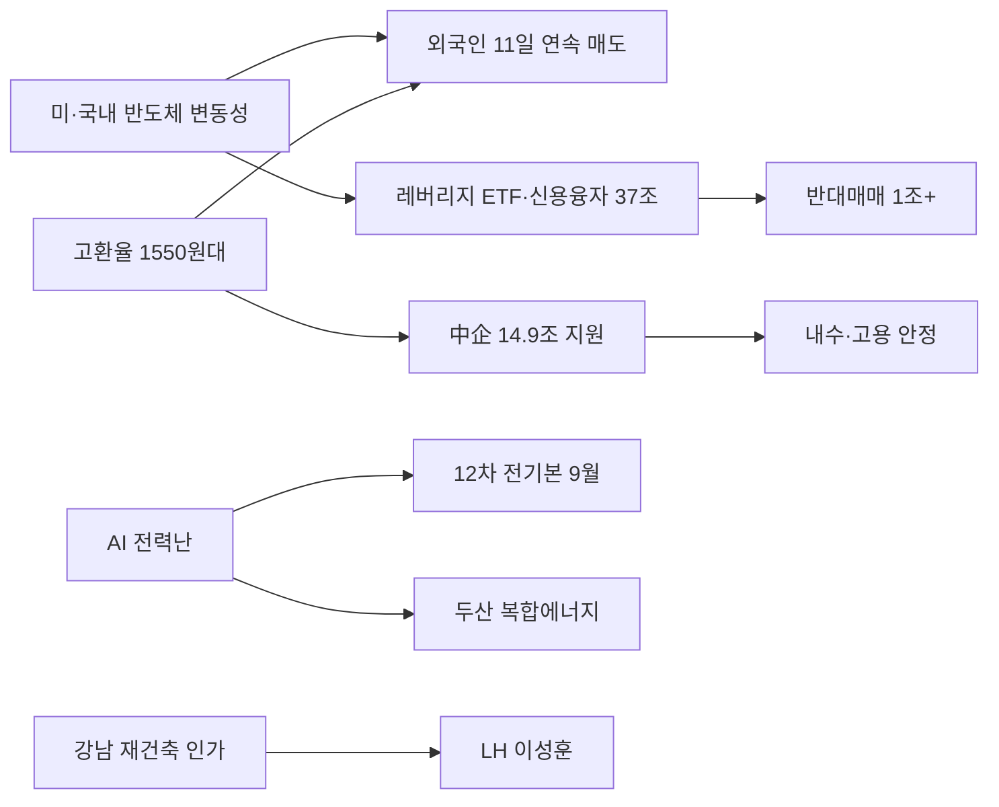

# 2026-07-03 Grok 심층 분석

## 분석 기준

본 보고서는 2026년 7월 3일 국내 주요 경제·증시 소식을 기후에너지환경부·재정경제부·한국은행·서울시·금융감독원·한국거래소 등 공식·1차 자료와 국내외 주요 언론 보도를 교차 검증해 작성했다. Gemini Top 5 주제를 유지하며, 수치·날짜·인과관계 오류를 수정하고 사실과 추론을 구분했다.

---

## 1. 반도체 시장 변동성 심화 속 AI 투자 전망 재평가…삼성 파운드리 기대감

### Gemini 핵심 내용

- KB증권, SK하이닉스 목표주가 380만원→420만원 상향.
- 삼성전자, 앤트로픽 AI 칩 2나노 공정 생산 논의.
- 코스피 롤러코스터(7700선 회복 후 7400선 이탈), 외국인 11거래일 연속 순매도.
- SEMI, 미 정부 메모리 시장 개입에 경계.

### 추가 조사 결과

- **KB증권 목표가 상향(2026-07-03)**: SK하이닉스 목표주가를 380만원에서 **420만원**으로 상향. 근거로 ①글로벌 AI 인프라 투자 2026년 8000억 달러→**1.5조 달러** 전망, ②메모리 공급 부족 장기화, ③HBM·고대역폭 메모리 수요 지속을 제시. 전날(-14%대) 급락에도 '더 간다'는 강세 전망으로 국내 증권가 내견 분열이 심화됐다.
- **앤트로픽-삼성 파운드리(The Information 등)**: 미국 AI 기업 앤트로픽이 삼성전자와 **자체 AI 칩 생산을 2나노(20A) 공정으로 논의 중**이라는 보도. 다만 **초기 단계**이며 **계약·수주 확정은 아님**. TSMC 의존도가 높은 빅테크가 파운드리 다변화를 모색하는 흐름과 맞닿아 있으나, 실적 반영까지는 수년 단위일 수 있다.
- **코스피 변동성(7월 3일)**: 장중 3%대 급락 뒤 상승 반전해 7700선을 재탈환했으나 이후 다시 하락 전환, **7400선**을 일시 이탈. 삼성전자는 반등, SK하이닉스는 약세로 희비가 갈렸다.
- **외국인 수급**: 6월 19일 이후 **11거래일 연속 순매도**. 7월 3일 장중 외국인 **약 8809억원** 순매도(헤럴드경제 등). 배경으로 ①미국 반도체 차익실현 파급, ②원·달러 고환율(1550원대), ③국내 밸류에이션 부담, ④피크아웃 우려가 거론된다.
- **SEMI(국제반도체장비재료협회)**: Bloomberg 인용 보도에 따르면 미 정부의 메모리 반도체 시장 개입·가격 안정화 시도에 업계가 경계. 공급 부족 해소를 정부 개입으로 풀 경우 **시장 왜곡·투자 신호 혼선** 우려.
- **2분기 실적 컨센서스(아시아경제)**: 상장사 2분기 영업이익 컨센서스 전년比 **247%↑**, 반도체가 견인. 통신·자동차는 주춤—펀더멘털과 주가 변동성의 괴리가 확대되는 배경.

### 교차 검증 및 수정 사항

- **앤트로픽 수주 '확정' 아님**: Gemini·일부 국내 제목의 '파운드리 부활 신호탄' 표현은 **기대감 수준**이다. The Information 등은 '논의 초기 단계'를 강조. 수주 확정 전까지 실적 기여는 추론에 해당.
- **외국인 11거래일 연속 매도 기준일**: **6월 19일 이후**가 정확(헤럴드경제 확인). 단순 '최근' 표기보다 기준일 명시가 필요.
- **KB 목표가 420만원**: 복수 매체(파이낸셜뉴스, 한국경제TV 등) 교차 확인. 다만 동시에 한화투자증권 등 타사는 430만원 등 더 높은 목표가도 존재해 **증권가 컨센서스 분산**이 크다.
- **피크아웃**: 메모리 가격·수출단가 일부 둔화 신호와 AI 투자 확대 전망이 공존. 단기 조정인지 사이클 전환인지는 **7~8월 수출 품목별·업황 리서치**로 판별해야 한다.

### 국내외 보도 관점 차이

- **국내**: '저가 매수 기회' vs '롤러코스피·멀미' 프레임이 혼재. KB 목표가 상향은 강세론, 외국인 매도·SEMI 경계는 약세론 근거.
- **해외(The Information·Bloomberg)**: 파운드리 다변화·미 정부 개입은 **공급망 재편** 이슈로 다루며, 한국 대형주는 글로벌 AI 사이클의 **베타(민감도)** 로 평가.

### 시장 및 관련 기업 영향

- **SK하이닉스**: 목표가 상향은 단기 심리 지지 요인이나, 외국인 매도·고변동성이 주가를 압박. HBM·DRAM 호황 지속 시 실적은 우호적.
- **삼성전자**: 앤트로픽 논의는 파운드리·先端공정 모멘텀에 긍정(추론). 다만 파운드리 적자 구조 개선 속도가 관건.
- **반도체 장비·소재**: SK하이닉스 capex 확대 기대와 맞물림. 미 정부 개입 시 장비 수주 타이밍 불확실성.
- **환율·채권**: 고환율은 수출 기업 실적(원화 환산)에 우호, 외국인 이탈 압력과 병존. 변동성 확대는 국채 단기 금리 변동성도 키울 수 있다.

### 투자자가 확인할 포인트

- **외국인 수급 전환**: 11거래일 연속 매도 후 반전 여부. 프로그램·현물 순매도 동시 추적.
- **앤트로픽 협상 진전**: MOU·양산 일정 공식 발표 여부.
- **미 정부 메모리 정책**: SEMI·업계 반응과 실제 행정조치 발표.
- **7월 반도체 수출·메모리 가격**: 피크아웃 논쟁의 분기 검증 지표.

### 위험 요인과 반대 관점

- **피크아웃 현실화**: AI capex 둔화·메모리 가격 하락이 겹치면 SK하이닉스 고목표가가 급격히 조정될 수 있다.
- **외국인 매도 가속**: 고환율·글로벌 리스크오프가 겹치면 7400선 지지력 약화.
- **반대 관점**: KB·일부 외신은 2026~2027년 AI 인프라 투자가 메모리 슈퍼사이클을 연장한다고 본다. 조정은 매수 기회라는 시각도 존재.

### 출처

- [교차] 파이낸셜뉴스, '"반도체 급락했는데 420만닉스?" KB증권, SK하이닉스 목표가 또 상향한 이유', 2026-07-03, https://n.news.naver.com/mnews/article/014/0005543318
- [교차] 서울신문, '삼성전자, 앤트로픽 AI칩 생산 논의…파운드리 부활 신호탄', 2026-07-03, https://n.news.naver.com/mnews/article/081/0003658130
- [교차] 헤럴드경제, '외국인 11거래일째 '팔자'…코스피 7400선 밀려', 2026-07-03, https://n.news.naver.com/mnews/article/016/0002665267
- [교차] 연합뉴스, '반도체 업계, 공급부족 해결 위한 美정부 개입에 경계', 2026-07-03, https://n.news.naver.com/mnews/article/001/0016174249
- [교차] 한국경제, '7700 회복했다가 7400 깨졌다가…멀미 나는 롤러코스피', 2026-07-03, https://n.news.naver.com/mnews/article/015/0005305903

---

## 2. AI 시대 전력난 심화, 정부·기업 복합 에너지 해법 모색 본격화

### Gemini 핵심 내용

- 김성환 기후에너지환경부 장관, 영광·울주 기존 원전 부지 추가 건설 가능(최대 4기).
- 12차 전력수급기본계획(전기본) 9월께 확정.
- 두산에너빌리티, 원전·SMR·가스터빈·수소·해상풍력 복합 포트폴리오 제시.
- 데이터센터 전력망 병목으로 소형 가스·피스톤 엔진 부상.

### 추가 조사 결과

- **김성환 장관 발언(2026-07-03, 서울경제)**: 전남 영광·울산 울주 **기존 원전 부지 내 추가 원전 4기** 건설 가능성을 언급. **12차 전기본**을 정기국회 전후인 **9월** 확정 예정. AI·데이터센터 전력 수요 급증을 전력 정책 전환의 배경으로 제시.
- **두산에너빌리티(정연인 부회장, 이데일리)**: AI 시대 전력난 해법으로 **원전·SMR·가스터빈·수소·해상풍력**을 아우르는 복합 에너지 전략 강조. 단일 전원 의존이 아닌 포트폴리오 접근.
- **소형 발전 엔진(연합뉴스)**: 데이터센터 백업·분산전원으로 **소형 천연가스 터빈·피스톤 엔진** 제조사가 부상. 송전망 병목 지역에서 **빠른 설치**가 장점이나, 탄소배출·소음 규제 이슈 동반.
- **글로벌 전력 수요(맥킨지 등 인용)**: AI 데이터센터가 2030년까지 **미국 전력 수요의 약 12%** 를 차지할 수 있다는 전망이 국내 정책 담론의 근거로 활용(추론: 한국도 AIDC 투자 확대 시 동일 압력).
- **12차 전기본 구체 비중**: 아직 **공식 확정 전**. 원전 확대·재생에너지·가스·ESS 비중은 9월 확정 전까지 가설 수준. 영광·울주 추가 원전은 **주민·환경단체 반발** 가능성이 핵심 변수.

### 교차 검증 및 수정 사항

- **'원전 4기'**: 영광·울주 **부지 각각** 추가 가능성을 합쳐 최대 4기로 해석하는 보도가 많다. 착공·승인 일정은 **미정**—정책 의지 선언 단계.
- **9월 전기본**: '정기국회 전후' 표현은 통상 **9월 말~10월 초** 범위. 확정 지연 시 에너지주 모멘텀도 후移.
- **어제 SK-KKR 재생에너지와의 관계**: 7월 2일 SK 10GW 통합법인 출범과 오늘 정부·두산의 **원전·가스 복합** 논의는 'AI 전력'이라는 동일 수요를 **민간 재생 + 공공 원전·가스**로 나눠 대응하는 구도(추론).

### 국내외 보도 관점 차이

- **국내**: 'AI 전력난'을 정부 원전 확대·복합 에너지로 푸는 **산업 성장** 프레임이 우세.
- **환경·시민단체(추론)**: 추가 원전은 탈원전·재생 비중 목표와 충돌 가능. 해외에서는 SMR·가스 터빈이 데이터센터 **과도기 전원**으로 더 자주 논의된다.

### 시장 및 관련 기업 영향

- **두산에너빌리티**: 원전·가스터빈·SMR 수주 기대감. 복합 에너지 내러티브는 중장기 모멘텀.
- **한전·한전KPS**: 송전망·변전 인프라 투자 수요. 데이터센터 전력 연결 병목 해소가 선행 조건.
- **가스터빈·엔진**: 소형 분산전원 수요—두산에너빌리티, 관련 부품사.
- **원전 밸류체산**: 추가 건설 논의 시 **우리기술·한전기술** 등 관심, 다만 실착공까지 장기간.

### 투자자가 확인할 포인트

- **12차 전기본 공식안(9월)**: 전원별 설비 용량·투자 규모.
- **영광·울주 주민설명·환경평가** 일정.
- **국내 AIDC(인공지능 데이터센터) 착공**과 전력 계약(PPA) 체결 현황.
- **소형 엔진·가스터빈**의 환경 규제(탄소·소음) 적용 기준.

### 위험 요인과 반대 관점

- **원전 확대 반발**: 지역 갈등·소송으로 일정 지연.
- **송전 병목**: 발전 설비만 늘려도 계통 연결 지연 시 전력난 해소 지연.
- **기술·비용**: SMR·수소 등 상용화 비용 불확실.
- **반대 관점**: 가스·소형 터빈은 당장 데이터센터에 투입 가능해 **재생+원전**보다 빠른 해법일 수 있다.

### 출처

- [교차] 서울경제, '김성환 "영광·울주에 원전 4개 부지 있다…12차 전기본, 정기국회 전후 확정"', 2026-07-03, https://n.news.naver.com/mnews/article/011/0004637793
- [교차] 이데일리, '정연인 두산에너빌리티 부회장 "AI 시대 전력난, 복합 에너지 해법으로 풀어야"', 2026-07-03, https://n.news.naver.com/mnews/article/018/0006321627
- [교차] 연합뉴스, '데이터센터 전력원으로 차 엔진 부상…발상 전환', 2026-07-03, https://n.news.naver.com/mnews/article/001/0016174285

---

## 3. 서울 강남 재건축 속도전, 은마·압구정 사업시행인가…공급 불안정 우려도

### Gemini 핵심 내용

- 은마아파트 사업시행인가, 2028년 착공 목표.
- 압구정2구역 조건부 통합심의, 최고 66층 2381세대.
- 이성훈 국토교통비서관 LH 신임 사장.
- 집값 상승 전망 55%, 정부 부동산 정책 부정 46%.

### 추가 조사 결과

- **은마아파트(헤럴드경제·세계일보)**: 서울 강남구 대치동 은마 재건축 **사업시행계획 인가** 완료. **2028년 착공** 목표. 규모는 **총 5850세대**(기존 4424가구 대비 대폭 증가—공공임대 909·공공분양 195세대 포함 보도). 관리처분계획·조합원 분양 신청이 **다음 행정 단계**.
- **압구정2구역(아시아경제·서울시)**: 서울시 **통합심의 조건부 의결**. 최고 **66층**, **2381세대**. 삼익·신반포 등 인근 구역도 동시 심의 통과. 조건 이행·관리처분계획 수립이 착공 시점을 좌우.
- **LH 사장 이성훈(서울신문·경기일보)**: 대통령실 국토교통비서관이 **LH 16대 사장**으로 임명(공석 약 8개월 만). 대통령 메시지로 **'잠긴 매물·공급 확대'** 강조(아시아경제). 공공분양·전세 공급·조직 개혁이 과제.
- **공급 불안(더팩트·한국갤럽)**: 건설 경기 주춤·**PF 경색**·공사비 상승으로 민간 착공 지연. 한국갤럽에 따르면 향후 1년 집값 **'오를 것' 55%**, 정부 부동산 정책 **'잘못' 46%**—공급 확대 기대와 정책 불신이 공존.
- **관리처분 일정(추론)**: 사업시행인가 후 통상 **6~18개월** 내 관리처분계획 인가가 관건. 조합원 분담금·규모 조정 갈등이 변수.

### 교차 검증 및 수정 사항

- **은마 규모**: Gemini 본문은 '4424가구' 언급이 있으나, 인가 후 **5850세대**가 헤럴드 등 최신 규모. 기존 세대수와 신규 공급 규모를 **구분**해야 한다.
- **압구정2 '확정' vs '조건부'**: 통합심의 **조건부** 의결—추가 요건 충족 전까지 최종 확정 아님.
- **LH 사장**: 인사는 확정. 구체적 공급 로드맵(물량·지역)은 **취임 후** 발표 예정.

### 국내외 보도 관점 차이

- **국내**: 강남 재건축은 **'부동산 시장 심리·프리미엄'** 지표로, LH 인사는 **'공공 공급'** 지표로 분리 보도.
- **해외 시각**: 서울 강남 재건축은 직접 다루기보다, 한국 **고환율·건설 경기** 맥락의 내수 지표로 간접 반영(추론).

### 시장 및 관련 기업 영향

- **건설사**: 대형 재건축 수주 기대—현대건설·대우건설 등 압구정·강남 참여사. 공사비·PF로 **마진 압박**.
- **강남 부동산**: 사업 진전은 심리 지지. 실입주·분양은 2030년대(추론)—단기 매매가에 선반영 위험.
- **LH 관련**: 공공분양 확대 시 **건설·자재** 수주, 전월세 시장 안정 기대.
- **금융**: PF 구조조정 지연 시 건설사·증권사 채권 리스크.

### 투자자가 확인할 포인트

- **은마·압구정 관리처분계획** 인가 일정.
- **LH 취임 후 공급 계획**(공공분양 물량·지역).
- **건설사 PF·수주** 공시(2분기).
- **서울·정부 부동산 규제** 추가 여부(전세·대출 규제).

### 위험 요인과 반대 관점

- **사업 지연**: 조합 갈등·인허가·공사비로 착공 2028 목표 미달.
- **PF 경색 장기화**: 중소형 건설사 도산·지방 미분양 확대.
- **반대 관점**: 재건축 가속은 장기 공급 확대로 **강남 프리미엄 상한**을 만들 수 있다는 분석도 존재.

### 출처

- [교차] 헤럴드경제, '드디어 서울 재건축 상징 은마, 사업시행인가…2028년 5850세대 착공 목표', 2026-07-03, https://n.news.naver.com/mnews/article/016/0002664920
- [교차] 아시아경제, '서울시, 압구정2구역 재건축 통합심의 의결…삼익·신반포도 심의 통과', 2026-07-03, https://n.news.naver.com/mnews/article/277/0005785111
- [교차] 서울신문, 'LH 신임 사장에 이성훈 국토교통비서관', 2026-07-03, https://n.news.naver.com/mnews/article/081/0003658077
- [교차] 더팩트, '건설은 주춤, 집값은 강세…커지는 공급 불안', 2026-07-03, https://n.news.naver.com/mnews/article/629/0000512895

---

## 4. 증시 변동성 심화 속 '빚투' 경고등…단일종목 레버리지 ETF 규제 논의 본격화

### Gemini 핵심 내용

- 이언주 의원, 단일종목 레버리지 ETF 단계적 축소 주장.
- 신용거래융자 37조3393억원(7/1) 사상 최대.
- KODEX SK하이닉스·삼성전자 단일종목 레버리지 ETF 대규모 순유입.
- 6월 반대매매 1조1228억원, 증권사 대출 규제 강화.

### 추가 조사 결과

- **이언주 의원(뉴스1)**: 더불어민주당 이언주 의원이 **단일종목 레버리지 ETF**의 고위험성을 지적, **단계적 축소** 필요성 주장. 현재는 **의원 발의·정책 제안** 단계이며, 금융위·금감원의 **공식 규제안 확정·시행 시점은 미발표**.
- **금융당국 대응**: 금융감독원이 증권사 **CRO(최고위험관리책임자)** 를 소집해 레버리지·신용융자 **선제 리스크 관리** 주문(매일신문 등). 규제 입법과 별개로 **자율 규제**가 먼저 작동 중.
- **신용거래융자(7월 1일)**: 잔액 **37조3393억원**으로 사상 최대(뉴시스·매일신문 교차). 코스피 변동성 확대와 동행.
- **단일종목 레버리지 ETF 순유입(최근 1주)**: KODEX SK하이닉스단일종목레버리지 **7878억원**, KODEX 삼성전자단일종목레버리지 **6175억원** 순유입(뉴시스).
- **반대매매(6월)**: 위탁매매 미수금 대비 반대매매 **1조1228억원**—올해 **처음 1조원 돌파**(매일신문).
- **증권사 대출 빗장**: 미래에셋증권 등 **증거금률 상향·신용융자 한도 축소**. 개인 레버리지 축소 → 단기 **매도 압력·거래대금 감소** 가능(추론).
- **과거 사례 비교(추론)**: 2020~2021년 글로벌 밈주식·국내 레버리지 ETF 거래 급증 후 조정 시 **반대매매 연쇄**가 변동성을 키웠다. 현재는 **반도체 쏠림+신용융자 최대**라는 유사 구조이나, 금융당국·증권사가 **더 빠르게 개입** 중.

### 교차 검증 및 수정 사항

- **'규제 논의 본격화' vs '입법 제안'**: 국회 의원 주장과 금감원 CRO 소집은 확인. **ETF 상품 구조 변경·신규 발행 중단** 등 구체 규제안은 아직 없음—Gemini 제목의 강도를 약간 조정할 필요.
- **신용융자 37조3393억원**: 7월 1일 기준 수치 복수 매체 일치.
- **반대매매 1조1228억원**: 6월 월간 기준. 일별이 아님.

### 국내외 보도 관점 차이

- **국내**: '야수의 심장'·'개미 레버리지' 등 **투자자 보호·시장 과열** 프레임.
- **해외**: 한국 단일종목 레버리지 ETF는 보고 드물며, 직접 비교 대상은 **미국 3배 레버리지 ETF** 규제 논쟁(추론).

### 시장 및 관련 기업 영향

- **삼성전자·SK하이닉스**: 레버리지 ETF·신용융자 쏠림으로 **단기 변동성 증폭기** 역할. 규제 시 거래대금·베타 하락 가능.
- **증권사**: 신용융자 축소는 **이자수익·거래수수료** 단기 감소, 반대매매 리스크는 감소.
- **ETF 운용사(삼성자산운용 등)**: 단일종목 레버리지 축소 시 **AUM·수수료** 타격.
- **코스피**: 반대매매·신용 축소는 조정 국면 **하방 압력**. 변동성 지수(VKOSPI) 민감.

### 투자자가 확인할 포인트

- **금융위·금감원 공식 입장** 및 ETF 발행 제한 여부.
- **신용융자 잔액** 주간 추이(37조 돌파 후 감소 여부).
- **반대매매 일별** 데이터(강제 청산 가속 신호).
- **증권사별 증거금·한도** 추가 조정 공지.

### 위험 요인과 반대 관점

- **규제 과잉**: 레버리지 축소가 유동성을 급격히 빼면 **급락 국면 악화**.
- **빚투 고착**: 금리·주가 조정에도 신용잔액이 안 줄면 **반대매매 폭탄** 위험.
- **반대 관점**: 레버리지 ETF는 개인의 **헤지·방향성 베팅 도구**—규제보다 **투자자 교육·증거금 강화**로 충분하다는 의견.

### 출처

- [교차] 뉴스1, '與이언주 "단일종목 레버리지는 고위험상품…단계적 축소해야"', 2026-07-03, https://n.news.naver.com/mnews/article/421/0009038234
- [교차] 뉴시스, '"그래도 삼전·닉스 2배로 간다"…개미, 미친 변동성에도 레버리지 베팅', 2026-07-03, https://n.news.naver.com/mnews/article/003/0014044663
- [교차] 매일신문, '롤러코스터 장세에 '빚투' 강제청산 속출…증권사도 대출 빗장', 2026-07-03, https://n.news.naver.com/mnews/article/088/0001017397

---

## 5. 고환율 지속에 정부, 중소기업에 14.9조 긴급 자금 지원…6월 외환보유액 소폭 증가

### Gemini 핵심 내용

- 중소·중견기업 **14조9000억원** 긴급 경영자금.
- 원부자재 수입 비중 20% 이상 기업은 요건 완화.
- 환변동보험 **1조3000억원** 확대, 보험료 할인 15%→30%.
- 6월 말 외환보유액 **4273억6000만달러**(전월比 +3.7억달러).

### 추가 조사 결과

- **재정경제부·중기부(뉴시스, 2026-07-03)**: 고환율 피해 **중소·중견기업**에 **14조9000억원** 규모 긴급 경영자금. **원부자재 수입 비중 20% 이상**이면 매출·영업이익 감소 요건 없이 지원. **환변동보험** 공급 **1조3000억원** 확대, 중소기업 보험료 할인 **15%→30%**. **법인세·부가세·소득세·관세** 납부 기한 연장.
- **고환율 배경**: 원·달러 **1550원대**—금융위기 이후 최고 수준 부근. 수입 원자재·에너지 비용 상승이 제조 중소기업 **이중고**(한국경제).
- **외환보유액(한국은행, 6월 말)**: **4273억6000만달러**, 전월 대비 **3억7000만달러 증가**(동행미디어 시대). 규모는 역대 최고권이나, **고환율 기조 자체를 즉시 되돌리지는 못함**—달러 강세·대외 불확실성이 우세.
- **지원 효과(추론)**: 14.9조는 **유동성·이자 부담 완화**에 기여하나, **환율·원가 하락**을 직접 해결하지는 못함. 구조적 경쟁력·수출 다변화와 병행 필요.
- **물가 파급(추론)**: 고환율은 수입 물가·서비스 비용에 전이. 정부는 동시에 **지역 성장엔진·내수 진작**(구윤철 부총리 발언, 아시아경제)을 강조—환율·물가·성장의 **정책 트레이드오프**.

### 교차 검증 및 수정 사항

- **14조9000억원·환변동보험 1조3000억원**: 뉴시스 등 재경부 브리핑 인용 보도와 **일치**. Gemini 수치 정확.
- **외환보유액**: 한국은행 월간 통계 기준 **4273.6억 달러**, 소폭 증가는 맞으나 **환율 방어 성공**으로 단정하기 어렵—시장 개입·평가차 등 복합 요인.
- **'6월' 외환보유액**: 7월 3일 보도는 **6월 말 결산** 수치—시의성은 '최신 공식 월간'이지 당일 스냅샷이 아님.

### 국내외 보도 관점 차이

- **국내**: '정부 대응'·'중소기업 숨통' 프레임과 '환율 근본 해결은 아니다' 비판이 공존.
- **해외**: 한국 외환보유액 규모는 긍정적으로 평가하나, **원화 약세**는 아시아 통화 약세·달러 강세의 일부로 해석.

### 시장 및 관련 기업 영향

- **중소·중견 제조**: 유동성 지원으로 **도산 위험 완화**. 환헤지 비용 절감(환변동보험).
- **수출·수입 기업**: 고환율은 수출 기업(달러 매출)에는 우호, **수입 의존 중소기업**에는 악화—정책은 후자 집중.
- **환율·채권**: 외환보유액 증가는 **대외 신뢰** 지지. 고환율 지속 시 **수입 물가**·**금리 인하 지연** 가능.
- **은행·정책금융**: 긴급자금 집행·보증 확대로 **정책금융** 역할 확대.

### 투자자가 확인할 포인트

- **14.9조 집행 속도**·실제 접수 건수(중기부·은행 공시).
- **원·달러 1550원대** 돌파·지속 여부, 미 연준·관세 뉴스.
- **7월 수입 물가·CPI**에서 환율 전이 확인.
- **외환보유액 7월** 변동(한국은행 월간).

### 위험 요인과 반대 관점

- **환율 추가 상승**: 미 금리·지정학 리스크 시 지원만으로는 한계.
- **도덕적 해이**: 긴급자금이 **구조적 좀비**를 연장할 수 있다는 비판.
- **반대 관점**: 고환율은 수출 기업 실적 개선으로 **코스피 실적 밸류**를 지지할 수 있다.

### 출처

- [교차] 뉴시스, '정부, 고환율 피해 中企에 14.9조 긴급경영자금 지원', 2026-07-03, https://n.news.naver.com/mnews/article/003/0014044391
- [교차] 동행미디어 시대, '외환보유액 4273억달러로 소폭 증가…환율 방어 속 반등', 2026-07-03, https://n.news.naver.com/mnews/article/417/0001150134
- [교차] 한국경제, '환율·원가 폭등 '이중고'에 공장 멈출 판…벼랑 끝 몰린 中企', 2026-07-03, https://n.news.naver.com/mnews/article/015/0005305902

---

## Top 5 종합 결론

2026년 7월 3일 국내 경제의 핵심 키워드는 **'AI 반도체 롤러코스터'** 와 **'고환율·빚투·레버리지'** 가 맞물린 **극단적 시장 변동성**이다. KB증권의 SK하이닉스 420만원 목표가 상향은 AI capex 1.5조 달러 전망·메모리 공급 부족이라는 **강한 펀더멘털 내러티브**를 재확인했으나, 외국인 11거래일 연속 순매도·신용융자 37조 돌파·단일종목 레버리지 ETF 쏠림은 **수급·레버리지 리스크**가 펀더멘털만큼 크다는 신호다.

정책 축에서는 **AI 전력난**(12차 전기본 9월·영광·울주 원전 논의·두산 복합에너지)과 **고환율 중소기업 14.9조 지원**이 동시에 추진된다. 부동산에서는 은마·압구정 재건축 인가와 LH 사장 교체가 **공급 심리**를 자극하나, PF·공사비로 실물 공급은 지연될 수 있다. 단기적으로는 **변동성 관리·수급·환율**이, 중기적으로는 **AI 전력·메모리 사이클·공공 공급**이 투자 판단의 축이 된다.

### 핵심 수정 사항 3가지

1. **앤트로픽-삼성**: 논의 **초기 단계**, 수주·계약 확정 아님—'파운드리 부활 확정' 표현은 과장.
2. **은마 재건축 규모**: 최신 인가 기준 **5850세대**(4424가구는 기존 규모).
3. **레버리지 ETF 규제**: 이언주 의원 **제안** 및 금감원 CRO 소집은 확인, **금융당국 공식 규제안·시행일 미확정**.

## 주제 간 연결 관계

- **반도체 변동성 ↔ 빚투·레버리지**: 삼성·SK 쏠림이 ETF·신용융자를 키우고, 반대매매가 변동성을 증폭.
- **고환율 ↔ 외국인 매도**: 달러 강세가 외국인 수익 실현·리스크오프와 맞물림. 14.9조는 중소기업 방어선.
- **AI 전력 ↔ 반도체**: AIDC 확대는 전력·반도체 수요를 동시에 끌어올리는 **AI 패키지** 정책.

## 추가 확인이 필요한 사항

- 앤트로픽-삼성 **양산 MOU·공정 세부** 공식 발표 여부.
- **12차 전기본** 에너지원별 비중 및 영광·울주 원전 **주민·환경** 절차.
- 금융당국 **단일종목 레버리지 ETF** 구조 규제 공식안 및 시행 시점.
- **신용융자 잔액** 피크 이후 감소 추세 여부(반대매매 연쇄 리스크).
- **14.9조 긴급자금** 실제 집행률·환율 1550원대 돌파 지속 여부.
- 은마·압구정 **관리처분계획** 인가 일정 및 LH **공공분양 로드맵**.