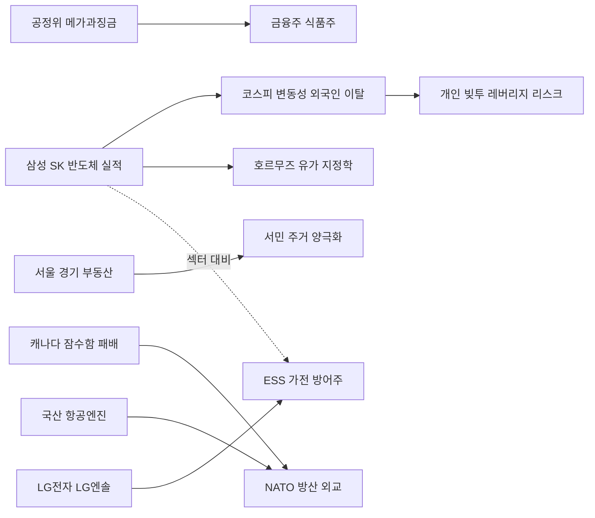

# 2026-07-08 Grok 심층 분석

## 분석 기준

본 보고서는 2026년 7월 8일(KST) 국내 주요 경제·증시 소식을 삼성전자·SK하이닉스 공시, 공정거래위원회 보도자료, 방위사업청·연합뉴스, 한국부동산원·국가데이터처, LG전자·LG에너지솔루션 잠정실적 공시와 국내외 주요 언론(조선일보, 서울경제, 이데일리, Korea Herald, Nikkei Asia, Korea Times 등)을 교차 검증해 작성했다. Gemini Top 5 주제를 유지하며, 수치·날짜·인과관계 오류를 수정하고 사실과 추론을 구분했다. 분석 시점 기준(수집 06:10 KST, 외부 조사 08:51 KST) 미국 뉴욕 마감(7월 7일 현지)과 7월 8일 장전 프리마켓 반응까지 반영했다.

---

## 1. 삼성전자 역대급 실적 발표에도 주가 급락, AI 반도체 랠리 지속성 우려 확산

### Gemini 핵심 내용

- 2분기 영업이익 89.4조원, 성과급 제외 106조원 추정, 엔비디아 제치고 분기 1위.
- 실적 당일 삼성전자 -6.92%, SK하이닉스 -6.06%, 코스피 -4.91%.
- 모건스탠리 메모리 비중 축소, 외국인 보유율 17년 최저, 개인 신용잔고 사상 최대.
- SK하이닉스 ADR 코너스톤 70억달러 유치.

### 추가 조사 결과

- **삼성전자 2분기 잠정실적(공시, 7월 7일)**: 연결 매출 **171조원**(전년동기 +129.3%), 영업이익 **89조4000억원**(전년동기 +1810.3%). 에프앤가이드 컨센서스 84조5994억원을 **약 5.7% 상회**. 엔비디아 2027회계 1분기 영업이익(약 82조원)을 공식 수치 기준으로 넘어섰다(파이낸셜뉴스·공시).
- **성과급 제외 이익**: 업계는 성과급 충당금을 **약 20조원** 수준으로 추정하며, 제외 시 영업이익 **106조원+** 가능성을 제시한다. Gemini의 '17조원'은 보수적 추정이며, 최신 보도는 **20조원** 추정이 우세하다(추론·추정치).
- **주가 급락과 글로벌 전이**: 7월 7일 삼성전자 주가는 **6.92%** 하락(조선일보·WSJ 인용). 문화일보는 장중·프리마켓 포함 **9.28%** 급락·'30만 전자' 이탈을 보도해, **종가 기준 6.92% vs 장중 최대 9%대** 보도 차이가 있다. 코스피는 약 **4.91%** 하락. 7월 7일(현지) 뉴욕 나스닥 **-1.2%**, 필라델피아 반도체지수 급락, 마이크론 **-4.7%**, 인텔 **-9.7%**—WSJ·블룸버그는 삼성 실적이 **글로벌 칩주 매도 촉발** 요인으로 해석했다(조선일보 7월 8일).
- **7월 8일 프리마켓**: 뉴시스 등에 따르면 삼성전자·SK하이닉스 ADR이 프리마켓서 **4%대 추가 하락**—이란 호르무즈 유조선 피격·미군 이란 공습 재개와 겹쳐 **이중 악재** 구도다.
- **외국인·개인 수급(7월 7일 기준)**: 외국인 삼성전자 보유율 **46.69%**—2009년 7월(46.67%) 이후 **약 17년 만에 최저**(문화일보·한국거래소). 6월 19일~7월 7일 13거래일 연속 순매도, 누적 **약 13조2650억원**. SK하이닉스 외국인 보유율 **50.17%**(3년 2개월 만에 최저), 순매도 누적 **약 19조5820억원**. 반면 개인 삼성전자 신용잔고 **5조5075억원**, SK하이닉스 **5조3049억원**—각각 **사상 최대**(연합인포맥스).
- **모건스탠리 '메모리 팔아라'**: 전자신문(7월 7일) 인용 보고서는 반도체 중심 **좁은 상승장 종료**, 주도주가 **하이퍼스케일러(AI 플랫폼·클라우드)** 로 이동할 수 있다며 메모리 비중 축소를 권고했다. 메타의 잉여 AI 컴퓨팅 자원 외부 판매를 **사이클 변화 신호**로 해석. 2021년 'Memory, Winter is Coming' 예언 이력이 있어 국내 투자자에게 익숙한 논조다.
- **반론·매수 관점**: JP모건은 반도체 조정을 **매수 기회**로 볼 필요가 있다며, 의미 있는 공급 확대 전까지 업황 개선이 이어질 수 있다고 분석(전자신문 인용). 유진투자증권 손인준 연구원은 하반기 메모리 가격 강세·주주환원 경쟁이 삼성전자 **아웃퍼폼**을 이끌 수 있다고 제시(문화일보). 키움증권 한지영 연구원은 **7월 10일 SK하이닉스 ADR 상장**이 외국인 수급 변곡점이 될 수 있다고 평가.
- **SK하이닉스 ADR 코너스톤**: SEC F-1 정정(7월 7~8일)에 따르면 베일리 기포드·코튜 매니지먼트·시츄에이셔널 어웨어니스(SA LP) 3곳이 **총 70억달러(약 10조6800억원) 매입 의향(IOI)** 을 제시—전체 공모 예정 **281억3310만달러의 25%**. **법적 구속력 없는 IOI**이며, 최종 배정은 7월 9일 공모가 확정 후 결정된다(서울경제 7월 8일). SA LP 참여는 AI 인프라 병목 예측으로 유명한 레오폴드 아셴브레너 펀드로, **메모리 슈퍼사이클 지속 내러티브**에 우호적이나 확정 투자가 아니다(추론).
- **메모리 3사 영업이익률 80%**: 업계 전망으로 보도되나, **공식 집계가 아닌 추정**이다. 하반기 메모리 가격·HBM4 양산·LTA가 실적 지속성의 핵심 변수다.

### 교차 검증 및 수정 사항

- **성과급 규모**: Gemini '약 17조원' → 최신 보도는 **약 20조원** 추정이 많다. 106조원은 **성과급 제외 추정치**이며 공시 확정이 아니다.
- **주가 하락률**: **6.92%(종가)** 와 **9.28%(문화일보·장중/프리마켓 포함)** 보도가 공존—투자자 커뮤니케이션 시 **6.92%** 를 공식 종가 기준으로 쓰는 것이 안전하다.
- **70억달러 코너스톤**: **확정 투자가 아닌 IOI(투자 의향)** 다. ARM(2023) 코너스톤 7.35억달러(공모액 15%)보다 규모는 크지만, **배정 전 단계**다.
- **엔비디아 비교**: 삼성 **89.4조원은 성과급 포함** 공시 수치, 엔비디아 82조원 비교는 **회계기간·항목 정의**가 다르다. '성과급 제외 106조' 비교는 **추정치 간 비교**다.
- **코스피 -4.91%**: 단일일 변동으로 **레버리지 ETF·외국인 이탈**과 겹친 극단적 날로 해석해야 한다.

### 국내외 보도 관점 차이

- **국내**: '역대 실적 vs 검은 화요일'—어닝 서프라이즈에도 **셀온(Sell-on)·차익실현** 패턴(서울경제: 삼성 어닝 서프라이즈 16회 중 10회 하락 보도). 개인 **빚투·레버리지**와 외국인 이탈의 **수급 엇갈림**이 핵심 프레임.
- **해외(WSJ·블룸버그·CNBC)**: 삼성 실적이 **AI 메모리 고평가·피크아웃 우려**를 재점화했으며, 아시아 반도체 약세가 **뉴욕 기술주로 전이**됐다는 인과를 강조. SK하이닉스 ADR IPO는 **AI capex 지속** 신호와 **희석·밸류** 우려가 공존한다.

### 시장 및 관련 기업 영향

- **삼성전자·SK하이닉스**: 단기 **변동성 확대**가 기본 시나리오. 7월 9~10일 ADR 공모가·첫 거래가 국내 본주 방향을 좌우할 수 있다.
- **반도체 장비·소재·MLCC·전력기기**: 메모리 슈퍼사이클 지속 시 **중기 수혜**(추론). 조정 국면에서는 고베타 종목이 더 크게 흔들릴 수 있다.
- **환율·유가**: 호르무즈 리스크로 브렌트유 **+3%** 급등(7월 7일 마감)—원자재 비용·인플레이션 재부각 가능(추론).
- **채권**: 위험회피와 동시에 반도체 실적 호조가 **성장 기대**를 지지—금리 방향은 혼재(추론).

### 투자자가 확인할 포인트

- **7월 9일** SK하이닉스 ADR 공모가 확정·코너스톤 최종 배정.
- **7월 10일** ADR 나스닥 상장·첫 거래 수급.
- 삼성전자 **실적 설명회(7월 말 예정)** — DS 부문·HBM·주주환원 가이던스.
- **금융당국 레버리지 ETF 대책**(7월 9일·13일 회의 예정) 결과.
- 외국인 보유율·신용잔고 **주간 추이**.

### 위험 요인과 반대 관점

- **AI 버블론·피크아웃**: 모건스탠리·고평가 논란이 재점화—실적이 좋아도 주가는 조정될 수 있다.
- **빚투·레버리지 역풍**: 급락 시 **반대매매·ETF NAV 괴리**가 변동성 증폭.
- **지정학(이란·호르무즈)**: 유가·공급망 리스크가 반도체 심리에 **이중 악재**.
- **반대 관점**: JP모건·국내 증권사 일부는 조정을 **매수 기회**로 보며, 하반기 메모리 가격·주주환원이 **재상승 트리거**가 될 수 있다(추론).

### 출처

- [공시] 삼성전자, 2026년 2분기 잠정실적 공시, 2026-07-07 — 파이낸셜뉴스 인용, https://n.news.naver.com/mnews/article/014/0005544554
- [교차] 조선일보, '뉴욕 증시 흔든 삼성전자…나스닥 1.2% 하락 마감', 2026-07-08, https://n.news.naver.com/mnews/article/023/0003986386
- [교차] 문화일보, '外人 삼전 보유율 17년 만에 최저…개미는 빚투 사상 최대', 2026-07-08, https://n.news.naver.com/mnews/article/021/0002803072
- [교차] 전자신문, '"메모리 팔아라" 모건스탠리가 또…', 2026-07-07, https://n.news.naver.com/mnews/article/030/0003445439
- [교차] 서울경제, 'SK하이닉스 ADR 역대급 코너스톤 투자…AI 미다스 손도', 2026-07-08, https://n.news.naver.com/mnews/article/011/0004639203
- [교차] 서울경제, '"소문에 사고 뉴스에 팔았다"…어닝 서프라이즈 16번 중 10번 하락', 2026-07-08, https://n.news.naver.com/mnews/article/011/0004639160

---

## 2. 공정위, 전분당 담합 역대 최대 과징금 7476억 부과…하반기 국고채 등 메가톤급 제재 예고

### Gemini 핵심 내용

- 4개 전분당사에 총 7475억7800만원 과징금·가격 재결정 명령.
- 상반기 과징금 1조7296억원, 국고채 담합 최대 11조원 추산.
- 공정거래법 개정(상한 20%→30%) 추진.

### 추가 조사 결과

- **전분당 담합 제재(공정위, 7월 7일)**: 대상·사조CPK·삼양사·CJ제일제당 4사에 **총 7475억7800만원** 과징금—담합 사건 **사상 최대**, 관련 매출 **6조525억원의 15%**. 개별 △대상 2341억4100만 △사조CPK 2001억3200만 △삼양사 2103억4000만 △CJ제일제당 1029억6500만원. **2018년 5월~2025년 10월** 7년 5개월·**13차례** 가격 담합, 시장점유율 **86.4%**. 우크라이나 전쟁 당시 최대 **73%** 인상·하락기 인하 지연. **가격 재결정 명령**·향후 **3년 반기 보고** 의무(한국일보·공정위 보도자료 취지).
- **추가 심의 개시**: 동일 4사 **전분당 입찰담합·부산물 가격담합** 심의절차도 개시—추가 제재 가능(한국일보).
- **2026년 상반기 과징금 누적**: 이데일리(7월 8일) 집계 기준 의결·예고 포함 **약 1조7296억원**—2017년 연간 최고(1조3308억원)와 지난해 연간(3402억원)의 **약 5배**. 전분당 7476억은 **상반기 집계 이후 추가**이므로 연간 규모는 더 커진다(추론).
- **국고채 금리 입찰 담합**: 공정위는 은행·증권 **15개사** 사건을 **8월 19~20일·26일** 3차 전원회의 심의 예정. 쟁점은 관련 매출—공정위는 **낙찰금액 76조2000억원** 적용 주장, 금융사는 **영업수익 기준**·정액과징금(600억원대) 주장. 공정위 기준 수용 시 **최대 11조원대**, 금융사 주장 수용 시 **600억원대**로 격차(이데일리 7월 8일).
- **배달앱·석화**: 쿠팡이츠·배달의민족 합계 과징금 **약 7636억원** 추산(동의의결 기각 후 본안 심의). 석유화학 10개사 담합은 **고과징금 뉴노멀** 분수령으로 지목(이데일리).
- **법·고시 개정**: 2025년 12월 공정위 방침—부당공동행위 과징금 상한 **20%→30%**, 정액과징금 상한 **40억→100억원**. 이재명 대통령 **징벌적 과징금 강화** 기조와 맞물림(이데일리).
- **기업·주가 영향**: 과징금은 **일시 비용**이나, 4사 모두 **식품·제과 원료** 핵심 공급자—단기 **이익 감소·배당 여력 축소** 가능. CJ제일제당·대상·삼양사 등 **식품株**는 제재 규모 대비 시장 반응이 제한적일 수 있으나, **행정소송** 제기 시 불확실성 장기화 가능(추론). 전분당 가격 재결정은 **하류 식품·음료 원가**에 하방 압력을 줄 수 있다(추론).

### 교차 검증 및 수정 사항

- **담합 종료 시점**: Gemini '2025년 10월까지'—공정위 보도와 일치. '작년 10월' 표기도 동일 의미.
- **상반기 1.7조 vs 전분당 7476억**: 상반기 1조7296억은 **7월 7일 이전 의결분** 합산이고, 전분당 7476억은 **7월 7일 추가**—연간 합계는 단순 합산이 맞다.
- **11조원**: **공정위 낙찰금액 기준 최대 추산**이며, 금융권 반발로 **실제 부과액은 대폭 낮아질 수 있다**—확정이 아니다.
- **소비자 환원 한계**: 과징금은 **국고 귀속**—피해 소비자 직접 환원 구조는 없다. 영남대 심재한 교수는 **가격 전가 유인**·사적 손해배상 병행 필요를 지적(이데일리).

### 국내외 보도 관점 차이

- **국내**: '걸리면 패가망신'—**이재명 정부 강경 기조**와 공정위 **역대급 제재**를 민생·금융 리스크 관리 프레임으로 연결.
- **해외**: 직접 보도는 제한적이나, **국고채 11조 추산**은 글로벌 IB·외신이 **한국 금융주 밸류에이션·규제 리스크**로 주목할 소재다(추론).

### 시장 및 관련 기업 영향

- **식품·제과·음료**: 전분당 가격 재결정으로 **원가 부담 완화** 기대—오뚜기·빙그레·하이트진로 등 하류 기업에 **중기 마진 개선** 가능(추론).
- **대상·CJ제일제당·삼양사**: 과징금 **현금 유출**·**Brand 이미지** 리스크. CJ·대상은 **다른 식품 사업**으로 분산되어 있어 **편중도는 상이**.
- **금융주**: 국고채 심의 결과가 **단기 최대 변수**—낙찰금액 기준 적용 시 **KB·신한·NH·증권사** 등 타격 큼(추론).
- **석화·배달앱**: 하반기 **추가 메가톤급** 제재 대기—SK지오센트릭·롯데케미칼·쿠팡·우아한형제들 관련성(추론).

### 투자자가 확인할 포인트

- **8월 19~26일** 국고채 담합 전원회의 결과·과징금 산정 기준(낙찰금액 vs 영업수익).
- 4사 **행정소송** 제기 여부·가격 재결정 **실제 인하 폭**.
- **공정거래법 개정안** 국회 계류·통과 시기.
- 전분당 **입찰·부산물 담합** 추가 제재 규모.

### 위험 요인과 반대 관점

- **소송·감경**: 과징금 **대폭 감경·취소** 가능성—공정위 기대만큼 타격이 없을 수 있다.
- **가격 전가**: 과징금·비용을 **판매가에 반영**하면 민생 체감 효과가 약해질 수 있다(이데일리 인용 학계 지적).
- **반대 관점**: 강력 제재가 **담합 억제·공정경쟁**에 기여하고, 식품 원가 안정에 **구조적 긍정**이 될 수 있다(추론).

### 출처

- [공식] 한국일보, '담합 전분당 4개 업체에 역대 최대 과징금 7476억', 2026-07-07, https://n.news.naver.com/mnews/article/469/0000940847
- [교차] 이데일리, '상반기만 1.7조…내달 최대 11조 과징금 예고', 2026-07-08, https://v.daum.net/v/20260708050309026
- [교차] 이데일리, '메가톤급 과징금 시대' 연재, 2026-07-08, https://v.daum.net/v/20260708050309026

---

## 3. 서울 집값 물가 상승률 상회하며 상승세 지속…경기권 전세난 심화로 양극화 심화

### Gemini 핵심 내용

- 5월까지 서울 집값 +3.45% vs 물가 +1.68%.
- 경기 전세 물건 -48.6%, 전셋값 상승률이 매매 상회.
- 서울→경기 전입 +30.9%, 경기 입주예정 -17.8%.
- 국세청 부동산 탈세 적발.

### 추가 조사 결과

- **서울 vs 물가**: Gemini 수치(5월 누적 서울 +3.45%, 물가 +1.68%)는 **한국부동산원·통계청 계열** 보도와 부합하는 패턴이다. '똘똘한 한 채' 프레임으로 **서울 아파트**가 물가를 웃도는 상승(중앙일보·Gemini 인용).
- **경기 전세난(디지털타임스, 7월 8일)**: 아실 기준 경기 아파트 전세 물건 **1만2392건**—전년 **2만4076건** 대비 **-48.6%**. 서울 전세 물건은 **-17.2%**(2만4801→2만556건). 한국부동산원(1/1~6/29) 경기 **전셋값 +3.48%** > **매매 +2.87%**. 광명 전세 물건 **-81.8%**, 성남 중원구 **-72.2%** 등 지역별 극단적 감소.
- **인구 이동**: 국가데이터처 2026년 1분기 서울→경기 전입 **8만3984명**—전분기 **+30.9%**(디지털타임스). **엑소더스(탈서울)** 가 경기 **전세 수요·가격**을 밀어 올린 구조(추론).
- **입주 물량**: 리얼투데이—2026년 경기 입주예정 **6만1420가구**, 전년 **7만4760가구** 대비 **-17.8%**. 공급 감소가 하반기 전세난 **심화** 요인(디지털타임스).
- **정부 대응·세제**: 李정부는 **동탄·기흥·구리** 토허구역·규제지역 신규 지정(서울경제 이슈). **하반기 부동산 세제 개편안** 발표가 임박했다는 관측이 많으나, **구체안·시행일은 아직 미확정**(추론). 양지영 신한 전문위원은 세제 개편 시 **임대 물량이 매매로 전환**될 수 있다고 경고(디지털타임스).
- **보유세·종부세**: 조선일보(7월 7일) 등—**종부세 납부자 60% 이상이 60세 이상**, 고가 주택 보유 구조 논란. 탈세 적발(40대 20억 증여·강남 월세 등)은 **세제 강화 정당성**을 뒷받침하는 사례로 보도(머니투데이·Gemini).
- **갭투자·전세→매매**: 중앙일보 등 **'전세금 빼서 서울 집 사라'** 기법 보도—전세난이 **매매 수요**를 자극하는 역설 구조(추론).

### 교차 검증 및 수정 사항

- **서울 집값 3.45%**: **5월 누적** 지표—6~7월 추세는 별도 확인 필요. '오늘' 기준 최신치가 아니다.
- **전세 물건 급감**: **매물 수 감소**이지 **거래량·전세가격 지수 하락**과 동일하지 않다—전셋값은 **상승** 중이다.
- **세제 개편안**: Gemini·전문가 전망은 **추정**—공식 발표 전까지 확정 사실이 아니다.

### 국내외 보도 관점 차이

- **국내**: '서울 피했더니 더 큰 산'—**수도권 내부 양극화**·서민 주거난 프레임. 정부 **규제 확대 vs 공급 확대** 논쟁 병행.
- **해외**: 직접 보도 적으나, **고환율·고금리** 맥락에서 서울 부동산을 **아시아 안전자산**으로 보는 시각과, **K-반도체 호황 부의 집중** 설명이 공존(추론).

### 시장 및 관련 기업 영향

- **건설·분양**: 경기 **전세·매매 동반 강세** 구간—대형 건설사 **수도권 분양** 호조 가능(추론). 입주 감소는 **임대차 시장**에 우호·**신규 분양**에는 제한적(추론).
- **금융**: 전세대출·주택담보대출 **연체·LTV** 모니터링 필요. 금리 인상 시 **수요 둔화** 변수.
- **REITs·건자재**: 수도권 주거 선호 지속 시 **간접 수혜**(추론).
- **지방**: 서울·경기 쏠림 심화 시 **지방 부동산 침체 장기화**(추론).

### 투자자가 확인할 포인트

- **하반기 세제 개편안** 공식 문안(보유세·양도세·다주택).
- 한국부동산원 **7월 전세·매매 가격지수**.
- 경기 **규제지역** 확대 후 전세 매물·가격 변화.
- **전세사기·월세 전환** 비율(법원·부동산원 통계).

### 위험 요인과 반대 관점

- **금리·규제 강화**: 수요 억제로 **가격 상승 둔화** 가능.
- **세제 불확실성**: 임대 공급 축소가 전세난을 **악화**시킬 수 있다(전문가 경고).
- **반대 관점**: 반도체 호황·고소득층 유입이 **서울·경기 하방 경직성**을 강화할 수 있다(추론).

### 출처

- [교차] 디지털타임스, '"서울 피했더니 더 큰 산"…경기 전세대란', 2026-07-08, https://n.news.naver.com/mnews/article/029/0003035842
- [교차] 중앙일보, '"전세금 빼서 지금 서울 집 사라"', 2026-07-08, https://n.news.naver.com/mnews/article/025/0003536088
- [교차] 중앙일보, ''똘똘한 한 채'의 그늘…결국 서울', 2026-07-08, https://n.news.naver.com/mnews/article/025/0003536089
- [교차] 머니투데이, '백수 40대 강남 월세…20억 엄빠 찬스', 2026-07-08, https://n.news.naver.com/mnews/article/008/0005382845

---

## 4. K-방산, 국산 항공엔진 시제품 첫 공개로 기술 자립 첫발…캐나다 잠수함 수주 실패는 '나토 동맹' 장벽 재확인

### Gemini 핵심 내용

- 캐나다, 독일 TKMS 우선협상대상자 선정(최대 60조원).
- 방위사업청·ADD, 5500lbf 터보팬·1400마력 터보프롭 시제 공개.
- 2041년 유인전투기 국산 엔진 목표.

### 추가 조사 결과

- **캐나다 잠수함(CPSP) 결과**: 캐나다 총리 마크 카니가 7월 7일(현지 월요일) 할리팩스에서 **독일 TKMS** 를 우선협상대상자로 발표—NATO 정상회의 전 출발(코리아타임스·Korea Herald·Nikkei Asia, 2026-07-07). 사업 규모 **최대 약 60조원($39.2~39.3B, MRO 포함)** , **12척** 3000톤급 잠수함. 카니: "어렵고 접전한 결정…**NATO 상호운용성·집단 안보**"가 핵심. TKMS **212CD**(노르웨이 공동), 첫함 **2034년** 인도·4척 by 2036 제안. 한화오션 KSS-III Batch-II: 첫함 **2032년**·12척 by 2043, **70억 CAD** 경제효과 제안(Korea Times·Herald).
- **한화오션 여지**: 카니는 TKMS-캐나다 **협상 결렬 시 한화를 예비 공급업체**로 지정할 수 있다고 언급(Herald). 본계약 목표 **2027년 말**. 협상 결렬·가격·산업요건이 **리스크**(추론).
- **정치·외교 맥락**: 李대통령은 패배에도 **한국 역량을 보여줬다**고 평가(SBS Biz 관련 보도). NATO 정상회의에서 **방산 파트너십 2.0**·한-나토 **조달 기본협정** 협상 추진 보도(조선일보·연합). 캐나다 패배는 **비NATO 중심 수출**의 한계를 재확인(추론).
- **국산 항공엔진(방위사업청, 7월 7일)**: **5500파운드급 터보팬**·**1400마력급 터보프롭** 시제 **최초 공개**—한화에어로스페이스 창원, ADD 협업. **장수명 항공엔진** 시제 완성은 **국내 최초**(단수명 미사일 엔진과 구분). 터보팬→**저피탐 무인편대기**, 터보프롭→**중고도무인정찰기(MUAV)**. **지상시험** 단계. 양산 목표: 터보프롭 **2034~2035**, 터보팬 **2036**, 부품 국산화 **85%**. **2041년** 차세대 유인전투기 **국산 엔진** 적용 목표(방위사업청 보도자료·연합뉴스).
- **KF-21·첨단항공엔진**: KF-21은 GE F414 **라이선스 생산** 의존—스텔스·유무인 복합체계 시 **성능 한계** 우려(연합뉴스 인용 한화 김종호 팀장). 첨단항공엔진(2만4000lbf) 사업은 **과기부 심사 접수**, 1만lbf급 **2026년 본 사업 착수** 예상. **두산에너빌리티** 경쟁 구도(연합뉴스).
- **한화 투자**: 2015년 이후 항공엔진 **1조8000억원** 투자, 12종 R&D 진행(연합뉴스).

### 교차 검증 및 수정 사항

- **사업 규모 60조 vs 92조**: 보도마다 **환율·MRO 포함 범위**에 따라 **39~60조원**·**최대 $100B** 등 상이—**최대 60조원(약 $39B)** 이 복수 매체 공통치.
- **캐나다 발표일**: 현지 **7월 6일 저녁/7일** 시차—한국 보도는 **7월 7일** 통일.
- **엔진 공개일**: ADD 행사 **7월 6~7일**(연합: 6일 창원 행사·7일 보도)—핵심 사실은 **7월 7일 공식 발표**와 일치.
- **'92조 효과'**: 일부 국내 보도의 **한화 경제효과 추정**과 캐나다 정부 **TKMS 패키지** 수치는 **서로 다른 주체의 추정**—혼동 금지.

### 국내외 보도 관점 차이

- **국내**: 잠수함 패배는 **아쉬움·정부 책임 공방**(장동혁 vs 한동훈, 연합). 동시에 엔진 국산화는 **K-방산 마지막 퍼즐** 낙관.
- **해외(Herald·Nikkei·Korea Times)**: 한화는 **기술적으로 경쟁력** 있었으나 **NATO·지정학** 에서 밀렸다는 분석. 한화 **글로벌 인지도 상승**·**예비 협상자** 여지 강조.

### 시장 및 관련 기업 영향

- **한화오션**: 단기 **목표주가·수주 기대** 조정. **그리스·중동·필리핀** 등 타 프로젝트로 **모멘텀 전환** 기대( Herald). 방산 **지정학 프리미엄**은 유지(추론).
- **한화에어로스페이스·한화시스템**: 엔진 국산화는 **무인기·KF-21 밸류체인** 장기 수혜(추론). 단기 실적 연동은 제한적.
- **두산에너빌리티**: 항공엔진 **경쟁자** 부상—가스터빈 기술 연계(연합뉴스).
- **환율·원자재**: 방산 수출 계약 **장기 환헤지** 이슈(추론).

### 투자자가 확인할 포인트

- **캐나다-TKMS** 본계약 협상 진행(목표 2027년 말)·**한화 예비 지정** 여부.
- 국산 엔진 **지상시험** 결과·2026년 **첨단항공엔진** 본사업 착수.
- NATO **조달 기본협정** 한-나토 협상 타결 시점.
- **사우디·그리스** 잠수함·함정 수주 일정.

### 위험 요인과 반대 관점

- **TKMS 계약 성사**: 한화 **예비 협상자** 기회 **축소**.
- **엔진 R&D**: MTCR·ITAR·예산 **지연**—2036~2041 목표 **밀릴 수 있음**(추론).
- **반대 관점**: 캐나다 패배가 **기술 검증·브랜드 상승**으로 이어져 **중동·유럽 타 수주**에 긍정적일 수 있다(Herald·이재명 대통령 발언 취지).

### 출처

- [교차] Korea Herald, "Canada's submarine decision: Beyond Hanwha's loss", 2026-07-07, https://www.koreaherald.com/article/10801324
- [교차] The Korea Times, 'Hanwha Ocean defeated by Germany's TKMS', 2026-07-07, https://www.koreatimes.co.kr/business/companies/20260707/hanwha-ocean-defeated-by-germanys-tkms-in-canada-submarine-deal
- [교차] Nikkei Asia, 'South Korea's Hanwha loses major Canadian submarine deal', 2026-07-07, https://asia.nikkei.com/business/aerospace-defense-industries/south-korea-s-hanwha-loses-major-canadian-submarine-deal
- [공식] 방위사업청, '국내개발 중인 무인기용 항공엔진 공개', 2026-07-07, https://www.dapa.go.kr/dapa/doc/selectDoc.do?docSeq=58833&menuSeq=3069&bbsSeq=326
- [교차] 연합뉴스, '항공기 심장 우리 기술로…무인기 엔진 시제품 첫선', 2026-07-07, https://www.yna.co.kr/amp/view/AKR20260707083052003

---

## 5. LG전자·LG엔솔 2분기 호실적 발표, 전기차 캐즘 극복 기대…BBQ는 수익성 악화로 '치킨게임' 고전

### Gemini 핵심 내용

- LG전자 2Q 매출 23조8297억·영업이익 1조5788억(+147%).
- LG엔솔 2Q 영업이익 1133억, AMPC 2410억, 흑자 전환.
- BBQ 매출 5278억·영업이익 690억(-19.4%), bhc·교촌에 밀림.

### 추가 조사 결과

- **LG전자(잠정, 7월 7일)**: 2분기 연결 매출 **23조8297억원**(+14.9% YoY), 영업이익 **1조5788억원**(+146.9%)—**역대 2분기 최대**. 상반기 누적 영업이익 **3조2525억원**으로 **지난해 연간(2조4784억원) 초과**. 해외 에어컨·전장·webOS·구독·미국 관세 **환급 일회성 수익** 반영. 관세 환급 제외해도 이익 **큰 폭 증가**(SBS Biz·한국경제TV·공시 취지).
- **LG에너지솔루션(잠정, 7월 7일)**: 2Q 매출 **7조5602억원**, 영업이익 **1133억원**—전분기(영업손실 2078억원) 대비 **흑자 전환**, 2개 분기 연속 적자 탈출. YoY 영업이익 **-77%**. **AMPC(미국 생산세액공제) 약 2410억원** 포함—AMPC 제외 시 **영업손실 1277억원**(매일경제·DART 공시 취지). **ESS 물량 증가**·북미 라인 확장이 반등 요인. 테슬라 상하이·유럽향 **중저가 배터리** 물량 회복 보도(매일경제).
- **전기차 캐즘**: LG엔솔 흑자는 **IRA·ESS** 의존도가 높아 **EV 본연 수요 회복**과는 **부분적 디커플링**(추론). 업계는 **2026년 말~** 본격 회복 전망(매일경제 인용).
- **BBQ(디지털타임스, 7월 8일)**: 지난해 연결 매출 **5278억원**(+4.3%), 영업이익 **690억원**(전년 **857억원**에서 **-19.4%**). 1위 **bhc** 매출 6147억·영업이익 **1645억원**. 3위 **교촌에프앤비** 매출 5174억·영업이익 **349억원**—BBQ와 매출 격차 **104억원**. 교촌은 **상장사 프리미엄**·영업이익 **+126.2%** 로 추격. BBQ **해외 57개국 800매장**이 IPO **명분**될 수 있으나 **프랜차이즈 상장 잔혹사**(더본코리아 등)로 **재추진 부담**(디지털타임스).
- **LG vs 반도체**: LG전자·LG엔솔 호실적은 **삼성·SK 하락장**과 대조—코스피 **섹터 로테이션** 시 **방어적·밸류** 관심 가능(추론).

### 교차 검증 및 수정 사항

- **LG엔솔 1133억 '흑자'**: **AMPC 포함** 기준. **본업(AMPC 제외)은 적자**—Gemini는 AMPC를 언급했으나 **'완전한 캐즘 극복'으로 읽히면 과장**이다.
- **BBQ 영업이익**: Gemini **690억원** 정확. 전년 **857억원**에서 감소(디지털타임스)—**690억→전년비** 표기 시 기준년 명시 필요.
- **LG전자 +147%**: **전년 동기 대비**이며, **관세 환급·희망퇴직 비용** 등 **일회성**이 포함—품질 조정 필요(추론).

### 국내외 보도 관점 차이

- **국내**: LG 계열은 **'캐즘 뚫고 실적 반등'** 낙관. BBQ는 **치킨 3강 구도·상장 딜레마** 소비재 프레임.
- **해외**: LG엔솔은 **IRA·ESS 북미** 스토리가 강하고, EV 수요 둔화는 **글로벌 OEM 가이던스**와 함께 평가(추론).

### 시장 및 관련 기업 영향

- **LG전자**: **가전·전장·B2B** 믹스 개선—주가는 **반도체 쏠림 해소** 시 상대 강세 가능(추론).
- **LG에너지솔루션**: **ESS·AMPC** 노출이 커 **정책·미국 선거** 민감도 상승(추론). EV 회복 시 **레버리지** 큼.
- **2차전지 밸류체인**: LG엔솔 흑자 전환이 **섹터 심리**에 단기 호재—삼성SDI·포스코퓨처엠 등 **연동**(추론).
- **BBQ·제너시스BBQ**: 비상장—**IPO 없이**는 bhc·교촌 대비 **자본시장 스토리** 약세. **글로벌 800매장**이 **차별화**(추론).
- **bhc·교촌에프앤비**: bhc **수익성 1위** 독주, 교촌 **2위 도전**—프랜차이즈 **가격·프로모션 경쟁** 심화.

### 투자자가 확인할 포인트

- LG전자·LG엔솔 **7월 말 실적 설명회**—부문별 마진·2026 하반기 가이던스.
- LG엔솔 **AMPC 지속성**·ESS 수주·**미국 공장 가동률**.
- BBQ **IPO 재추진** 루머·삼복(7~8월) **동일매장 매출**.
- **원자재(닭고기·유가)** 가격과 치킨 **메뉴 가격 인상** 여부.

### 위험 요인과 반대 관점

- **EV 수요 재둔화**: LG엔솔 **AMPC 제외 적자**가 지속될 수 있다.
- **가전·전장**: 중동·관세·환율 **불확실성**(LG전자 보도).
- **BBQ**: **영업이익 추가 악화** 시 브랜드·가맹 **이탈** 리스크.
- **반대 관점**: LG엔솔 **ESS 슈퍼사이클**이 EV 캐즘을 **대체 성장축**으로 만들 수 있다(추론).

### 출처

- [공시] LG전자·LG에너지솔루션, 2026년 2분기 잠정실적, 2026-07-07 — SBS Biz, https://v.daum.net/v/20260707110902374
- [교차] 매일경제, '적자늪 탈출한 LG엔솔 2분기 영업이익 1133억', 2026-07-07, https://n.news.naver.com/mnews/article/009/0005704123
- [교차] 디지털타임스, 'BBQ 샌드위치 치킨게임', 2026-07-08, https://n.news.naver.com/mnews/article/029/0003035846
- [교차] 한국경제TV, 'LG전자 2분기 영업익 1조5788억', 2026-07-07, https://n.news.naver.com/mnews/article/215/0001257862

---

## Top 5 종합 결론

2026년 7월 8일 국내 경제의 중심 축은 **'역대 반도체 실적 vs 역대급 주가 조정'** 이라는 괴리다. 삼성전자 89.4조원·SK하이닉스 ADR 70억달러 IOI는 **AI 메모리 슈퍼사이클**의 정점 신호이지만, 모건스탠리 경고·외국인 이탈·개인 빚투·뉴욕 반도체 급락·호르무즈 지정학이 겹치며 **밸류에이션·수급·지정학 삼중 조정** 국면에 진입했다. 공정위의 **전분당 7476억·국고채 11조 추산**은 **규제·금융 리스크**를 키우고, 수도권 **전세난**은 반도체 호황과 무관하게 **서민 주거 불안**을 심화한다. K-방산은 캐나다에서 **NATO 벽**을 확인했으나 **국산 항공엔진**으로 장기 역량을 보강했고, LG전자·LG엔솔은 **반도체 외 실적 기댓값**을 제시한다.

---

## 주제 간 연결 관계

- **삼성/SK 조정** ↔ **LG 호실적**: 코스피 **섹터 로테이션·쏠림 완화** 가능성(추론).
- **지정학(이란·유가)** ↔ **반도체**: 7월 7~8일 **이중 악재**로 결합—실적 호조만으로는 주가 방어 어려움.
- **공정위 강경 기조** ↔ **식품·금융**: **규제 프리미엄** 확대—반도체와 **디커플링**된 리스크 축.
- **NATO 방산** ↔ **캐나다 패배**: 한화 **예비 협상자**·**엔진 국산화**가 **대체 성장 narrative**.

---

## 추가 확인이 필요한 사항

- **7월 8일 한국 장중** 삼성전자·SK하이닉스 **종가·수급**—프리마켓 4%대 하락 이후 **반등 여부**.
- SK하이닉스 **7월 9일 ADR 공모가·코너스톤 확정 배정**.
- **국고채 담합** 8월 심의 전 금융당국·공정위 **협의** 동향.
- **부동산 세제 개편안** 공식 발표 일정·문안.
- **캐나다-TKMS** 본계약 협상 착수·**한화 예비 지정** 법적 효력.
- LG엔솔 **AMPC 제외 마진**·3분기 **EV 수주** 가이던스.