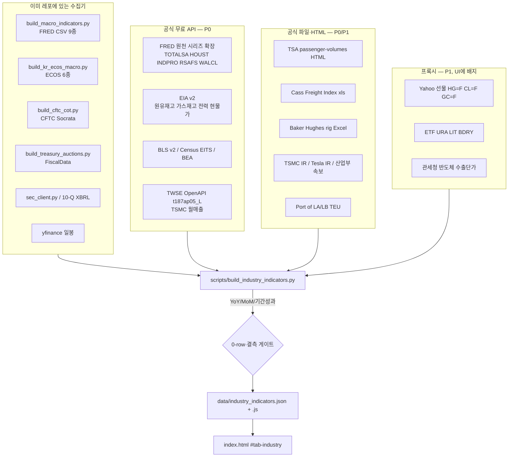

# Mir_US_Stocks 산업·매크로 선행지표 터미널 기획 & 구현 가이드
> **한국경제 epic(에픽) 벤치마킹 기반 — 기관급 주식 분석 최적화 도구 고도화 설계서**  
> 대상 프로젝트: `Mir_US_Stocks` (GitHub Pages 정적 대시보드)  
> 작성일: 2026-09-15  
> 데이터·API·유사제품 조사 보강: 2026-09-15 (공식 문서·벤더 사이트·경쟁 제품 교차검증)  
> **2차 보강: 2026-09-15 저녁** — 레포 실제 코드 대조(0장 4절), 신규 무료 소스 60여 종 접근 경로 실검증(1장 ⑧~㉑, 2A-G), 유사 서비스 기능 단위 재조사(5.5-2), UI 정정본(4장), 분석 기능 정직성 규약(8장 신설)  
> **3차 검토·보강: 2026-09-17** — 관련 종목 티커를 레포 데이터와 전수 대조해 정정(0장 5절), 중복 지표 ID 통합, 1차 런치 범위를 PR 단위로 분할(1장 P0), 선행 검증·신호등 규칙 재정의(8장), `industry.html` 잔재 제거, 3차 외부 데이터 조사(1B장)  
> **처음 여는 사람은 맨 끝의 10장(작업 이력과 인수인계)부터 읽을 것.**  
> 담당: Claude 구현용 상세 기술·데이터·UI/UX 통합 스펙

본 보강본은 초안의 제품 방향(epic 벤치, 미국주 특화, 정적 JSON, 관련 기업 태그)을 유지하면서, **실제로 가져올 수 있는 데이터 / 가져올 수 없는 데이터 / 어디서 / 어떤 라이선스로 / 누가 이미 같은 일을 하는지**를 구현 가능한 수준으로 채운다. 확인하지 못한 엔드포인트는 적지 않았고, 초안에 있던 미검증 경로(예: KOMIS `/api/metal/getPriceList`)는 정정했다.

---

## 0. 기획 배경 및 목표

### 1) 왜 산업·선행 지표인가?
개인 투자자는 종목의 주가 차트(기술적 분석)나 과거 재무제표(후행 지표)만 봅니다. 반면 **여의도·월가의 섹터 애널리스트와 헤지펀드 매니저는 기업 실적을 결정짓는 '선행 가격(Spot Price)'과 '출하량/판매량(Volume)'을 매일 추적**합니다.
- 예: 마이크론(MU) 실적은 **DRAM/NAND 가격**에 크게 좌우됩니다. (초안의 "1~2개 분기 선행"도 미검증 수치라 삭제.)
- 예: 테슬라(TSLA)와 리비안(RIVN)의 주가는 **미국 자동차 판매 연율(SAAR)** 및 **탄산리튬 원가**와 직결됩니다.
- 예: 애플(AAPL)과 엔비디아(NVDA)의 칩을 위탁생산하는 **TSMC의 매월 10일 월간 매출액**은 두 회사 분기 실적보다 먼저 나오는 공개 숫자입니다. (초안의 "90% 윤곽이 드러난다"는 검증되지 않은 수치라 3차에서 삭제 — 얼마나 선행하는지는 8장 검증을 통과한 뒤에만 숫자로 말한다.)

### 2) 벤치마크 모델: 한국경제 `epic`
한국경제에서 출시한 증권 전문 터미널 `epic(에픽)`의 **[산업지표]** 및 **[시장지표]** 탭을 벤치마킹합니다.
- **좌측 2단계 계층형 네비게이션** (산업 대분류 → 세부 지표 리스트)
- **복합 인터랙티브 차트 (Dual Y-Axis)**: 절대 수치(막대그래프) + 증감률 YoY/MoM(선그래프)
- **기간별 성과 요약 테이블**: 1D, 1W, 1M, 3M, 6M, YTD, 1Y, 3Y 등락률
- **핵심 킬러 기능 — [관련 기업 태그]**: 지표 하단에 해당 산업과 직결된 상장사 태그를 노출하고, 클릭 시 '미르의 미국주식' 해당 종목 상세 분석 화면으로 즉시 연결!

### 3) Mir_US_Stocks만의 차별점 (Alpha)
- 한국경제 epic은 **국내 기업(코스피/코스닥)** 중심이지만, 우리는 **미국 상장 대형주(S&P500, 나스닥100) 및 글로벌 매크로**에 완벽하게 최적화합니다.
- 정적 사이트 구조(GitHub Actions + JSON)를 유지하여 **서버 비용 0원, 초고속 로딩(0.1초 렌더링)**을 달성합니다.

### 4) 레포 현황 대조 (2026-09-15 2차, 실제 코드 기준)

초안·1차 보강본이 "새로 만들 것"으로 적은 항목 가운데 상당수가 이미 레포에 있다. 구현자는 아래 표를 먼저 보고 **재사용할 것 / 이름을 고칠 것 / 등록해야 할 것**을 구분한다.

| 문서가 가정한 것 | 실제 레포 (2026-09-15) | 구현 시 조치 |
| :--- | :--- | :--- |
| 한국 반도체 수출단가는 "관세청 보도자료 파서(B)"로 새로 만든다 | `scripts/build_kr_trade_exports.py`가 **이미** data.go.kr 관세청 품목별 수출입실적 API(`nitemtrade/getNitemtradeList`, `DATA_GO_KR_KEY`)로 HS 8542 반도체·8486 반도체장비·8703 자동차·8507.60 리튬이온배터리·8517 무선통신·2710 석유제품·8901 선박·3304 화장품의 **월간 수출액·YoY 25개월**을 `data/korea/trade_exports.json`(`window.KR_TRADE_EXPORTS`)으로 만든다. 신뢰도 센터에 "수출 모멘텀"으로 등록돼 있고 시그널 탭에서 lazy 로드 | 산업지표의 `kr_semi_export`·`kr_auto_export`·`kr_battery_export`는 **이 파일을 읽는다.** 단가(USD/kg)는 **3차 정정**: 기존 빌더의 `nitemtrade` 는 "품목별 국가별"(15100475)이라 중량이 없다. 중량 `expWgt` 는 `Itemtrade/getItemtradeList`(15101609, HS 10단위)에 있다 → 같은 키·같은 XML 파서로 엔드포인트만 추가(1B.1·카탈로그 A-3). `proxy:true` 표기 |
| TSMC 월매출 히스토리를 위한 "누적 아카이브" 패턴이 필요하다 | `data/history/market_history.json`(`keep`·`records`, 하루 1레코드 적립)이 같은 목적의 **적립 저장소 패턴**으로 이미 동작(시그널 탭 매크로 추이 스파크라인) | TWSE 최신월·AAII 최신주·Harpex 최신주·Cameco 월간처럼 "최신값만 주는 소스"는 `data/industry_archive/{id}.json`에 같은 규약(중복 날짜 skip·`keep` 상한)으로 적립 |
| 관련 기업 칩 클릭은 `openStockDetail(ticker)` 를 부른다 | **그 함수는 없다.** 실제 진입점은 `app.js`의 `navigateToStockAnalysis(ticker, query, { animate })` (검색 탭 → analysis 서브탭 활성화 → `selectTicker` → `loadAiDeepReport`) | 칩 클릭 = `navigateToStockAnalysis(ticker, "TSMC 8월 매출 +N% 가 NVDA 에 갖는 의미", { animate: false })` |
| 매크로 패널은 FRED 9종 타일 | `signals.js renderMacroIndicators()`가 `MACRO_INDICATORS.indicators`를 타일로 그리고, `MARKET_HISTORY`가 있으면 추이 타일을 붙인다. `SIGNALS_FEATURE_KEYS`에 든 피처가 도착할 때마다 다시 그림 | 산업지표 페이지가 WTI·HY OAS·달러를 다시 받지 않도록 빌드 단계에서 `macro_indicators.json`을 읽어 같은 관측치를 재사용(문서 2.1의 원칙을 코드 경로로 고정) |
| 섹터 화면이 따로 없다 | `index.html?tab=sector`(`renderSectors`, `SECTOR_ETFS` 11종 XLK·XLE… + ETF 상대강도 서브탭)가 있고 `sector-detail.html`은 거기로 리다이렉트 | 산업지표 카테고리마다 `sector_etf`(XLE·XLI·XLB·ITB…)를 붙여 섹터 탭과 **양방향 링크**. 섹터 탭 상단에 "이 섹터의 선행지표 3개" 스트립 |
| 피처 데이터 로드는 각자 구현 | `feature-data.js`의 레지스트리 한 줄(`{ global, path, usOnly/krOnly, lazy, feature }`)로 로드·실패 캐시·시장 전환이 처리됨 | `industry: { global: "INDUSTRY_INDICATORS", path: "data/industry_indicators.js", lazy: true }` 한 줄 추가. 두 시장 모두 로드(미국 지표는 KR 수출주에도 컨텍스트) |
| 데이터 신뢰도 센터는 별개 | `app.js`의 `source(라벨, 출처, window.X, [필수키], 신선도시간, 주기, featureKey)` 행을 추가하지 않으면 **감시 사각지대**가 된다(2026-08-06 무키 피드 때 명시) | `rows.push(source("산업 선행지표", "FRED·EIA·TWSE·관세청 외", window.INDUSTRY_INDICATORS, ["indicators"], 30, "매일 06:10", "industry"))` + `TRUST_RECOVERY`에 워크플로우 이름 등록 |
| 배포는 push 하면 된다 | 데이터 워크플로우는 `GITHUB_TOKEN`으로 push 하므로 **`deploy-pages.yml`의 `workflow_run.workflows` 목록에 새 워크플로우 `name:`을 넣지 않으면 사이트에 영영 반영되지 않는다.** `scripts/check_deploy_triggers.py`가 어긋남을 검사 | `industry-indicators.yml`의 `name: "Industry indicators"`를 목록에 추가하고 `check_deploy_triggers.py` 통과 확인. concurrency 그룹은 워크플로우별(단일 `pages` 그룹으로 회귀 금지) |
| 새 페이지는 그냥 서빙된다 | `scripts/build_bundle.mjs`의 `PAGES = ["index.html","analysis.html","chart_capture.html"]`만 배포 시 번들·minify 된다. 목록 밖 페이지도 동작은 하지만 25개 classic script를 그대로 받는다 | **독립 페이지를 만들지 않는다(3차 확정).** 메인 탭 `#tab-industry` 로만 가므로 `PAGES` 변경 없음 |
| SW 캐시는 신경 안 써도 된다 | `sw.js`는 `/data/` 경로를 **networkFirst**로 바꿔 둔 상태(과거 `?v=MIR_BUILD_ID` cacheFirst 동결 버그 수정본) | 그대로 두면 됨. 라이브 검증은 시크릿 창 |
| sitemap은 손으로 | `build_sitemap.py`가 생성(602 URL, `analysis.html?t=`만 종목 canonical) | 지표 딥링크(`index.html?tab=industry&i=tsmc_monthly_rev`)를 sitemap에 넣으려면 `build_sitemap.py`에 산업 URL 블록을 추가하고 canonical 규약을 맞춘다. 직접 편집 금지 |
| UI 예시의 돋보기·핀·폴더·태그 장식 이모지 | 사이트 규칙: **장식 이모지 금지**(기능 심볼 ✕☰✓★▲▼만, 필요 시 얇은 SVG). Pretendard·tabular-nums 베이스라인 | 4장의 레이아웃·컴포넌트 설명에서 이모지를 제거(아래 4장은 정정본) |
| 국내 종목은 코드로 표기 | KR 모드 화면 표기는 `fmt.js stockLabel/stockSubLabel`(회사명 주 표기, 코드 부 표기)만 허용. `data-*`·URL·저장키는 코드 | `related_tickers`에 `market:"kr", code:"005930"`을 넣고 화면은 `stockLabel`로만 그린다. `verify_kr_names.mjs`가 코드 주 표기를 잡는다 |
| 파이썬 빌더 규약 | 기존 빌더 공통: `sys.stdout.reconfigure(encoding="utf-8")`(cp949 콘솔), `briefing_store.atomic_write_text`, `repository_publish_lock`, 0-row 게이트, 실패 시 기존 파일 유지, identified User-Agent | 그대로 따른다. 특히 관세청 키는 `/`로 시작해 Git Bash 가 경로로 변조(`MSYS2_ENV_CONV_EXCL`) — 로컬 실행 주의 |
| 검증 하네스 | `build_factor_validation.mjs`·`prob_calibration.json`·`earnings_reactions`가 "신호가 진짜인지"를 실측해 왔고, 상승확률 점수는 예측력 없음(ρ≈−0.02)이 확인돼 이름을 바꾼 전례가 있다 | 8장의 "선행/후행 상관·서프라이즈 반응"도 **같은 하네스로 검증한 것만** 화면에 올린다. 검증 전엔 수치 없이 "관련 지표"로만 표기 |

### 5) 관련 종목 티커 전수 대조 (2026-09-17 3차)

문서의 모든 관련 종목을 `data/details/<TICKER>.json`·`data/korea/details/<코드>.json` 존재 여부로 대조했다. 칩을 누르면 `navigateToStockAnalysis` 가 이 파일을 fetch 하므로, **파일이 없는 티커는 빈 화면**이 된다. 아래는 고친 내용이며 표 본문에는 이미 반영돼 있다.

| 문서에 있던 표기 | 레포 실측 | 조치 |
| :--- | :--- | :--- |
| `X` (US스틸), `RDFN` (레드핀), `ALTM` (아카디움 리튬) | 세 종목 모두 details·스냅샷에 없음 (2025년 피인수·상장폐지로 추정) | 삭제. `RDFN` 자리는 `RKT` |
| `GOLD` = 배릭골드 | 레포의 `GOLD` 는 시총 $1.4B·INDUSTRIALS 인 **다른 회사**. 배릭은 `B` (시총 $69.8B·BASIC MATERIALS, 5년 이력) | `B` 로 교체 |
| `CMT` = 공작기계 관련 | 레포의 `CMT` 는 시총 $0.2B AMEX 소형주 (무관) | 삭제, `ROK`·`EMR` 로 교체 |
| `PSTG` (퓨어스토리지) | 없음. `P` (NYSE·TECHNOLOGY·시총 $31B·매출 $3.7B·5년 이력)가 같은 회사로 보임 — 티커 변경 추정 | `P` 로 교체. **구현 시 회사명으로 재확인** |
| `CTRA` (코테라) | 없음 (합병 추정) | 가스 생산사는 `EXE`·`AR` 로 교체 |
| `EA`, `CQP`, `UUP`, `AVB`, `EQR` | details·스냅샷에 없음 (원인 미확인 — 상폐·유니버스 누락 중 하나) | 삭제 또는 같은 업종 실재 티커(`RBLX`, `MAA`, `ESS`, `UDR`)로 교체 |
| `TOELY`, `FANUY`, `GLNCY`, `VWAGY`, `BMW`, `BYDDY`, `SUMCO`, `GlobalWafers` | 미국 OTC·해외 상장이라 유니버스 밖 | 삭제 (칩으로 만들 수 없음) |
| "`SKHY` 관련 ADR" | `SKHY` 는 실재 (2026-07-10 상장분부터 일봉, 시총 $1,280B 로 표기됨 — 단위 점검 필요) | `SKHY` 로 확정 + KR 칩 병기 |

**빌드 게이트(필수)**: `build_industry_indicators.py` 는 산출 직전에 `related_tickers` 전부를 위 두 경로로 검사한다. 없는 티커가 하나라도 있으면 **그 칩만 떨구고 경고를 남기는 것이 아니라 exit 1** 로 실패시킨다(큐레이션 표는 사람이 쓰는 정적 데이터라 조용한 누락이 곧 방치다). 상장폐지·티커 변경은 계속 생기므로 이 검사는 1회성이 아니라 매 빌드에 돈다.

---

## 1. 어떤 데이터를 가져올 수 있는가? (산업별 전수 조사 목록)

애널리스트들이 실제로 매일 모니터링하는 핵심 섹터의 선행·동행 지표와, 연관 미국 주식 티커 매핑이다. **표시한다고 해서 모두 무료 API로 들어올 수 있는 것은 아니다.** 아래 수집 등급을 지표마다 붙인다.

| 등급 | 의미 | 구현 시 원칙 |
| :--- | :--- | :--- |
| **A** | 공식 무료 API. 키만 있으면 시계열이 JSON/CSV로 떨어진다 | 1차 런치 기본 소스. 원천 기관을 FRED 집계보다 우선 |
| **B** | 공식 HTML·CSV·보도자료. 파서 필요, 구조는 안정적 | 주 1회 크론으로 충분. User-Agent·robots·저작권 준수 |
| **C** | 공개 프록시(선물 티커, ETF, 수출단가). 원지표와 상관은 높으나 동일하지 않음 | UI에 "프록시" 배지. 원천 명칭을 사칭하지 않음 |
| **D** | 유료 벤더(TrendForce, UxC, Baltic, Fastmarkets, SEMI 히스토리 등) | 구매 전 제외. 대체 C가 있으면 C로 표기 |
| **X** | 재배포 금지·비공식 스크래핑만 가능·ToS 위반 위험 | 넣지 않음. 문서에만 "존재한다"고 기록 |

1차 런치(P0)는 **A + 안정적인 B**만. C는 2차. D/X는 로드맵 밖으로 둔다.

### ① 테크 & 반도체 & AI 하드웨어 (Technology & Semiconductors)
| 지표 ID | 지표 국문명 | 단위 및 주기 | 핵심 의미 및 분석 가치 | 연관 미국 주식 (태그) | 1순위 소스 | 등급 |
| :--- | :--- | :--- | :--- | :--- | :--- | :--- |
| `dram_spot_ddr5` | **DRAM 현물 가격 (DDR5 16Gb)** | USD, 일간 | 메모리 업황의 절대 선행. MU 마진과 1~2분기 동행 | `MU`, `WDC`, `NVDA`, `AMD`, `INTC` | TrendForce/DRAMeXchange는 **D**. 무료 대체: 관세청 DRAM kg당 수출단가(B), `SOXX`/`MU`는 주가지수라 원지표가 아님 | D → P0 제외. **3차: 공식 무료 대체 발견 — `kr_xpi_dram`(한국은행 수출물가)·`boj_memory_ic_price_index`·`tw_memory_rev` (1B.1)** |
| `nand_flash_spot` | **NAND 플래시 현물 가격 (512Gb TLC)** | USD, 일간 | SSD·엔터프라이즈 스토리지 수요 | `WDC`, `MU`, `P`, `STX` | 동일 (TrendForce D). 관세청 플래시 수출단가(B) | D → P0 제외. **3차: `kr_xpi_flash` (1B.1)** |
| `hbm_export_unit` | **한국 HBM/MCP 수출단가** | USD/kg, 순별~월간 | AI 메모리 슈퍼사이클의 공식 무역통계 프록시. 현물보드와 다르지만 재배포 가능 | `MU`, `SKHY`, `NVDA`; `SK하이닉스`(000660), `삼성전자`(005930) | 관세청 수출입무역통계 / 산업통상자원부 수출입 속보 | B |
| `tsmc_monthly_rev` | **TSMC 월별 매출액 (대만달러)** | NT$ (십억), 월간 (매달 10일) | **글로벌 테크 1위 선행.** NVDA AI·AAPL 아이폰 칩 위탁생산이 매달 드러남 | `TSM`, `NVDA`, `AAPL`, `AMD`, `QCOM`, `AVGO` | TSMC IR HTML + TWSE OpenAPI `t187ap05_L` (최신월, 키 없음) | **A/B** |
| `semi_ip_us` | **미국 반도체 산업생산** | 지수, 월간 | 미국 내 반도체 생산 실측. 현물가보다 늦지만 공식 | `INTC`, `MU`, `TXN`, `ADI` | FRED `IPN3344S` / Fed G.17 | **A** |
| `semi_ppi_us` | **미국 반도체 PPI** | 지수, 월간 | 반도체 출하가격 물가. 계약가 사이클의 공식 대체 | `MU`, `INTC`, `TXN` | BLS PPI `PCU334413334413` | **A** |
| `semi_equipment_billings` | **북미/글로벌 반도체 장비 출하** | USD, 월~분기 | 팹 증설 사이클 | `ASML`, `AMAT`, `LRCX`, `KLAC`, `TER` | SEMI 월간 보도자료(B, 최신 1포인트). 히스토리 Excel은 회원 **D**. 2017부터 book-to-bill 중단 | B(최신) / D(히스토리) |
| `japan_machine_tool` | **일본 공작기계 수주** | 엔, 월간 | 아시아 캡엑스 선행. 반도체·자동차 설비 | `ROK`, `EMR`, `ASML` | JMTBA 보도자료 / 일본 기계진흥협회 | B |
| `taiwan_export_orders` | **대만 수출주문** | NTD, 월간 | 전자 공급망 선행 (TSMC·Hon Hai 전 단계) | `TSM`, `AAPL`, `NVDA` | 대만 경제부 통계처 보도 | B |
| `bigtech_capex_sum` | **북미 빅테크 합산 CAPEX** | USD (십억), 분기 | MSFT·GOOGL·AMZN·META·ORCL AI 데이터센터 | `NVDA`, `AVGO`, `ANET`, `VRT`, `SMCI`, `MSFT` | SEC 10-Q XBRL (이미 `sec_client.py` 보유) | **A** |

### ② 전기차 & 모빌리티 & 배터리 광물 (Auto, EV & Battery Materials)
| 지표 ID | 지표 국문명 | 단위 및 주기 | 핵심 의미 및 분석 가치 | 연관 미국 주식 (태그) | 1순위 소스 | 등급 |
| :--- | :--- | :--- | :--- | :--- | :--- | :--- |
| `us_auto_sales_saar` | **미국 경차 판매 연율** | 백만 대(연율), 월간 | 내구재 구매 체력·완성차 업황. 시리즈 ID는 `TOTALSA`(FRED). 초안의 `TOTALSAAR`는 별칭 | `F`, `GM`, `TSLA`, `RIVN`, `STLA` | FRED `TOTALSA` / BEA | **A** |
| `us_light_vehicle_sales` | **미국 경량차 판매 (ALTSALES)** | 백만 대(연율), 월간 | TOTALSA의 경량차 부분집합. 픽업·SUV 비중 분석용 | `F`, `GM`, `TSLA` | FRED `ALTSALES` | **A** |
| `lithium_carbonate_price` | **탄산리튬 99.5% 시세 (배터리급)** | CNY/톤 또는 USD/kg, 일간 | EV 셀 원가·양극재 판가 | `ALB`, `SQM`, `LAC`, `TSLA` | Fastmarkets/SMM는 **D**. KOMIS 웹 UI는 시세 조회 가능하나 **문서화된 공개 REST를 확인하지 못함**. 공공데이터포털 리튬 데이터는 **연간 예측치**라 일별 시세가 아님. P0는 `LIT` ETF(C) 또는 생략. **3차: IMF PCPS `PLITH`(월)·한국은행 수입물가 `kr_mpi_lithium`·관세청 수입단가로 대체 (1B.1)** | D / **A(월)** |
| `lme_nickel_cash` | **니켈 가격** | USD/톤, 일간 | 하이니켈 NCM 원가 | `VALE`, `BHP`, `TSLA`, `GM` | LME 공식은 유료. 무료: FRED/IMF `PNICKUSDM`(월간 A), Yahoo 니켈 선물 티커는 상장 여부가 바뀜 → 월간 IMF를 P0 | **A**(월) / D(일 LME) |
| `lme_cobalt_cash` | **코발트 가격** | USD/톤, 일간 | 삼원계 배터리 | `BHP`, `ALB` | LME/Fastmarkets D. USGS 연간, KOMIS 웹 B 가능성. **3차: IMF PCPS `PCOBA` 월간(A)** | D / **A(월)** |
| `tesla_quarterly_deliveries` | **테슬라 분기 글로벌 인도량** | 대, 분기 초 | 어닝 서프라이즈 분기점 | `TSLA`, `RIVN`, `LCID`, `NIO` | Tesla IR 보도자료 HTML. API 없음 | B |
| `china_cpca_nev_sales` | **중국 신에너지차(NEV) 월간 판매** | 대, 월간 | 세계 최대 EV 시장 | `NIO`, `LI`, `XPEV`, `TSLA` | CPCA/CAAM 웹·보도. 영문 지연. 공식 API 없음 | B |

### ③ 에너지 & 정유 & 유틸리티 & 원전 (Energy, Refining & Utilities)
| 지표 ID | 지표 국문명 | 단위 및 주기 | 핵심 의미 및 분석 가치 | 연관 미국 주식 (태그) | 1순위 소스 | 등급 |
| :--- | :--- | :--- | :--- | :--- | :--- | :--- |
| `wti_crude_oil` | **WTI 원유 가격** | USD/배럴, 일간 | 에너지 원가·물가·정유 | `XOM`, `CVX`, `OXY`, `COP`, `EOG` | EIA `PET.RWTC.D` (A, 현물) 또는 Yahoo `CL=F` (C, 선물). 프로젝트는 이미 FRED `DCOILWTICO` 사용 | **A** |
| `brent_crude` | **브렌트 원유** | USD/배럴, 일간 | 글로벌 벤치마크. WTI와 스프레드 | `XOM`, `BP`, `SHEL` | EIA / FRED `DCOILBRENTEU` | **A** |
| `us_crude_inventories` | **미국 주간 상업용 원유 재고** | 천 배럴, 주간 수 | 수급 밸런스. 수요일 EIA WPSR | `XOM`, `CVX`, `SLB`, `HAL` | EIA v2 `PET.WCRSTUS1.W` | **A** |
| `us_gasoline_inventories` | **미국 주간 가솔린 재고** | 천 배럴, 주간 | 드라이빙시즌 수요 | `VLO`, `MPC`, `PSX` | EIA `PET.WGTSTUS1.W` | **A** |
| `us_natgas_storage` | **미국 주간 천연가스 재고** | Bcf, 주간 목 | 가스 수급. 목 10:30 ET | `EQT`, `EXE`, `KMI` | EIA Weekly NG Storage | **A** |
| `refining_crack_spread` | **3:2:1 복합 정제마진** | USD/배럴, 일간 | 원유 2 + 가솔린·히팅오일 가중. 직접 시리즈는 없음 → `CL`/`RB`/`HO`로 계산 | `VLO`, `MPC`, `PSX` | EIA 현물 또는 Yahoo `CL=F`,`RB=F`,`HO=F`로 산출 | **A**(계산) |
| `henry_hub_natgas` | **헨리허브 천연가스** | USD/MMBtu, 일간 | 발전·난방·LNG 피드가스 | `EQT`, `EXE`, `AR`, `LNG`, `KMI`, `CEG` | EIA `NG.RNGWHHD.D` / FRED `DHHNGSP` | **A** |
| `baker_hughes_rigs` | **베이커휴즈 미국 리그 수** | 기, 주간 금 | 업스트림 활동의 가장 빠른 실측 | `BKR`, `SLB`, `HAL`, `HP` | Baker Hughes 주간 Excel (공식, 무료 다운로드) | **B** |
| `uranium_u3o8_spot` | **우라늄 현물 (U3O8)** | USD/lb, 주간 | SMR·원전 PPA | `CCJ`, `URA`, `SMR`, `OKLO`, `CEG` | UxC/TradeTech **D**. Cameco 사이트는 UxC 지연 게시(B, 재배포 주의). P0는 `URA`/`URNM`(C) | D / C |
| `us_electricity_generation` | **미국 발전량** | GWh, 주~월 | 전력 수요·가스/원전/재생 믹스 | `VST`, `CEG`, `NRG`, `NEE`, `SO` | EIA electricity (월간 확정 A, 시간별 RTO는 EIA-930) | **A** |
| `us_electricity_price` | **미국 소매 전력요금** | ¢/kWh, 월간 | 유틸 실적·데이터센터 원가 | `NEE`, `SO`, `DUK`, `AEP` | EIA `/v2/electricity/retail-sales` | **A** |

### ④ 운송 & 해운 & 물류 & 여행 (Shipping, Logistics & Airlines)
| 지표 ID | 지표 국문명 | 단위 및 주기 | 핵심 의미 및 분석 가치 | 연관 미국 주식 (태그) | 1순위 소스 | 등급 |
| :--- | :--- | :--- | :--- | :--- | :--- | :--- |
| `scfi_freight_index` | **상하이 컨테이너 운임지수 (SCFI)** | 포인트, 주간 금 15:00 BJT | 상하이 출항 스팟. 소비재 물동량 | `ZIM`, `MATX`, `DAC` | 상하이항운교역소. 최신 헤드라인은 공개, 전체 시계열·API는 유료(~CNY 1.5만/년). Freightos FBX API는 키 유료. P0는 지연 헤드라인(B) 또는 `ZIM` 운임 민감주로 대체하지 말 것 | B(최신) / D(풀) |
| `fbx_global` | **Freightos Baltic Index (FBX)** | USD/FEU, 일간 | 유일한 일간·IOSCO 컨테이너 지수. SCFI보다 빠르다 | `ZIM`, `MATX` | Freightos `GET https://api.freightos.com/fd_external_apis/fbx/data/` — 구독 키 필요 | D (지연 웹은 일부 무료) |
| `drewry_wci` | **Drewry World Container Index** | USD/40ft, 주간 목 | 미디어가 인용하는 글로벌 컨테이너 | `ZIM`, `MATX` | Drewry 웹 지연 공개 / 풀 데이터 유료 | B/D |
| `baltic_dry_index` | **발틱 건화물선 운임 (BDI)** | 포인트, 일간 | 철광석·석탄·곡물 벌크 | `SBLK`, `GOGL` | Baltic Exchange **D**. Yahoo `^BDI`는 비공식·단절 잦음. ETF `BDRY`는 선물 추종(C) | D / C |
| `la_lb_teu` | **LA/롱비치 항만 컨테이너 물동량** | TEU, 월간 | 미국 수입 실측. SCFI보다 느리나 공식 | `ZIM`, `FDX`, `HD`, `WMT` | Port of LA / Port of LB 통계 페이지 (무료 HTML/CSV) | **B** |
| `tsa_passenger_throughput` | **TSA 일일 검색 승객** | 명, 평일 09:00 ET 갱신 | 항공 수요의 가장 빠른 실측 | `DAL`, `UAL`, `AAL`, `LUV`, `BKNG`, `ABNB` | `https://www.tsa.gov/travel/passenger-volumes` HTML 테이블. **공식 API 없음**. 연도별 아카이브 페이지 있음. FOIA PDF는 공항별 시간대(과함) | **B** |
| `cass_freight_index` | **Cass 화물 운송 지수** | 지수(1990=1), 월간 ~13일 | 북미 트럭·LTL·철도 실청구 기반 | `FDX`, `UPS`, `UNP`, `CSX`, `JBHT` | cassinfo.com 월간 리포트 + Historical xls 무료 다운로드. FRED에도 실렸던 적 있음(제3자 시리즈 라이선스 주의) | **B** |

### ⑤ 원자재 & 철강 & 비철금속 & 주택 (Commodities & Housing)
| 지표 ID | 지표 국문명 | 단위 및 주기 | 핵심 의미 및 분석 가치 | 연관 미국 주식 (태그) | 1순위 소스 | 등급 |
| :--- | :--- | :--- | :--- | :--- | :--- | :--- |
| `copper_comex` | **구리 가격 ('닥터 코퍼')** | USD/lb 또는 USD/톤, 일간 | 실물경기·전력망·데이터센터 전선 | `FCX`, `SCCO`, `BHP`, `RIO` | Yahoo `HG=F` (COMEX 선물, C) + FRED/IMF `PCOPPUSDM` (월간 A). LME 현금은 유료 | **A**(월) / C(일) |
| `gold_usd` | **금 현물/선물** | USD/oz, 일간 | 실질금리·달러·리스크오프 | `GLD`, `NEM`, `B`, `AEM` | FRED `GOLDAMGBD228NLBM`(LBMA, 제3자) 또는 Yahoo `GC=F` | C / A |
| `iron_ore_62pct` | **철광석 62% 분광** | USD/톤, 일간~월간 | 중국 인프라·철강 원가 | `VALE`, `RIO`, `BHP`, `CLF`, `NUE` | Fastmarkets/Mysteel **D**. FRED/IMF `PIORECRUSDM` 월간 **A** | **A**(월) |
| `us_steel_ppi` | **미국 철강 PPI** | 지수, 월간 | 미국 철강 판가 | `NUE`, `CLF`, `STLD` | BLS PPI 철강 | **A** |
| `us_housing_starts` | **미국 주택 착공** | 천 건(연율), 월간 | 금리 민감 선행. 가전·건자재 | `DHI`, `LEN`, `PHM`, `HD`, `LOW` | Census EITS `resconst` API + FRED `HOUST` | **A** |
| `us_building_permits` | **미국 건축허가** | 천 건(연율), 월간 | 착공보다 한 박자 빠른 선행 | `DHI`, `LEN`, `PHM` | FRED `PERMIT` / Census | **A** |
| `us_new_home_sales` | **미국 신규주택 판매** | 천 건(연율), 월간 | 빌더 실적 직결 | `DHI`, `LEN`, `PHM` | FRED `HSN1F` | **A** |
| `us_mortgage_rate_30y` | **미국 30년 모기지 금리** | %, 주간 | 주택 수요의 가격 | `DHI`, `LEN`, `RKT`, `UWMC` | FRED `MORTGAGE30US` (Freddie Mac) | **A** |

### ⑥ 매크로 & 유동성 & 신용 위험 (Macro, Liquidity & Credit Risk)
| 지표 ID | 지표 국문명 | 단위 및 주기 | 핵심 의미 및 분석 가치 | 연관 미국 주식 (태그) | 1순위 소스 | 등급 |
| :--- | :--- | :--- | :--- | :--- | :--- | :--- |
| `us_high_yield_spread` | **하이일드 OAS** | %p, 일간 | 부도 위험 조기경보. 급락 전 먼저 벌어짐 | `HYG`, `JNK`, `SPY`, `QQQ` | FRED `BAMLH0A0HYM2` (ICE BofA, 제3자). 프로젝트 매크로 패널에 **이미 있음** | **A** (제3자 표기) |
| `us_ig_spread` | **투자등급 OAS** | %p, 일간 | IG 신용. HY와 스프레드 스택 | `LQD`, `IGIB` | FRED `BAMLC0A0CM` | **A** (제3자) |
| `fed_total_assets` | **연준 총자산** | 백만 달러, 주간 목 | QT/QE 속도 | `QQQ`, `SPY`, `TLT` | FRED `WALCL` | **A** |
| `us_m2_money_supply` | **미국 M2** | 십억 달러, 월간 | 유동성 | `SPY`, `GLD` | FRED `M2SL` | **A** |
| `dollar_index_dxy` | **달러** | 지수, 일간 | 기축통화·다국적 환차손 | `SPY`, `EEM` | FRED `DTWEXBGS`(광의, A) vs Yahoo `DX-Y.NYB`(ICE DXY, C). 둘은 바스켓이 다름. UI에 이름을 구분 | **A** / C |
| `t10y2y` | **미국 10Y−2Y 스프레드** | %p, 일간 | 장단기 역전 = 침체 선행 | `SPY`, `TLT`, `XLF` | FRED `T10Y2Y`. 수익률 곡선 패널에 **이미 있음** | **A** |
| `nfci` | **시카고연준 금융여건 (NFCI)** | 지수, 주간 | 금융 스트레스. 0=평균 | `SPY`, `XLF` | FRED `NFCI` | **A** |
| `initial_claims` | **신규 실업수당** | 천 건, 주간 | 고용의 가장 빠른 실측 | `SPY`, `HD`, `LOW` | FRED `ICSA`. 매크로 패널에 **이미 있음** | **A** |
| `ism_pmi_mfg` | **ISM 제조업 PMI** | 지수, 월간 1일 | 제조 사이클. 50 상/하 | `XLI`, `CAT`, `HON` | ISM 원천은 유료·재배포 제한. FRED 구 `NAPM`은 단절. S&P Global PMI도 유료. **P0 제외**하거나 헤드라인만 B. **3차: 지역 연준 5개 서베이 합성 `regional_fed_composite_pmi` 로 대체 (1B.1)** | D |
| `retail_sales` | **미국 소매판매** | 백만 달러, 월간 | 소비 동행 | `WMT`, `AMZN`, `HD`, `COST` | Census EITS `mrts` + FRED `RSAFS` | **A** |
| `indpro` | **미국 산업생산** | 지수, 월간 | 제조 동행 | `XLI`, `CAT` | FRED `INDPRO` / Fed G.17 | **A** |
| `umcsent` | **미시간 소비심리** | 지수, 월간 | 소비 선행 | `WMT`, `F`, `GM` | FRED `UMCSENT`. 매크로 패널에 **이미 있음**. 미시간대 제3자 | **A** (제3자) |

### ⑦ 추가 섹터 — 1차에 넣지 않아도 카탈로그에 남긴다

#### 클라우드·광고·소프트웨어
| 지표 ID | 의미 | 소스 | 등급 |
| :--- | :--- | :--- | :--- |
| (별칭) `hyperscaler_capex` | **ID 를 만들지 않는다.** ①의 `bigtech_capex_sum` 하나만 쓰고 클라우드 카테고리에도 같은 ID 를 건다 | SEC 10-Q | A |
| `aws_azure_gcp_growth` | 클라우드 매출 YoY. 실적 발표 때 한 줄 | 10-Q 세그먼트 | A |
| `digital_ad_spend` | 디지털 광고. META/GOOGL 실적 가이던스 | 10-Q / ISBA (유료) | A/D |

#### 금융·신용
| 지표 ID | 의미 | 소스 | 등급 |
| :--- | :--- | :--- | :--- |
| `cc_delinquency` | 신용카드 연체율 | FRED `DRCCLACBS` | A |
| `sloos_lending` | 은행 대출태도 (SLOOS) | Fed SLOOS / FRED | A |
| `cftc_cot` | 투기 순포지션 | CFTC Socrata. **이미 `build_cftc_cot.py`** | A |
| `treasury_btc` | 국채 경매 응찰배수 | FiscalData. **이미 `build_treasury_auctions.py`** | A |

#### 한국 산업 (미국주 공급망 선행)
미국주 대시보드라도 **한국·대만 무역통계가 미국 반도체주보다 한 달 빠르다.**
| 지표 ID | 의미 | 소스 | 등급 |
| :--- | :--- | :--- | :--- |
| `kr_semi_export` | 한국 반도체 수출액·단가 | 산업통상자원부 수출입 속보, 관세청 | B |
| `kr_ict_export` | ICT 수출 | 과기정통부/산업부 속보 | B |
| `kr_auto_export` | 자동차 수출 | 산업부 / KAMA | B |
| `bok_base_rate` | 한은 기준금리 | ECOS `722Y001`. **이미 `build_kr_ecos_macro.py`** | A |
| `kr_export_total` | 한국 총수출 | ECOS / 산업부 | A/B |
| `kospi_semi_index` | 반도체 업종지수 | KRX | B |

#### 농산물 (인플레·식품주)
| 지표 ID | 의미 | 소스 | 등급 |
| :--- | :--- | :--- | :--- |
| `usda_wasde` | 세계 곡물 수급 | USDA WASDE PDF/CSV 월간 | B |
| `nass_crop` | 미국 작황 | USDA NASS Quick Stats API (키 무료) | A |
| `corn_wheat_soy` | 옥수수·밀·대두 선물 | Yahoo `ZC=F`,`ZW=F`,`ZS=F` | C |

### ⑧~㉑ 2차 조사로 추가된 섹터·지표 (2026-09-15, 접근 경로 실검증)

검증 표기: **F** = 이번 조사에서 엔드포인트·파일을 직접 받아 확인, **S** = 공식 문서·검색 스니펫으로만 확인, **U** = 미확인. 등급은 1장과 같다. "재배포"는 우리 대시보드에 시계열을 올려도 되는지이며, "인용"은 최신 헤드라인 1개 + 출처 링크만 허용한다는 뜻이다.

#### ⑧ AI 데이터센터 · 전력 · GPU (초안에 없던 섹터)
AI 인프라 주식(NVDA·VST·CEG·CRWV)은 반도체 지표보다 **전력 수요와 GPU 임대가**가 더 직접적이다.

| 지표 ID | 지표 | 단위·주기 | 분석 가치 | 연관 종목 | 소스·접근 | 재배포 | 등급 | 검증 |
| :--- | :--- | :--- | :--- | :--- | :--- | :--- | :--- | :--- |
| `us_grid_demand_930` | 미국 48개주 전력수요 (EIA-930) | MWh, 시간별→일·주 집계 | 데이터센터 전력 수요 논리의 유일한 공식 실측. PJM·ERCOT 지역별 분해 가능 | `VST`, `CEG`, `NRG`, `TLN`, `NEE`; `한전`(015760) | EIA v2 `electricity/rto/region-data` (`respondent=US48`, `type=D`, 5,000행/요청) | 공공(EIA) | **A** | S(문서) |
| `pjm_capacity_price` | PJM 용량경매 낙찰가 | $/MW-day, 연 1~2회 | 2027/28 경매가 상한 $333.44 (2025-12-17). 독립발전사 실적 점프의 원인 | `VST`, `CEG`, `NRG`, `TLN`, `PEG` | PJM BRA 보고서 PDF | 공개 | B (이벤트형) | S |
| `cloudflare_ai_bots` | AI 크롤러 트래픽 비중 (Cloudflare Radar) | %, 일·주 | GPTBot·ClaudeBot 등 AI 봇 트래픽. 검색→AI 전환의 실측 | `NET`, `GOOGL`, `MSFT`, `META` | `GET api.cloudflare.com/client/v4/radar/ai/bots/timeseries` (무료 계정 Bearer 토큰) | **CC BY-NC 4.0** — 비상업 사이트만. 광고·유료화 시 재검토 | A(조건부) | F |
| `steam_gpu_share` | Steam 하드웨어 설문 GPU 점유율 | %, 월초 | NVDA/AMD/INTC 소비자 GPU 점유율의 무료 대체. RTX 세대 교체 속도 | `NVDA`, `AMD`, `INTC` | `store.steampowered.com/hwsurvey/videocard/` HTML (페이지에 5개월분) | 라이선스 없음(Valve ToS) | B/C | F |
| `steam_ccu` | Steam 동시접속 (특정 앱·전체) | 명, 실시간 | 게임 수요 실측. 자체 적립 필요 | `TTWO`, `RBLX`, `NVDA`; `크래프톤`(259960) | `api.steampowered.com/ISteamUserStats/GetNumberOfCurrentPlayers/v1/?appid=` (키 없음, JSON) | Steam Web API ToS 허용 | A(점값) | F |
| `gpu_rental_h100` | H100 시간당 임대가 지수 | USD/h, 주간 | AI 컴퓨트 수급의 가격 신호. 공식 지수 없음 | `NVDA`, `CRWV`, `NBIS`, `ORCL` | GetDeploying gpu-price-index(2024-07~ 주간), Ornn OCPI(무료 API 주장) | 제3자·불명 | C | S |
| `bigtech_capex_sum` (재게재, 새 ID 아님) | 빅테크 CAPEX 합산 | USD, 분기 | ①과 **같은 ID**. 카테고리 `ai_datacenter` 의 `indicators` 배열에 한 번 더 걸 뿐 | 위와 같음 | SEC 10-Q XBRL (`sec_client.py`) | 공공 | **A** | 레포 보유 |

#### ⑨ 반도체 — 초안 ①에 추가할 것
| 지표 ID | 지표 | 단위·주기 | 분석 가치 | 연관 종목 | 소스·접근 | 재배포 | 등급 | 검증 |
| :--- | :--- | :--- | :--- | :--- | :--- | :--- | :--- | :--- |
| `kr_exports_10day` | **한국 1~10일·1~20일 수출 잠정치 (반도체 포함)** | USD, 순별 (11일·21일·1일) | **세계에서 가장 빠른 공식 무역 통계.** 월간 확정치보다 2~3주 빠르고 반도체 품목이 따로 나온다. 삼성전자·SK하이닉스·MU 의 분기 전 체온계 | `MU`, `NVDA`, `AMD`; `삼성전자`(005930), `SK하이닉스`(000660) | data.go.kr **관세청_수출 주요품목별 10일 단위 잠정치** (데이터셋 15157908, XML, `DATA_GO_KR_KEY` 재사용; 국가별 15157941). 보도자료: customs.go.kr 게시판 bbsId=1362 | 이용허락범위 제한 없음(동일 계열 15157901 기준, 15157908 페이지에서 재확인) | **A** | F(보도·수입API) / 수출 API 상세 U |
| `motie_monthly_export_items` | 산업부 월간 20대 품목 수출 | USD, 매월 1일 09:00 | 반도체·자동차·석유제품·선박 품목 헤드라인. 8월 반도체 466.5억$(+209%) 같은 숫자가 여기서 나옴 | 위와 같음 + `현대차`(005380) | motie.go.kr 보도자료 PDF/HWPX (KOGL 공공누리) | 공공누리 | B | F |
| `wsts_global_sales` | WSTS 세계 반도체 매출 (3MMA) | USD, 월간 (2개월 지연) | 업황의 공식 총량. 1976년부터 | `SOXX` 전반 | WSTS Historical Billings xlsx (월별 파일명 변경, 인덱스 페이지에서 링크 추출). SIA 보도자료 | **X**(전문 복제 금지 명시). 헤드라인 YoY + 링크만 | B(헤드라인)/X(시계열) | F |
| `seaj_japan_equipment` | 일본 반도체장비 출하 (SEAJ, 3MMA) | 엔, 월간 ~20일 | 북미 SEMI 빌링스의 무료 대체. 히스토리가 페이지에 있음 | `AMAT`, `LRCX`, `KLAC`, `ASML`; `한미반도체`(042700) | seaj.or.jp/english/statistics HTML·PDF | 불명(©) | B | F |
| `semi_wafer_shipments` | SEMI 실리콘 웨이퍼 출하 | M in², 분기 | 팹 가동률의 물리 지표 | 미국 상장 순수 웨이퍼사 없음 → `ENTG`, `AMAT`(간접) | SEMI 분기 보도자료 | 인용만 | B | S |
| `trendforce_headline` | TrendForce DRAM/NAND 계약가 보도 | %, 분기 전망 | 유일하게 허용되는 TrendForce 사용법: **보도자료 원문 인용** (Attribution Guide: 출처·링크·무수정) | `MU`; `삼성전자`, `SK하이닉스` | trendforce.com 보도자료 | 출처 표기 시 가능(무수정) | B(헤드라인) | S |
| `mops_monthly_history` | TSMC·MediaTek·Hon Hai 월매출 백필 | NT$, 월간 | `t187ap05_L`이 최신월만 주므로 과거는 MOPS HTML로 1회 백필 | `TSM`, `AAPL`, `NVDA` | `mops.twse.com.tw/nas/t21/sii/t21sc03_{민국yy}_{m}_0.html` (봇 차단 잦음) | TWSE 공개 | B | S |

`t187ap05_L`은 이번 조사에서 **라이브 확인**(출표일 1150914, 자료연월 11508=2026-08, 약 1,000행). 1차 보강본의 판단 유지.

#### ⑩ 자동차·EV — 초안 ②에 추가할 것
| 지표 ID | 지표 | 주기 | 분석 가치 | 연관 종목 | 소스 | 재배포 | 등급 | 검증 |
| :--- | :--- | :--- | :--- | :--- | :--- | :--- | :--- | :--- |
| `manheim_uvvi` | 만하임 중고차 가치지수 | 월 2회 (5영업일·중순) | 중고차 잔존가치 = 리스·오토론·렌터카 실적. 1997=100 | `KMX`, `CVNA`, `ALLY`, `CACC`; `현대차`·`기아` 잔존가치 | site.manheim.com UVVI 페이지의 xlsx 링크(파일명 월별 변경) | 불명(담당 메일 안내) | B | F(페이지)/xlsx U |
| `cox_saar_forecast` | Cox 월간 판매 전망 SAAR | 월 ~25일 | BEA 확정치(다음달 초)보다 1주 빠른 전망치. 8월 16.8M | `GM`, `F`, `TSLA`, `STLA` | Cox 보도자료 | 인용 | B | S |
| `acea_eu_registrations` | EU 신차등록 (ACEA) | 월 3~4주차 | 유럽 EV 침투율·테슬라 유럽 | `TSLA`, `STLA`; `현대차`(005380)·`기아`(000270) | acea.auto 보도자료 PDF | 인용 | B | S |
| `china_cpca_weekly` | 중국 CPCA 주간 소매 | 주간 | 초안 ②의 월간을 주간으로 앞당김 | `TSLA`, `NIO`, `XPEV`, `LI` | cpcaauto.com (중문 HTML) | 불명 | B/C | S |
| `tesla_china_registrations` | 테슬라 중국 주간 보험등록 | 주간 (월·화) | 분기 인도량의 가장 빠른 선행. 1차 출처가 없고 CnEVPost 등 2차 매체 | `TSLA` | cnevpost.com 태그 페이지 | 제3자 | C | S |
| `rho_motion_ev_sales` | 글로벌 EV 판매 (Rho Motion) | 월 2주차 | 세계 EV 총량 헤드라인 | `TSLA`, `ALB`, `SQM`; `LG에너지솔루션`(373220), `에코프로`(086520) | rhomotion.com/news | 인용 | B | S |
| `kr_auto5_sales` | 국내 완성차 5사 월간 판매 | 매월 1일 | 현대차·기아 IR 보도. 8월 58.9만대(−5.9%) | `현대차`, `기아`, `KG모빌리티` | 각사 IR 보도자료 | 인용 | B | S |
| `gfex_lithium_carbonate` | 광저우선물거래소 탄산리튬 선물 | 일간 | 1차 보강본의 "리튬 일별 불가"에 대한 **유일한 무료 근사**. 정산가 HTML | `ALB`, `SQM`, `LAC`; `포스코홀딩스`(005490) | gfex.com.cn 일별 정산 (중문) / SMM `metal.com/lithium/lc2609` | 불명(SMM 현물은 독점) | C | S |

#### ⑪ 에너지·전력 — 초안 ③에 추가할 것
| 지표 ID | 지표 | 주기 | 분석 가치 | 연관 종목 | 소스 | 재배포 | 등급 | 검증 |
| :--- | :--- | :--- | :--- | :--- | :--- | :--- | :--- | :--- |
| `eia_refinery_utilization` | 미국 정제설비 가동률 | 주간 수 | 크랙스프레드와 짝. `WPULEUS3` | `VLO`, `MPC`, `PSX`; `S-Oil`(010950) | EIA v2 petroleum weekly | 공공 | **A** | S |
| `eia_spr_level` | 전략비축유 재고 | 주간 | 정부 방출·재매입 | `XOM`, `OXY` | EIA `WCSSTUS1` | 공공 | **A** | S |
| `eia_steo_forecast` | EIA 단기전망(STEO) 유가·생산 | 월 6~10일 | 공식 전망치. "컨센서스" 칸의 대체재 | 에너지 전반 | EIA v2 `steo` | 공공 | A | S |
| `eu_gas_storage_agsi` | EU 가스 저장률 (GIE AGSI+) | 일간 (D-1, 18:00 CET) | 유럽 가스 위기·LNG 수출 수요 | `LNG`, `EQT`, `EQNR`, `SHEL`; `한국가스공사`(036460) | `agsi.gie.eu/api?country=eu` (무료 키, 헤더 `x-key`, IP 버스트 제한) | 공개 서비스·출처 표기 관례 | **A** | S(문서 PDF) |
| `ttf_gas` | 네덜란드 TTF 가스 | 일간 | 유럽 벤치마크 | 위와 같음 | Yahoo `TTF=F` (비공식) | 표시용만 | C | — |
| `frac_spread_count` | 프랙 스프레드 수 (Primary Vision) | 주간 금 | 리그 수보다 완결 활동에 가까움. 09-11 184 | `HAL`, `SLB`, `LBRT`, `PTEN` | AOGR 주간 페이지(무료 헤드라인), 풀데이터 유료 | 인용 | C | S |
| `uranium_monthly_cameco` | 우라늄 현물·장기가 월평균 (Cameco 게시) | 월간 | 1차 보강본의 판단 정정: Cameco 페이지는 **월평균**(2026-08 현물 $89.68·장기 $96.50). Numerco 공개 페이지는 404 | `CCJ`, `UEC`, `URA`; `한전` | cameco.com/invest/markets/uranium-price | UxC 데이터 헤드라인만 | B(월)/D(일) | F |
| `solar_spot_infolink` | 폴리실리콘·웨이퍼·셀·모듈 현물 (InfoLink) | 주간 수 | 태양광 밸류체인 가격 | `FSLR`, `ENPH`, `JKS`, `DQ`; `한화솔루션`(009830), `OCI홀딩스`(010060) | infolink-group.com/spot-price 표 | 불명(출처 표기 인용 관례) | B | S |
| `opec_momr` | OPEC 월간 보고서 수급 | 월 11~15일 | 공식 수급 전망. IEA OMR 전문은 유료 | `XOM`, `CVX`, `OXY` | momr.opec.org PDF | 인용 | B | S |
| `lng_feedgas_weekly` | LNG 피드가스 (EIA 주간 가스 리뷰) | 주간 목 | 일별은 민간 파이프라인 노미네이션(유료) | `LNG`, `KMI`, `VG` | eia.gov/naturalgas/weekly HTML | 공공 | B | S |

#### ⑫ 해운·물류·항공 — 초안 ④에 추가할 것
| 지표 ID | 지표 | 주기 | 분석 가치 | 연관 종목 | 소스 | 재배포 | 등급 | 검증 |
| :--- | :--- | :--- | :--- | :--- | :--- | :--- | :--- | :--- |
| `imf_portwatch_chokepoints` | **IMF PortWatch 초크포인트 통과·항만 입항** (수에즈·파나마·호르무즈·말라카 등 28곳) | 일 단위, 매주 화 09:00 ET 갱신 | 홍해·호르무즈 사태의 **공식·일별·무료** 실측. 운임지수 유료의 대체 | `ZIM`, `MATX`, `FDX`, `UPS`, 정유·LNG; `HMM`(011200), `팬오션`(028670) | ArcGIS Hub CSV/GeoJSON/Feature Service (`portwatch.imf.org/datasets/...`, IMF data-download 페이지) | ArcGIS "Custom License" — **게시 전 라이선스 문구 확인 필수** (IMF 관례는 출처 표기) | A− | S(사이트 응답 불량) |
| `aar_weekly_rail` | 북미 주간 철도 물동량 (AAR) | 주간 수 정오 | Cass보다 빠른 주간 실물. 9/5 주 533,545량(+13.8%) | `UNP`, `CSX`, `NSC`, `CP`, `CNI` | aar.org 주간 보도 | 라이선스 문의 안내 → 헤드라인만 | B | F |
| `harpex_charter` | Harpex 컨테이너선 용선지수 | 주간 금 | 선사 원가·용선주 실적. 09-11 2,447 | `DAC`, `GSL`, `ZIM`; `HMM` | harperpetersen.com/harpex (최신값만, 시계열 유료) | 최신값 인용 / 히스토리 X | B/D | F |
| (④의 `drewry_wci` 보강) | — | — | 2차 확인값 09-10 $4,476/40ft. **행을 새로 만들지 않고 ④의 정의를 쓴다** | — | drewry.co.uk 주간 업데이트 | 인용 | B | S |
| (④의 `scfi_freight_index` 보강) | — | — | 헤드라인 1점만 적립한다는 초안 판단 유지. **ID 는 `scfi_freight_index` 하나** | — | en.sse.net.cn/indices/scfinew.jsp | 인용 | B | S |
| `descartes_us_import_teu` | 미국 수입 컨테이너 (Descartes) | 월 ~10일 | 항만 통계보다 빠른 전국 합계. 8월 2,603,709 TEU(+3.3%) | `ZIM`, `MATX`, `XPO`, `UPS` | Descartes 월간 보도 | 인용 | B | S |
| `ata_truck_tonnage` | ATA 트럭 톤수 | 월 5영업일 | FRED `TRUCKD11` (제3자 표기) | `KNX`, `WERN`, `SNDR`, `ODFL` | ATA 보도 / FRED | 제3자 | B | S |
| `panama_canal_transits` | 파나마 운하 월간 통항 | 월간 | 가뭄·통항 제한 | `ZIM`, `LNG`, `ADM`, `BG` | pancanal.com 월간 운영요약 PDF | 공개 | B | S |
| `iata_air_cargo` | IATA 항공화물 월간 | 월간 | 고가 전자·반도체 물류 | `FDX`, `UPS`; `대한항공`(003490) | iata.org 월간 PDF | © 인용 | B | S |
| `bts_tsi_freight` | 교통서비스지수 화물 | 월간 | 공식 종합 물류지수 | 물류 전반 | FRED `TSIFRGHT` / data.bts.gov Socrata | 공공 | **A** | S |
| `bts_t100_airlines` | 항공 탑승률·RPM (BTS T-100) | 월간 (2개월 지연) | TSA(일별)의 공식 후행 확인 | `DAL`, `UAL`, `AAL`, `LUV` | TranStats 다운로드 | 공공 | A | S |

#### ⑬ 소비·여행·미디어 (초안에 없던 섹터)
| 지표 ID | 지표 | 주기 | 분석 가치 | 연관 종목 | 소스 | 재배포 | 등급 | 검증 |
| :--- | :--- | :--- | :--- | :--- | :--- | :--- | :--- | :--- |
| `opentable_seated_diners` | OpenTable 착석 손님 YoY | 일간 | 외식 수요의 가장 빠른 실측. 인터랙티브 차트라 CSV 없음 | `DRI`, `CMG`, `TXRH`, `SBUX` | opentable.com/c/state-of-industry | 불명 | B/C | S(접속 실패) |
| `str_hotel_weekly` | STR/CoStar 주간 호텔 점유율·RevPAR | 주간 목 | 호텔·항공·OTA | `MAR`, `HLT`, `H`, `ABNB`, `BKNG` | CoStar 보도자료 | 인용 | B | S |
| `bofa_consumer_checkpoint` | BofA 카드결제 월간 (Consumer Checkpoint) | 월 2주차 | 소매판매(Census)보다 빠른 카드 실측 | `V`, `MA`, `AXP`, `WMT`, `AMZN` | institute.bankofamerica.com PDF | 인용 | B | S |
| `nielsen_gauge` | 닐슨 TV·스트리밍 점유율 (The Gauge) | 월 3주차 | 스트리밍 49.0%(7월) 같은 헤드라인 | `NFLX`, `DIS`, `WBD`, `GOOGL` | nielsen.com 보도 | 인용 | B | S |
| `placer_retail_visits` | Placer.ai 매장 방문 YoY | 월간 블로그 | 8월 소매 방문 +0.3% | `SPG`, `WMT`, `TGT`, `DRI` | placer.ai 블로그 | 인용 | C | S |
| `redbook_weekly` | 존슨 레드북 주간 소매 | 주간 화 | 1차 출처 없음(캘린더 사이트 경유) | `WMT`, `TGT`, `COST` | — | 독점 | C | S |
| 박스오피스 | Box Office Mojo·The Numbers | 일간 | **IMDb 이용약관이 스크래핑을 금지** | `DIS`, `IMAX`, `CNK`; `CJ CGV` | — | **X** | X | S |

#### ⑭ 주택 — 초안 ⑤에 추가할 것 (무료 CSV가 풍부한 섹터)
| 지표 ID | 지표 | 주기 | 분석 가치 | 연관 종목 | 소스 | 재배포 | 등급 | 검증 |
| :--- | :--- | :--- | :--- | :--- | :--- | :--- | :--- | :--- |
| `redfin_weekly_market` | Redfin 주간 주택시장 (매물·중위가·판매) | 주간 목, 2017~ | Census 월간보다 빠른 **주간** 주택 실측 | `RKT`, `OPEN`, `Z`, `DHI`, `LEN`, `PHM`, `ITB` | S3 TSV `redfin-public-data.s3.us-west-2.amazonaws.com/redfin_market_tracker/weekly_housing_market_data_most_recent.tsv000` (월간은 `..._market_tracker.tsv000.gz`) | 명시 라이선스 없음, "출처 표기 시 사용 환영" 관례 → 출처 표기 필수 | A− | F(허브)/S3 S |
| `zillow_zhvi_zori` | Zillow 주택가치(ZHVI)·임대(ZORI) | 월 16~20일 | 케이스실러(제3자·P0 제외)의 무료 대체. 2026-07-31 컬럼까지 확인 | `Z`, `INVH`, `AMH`, `MAA`, `ESS` | `files.zillowstatic.com/research/public_csvs/zhvi/Metro_zhvi_uc_sfrcondo_tier_0.33_0.67_sm_sa_month.csv` (zori 경로 동일 규약) | 게시 약관 없음(과거: 출처 표기·비상업) → 출처 표기 | A− | F(CSV) |
| `realtor_inventory` | Realtor.com 매물·시장체류일 | 월 1주차 | FRED `ACTLISCOUUS`, `MEDDAYONMARUS` | `Z`, `RKT`, 빌더 | FRED (제3자 표기) | 제3자 | A− | S |
| `apartmentlist_rent` | Apartment List 임대료 추정 | 월말 | 임대 REIT | `INVH`, `AMH`, `MAA`, `UDR` | 리서치 블로그 CSV (봇 403) | 불명 | B | S |
| `nahb_hmi` | NAHB 주택시장지수 | 월 ~17일 10:00 | 빌더 심리. 다음 발표 2026-09-16 | `DHI`, `LEN`, `PHM`, `TOL` | NAHB 보도 + xls | © 인용 | B | S |
| `mba_weekly_apps` | MBA 주간 모기지 신청 | 주간 수 07:00 | 모기지 수요 | `RKT`, `UWMC`, `PFSI` | mba.org 보도 | © 인용 | B | S |

#### ⑮ 노동 (초안 ⑥ 보강)
| 지표 ID | 지표 | 주기 | 분석 가치 | 연관 종목 | 소스 | 재배포 | 등급 | 검증 |
| :--- | :--- | :--- | :--- | :--- | :--- | :--- | :--- | :--- |
| `indeed_job_postings` | Indeed 구인공고 지수 (전체·섹터별·주별) | 일별 데이터, 주 1회 갱신, 2020-02-01=100 | JOLTS(월간·후행)보다 빠른 노동수요. **CC BY 4.0** | `RHI`, `MAN`, `KFY`; 매크로 전반 | GitHub `hiring-lab/job_postings_tracker` CSV (`aggregate_job_postings_US.csv`, `job_postings_by_sector_US.csv`) / FRED `IHLIDXUS` | **CC BY 4.0** (출처 표기) | **A** | F |
| `challenger_job_cuts` | 챌린저 감원 발표 | 월 첫 목 07:30 | 8월 52,881 | 매크로 | challengergray.com PDF | © 인용 | B | S |
| WARN Tracker | 주별 WARN 통지 | 상시 | 벌크·피드 유료 | — | — | 유료 | D | S |
| Layoffs.fyi | 테크 감원 목록 | 상시 | 구글시트 기반, 라이선스 불명 | 테크 | — | 불명 | C | S |

#### ⑯ 나우캐스트 · 경기 체제 (초안에 없던 섹터 — "지표 대시보드의 신호등"에 필요)
| 지표 ID | 지표 | 주기 | 분석 가치 | 소스 | 재배포 | 등급 | 검증 |
| :--- | :--- | :--- | :--- | :--- | :--- | :--- | :--- |
| `gdpnow` | 애틀랜타연준 GDPNow | 발표 때마다(주 수회) | 분기 GDP 실시간 추정 | FRED `GDPNOW` (2011Q3~). 애틀랜타연준 xlsx는 링크 스크래핑 필요 | 연준 공공 | **A** | S/F |
| `nyfed_nowcast` | 뉴욕연준 스태프 나우캐스트 | 주간 금 | GDPNow 와 교차 | `newyorkfed.org/medialibrary/Research/Interactives/Data/NowCast/Downloads/New-York-Fed-Staff-Nowcast_download_data.xlsx` (**라이브 확인**) | 공공 | **A** | F |
| `cleveland_inflation_nowcast` | 클리블랜드연준 인플레 나우캐스트 | 매 영업일 10:00 ET | CPI 발표 전 월간 추정 (09-14: 9월 CPI 0.37% m/m, 3.43% y/y). CSV 없음 | clevelandfed.org HTML | 공공 | B | F |
| `wei` | 뉴욕연준 주간경제지수 (WEI) | 주간 목 | 주간 GDP 프록시, 2008~ | FRED `WEI` | 공공 | **A** | S |
| `sahm_rule` | 삼 법칙 실시간 | 월간 | 침체 트리거 | FRED `SAHMREALTIME` | 공공 | **A** | — |
| `cfnai` | 시카고연준 국가활동지수 | 월말 08:30 | 85개 지표 합성 | FRED `CFNAI` / chicagofed xlsx | 공공 | **A** | S |
| `ads_index` | 필라델피아연준 ADS 실물활동 | 입력 발표마다 | 일 단위 경기 | philadelphiafed.org xlsx | 공공 | **A** | S |
| `oecd_cli` | **OECD 경기선행지수 (미국·한국)** | 월 2주차 | 한국 CLI 2026-08 102.87, 미국 100.96 (**라이브 확인**). KR 모드 신호등의 핵심 | OECD SDMX CSV `sdmx.oecd.org/public/rest/data/OECD.SDD.STES,DSD_STES@DF_CLI,/USA+KOR.M.LI...AA...H?startPeriod=2026-01&format=csvfilewithlabels` (키 없음) | OECD 약관: 출처 표기 시 자유 | **A** | F |
| `usrec_shading` | NBER 침체 기간 (차트 음영용) | 월간 | 모든 차트의 침체 음영 | FRED `USREC` | 공공 | **A** | — |
| `conference_board_lei` | 컨퍼런스보드 LEI | 월간 (다음 09-18 10:00) | 시리즈 유료. 헤드라인만 | 보도자료 | © | B | S |
| `ecri_wli` | ECRI 주간선행지수 | 주간 금 | 사이트 접속 실패로 미확인 | businesscycle.com | 불명 | B/U | U |
| `citi_surprise` | 씨티 경제서프라이즈 | — | **무료 1차 출처 없음.** 우리가 `발표치−컨센서스`로 자체 서프라이즈를 만들면 대체 가능 (8장) | — | 독점 | D/X | S |

#### ⑰ 심리 · 수급 · 유동성 (초안 ⑥ 보강)
| 지표 ID | 지표 | 주기 | 분석 가치 | 소스 | 재배포 | 등급 | 검증 |
| :--- | :--- | :--- | :--- | :--- | :--- | :--- | :--- |
| `fed_net_liquidity` | 연준 순유동성 = WALCL − TGA − RRP | 주간 (RRP 일간) | X·유튜브에서 가장 많이 인용되는 유동성 지표를 **공식 3시리즈로 자체 계산** | FRED `WALCL`, `WTREGEN`, `RRPONTSYD` | 공공 | **A**(계산) | S |
| `global_m2` | 글로벌 M2 (미·유로·일·중) | 월간 | 미 `M2SL`; ECB Data Portal `BSI.M.U2.Y.V.M20.X.1.U2.2300.Z01.E` (SDMX); **BoJ 시계열 API 2026-02 신설**(JSON/CSV, 누구나); PBoC 는 HTML + FRED `MYAGM2CNM189N` | 각 중앙은행 | 공공 | A/B(중국) | S |
| `finra_margin_debt` | FINRA 신용융자 잔고 | 월 3주차, 1997~ | 레버리지 과열. HTML 표 + Excel 다운로드 (**라이브 확인**, 2026-08까지) | finra.org margin-statistics | 재배포 금지 조항 없음 | A− | F |
| `ici_weekly_flows` | ICI 주간 펀드·ETF 자금흐름 | 주간 수 | 리테일 자금 방향 | `ici.org/etf_flows_data_2026.xls`, `combined_flows_data_{yyyy}.xls` | © 출처 표기 | A− | S |
| `aaii_sentiment` | AAII 강세·약세 비율 | 주간 목 | 09-09: 강세 38.0 / 중립 22.7 / 약세 39.3 (**라이브 확인**). **히스토리 스프레드시트는 유료 회원($198/년)** → 최신값을 우리가 적립 | aaii.com/sentimentsurvey | 최신값 인용 / 히스토리 X | B(최신)/D(히스토리) | F |
| `naaim_exposure` | NAAIM 액티브 매니저 노출 | 주간 수·목 | "상업 목적은 별도 허락" 명시 | naaim.org | 최신값 인용 | B/X | F |
| `kalshi_fed_odds` | **Kalshi 예측시장 내재확률 (FOMC·CPI·실업률)** | 실시간 | 연준 논문(2026-02)이 FOMC 예측 "무결점 기록" 평가. 우리 릴리스 카드의 **컨센서스 대체재**. `api.elections.kalshi.com/trade-api/v2/markets` **무인증 JSON 라이브 확인** (`yes_bid/ask`, `last_price`, 캔들 `/markets/{ticker}/candlesticks`) | Kalshi 공개 API (Basic 200 토큰/초) | Developer Agreement 미열람 → 게시 전 확인 | A− | F |
| `polymarket_odds` | Polymarket Gamma | 실시간 | `gamma-api.polymarket.com/markets` 키 없음이나 **이번 페치는 451 지역차단**. Actions 러너(미국)도 차단될 수 있음 | — | 불명 | B/C | F(451) |
| `cme_fedwatch` | CME FedWatch | — | 웹 열람 무료, **API 유료**, 스크래핑은 약관 위반. **3차: 애틀랜타연준 `atl_market_prob_tracker` 가 공식 무료 대체 (1B.1)** | — | X | D/X | S |
| `cnn_fear_greed` | CNN 공포탐욕 | 일간 | 레포가 이미 `build_sentiment_gauges.py`로 best-effort 수집. 이번 페치는 **HTTP 418** (봇 차단). 기존 브라우저 UA·Referer 경로 유지, 실패 허용 | — | 비공식 | C/X | F(차단) |

#### ⑱ 크립토 · 핀테크 (COIN · HOOD · MSTR · IBIT 용, 초안에 없던 섹터)
| 지표 ID | 지표 | 주기 | 소스 | 재배포 | 등급 | 검증 |
| :--- | :--- | :--- | :--- | :--- | :--- | :--- |
| `stablecoin_supply` | 스테이블코인 총 유통량 (USDT $183.4B 등) | 일간 | `stablecoins.llama.fi/stablecoins?includePrices=false` (키 없음, **라이브 확인**), 차트 `stablecoincharts/all`, TVL `api.llama.fi/v2/historicalChainTvl` | 오픈소스 프로젝트·출처 표기 (공식 라이선스 문구는 불명) | **A** | F |
| `btc_etf_flows` | 현물 BTC ETF 일별 자금흐름 (발행사별) | 일간 | farside.co.uk HTML 표 (2024-01~). **봇 403** → 브라우저 UA 필요, 실패 허용 | 불명 | B/C | F(403) |
| `coinbase_premium` | 코인베이스 프리미엄 | 실시간 | CryptoQuant 는 유료. DIY: Coinbase `api.exchange.coinbase.com` BTC-USD vs Binance BTCUSDT 공개 티커 차이 | 자체 계산 | C | S |
| `coingecko_marketcap` | 코인 시총·거래량 | 실시간 | Demo 플랜 무료 키 30rpm·월 1만 콜, **출처 표기 의무** | 출처 표기 시 가능 | A− | S |

#### ⑲ 헬스케어 (초안에 없던 섹터)
| 지표 ID | 지표 | 주기 | 연관 종목 | 소스 | 재배포 | 등급 | 검증 |
| :--- | :--- | :--- | :--- | :--- | :--- | :--- | :--- |
| `cdc_fluview_ili` | 독감 유사질환 비율 (ILINet) | 주간, 1997w40~ | `PFE`, `MRNA`, `GSK`, `SNY`; `SK바이오사이언스`(302440) | Delphi Epidata `api.delphi.cmu.edu/epidata/fluview/?regions=nat&epiweeks=...` (키 없음) | 공공 | **A** | S |
| `cdc_wastewater` | 하수 바이러스 농도 (NWSS) | 주간 금 | 위와 같음 | Socrata `data.cdc.gov/resource/2ew6-ywp6.json` (앱토큰 선택) | 공공 | **A** | S(DNS 실패) |
| `clinicaltrials_count` | 임상시험 등록 건수 (약물·적응증별) | 상시 | `LLY`, `NVO`, 바이오 전반 | `clinicaltrials.gov/api/v2/studies?query.term=...` (키 없음, **라이브 확인**, `nextPageToken`) | 공공 | **A** | F |
| `fda_adcomm_calendar` | FDA 자문위원회 일정 | 이벤트 | 바이오 | fda.gov 자문위 캘린더 HTML. **PDUFA 공식 피드는 없음**(제3자 무료 캘린더만) | 공공 | B | S |
| `cms_ma_enrollment` | 메디케어 어드밴티지 가입자 (계약·플랜별) | 월 ~15일 | `UNH`, `HUM`, `CVS`, `ELV` | cms.gov 월간 zip/csv | 공공 | **A** | S |
| GLP-1 처방 (IQVIA) | — | — | `LLY`, `NVO` | 유료만 | — | D | — |

#### ⑳ 금속·귀금속 (초안 ⑤ 보강)
| 지표 ID | 지표 | 주기 | 연관 종목 | 소스 | 재배포 | 등급 | 검증 |
| :--- | :--- | :--- | :--- | :--- | :--- | :--- | :--- |
| `comex_warehouse_stocks` | COMEX 금·은·구리 창고재고 | 일간 | `GLD`, `SLV`, `FCX`, `NEM`; `고려아연`(010130) | `cmegroup.com/delivery_reports/Gold_Stocks.xls` (Silver·Copper 동일). **봇 403·타임아웃** → 헤더 필요 | CME 약관: 개인·비상업 표시 | B | F(차단) |
| `wgc_central_bank_gold` | 중앙은행 금 매입 (WGC) | 월간 | `GLD`, `NEM`, `AEM` | Goldhub 데이터는 **무료 가입 후** 다운로드. 월간 블로그는 무료 | 가입 약관 불명 | B | S |
| `sge_premium` | 상하이 금 프리미엄 | 일간 | 금 전반 | SGE Au99.99 − LBMA/COMEX 자체 계산 | SGE 불명 | B/C | S |
| LBMA · Kitco | — | — | — | LBMA 는 ICE IBA 라이선스(재배포 수만 달러), Kitco 약관 금지 | **X** | X | S |

#### ㉑ 농산물·보험·기타
| 지표 ID | 지표 | 주기 | 연관 종목 | 소스 | 재배포 | 등급 | 검증 |
| :--- | :--- | :--- | :--- | :--- | :--- | :--- | :--- |
| `nass_crop_condition` | 작황 등급 (옥수수·대두 Good/Excellent %) | 주간 월 16:00 ET (4~11월) | `DE`, `AGCO`, `CF`, `MOS`, `NTR`, `CTVA` | Quick Stats `quickstats.nass.usda.gov/api/api_GET/?key=...&commodity_desc=CORN&statisticcat_desc=CONDITION` (무료 키, 5만 행/요청, **라이브 확인**) | 공공. **표기 의무**: "This product uses the NASS API but is not endorsed or certified by NASS" | **A** | F |
| `fertilizer_weekly` | 비료 가격 (Green Markets·DTN) | 주간 | `CF`, `MOS`, `NTR` | 헤드라인만 무료 | 불명 | C | S |
| `noaa_nhc_active` | 활성 허리케인 (NHC) | 실시간 | `ALL`, `PGR`, `TRV`, `CB`; `삼성화재`(000810) 재보험 | `nhc.noaa.gov/gis-at.xml`, `index-at.xml` RSS/KML | 공공 | **A** | S |

---

### 1차 런치에 넣을 지표 (P0, 등급 A/B만)

> **3차 정정 — P0 는 "약 20개"가 아니다.** 아래 22줄 + 2차 추가 9줄을 묶음까지 풀면 지표 약 40개, 원천 15곳 이상, 그중 전용 파서가 필요한 곳이 8곳(TSA HTML·Cass xls·Baker Hughes Excel·LA/LB 항만·FINRA·ICI·뉴욕연준 xlsx·10-Q XBRL)이다. 한 PR 로 올리면 검증이 안 된다. **P0 를 PR 단위 3단으로 나눈다.**
>
> | 단 | 내용 | 원천 수 | 완료 기준 |
> | :--- | :--- | :--- | :--- |
> | **P0-a (첫 PR)** | FRED CSV 시리즈 전부(기존 `fetch_series()` 재사용: 자동차·주택·소매·산업생산·반도체 IP·M2·WALCL·달러·IMF 구리/철광석·나우캐스트 6종·순유동성 3종) + `tsmc_monthly_rev`(TWSE) + `kr_exports_10day`(기존 관세청 빌더 확장) + `oecd_cli`. 프론트는 탭·내비·지표 상세·관련 종목 칩·신뢰도 센터 등록까지 | 4곳 (FRED·TWSE·관세청·OECD), 새 키 0개 | 라이브에서 칩 → 종목 분석 왕복, 티커 게이트 통과 |
> | **P0-b** | EIA 키 발급 후 에너지 묶음(재고·가스·전력·EIA-930·정제가동률·SPR·크랙 계산) + BLS PPI + Indeed·DefiLlama·ClinicalTrials(무키 JSON/CSV) | +5곳, 새 키 1~2개 | 매크로 패널과 WTI 값 일치 |
> | **P0-c** | 파서형: TSA·Cass·Baker Hughes·LA/LB TEU·FINRA·ICI·뉴욕연준 xlsx·`bigtech_capex_sum`(10-Q) — **소스 하나당 PR 하나** | +8곳 | 각 파서에 0-row 게이트·기존 파일 유지 테스트 |
>
> 역방향 위젯·홈 신호등·섹터 탭 연결(로드맵 3단계)은 P0-a 가 라이브에서 검증된 뒤에 시작한다.

초안 26개 중 DRAM/NAND 현물, 리튬 일별, 코발트, 우라늄 현물, SEMI 히스토리, SCFI 풀히스토리, BDI 공식은 **P0에서 뺀다.** 대신 공식 시계열로 채운다.

1. `tsmc_monthly_rev` (TWSE + TSMC IR)
2. `semi_ip_us` (`IPN3344S`)
3. `semi_ppi_us` (BLS)
4. `us_auto_sales_saar` (`TOTALSA`)
5. `wti_crude_oil` (EIA/FRED, 이미 매크로에 WTI 있음)
6. `us_crude_inventories` (EIA)
7. `us_natgas_storage` (EIA)
8. `henry_hub_natgas` (EIA/FRED)
9. `refining_crack_spread` (계산)
10. `baker_hughes_rigs` (Excel)
11. `us_electricity_generation` (EIA)
12. `tsa_passenger_throughput` (TSA HTML)
13. `cass_freight_index` (Cass xls)
14. `la_lb_teu` (항만 통계)
15. `copper_comex` (IMF 월 + COMEX 일)
16. `iron_ore_62pct` (IMF 월)
17. `us_housing_starts` / `us_building_permits`
18. `us_high_yield_spread` (이미 있음)
19. `fed_total_assets` / `us_m2_money_supply`
20. `dollar_index_dxy` (`DTWEXBGS`)
21. `retail_sales` / `indpro`
22. `bigtech_capex_sum` (10-Q)

P1: Tesla 인도, 중국 NEV, TSMC 외 대만 월매출(2330 외 Foxconn 등), 한국 반도체 수출단가, FBX 지연, Cameco 우라늄 지연.
P2: 유료 원천(DRAM 현물, UxC, SEMI 히스토리, LME 일별) — 구매 결정 전 구현하지 않음.
### 2차 조사 후 P0 추가 (이번 세션에 엔드포인트가 살아 있음을 확인한 것만)

위 P0 22개에 더해, 아래 9개는 **키 없이 또는 이미 있는 키로 지금 당장 받아지는 것**을 확인했다. 1단계 수집기에 함께 넣는다.

| 순서 | 지표 ID | 이유 | 접근 |
| :--- | :--- | :--- | :--- |
| 23 | `kr_exports_10day` | 세계에서 가장 빠른 공식 무역 통계. KR 모드의 킬러이자 US 반도체주의 선행 | data.go.kr 15157908 (`DATA_GO_KR_KEY` 재사용) |
| 24 | `oecd_cli` (USA·KOR) | 두 시장 공통 경기 체제 신호등 | OECD SDMX CSV, 키 없음 |
| 25 | `gdpnow` / `nyfed_nowcast` / `wei` / `sahm_rule` / `cfnai` / `usrec_shading` | 모두 FRED 한 줄 추가 (뉴욕연준은 xlsx). 침체 음영은 모든 차트에 쓰인다 | `fredgraph.csv` 패턴 |
| 26 | `fed_net_liquidity` | 공식 3시리즈로 계산. 매크로 패널·산업지표 공용 | FRED `WALCL`·`WTREGEN`·`RRPONTSYD` |
| 27 | `indeed_job_postings` | CC BY 4.0 명시. 섹터별 파일로 산업 태그가 자연스럽다 | GitHub CSV |
| 28 | `stablecoin_supply` | COIN·HOOD·MSTR 을 위한 유일한 무료 일별 원천 | DefiLlama JSON |
| 29 | `clinicaltrials_count` | 바이오 카테고리 최초 지표 | ClinicalTrials.gov v2 |
| 30 | `us_grid_demand_930` / `eia_refinery_utilization` / `eia_spr_level` | EIA 키 하나로 ③과 함께 | EIA v2 |
| 31 | `finra_margin_debt` / `ici_weekly_flows` | Excel 파일, 출처 표기 | FINRA·ICI |

**P1 추가**: `imf_portwatch_chokepoints`(라이선스 문구 확인 후), `eu_gas_storage_agsi`(키 발급), `redfin_weekly_market`·`zillow_zhvi_zori`(출처 표기 규약 확정 후), `kalshi_fed_odds`(Developer Agreement 확인 후), `nass_crop_condition`(키), `cloudflare_ai_bots`(비상업 조건 확인), `steam_gpu_share`, `aar_weekly_rail`·`harpex_charter`·`aaii_sentiment`·`uranium_monthly_cameco`(최신값 적립형), `seaj_japan_equipment`, `manheim_uvvi`, `cdc_fluview_ili`, `cms_ma_enrollment`, `noaa_nhc_active`.

**P2/보류**: `mops_monthly_history`(봇 차단), `btc_etf_flows`·`comex_warehouse_stocks`·`cnn_fear_greed`(봇 차단, 실패 허용형), `polymarket_odds`(지역 차단), `opentable_seated_diners`(CSV 없음), `gfex_lithium_carbonate`(중문 HTML), `tesla_china_registrations`(2차 매체).

**넣지 않는 것 (2차에서 확정)**: WSTS 전체 시계열, LBMA, Kitco, Box Office Mojo, CME FedWatch API, NAAIM 상업 이용, AAII 히스토리, Harpex 히스토리, Citi 서프라이즈, IQVIA.

---

## 1B. 3차 외부 데이터 조사 (2026-09-17) — "인터넷에 있는 무료 지표를 최대한"

목표가 "산업 선행지표 탭"에서 **투자 분석 도구 전체**로 넓어졌다. 그래서 1장(21개 섹터·약 150개)에 없던 다섯 영역을 병렬로 조사했다: 한국 공식 통계, 미국 매크로·시장구조, 글로벌·원자재, 기업 공시형 월간 KPI, 테크·AI·크립토 대체 데이터. 결과는 **신규 지표 324개**(직접 응답 확인 F 262 · 문서만 S 36 · 미확인 U 4 · 자체 계산 22)이고, 등급 A/A− 가 210개다.

- **전문(접근 URL·파라미터·라이선스·실측값·실패 목록)은 부속 문서 `mir_design/INDUSTRY_DATA_CATALOG.md`** 에 있다(약 250KB). 이 장에는 판단을 바꾸는 발견, 우선순위, 전체 색인만 둔다.
- 통합 단계에서 5건을 다시 호출해 조사자가 적은 값과 일치함을 확인했다: ECOS `402Y016` DRAM(2026-04 233.82), TPEx `mopsfin_t187ap05_O`(892행, 5274 信驊 +118.4%), Cboe `VIX3M_History.csv`(09-16 19.73), OFR `fsi.csv`(09-14 −2.226), Epoch AI `ai_chip_sales.zip`(200).
- 조사 회선은 한국 가정용 IP다. **GitHub Actions(미국 Azure IP)에서의 차단 여부는 검증되지 않았다.** 특히 Binance·Bybit(미국 451/403 통설), Akamai 계열(DOL·SSGA)은 첫 실행 로그로 확인한다.
- 0장 5절의 티커 게이트를 카탈로그에도 돌렸다(레포에 없는 티커 0개).

### 1B.1 기존 판단을 뒤집는 발견 — "유료라서 포기"했던 칸이 공식 무료로 채워진다

| 1·2차 문서의 판단 | 3차에서 찾은 공식 무료 대체 | 접근 (검증) | 비고 |
| :--- | :--- | :--- | :--- |
| `dram_spot_ddr5`·`nand_flash_spot` = TrendForce(D) → P0 제외 | **① 한국은행 수출물가지수 DRAM·플래시메모리(달러 기준, 월, DRAM 1971~)** `kr_xpi_dram`·`kr_xpi_flash` **② 일본은행 기업물가지수 MOS 메모리 IC 수출·수입 물가(계약통화, 월, 2010~)** `boj_memory_ic_price_index` **③ 대만 메모리 4사 월매출** `tw_memory_rev` | ECOS `402Y016/M/../30911201AA/D`(기존 `ECOS_API_KEY`) — F: 2026-04 233.82 → 08 282.77. BoJ `stat-search.boj.or.jp/api/v1/getDataCode?db=PR01&code=PRCG20_2300550006`(gzip) — F: 08월 293.4. TWSE/TPEx — F: 南亞科 YoY +560.9% | 세 나라 공식 통계가 같은 방향을 가리키면 "현물 프록시"가 아니라 **공식 메모리 가격 지표**로 부를 수 있다. 이름은 "DRAM 수출물가지수(한국은행)"로 — "DRAM 현물가"라 쓰지 않는다 |
| `lithium_carbonate_price`·`lme_cobalt_cash`·`uranium_u3o8_spot` = D → P0 제외 | **IMF PCPS SDMX**: 리튬 `PLITH`·코발트 `PCOBA`·희토류 `PREODOM`·우라늄 `PURAN`·요소·DAP·일본 LNG 월간. + **한국은행 수입물가지수 탄산리튬·수산화리튬**(2022.12=100) `kr_mpi_lithium` + 관세청 HS 2836910000·2825202000 **수입단가** | `api.imf.org/external/sdmx/2.1/data/IMF.RES,PCPS/G001.PLITH+PCOBA+PURAN….USD.M` — F(2026-M08). ECOS `401Y017/…/30512205AA/D` — F: 08월 22.94 | `PLITH` 는 값 크기(148,620)로 보아 CNY/톤일 가능성 — 단위 메타 확인 후 표기. FRED 미러보다 한 달 빠름. 원표 재호스팅 금지(값+출처만) |
| `ism_pmi_mfg` = D → P0 제외 | **지역 연준 5개 서베이**(Philly·Empire·Richmond·KC·Dallas)를 z-정규화 평균한 `regional_fed_composite_pmi` + 가격지불 평균(인플레 선행) | 5개 입력 전부 F. 선례: Bespoke 'Five Fed', Yardeni, Apollo | "ISM"이라 부르지 않는다. "지역 연준 합성(n/5 반영)". KC 는 파일명에 발표일이 박혀 링크 추출 필요 |
| `cme_fedwatch` = X | **애틀랜타연준 Market Probability Tracker**(SOFR 옵션 기반, 일간, 2023-03~) `atl_market_prob_tracker` | `atlantafed.org/…/mpt_histdata.xlsx`(6.9MB) — F: 09-15 | LICENSE 시트가 도형이라 **수동 확인 후** 게시. Kalshi(약관 확인 전)와 함께 "컨센서스 칸"의 두 번째 후보 |
| `aar_weekly_rail` = 헤드라인만(재배포 불명) | **STB EP 724 — Class I 철도사별·22개 품목 주간 카로드, 속도·체류시간, 2017~ 한 파일** `stb_rail_service_weekly` | `stb.gov/reports-data/rail-service-data/` 에서 xlsx 링크 추출(7.7MB) — F: 09-16 주차 | 미 연방 공공. UNP·CSX·NSC 를 **회사별로** 볼 수 있어 AAR 합계보다 낫다 |
| `btc_etf_flows`(Farside) = 봇 403 | **발행주식수 차분 × NAV 로 자금흐름 자체 계산**: ProShares(이력 포함 CSV)·Direxion CSV·SPDR navhist xlsx·ARK CSV·iShares 제품 페이지 임베드 JSON | 전부 F (TQQQ SO 509,300천 주, XLK SO 648,961,794, IBIT SO 1,385,600,000) | 섹터 SPDR 11개 = **섹터 로테이션 일별 자금흐름**, TQQQ/SOXL = 리테일 레버리지 심리. iShares 구 CSV ajax 는 폐기됨 |
| SCFI·BDI = 헤드라인 1점 | **대만 컨테이너 3사 월매출**(운임×물동량의 실제 매출) `tw_container_liner_rev`, **KOBC KCCI**(부산발, 주간) `kcci`, **RWI/ISL 컨테이너 처리량**, **싱가포르 MPA**, 독일 트럭 통행료 지수 | TWSE — F: 長榮 +48.6%. KOBC HTML — F: 09-14 4,696 | 재배포 문제가 없는 조합으로 해운 카테고리를 채운다 |
| `hbm_export_unit` "관세청 보도자료 파서(B)" | **관세청 `Itemtrade`(15101609)에 수출중량 `expWgt` 필드**가 있고 HS **10단위**까지 받는다. HSK 확정 코드: DRAM 8542321010·플래시 8542321030·**MCP(HBM 통설) 8542323000** | data.go.kr Swagger 명세 F, 실호출은 키 부재로 S | **기존 빌더가 쓰는 `nitemtrade` 는 "품목별 국가별"(15100475) 엔드포인트**였다 — 국가 행이 나오던 이유. 0장 4절의 "같은 API 의 수출중량 필드" 서술은 `Itemtrade` 로 읽어야 한다 |
| `motie_monthly_export_items` URL `motie.go.kr` | 산업부 도메인이 **`motir.go.kr` 로 리다이렉트** | F | 구현 시 새 도메인 |
| FDIC `banks.data.fdic.gov` / Shiller Yale 주소 | **`api.fdic.gov/banks/…` 로 301 이전**. Yale `ie_data.xls` 는 **2023-09 에서 멈춘 파일**(최신은 shillerdata.com 가변 링크) | F | 옛 주소가 200 을 주므로 조용히 stale 해진다 — 최신 날짜 게이트 필수 |
| `bigtech_capex_sum` = "10-Q XBRL" | **XBRL Frames API 는 현금흐름 항목(CAPEX·자사주)의 Q2·Q3 3개월 프레임이 거의 비어 있다**(CAPEX CY2026Q1 2,440개사 vs Q2 196개사 — 10-Q 가 YTD 누적이라) | F | 분기 CAPEX 는 `companyconcept` YTD 값을 **직접 차분**. 반면 재고·매출채권·현금(시점 값)은 Frames 한 번 호출로 전 상장사 합산 가능 → `xbrl_inventory_sum` 등 "바텀업 매크로" |

### 1B.2 새로 열린 지표군 (1·2차 문서에 없던 축)

1. **대만 월매출 바스켓 (C영역, 최우선).** 기존 TSMC 수집기와 **같은 응답**에서 코드 목록만 늘리면 된다: AI 서버 ODM 5사(廣達 +177.5%·緯創 +166.5%), 데이터센터 네트워크·전력·냉각, 후공정·기판·CCL, 메모리, 광학·조립, 컨테이너 3사. Aspeed(5274, BMC = 서버 보드 1장당 1개)와 GlobalWafers(6488)는 **TWSE 에 없고 TPEx `mopsfin_t187ap05_O` 에만** 있다(필드명 동일).
2. **한국은행 ECOS 확장 (A영역).** 기존 키 하나로 20여 개: 품목별 수출·수입물가(변압기·2차전지·라면·화장품·OLED·원유·나프타), 업종별 BSI, CSI 세부(여행비·내구재), 제조업 재고율, 산업별 출하·재고, 품목별 생산·재고(에틸렌·철근), 건설수주·미분양, **업태별 소매판매(면세점 `I74F`)**, 일별 외국인 순매수(`802Y001`, pykrx 값과 일치 확인), 증시주변자금.
3. **관세청 HS 10단위 단가 팩 + 시군구별 수출 (A영역).** 여의도가 실제로 추적하는 품목을 공식 HSK 표(12,469행)로 대조해 확정: 라면 1902301010, 초고압 변압기 8504230000, 톡신 3002491000, 양극재 NCM 2841909020/NCA …9030, MLCC 8532240000, 피부과 레이저 9018908110, 가정용 미용기기 8543702020 등 20여 개 품목군. **시군구별 품목별 수출 API(15134343)** 로 "밀양=삼양식품, 청주=SK하이닉스"식 지역 트래커(6단위·중량 없음). KR 모드의 킬러 후보.
4. **KOFIA 일별 예탁금·신용융자·반대매매 (A영역).** 무키 POST. 09-16 예탁금 99.57조·신용융자 33.07조. 비공식 화면용 엔드포인트라 등급 B·일 1회.
5. **변동성·스트레스 체제 (B영역).** Cboe CDN CSV(VIX9D/VIX/VIX3M·VVIX·SKEW·풋콜), OFR FSI(5개 기여도), FRED ID 묶음 20개(`NFCIRISK`·`STLFSI4`·`SOFR99`·`THREEFYTP10`·`USEPUINDXD`·`CARTS`·`BUSAPPWNSAUS`·`RECPROUSM156N`·`T10Y3M`·`NCBEILQ027S` 버핏 지표 등 — 빌더 수정 없이 ID 만 추가), FiscalData **TGA 일별**(순유동성을 주간→일간; 함정: 마감잔고가 `open_today_bal` 필드), FINRA **격주 공매도 잔고** 무인증 POST(레포의 일일 공매도량과 합쳐 숏스퀴즈 입력).
6. **자체 계산 시장 내부지표 (B영역 §10).** 외부 의존 0 — 레포의 7,130개 `chartSeries` 로 200일선 상회 비율, 신고가−신저가, A/D 라인, McClellan. + Shiller CAPE·Damodaran 월간 내재 ERP·GZ 초과채권프리미엄을 "밸류·신용 체제" 월간 카드로.
7. **기업이 직접 내는 월간 KPI (D영역).** 공통 경로 3개가 핵심이다: **Q4 IR 공통 JSON 피드**(호스트만 바꾸면 되는 `…/feed/PressRelease.svc/GetPressReleaseList` — ICE·Cboe·Schwab·Costco·Boeing·CAT 동작 확인), **EDGAR submissions → index.json → EX-99**(PGR 월실적·SYF/AXP 카드 연체·IVZ AUM·ODFL/XPO/SAIA LTL·중국 EV 3사 6-K), **PR Newswire 기업 목록**. 개별: 마카오 DICJ XML(08월 21,891 MOP백만), Boeing Tableau CSV, NRC 일일 원자로 출력(호기별, 식별 UA 필수), Census **데이터센터 건설지출**(Jul-26p $75.2B SAAR, 3개월 +21%), 카드 마스터트러스트 10-D(CIK 7개 확인), Netflix Top10 TSV, AISI 주간 조강. **월간 공시는 사라지는 추세**(MKTX 2026-07·ALGT 2026-01 중단, IBKR·HOOD·CME 는 8-K 미제출) → 지표마다 `lastSeen` 기록.
8. **AI 실물·채택 (E영역).** Epoch AI(**CC BY 4.0**: 칩·설계사별 분기 출하 추정, AI 기업 ARR, 데이터센터 타임라인·MW), 미 센서스 **BTOS 기업 AI 사용률**(격주, 23.2%), StatCounter AI 챗봇·검색 점유율(CC BY-SA), LMArena 공식 HF 데이터셋(CC BY 4.0), 개발자 채택(npm·PyPI ClickPy·Docker Hub·HF·GitHub), SEC 전문검색 키워드 공시 수("artificial intelligence" 10-K 2026 상반기 3,639건), Backblaze 드라이브 통계(STX·WDC).
9. **크립토 파생·온체인 (E영역).** Deribit DVOL(크립토판 VIX), Hyperliquid·OKX 펀딩비(미국 IP 차단 회피), alternative.me 공포탐욕, CoinGecko 상장사 BTC 보유(MSTR 845,050 BTC), blockchain.com 채굴수익, DefiLlama DEX 거래량.
10. **글로벌 체제 (C영역).** BIS SDMX 5종(신용갭·DSR·실질실효환율·정책금리·주택가격 — 한국 비교가 바로 됨), World Bank Pink Sheet(CC BY 4.0, 비료·목재·고무 1960~), EEX EU 탄소 경매가, Destatis 트럭 통행료(일별 독일 경기, DL-DE BY 2.0), FAO 식량가격, USDA 바지선 운임·미시시피 수위·가뭄·ENSO·도일(기상→물류→곡물·가스 묶음).

### 1B.3 쓰지 않는 것 (3차에서 확정)

| 소스 | 사유 |
| :--- | :--- |
| OpenRouter 모델별 토큰 랭킹 | ToS §7 스크래핑 금지 원문 확인, JSON API 없음. **가격 API(`/api/v1/models`)만** 사용 |
| PCPartPicker·Camelcamelcamel·Keepa·Newegg (DRAM 소매가) | 자동수집 금지. 합법적 무료 DRAM 소매가 시계열은 **찾지 못했다** → 1B.1 의 공식 물가지수로 간다 |
| 예탁결제원 ELS API(공공누리 2유형·상업금지), 금융위 시세 API(4유형·변경금지) | 라이선스. 제외 권고 |
| Coin Metrics Community, Cloudflare Radar 랭킹, Ookla | **CC BY-NC** — 비상업 조건부. 광고·유료화 시 제거(기존 Cloudflare 항목과 같은 취급). NC 를 피하려면 blockchain.com·mempool.space 로 대체 |
| StatCounter | CC BY-**SA** — 파생 데이터도 같은 라이선스로 공개해야 함. 게시는 가능하되 **우리 JSON 의 해당 시리즈에 라이선스 표기** |
| DOL H-1B LCA, Bluesky 검색, MOEA 수출주문 페이지, Airbus O&D, 다수 IR 사이트(UNP·NIO·Tesla·Wynn) | Akamai/403. 자동화 부적합(EDGAR 6-K·STB 등 대체 경로 사용) |
| ECOS `601Y002` 지역별 카드, data.go.kr 방한외래객 상세 파일(15136774) | **중단·stale**(2023-08 / 2024-07) |
| Stack Overflow 태그 추이 | API 는 정상이나 신호 소멸(사이트 전체 월 1,133건) |
| DefiLlama `/overview/derivatives` | 402 유료 전환 |
| 검색 스니펫으로만 본 값(S) | **대시보드 초기값으로 쓰지 않는다**(AIA ABI 처럼 연도 불명 값이 섞여 있었음) |

### 1B.4 3차 조사를 반영한 우선순위 (1장 P0 분할표에 얹는다)

| 단 | 추가되는 것 | 새 키 | 근거 |
| :--- | :--- | :--- | :--- |
| **P0-a (첫 PR)에 추가** | ① TWSE 코드 목록 확장 + TPEx 엔드포인트(대만 바스켓 7종) ② FRED ID 묶음 20개 ③ ECOS `kr_xpi_dram`·`kr_xpi_flash`·`kr_mpi_lithium`·`kr_mfg_inventory_ratio`·`kr_foreign_net_daily` | 0 (ECOS·FRED 기존) | 전부 **기존 수집 함수에 ID·코드만 추가**. 메모리·리튬 칸이 첫 PR 부터 채워진다 |
| **P0-b 에 추가** | Cboe CSV 6종, OFR FSI, FiscalData TGA 일별, IMF PCPS 2묶음, BoJ 메모리 물가, BIS SDMX 5종, Deribit DVOL, alternative.me, Epoch AI zip 3종, Census 데이터센터 건설지출·BTOS, 마카오 DICJ XML, NRC 원자로 | 0 | 무키·고정 URL·JSON/CSV. 파서가 10줄 안쪽 |
| **P0-c (소스당 PR)** | 지역 연준 합성 PMI(5 파서), STB 철도, ETF 발행주식수 팩, FINRA 격주 공매도 잔고, EDGAR EX-99 월간 KPI 팩, Q4 IR 피드 팩, Boeing Tableau, World Bank Pink Sheet, KOFIA, KCCI | 0 | 파서·링크 추출·UA 분기가 필요 |
| **KR 전용 묶음 (별도 PR)** | 관세청 `Itemtrade` 10단위 단가 팩(20품목군) + 시군구별 수출 + ECOS 업종 BSI·업태별 소매·건설·품목별 재고 + DART 카지노 월매출 | 0 (`DATA_GO_KR_KEY`·`DART_API_KEY` 기존) | `build_kr_trade_exports.py` 의 엔드포인트를 `Itemtrade` 로 바꾸는 것이 선행. Actions 에서 첫 실호출 검증 |
| **P1** | 자체 계산 breadth 4종, XBRL Frames 바텀업 매크로, 애틀랜타연준 MPT(라이선스 수동 확인 후), 개발자 채택 팩(`GITHUB_TOKEN`), StatCounter, KOSIS 반도체 출하·재고(KOSIS 키 발급), USDA FAS(키), AFDC(키), Artificial Analysis(키) | 키 3~4개 | 키 발급·라이선스 확인·표본 설계가 필요 |
| **P2/보류** | 카드 마스터트러스트 10-D(파서 7개), Coin Metrics(NC), GDELT(429), Stocktwits(집계만), H-1B(수동), 네이버 데이터랩(로컬 키 401 — 앱에 데이터랩 API 미등록으로 보임) | — | 불안정·조건부 |

### 1B.5 구현 규약에 추가되는 것 (3차 실측에서 나온 함정)

1. **UA 가 소스마다 반대로 작동한다.** 미 연방 Akamai 계열(NRC·FDA·DSCA)과 **FRED `fredgraph.csv`** 는 브라우저 UA 를 막고 식별 UA(`Mir_US_Stocks research <email>`)를 통과시킨다. Q4 IR·Cboe·Tradeweb·PR Newswire·SSGA 는 브라우저 UA 가 필요하다. 소스 정의에 `ua_mode: "ident" | "browser"` 를 둔다.
2. **파일명에 날짜·해시가 박힌 소스**(STB·KC 연준·World Bank Pink Sheet·RWI·Tradeweb·LVCVA·HKIA)는 URL 을 조립하지 말고 목록 페이지에서 링크를 추출한다.
3. **옛 주소가 200 을 주며 조용히 stale** 한 사례가 있다(Shiller Yale, ECOS 601Y002, data.go.kr 파일). 모든 시리즈에 "최신 관측일이 기대 주기 × 2 를 넘으면 실패" 게이트.
4. **확장자 거짓말**: GSCPI `.xlsx` 는 실제 xls, Dallas `.xls` 는 실제 xlsx → 매직바이트(`PK`)로 분기. BoJ API 는 gzip 강제(`--compressed`). TWSE/TPEx 는 UTF-8 BOM(`utf-8-sig`).
5. **0 은 결측일 수 있다**(npm 이 09-07·08 을 0 으로 반환). 다운로드·거래량류는 0 을 결측 처리.
6. **정정 공시가 있는 소스**(Census `p`/`r`, LVCVA `r`)는 적립형의 "같은 날짜 skip" 규약의 예외 — 같은 기간 값은 최신 파일로 덮어쓴다.
7. **`lastSeen` + 45일 규칙**: 기업 월간 KPI 는 공시 중단이 잦다. 45일 이상 갱신이 없으면 신뢰도 센터에 "공시 중단 의심".
8. **큰 파일은 꼬리만 커밋**(ACM 10MB·MPT 6.9MB·STB 7.7MB·Netflix 국가별 32MB → KR 만). 레포 pack·배포 용량 부채(CLAUDE.md)를 늘리지 않는다.
9. SEC 전문검색(`efts.sec.gov`)은 조사자에 따라 200·403·비JSON 이 섞여 나왔다 → 1~2초 간격·재시도·실패 허용. "오늘 나온 8-K 탐지"는 submissions JSON 이 확실하다.
10. `.env` 의 `DART_API_KEY` 값에 공백·따옴표가 섞여 있어 조사 중 예외가 났다 → 빌더가 키를 읽을 때 `strip().strip('"')`.

### 1B.6 3차 조사 전체 색인 (324개 · 상세는 `INDUSTRY_DATA_CATALOG.md` 의 해당 영역-절)

영역: A 한국 공식 · B 미국 매크로·시장구조 · C 글로벌·원자재 · D 기업 월간 KPI · E 테크·AI·크립토. 검증 "—" 는 자체 계산 지표이거나 표에 검증 칸이 없는 항목(관세청 Swagger 명세 확인분 등)이다.

| 지표 ID | 지표 | 영역-절 | 등급 | 검증 |
| :--- | :--- | :--- | :--- | :--- |
| `kr_xpi_dram` | 수출물가지수 DRAM (달러기준) | A · 한국은행 ECOS | A | F |
| `kr_xpi_flash` | 수출물가지수 플래시메모리 (달러) | A · 한국은행 ECOS | A | F |
| `kr_xpi_items` | 수출물가지수 품목 팩 | A · 한국은행 ECOS | A | F |
| `kr_mpi_lithium` | 수입물가지수 탄산리튬·수산화리튬 (달러) | A · 한국은행 ECOS | A | F |
| `kr_mpi_raw` | 수입물가지수 원재료 팩 | A · 한국은행 ECOS | A | F |
| `kr_bsi_industry` | 업종별 BSI 실적 (업황·수출·신규수주·재고·가동률·채산성) | A · 한국은행 ECOS | A | F |
| `kr_csi` | 소비자동향조사(CCSI + 세부 지출전망) | A · 한국은행 ECOS | A | F |
| `kr_esi` | 경제심리지수(원계열·순환변동치) | A · 한국은행 ECOS | A | F |
| `kr_mfg_inventory_ratio` | 제조업 재고율(재고/출하) | A · 한국은행 ECOS | A | F |
| `kr_ip_ship_inv` | 산업별 생산·출하·재고 지수(중분류) | A · 한국은행 ECOS | A | F |
| `kr_item_output` | 품목별 생산·출하·재고·내수·수출량 | A · 한국은행 ECOS | T43 내수 \ | — |
| `kr_market_funds_m` | 증시주변자금(예탁금·신용융자·미수금·RP) | A · 한국은행 ECOS | A | F |
| `kr_investor_trading_m` | 투자자별 주식거래(시장 합계) | A · 한국은행 ECOS | A | F |
| `kr_foreign_net_daily` | 외국인 순매수 일별(코스피/코스닥)·거래대금·시총 | A · 한국은행 ECOS | A | F |
| `kr_cli_bok` | 경기종합지수(선행·동행 순환변동치) | A · 한국은행 ECOS | A | F |
| `kr_machinery_orders` | 기계수주액 / 설비투자지수 | A · 한국은행 ECOS | A | F |
| `kr_construction_orders` | 국내건설수주액(발주자·공종별) | A · 한국은행 ECOS | A | F |
| `kr_housing_supply` | 미분양·인허가·착공 | A · 한국은행 ECOS | A | F |
| `kr_retail_channel` | 소매업태별 판매액지수 | A · 한국은행 ECOS | ECOS | — |
| `kr_retail_goods` | 재별·상품군별 판매액지수 | A · 한국은행 ECOS | A | F |
| `kr_current_account` | 경상수지(계절조정)·상품수지 | A · 한국은행 ECOS | A | F |
| `kr_export_volume_idx` | 수출물량지수(품목별)·교역조건 | A · 한국은행 ECOS | A | F |
| `kr_household_credit` | 가계신용(업권별) | A · 한국은행 ECOS | A | S |
| `kr_power_usage` | 부문별 전력사용량 | A · 한국은행 ECOS | A | F |
| `kr_semi_ship_inv` | 반도체 생산·출하·재고지수 → 재고율 | A · KOSIS / 통계청 | A | F |
| `kr_mfg_inventory_ratio_kosis` | 제조업 재고율(원자료) | A · KOSIS / 통계청 | A | F |
| `kr_item_output_kosis` | 품목별 생산·출하·재고·내수·수출량 | A · KOSIS / 통계청 | A | F |
| `kr_shipment_dom_exp` | 내수/수출 출하지수 | A · KOSIS / 통계청 | A | F |
| `kr_online_shopping` | 온라인쇼핑 상품군별 거래액 | A · KOSIS / 통계청 | A | F |
| `kr_online_overseas_sales` | 온라인 해외직접판매(역직구, 면세점 포함)·직구 | A · KOSIS / 통계청 | A | F |
| `kr_trade_hs10` | 15101609 품목별 수출입실적(GW) | A · 관세청 수출입 | A | S |
| `kr_trade_hs_country` | 15100475 품목별 국가별(GW) — 기존 빌더가 쓰는 `nitemtrade` | A · 관세청 수출입 | A | F |
| `kr_trade_sigungu_item` | 15134343 시군구별 품목별 수출입실적 | A · 관세청 수출입 | A | S |
| `kr_trade_sido_item` | 15101641 시도별 품목별(GW) | A · 관세청 수출입 | A | S |
| `kr_trade_sigungu_total` | 15134344 시군구별 수출입실적 | A · 관세청 수출입 | A | S |
| `kcci` | KOBC 컨테이너운임지수(KCCI) 종합 + 13개 항로 | A · 해운·에너지 | B | F |
| `kdci` | KOBC 건화물선운임지수(KDCI) + 선형별 | A · 해운·에너지 | B | F |
| `kpx_smp` | 육지 SMP 시간별·일 가중평균 | A · 해운·에너지 | A/B | — |
| `kpx_demand` | 전력수급(공급능력·현재부하·예비율) | A · 해운·에너지 | A | S |
| `opinet_crude` | 국제 원유(Dubai 현물·Brent·WTI) | A · 해운·에너지 | B | F |
| `opinet_sg_products` | 싱가포르 석유제품가(휘발유 92/95RON·등유·경유 0.001%·고유황중유·나프타) | A · 해운·에너지 | B/C | F |
| `opinet_domestic` | 전국 주유소 평균가 | A · 해운·에너지 | A | S |
| `mof_port_container` | 항만별 수출입 컨테이너 처리실적 | A · 해운·에너지 | A | S |
| `rone_weekly_apt` | 주간 아파트 매매·전세가격지수(지역별), 매주 목 | A · 부동산·건설 | A | F |
| `molit_unsold` | 미분양(규모별·준공후·시군구별) | A · 부동산·건설 | B | F |
| `kobis_boxoffice` | 일별 박스오피스(매출액·관객·스크린·배급) | A · 소비·콘텐츠·관광 | A | F |
| `kr_inbound_tourists` | 방한 외래객(국적·목적·입국항별)·관광수지 | A · 소비·콘텐츠·관광 | A | S |
| `kr_airport_traffic` | 전국공항 월 수송실적(공항×노선×여객/화물) | A · 소비·콘텐츠·관광 | A | S |
| `icn_airport_stats` | 인천공항 공항별(노선별) 운항·여객·화물 | A · 소비·콘텐츠·관광 | A | S |
| `motie_retail_sales` | 주요 유통업체 매출 증감률(대형마트·백화점·편의점·SSM·온라인 × 상품군) | A · 소비·콘텐츠·관광 | B | F |
| `naver_datalab_search` | 네이버 검색어 트렌드 / 쇼핑인사이트 | A · 소비·콘텐츠·관광 | A | F |
| `kdfa_dutyfree` | 면세점협회 월 매출·이용객(내/외국인) | A · 소비·콘텐츠·관광 | B | U |
| `kofia_market_funds_d` | 투자자예탁금·미수금·반대매매(일별) | A · 수급·시장구조 | B | F |
| `kofia_credit_balance_d` | 신용거래융자 잔고(전체·코스피·코스닥)·신용대주 | A · 수급·시장구조 | B | F |
| `kofia_other` | `STATSCU0100000140BO`(대차거래로 추정: 체결·상환·잔고주수·잔고금액) | A · 수급·시장구조 | B | F |
| `krx_market_investor_flow` | 시장 전체 투자자별 순매수(일), 투자자별 순매수 상위 종목 | A · 수급·시장구조 | A/B | F |
| `nps_5pct_quarterly` | 국민연금 대량보유(5%↑) 보고내역 | A · 수급·시장구조 | B | F |
| `ksd_els` | ELS/DLS 월별 발행·상환, 일별 ELS 발행잔액, 월별 대차거래 | A · 수급·시장구조 | A | S |
| `kr_casino_monthly` | 파라다이스(034230)·GKL(114090) 월 카지노 매출·드롭액 | A · 기업 공시형 월간 KPI | A(목록)/B(본문) | F |
| `philly_mbos` | 필라델피아연준 제조업(MBOS) 확산지수 — 일반활동·신규주문·출하·가격지불·가격수취·고용 + 6개월 전망 | B · 지역 연준 서베이 | A | F |
| `empire_state_mfg` | 뉴욕연준 Empire State 제조업 | B · 지역 연준 서베이 | A | F |
| `dallas_tmos` | 댈러스연준 텍사스 제조업(TMOS) | B · 지역 연준 서베이 | A | F |
| `richmond_mfg` | 리치몬드연준 제5지구 제조업 | B · 지역 연준 서베이 | B | F |
| `kcfed_mfg` | 캔자스시티연준 제10지구 제조업 | B · 지역 연준 서베이 | B | F |
| `regional_fed_composite_pmi` | 지역 연준 합성 PMI(자체 계산) | B · 지역 연준 서베이 | A(계산) | — |
| `nyfed_ref_rates` | SOFR·EFFR·OBFR·TGCR·BGCR + 분위수(1/25/75/99%)·거래량, SOFR 평균·지수 | B · 뉴욕연준 | A | F |
| `nyfed_rrp_ops` | 역레포·레포 오퍼레이션 결과 | B · 뉴욕연준 | A | F |
| `nyfed_soma` | SOMA 보유(국채·MBS·빌·TIPS) 주간 | B · 뉴욕연준 | A | F |
| `nyfed_primary_dealer` | 프라이머리 딜러 포지션·파이낸싱·거래량 | B · 뉴욕연준 | A | F |
| `gscpi` | 글로벌 공급망 압력지수 | B · 뉴욕연준 | A− | F |
| `acm_term_premium` | ACM 기간프리미엄·위험중립금리 (1~10년) | B · 뉴욕연준 | A− | F |
| `nyfed_sce` | 소비자기대조사(SCE) — 1·3·5년 기대인플레, 실직확률, 소득·지출 기대, 신용접근 | B · 뉴욕연준 | A− | F |
| `nyfed_hhdc` | 가계부채·신용 보고서 — 유형별 잔고, 신규 연체 전이율, 연령별 | B · 뉴욕연준 | B | F |
| `nyfed_cmdi` | 회사채시장 디스트레스 지수(CMDI) — 시장·IG·HY | B · 뉴욕연준 | B | F |
| `nyfed_yc_recession_prob` | 수익률곡선 기반 12개월 후 침체확률 | B · 뉴욕연준 | A− | F |
| `ofr_fsi` | OFR 금융스트레스지수 + 5개 기여도(신용·주식밸류·안전자산·펀딩·변동성) + 지역(미국·선진·신흥) | B · 금융 스트레스·은행·자금시장 | A | F |
| `ofr_stfm_repo` | OFR 단기자금 모니터 — 트라이파티·GCF·DVP 레포 금리·거래량 | B · 금융 스트레스·은행·자금시장 | A | F |
| `ofr_mmf` | MMF 총자산·국채/레포/에이전시 배분 (N-MFP) | B · 금융 스트레스·은행·자금시장 | A | F |
| `ofr_hedge_fund` | OFR 헤지펀드 모니터 — 전략별 레버리지·총명목익스포저·자산군별 롱/숏 (Form PF 집계) | B · 금융 스트레스·은행·자금시장 | A | F |
| `stlfsi4` | 세인트루이스연준 FSI(주간)·캔자스시티연준 FSI(월간) | B · 금융 스트레스·은행·자금시장 | A | F |
| `nfci_subindexes` | NFCI 하위지수(위험·신용·레버리지) + 조정 NFCI | B · 금융 스트레스·은행·자금시장 | A | F |
| `fed_fci_g` | 연준 FCI-G (금융여건의 GDP 성장 임펄스) + 7개 구성(FFR·10년·모기지·BBB·주식·주택·달러 | B · 금융 스트레스·은행·자금시장 | A | F |
| `gz_ebp` | Gilchrist-Zakrajšek 초과채권프리미엄(EBP)·GZ 스프레드·침체확률 | B · 금융 스트레스·은행·자금시장 | A | F |
| `h8_bank_credit` | H.8 주간 은행 대출·예금·은행신용 | B · 금융 스트레스·은행·자금시장 | A | F |
| `fed_discount_window` | 할인창구(프라이머리 크레딧)·전체 유동성 대출, 지준 | B · 금융 스트레스·은행·자금시장 | A | F |
| `sloos_standards` | SLOOS 대출태도(C&I 대형·카드) | B · 금융 스트레스·은행·자금시장 | A | F |
| `g19_consumer_credit` | G.19 소비자신용(총·리볼빙)·카드 금리 | B · 금융 스트레스·은행·자금시장 | A | F |
| `bank_delinq_chargeoff` | 상업은행 연체·상각률 (전체·카드·소비자·C&I·CRE·주택) | B · 금융 스트레스·은행·자금시장 | A | F |
| `commercial_paper` | 상업어음 잔고·금리·CP-FF 스프레드 | B · 금융 스트레스·은행·자금시장 | A | F |
| `credit_spread_ladder` | 등급별 스프레드 사다리: CCC OAS, BBB OAS, Baa−10Y, Aaa−10Y | B · 금융 스트레스·은행·자금시장 | A(제3자) | F |
| `epu_daily` | 경제정책 불확실성(EPU) 일별 — 미국 | B · 불확실성·심리·기대 | A | F |
| `gpr_daily` | 지정학 리스크(GPR) 일별 — 총·행위(ACT)·위협(THREAT) | B · 불확실성·심리·기대 | A− | F |
| `sf_news_sentiment` | SF연준 일별 뉴스 심리지수 | B · 불확실성·심리·기대 | A− | F |
| `atl_wage_tracker` | 애틀랜타연준 임금상승 추적기(전체·이직자/잔류자·연령·학력) | B · 불확실성·심리·기대 | A | F |
| `atl_sticky_cpi` | 애틀랜타연준 Sticky CPI (근원 12개월) | B · 불확실성·심리·기대 | A | F |
| `clev_expected_inflation` | 클리블랜드연준 기대인플레(1·10년)·10년 실질금리 | B · 불확실성·심리·기대 | A | F |
| `umich_subindexes` | 미시간 하위지수 — 현재여건(ICC)·기대(ICE)·1년/5년 기대인플레 | B · 불확실성·심리·기대 | B | F |
| `atl_market_prob_tracker` | 애틀랜타연준 Market Probability Tracker — FOMC 금리 경로 확률분포 | B · 불확실성·심리·기대 | B | F |
| `truflation` | Truflation 일별 CPI | B · 불확실성·심리·기대 | D | S |
| `vix_term_structure` | VIX 기간구조: VIX9D / VIX / VIX3M (+ 비율 VIX/VIX3M) | B · 옵션·변동성·시장구조 | A− | F |
| `vvix_skew` | VVIX(변동성의 변동성)·SKEW(꼬리위험) | B · 옵션·변동성·시장구조 | A− | F |
| `cboe_putcall_daily` | Cboe 풋콜비율 — 총·지수·ETP·주식·VIX·SPX | B · 옵션·변동성·시장구조 | A− | F |
| `other_vol_indexes` | 원유 VIX(OVX)·금 VIX(GVZ)·MOVE(채권 변동성) | B · 옵션·변동성·시장구조 | A− / C | F |
| `finra_short_interest` | FINRA 통합 공매도 잔고(격주) — 종목별 잔고·전기 대비·Days-to-cover | B · 옵션·변동성·시장구조 | A | F |
| `finra_ats_darkpool` | FINRA OTC/ATS 투명성 — 주간 다크풀(ATS)·비ATS OTC 거래량, 종목×ATS | B · 옵션·변동성·시장구조 | A | F |
| `sec_midas` | SEC MIDAS 시장구조 지표 — 종목별 취소/체결비, 오드랏 비중, 히든 비중 | B · 옵션·변동성·시장구조 | B | F |
| `occ_volume` | OCC 옵션 청산 거래량(일·월, 계약 유형별) | B · 옵션·변동성·시장구조 | B | F(403) |
| `nyse_nasdaq_hilo` | 거래소 공식 신고가·신저가 | B · 옵션·변동성·시장구조 | X | U |
| `shiller_cape` | Shiller CAPE·실질 주가·실질 이익·배당·초과 CAPE 수익률 | B · 밸류에이션·학술 데이터셋 | B | F |
| `damodaran_implied_erp` | Damodaran 월간 내재 주식위험프리미엄 | B · 밸류에이션·학술 데이터셋 | A− | F |
| `damodaran_industry` | Damodaran 산업별 멀티플(PE·EV/EBITDA·마진·베타·WACC) | B · 밸류에이션·학술 데이터셋 | B | F |
| `french_factors` | Fama-French 3·5팩터 + 모멘텀 일별 수익률 | B · 밸류에이션·학술 데이터셋 | A− | F |
| `aqr_factors` | AQR QMJ·BAB·HML-Devil·TSMOM | B · 밸류에이션·학술 데이터셋 | B | F |
| `sp500_eps_est` | S&P DJI 지수 EPS·바이백 xlsx | B · 밸류에이션·학술 데이터셋 | X | F(403) |
| `buffett_indicator` | 버핏 지표(시총/GDP) 자체 계산 | B · 밸류에이션·학술 데이터셋 | A | F |
| `multpl` | multpl.com (PER·배당수익률 표) | B · 밸류에이션·학술 데이터셋 | C/X | U |
| `dts_tga_daily` | 일일 재무부 명세서 — TGA 일별 잔고 | B · 재무부·재정 | A | F |
| `dts_tax_receipts` | 일별 원천징수세(소득·FICA)·법인세 입금 | B · 재무부·재정 | A | F |
| `treasury_buybacks` | 재무부 바이백 오퍼레이션(유동성 지원·현금관리) | B · 재무부·재정 | A | F |
| `mts_deficit_interest` | 월간 재무부 명세서 — 세입·세출·적자, 순이자비용 | B · 재무부·재정 | A | F |
| `avg_interest_rates_debt` | 국가채무 평균 이자율(빌·노트·본드·TIPS별) | B · 재무부·재정 | A | F |
| `tic_major_holders` | TIC — 외국인 미 국채 보유(국가별) | B · 재무부·재정 | A− | F |
| `real_yield_breakeven` | 실질금리·브레이크이븐·5y5y 선도 | B · 재무부·재정 | A | F |
| `gsw_yield_curve` | 연준 GSW 제로쿠폰·선도금리 곡선 파라미터 | B · 재무부·재정 | B | F |
| `fdic_bank_financials` | FDIC BankFind — 은행별 분기 NIM·부실채권비율·순상각률·ROA·예금·자산 | B · 은행·신용 | A | F |
| `fdic_qbp_aggregate` | FDIC 분기 은행업 프로파일(업계 합계) | B · 은행·신용 | A | F |
| `card_master_trust_10d` | 신용카드 마스터트러스트 월간 10-D — 연체(30+/60+/90+)·순상각률·결제율·포트폴리오 수익률 | B · 은행·신용 | B (트러스트마다 표 양식 | F |
| `philly_y14_cards` | 필라델피아연준 대형은행 카드·모기지(Y-14M 집계) — 잔고, 연체 30/60/90+, 최소결제 비중, 신 | B · 은행·신용 | B | F |
| `kc_lmci` | KC연준 노동시장 여건지수(수준·모멘텀) | B · 은행·신용 | A | F |
| `sifma_issuance` | SIFMA 발행 통계(회사채·ABS·지방채) xls | B · 은행·신용 | B/X | S |
| `us_courts_bankruptcy` | 미 법원 파산 통계(챕터 7/11/13, 사업/비사업) | B · 은행·신용 | B | S |
| `census_bfs_weekly` | Census 사업체 설립 신청(BFS) — 전체·고성향(HBA)·임금계획(WBA)·법인(CBA) | B · 고빈도 실물 | A | F |
| `chicagofed_carts` | 시카고연준 CARTS — 자동차 제외 소매판매 주간 나우캐스트 | B · 고빈도 실물 | A | F |
| `mfg_construction` | 제조업 건설지출(CHIPS·리쇼어링) | B · 고빈도 실물 | A | F |
| `gasoline_retail_weekly` | EIA 주간 휘발유 소매가(전국 레귤러) | B · 고빈도 실물 | A | F |
| `stl_econ_news_index` | 세인트루이스연준 Economic News Index | B · 고빈도 실물 | A | F |
| `breadth_ad_line` | 일별 (상승 종목수 − 하락 종목수) 누적. 유니버스는 보통주만(ETF·우선주 제외, `fundamental | B · 자체 계산 시장 내부지표 | A | — |
| `pct_above_ma` | 종가 > 200일(·50일·20일) SMA 종목 비율. 전체 / S&P500 / 섹터별 | B · 자체 계산 시장 내부지표 | A | — |
| `new_high_low` | 252봉 신고가 종목수 − 신저가 종목수, 그리고 (신고가)/(신고가+신저가) 10일 평균(High-Low  | B · 자체 계산 시장 내부지표 | A | — |
| `mcclellan` | 비율조정 순상승 RANA = (상승−하락)/(상승+하락)×1000; 오실레이터 = EMA19(RANA) −  | B · 자체 계산 시장 내부지표 | A | — |
| `sector_dispersion` | 11개 섹터 ETF 20일 수익률의 횡단면 표준편차 + 종목 간 평균 쌍상관(60일, 시총 상위 100) | B · 자체 계산 시장 내부지표 | A | — |
| `equal_vs_cap` | `RSP`/`SPY` 비율, `IWM`/`SPY` 비율의 50일 추세 | B · 자체 계산 시장 내부지표 | A | — |
| `insider_buy_sell_ratio` | 기존 `data/insider_trades.json`(Form 4) 에서 월별 공개시장 매수(P) 건수 ÷  | B · 자체 계산 시장 내부지표 | A | — |
| `buyback_aggregate` | XBRL `PaymentsForRepurchaseOfCommonStock` 합계(전 상장사, 분기) + 상위 | B · 자체 계산 시장 내부지표 | A | — |
| `xbrl_inventory_sum` | `InventoryNet` / `CY2026Q2I` (시점) | B · SEC XBRL Frames API | A | — |
| `xbrl_receivables_sum` | `AccountsReceivableNetCurrent` / `CY2026Q2I` | B · SEC XBRL Frames API | A | — |
| `xbrl_cash_sum` | `CashAndCashEquivalentsAtCarryingValue` / `CY2026Q2I` | B · SEC XBRL Frames API | A | — |
| `xbrl_revenue_sum` | `Revenues` / `CY2026Q2` (3개월 구간) | B · SEC XBRL Frames API | A | — |
| `xbrl_interest_expense_sum` | `InterestExpense` / `CY2026Q2` | B · SEC XBRL Frames API | A | — |
| `xbrl_capex_sum` | `PaymentsToAcquirePropertyPlantAndEquipment` / `CY2026Q1` vs | B · SEC XBRL Frames API | A | — |
| `xbrl_buyback_sum` | `PaymentsForRepurchaseOfCommonStock` / `CY2026Q1` vs `Q2` | B · SEC XBRL Frames API | A | — |
| `tw_ai_server_odm_rev` | AI 서버 ODM 월매출 합산 (Quanta 2382·Wistron 3231·Wiwynn 6669·Inven | C · 대만 공급망 | A | F |
| `tw_dc_network_power_rev` | 데이터센터 네트워크·전력·냉각 (Accton 2345·Delta 2308·AVC 奇鋐 3017) | C · 대만 공급망 | A | F |
| `tw_osat_substrate_ccl_rev` | 후공정·기판·CCL (ASE 3711·Unimicron 3037·EMC 台光電 2383·Alchip 3661 | C · 대만 공급망 | A | F |
| `tw_memory_rev` | 대만 메모리 (Nanya 2408·Winbond 2344) + TPEx Phison 8299·ADATA 32 | C · 대만 공급망 | A | F |
| `tw_handset_optics_rev` | 스마트폰 광학·조립 (Largan 3008·Pegatron 4938) | C · 대만 공급망 | A | F |
| `tw_container_liner_rev` | 대만 컨테이너 3사 월매출 (Evergreen 2603·Yang Ming 2609·Wan Hai 2615) | C · 대만 공급망 | A | F |
| `tpex_monthly_rev` | TPEx(장외) 월매출 — Aspeed 5274(BMC), GlobalWafers 6488, Vanguard | C · 대만 공급망 | A | F |
| `taiwan_export_orders_detail` | 대만 수출주문 품목별(전자·정보통신) | C · 대만 공급망 | B | — |
| `imf_pcps_battery_metals` | IMF PCPS 리튬(PLITH)·코발트(PCOBA)·희토류(PREODOM)·실리콘(PSILLUMP)·망간· | C · 집계 허브·국제기구 | A | F |
| `imf_pcps_uranium_fert_lng` | IMF PCPS 우라늄(PURAN)·요소(PUREA)·DAP(PDAP)·칼륨(PPOTASH)·일본 LNG(P | C · 집계 허브·국제기구 | A | F |
| `wb_pink_sheet` | World Bank Pink Sheet 월간 71개 품목 (요소·DAP·TSP·인광석·염화칼륨, 일본 LNG | C · 집계 허브·국제기구 | B | F |
| `wb_gem_em_trade_ip` | World Bank Global Economic Monitor — 중국·베트남·인도 등 월간 수출입(USD) | C · 집계 허브·국제기구 | A | F |
| `bis_credit_gap` | BIS 신용갭(Credit-to-GDP gap) | C · 집계 허브·국제기구 | A | F |
| `bis_dsr` | BIS 민간 비금융 DSR(원리금상환비율) | C · 집계 허브·국제기구 | A | F |
| `bis_property_prices` | BIS 실질 주택가격지수 | C · 집계 허브·국제기구 | A | F |
| `bis_policy_rates` | BIS 중앙은행 정책금리(일별, 40여 개국 통일 포맷) | C · 집계 허브·국제기구 | A | F |
| `bis_reer` | BIS 실질실효환율(Broad 64개국) | C · 집계 허브·국제기구 | A | F |
| `imf_cofer_usd_share` | IMF COFER 외환보유액 통화구성(달러 비중) | C · 집계 허브·국제기구 | A | F |
| `imf_cb_gold_holdings` | 중앙은행 금 보유량(국가별) | C · 집계 허브·국제기구 | A | F |
| `imf_weo_growth` | IMF WEO 성장률 전망 | C · 집계 허브·국제기구 | A | F |
| `dbnomics_fallback` | DBnomics(93개 제공자 단일 API) | C · 집계 허브·국제기구 | C | F |
| `un_comtrade_preview` | UN Comtrade 무키 preview (HS 품목×국가 월간) | C · 집계 허브·국제기구 | A | F |
| `de_truck_toll_index` | 독일 트럭 통행료 주행지수 (Destatis/BALM) | C · 유럽 | B | F |
| `ecb_ciss` | ECB 시스템 스트레스 종합지수(CISS) | C · 유럽 | A | F |
| `ecb_eurusd_ref` | ECB 기준환율(EUR/USD 외 30여 통화) | C · 유럽 | A | F |
| `eu_industrial_production` | 유로존·독일 산업생산 | C · 유럽 | A | F |
| `eu_esi_sentiment` | EU 집행위 경기체감지수(ESI)·산업신뢰 | C · 유럽 | A | F |
| `zew_expectations` | ZEW 독일 경기기대·현황 | C · 유럽 | B | F |
| `eua_auction_price` | EU ETS 탄소배출권(EUA) 경매 낙찰가 (EEX 1차 시장) | C · 유럽 | B | F |
| `de_power_price_dayahead` | 독일·유럽 전력 도매가(Day-ahead) | C · 유럽 | A | F |
| `entsoe_transparency` | ENTSO-E 발전·부하·국경간 흐름 | C · 유럽 | A | S |
| `uk_ons_timeseries` | 영국 ONS 월간 GDP 등 | C · 유럽 | A | F |
| `boj_memory_ic_price_index` | BoJ 기업물가지수 — MOS 메모리 IC 수출·수입 물가(계약통화 기준) | C · 일본 | A | F |
| `boj_semi_equipment_price_index` | BoJ 반도체 제조장비 수출 물가 / 집적회로 PPI | C · 일본 | A | F |
| `jp_semi_equipment_exports` | 일본 반도체 제조장비(HS 8486) 국가별 수출 | C · 일본 | B | S |
| `meti_iip` | METI 광공업생산(전자부품·디바이스) | C · 일본 | B | U |
| `cn_exports_oecd_fred` | 중국 수출액(OECD 경유) | C · 중국 | A | F |
| `cn_oecd_cli` | 중국 OECD CLI | C · 중국 | A | F |
| `ccfi_composite` | 중국 수출 컨테이너 운임지수 CCFI 종합+13개 항로 (+ SCFI 종합) | C · 중국 | B (약관상 X 에 가까움 | F |
| `jodi_oil_world` | JODI 석유 DB — 국가별 원유 생산·수출·재고·정제 투입 | C · 에너지·금속 | A | F |
| `yahoo_commodity_futures_ext` | 야후 선물 티커 확장 — 목재 `LBR=F`, 열연 `HRC=F`, 알루미늄 `ALI=F`, 백금 `PL=F | C · 에너지·금속 | C | F |
| `yahoo_softs_livestock` | 농산물 선물 — 밀 `ZW=F`/`KE=F`, 대두 `ZS=F`·박 `ZM=F`·유 `ZL=F`, 생우 `L | C · 에너지·금속 | C | F |
| `eia_international` | EIA 국제 석유·가스 생산 | C · 에너지·금속 | A | S |
| `usgs_mcs` | USGS Mineral Commodity Summaries·월간 MIS | C · 에너지·금속 | B | F |
| `fao_food_price_index` | FAO 식량가격지수(종합·육류·유제품·곡물·유지·설탕) | C · 농산물·기상 | A | F |
| `usda_fas_export_sales` | USDA FAS 주간 수출판매(ESR) — 품목×국가 | C · 농산물·기상 | A | F |
| `usda_fas_psd` | USDA PSD(세계 수급 — WASDE 의 기계판) | C · 농산물·기상 | A | F |
| `usda_barge_rates` | 미시시피 하행 곡물 바지선 운임(USDA GTR 원자료) | C · 농산물·기상 | A | F |
| `usda_fertilizer_prices_region` | 미국 지역별 비료 소매가(요소·DAP·칼륨·무수암모니아) + 비료 바지 물동·수출입 | C · 농산물·기상 | A | F |
| `usda_grain_rail_export` | 곡물 철도 적재·미선적 수출잔고·컨테이너 곡물·에탄올 철도 | C · 농산물·기상 | A | F |
| `usgs_mississippi_stage` | 미시시피강 세인트루이스 수위 | C · 농산물·기상 | A | F |
| `noaa_degree_days` | NOAA CPC 가스난방 가중 HDD / 인구 가중 CDD (일별, 센서스 9개 지역+CONUS) | C · 농산물·기상 | 없음 | — |
| `enso_oni` | ENSO ONI(3개월 이동 해수면온도 편차) | C · 농산물·기상 | A | F |
| `us_drought_monitor` | US Drought Monitor 가뭄 면적 비율(D0~D4) | C · 농산물·기상 | A | F |
| `usda_ams_mars` | USDA AMS Market News(MARS) — 가축·육류·계란 현물 | C · 농산물·기상 | A | F(키 없이 403 확인) |
| `rwi_isl_container_index` | RWI/ISL 컨테이너 처리량 지수 (세계 90개 항만 + 북유럽 Nordrange + 중국 별도 파일) | C · 해운·글로벌 교역 | B | F |
| `sg_container_throughput` | 싱가포르 항만 컨테이너 처리량(MPA) | C · 해운·글로벌 교역 | A | F |
| `kiel_red_sea_transits` | Kiel 무역지표 갤러리 — 홍해·희망봉 일별 컨테이너선 통과 수, 중국→북유럽 운임 | C · 해운·글로벌 교역 | B | F |
| `ibkr_monthly_metrics` | IBKR 월간 브로커리지 지표 (DARTs·고객자산·마진론·계좌수) | D · 브로커 · 거래소 · 자산운용 · 카드 | B | F |
| `schw_monthly_activity` | Schwab Monthly Activity Highlights (순신규자산·고객자산·신규계좌·마진) | D · 브로커 · 거래소 · 자산운용 · 카드 | B | F(피드: 2026-09-15·08-14·06-12·05-14 게시 확인) |
| `hood_monthly_operating` | Robinhood 월간 운영지표 (Funded Customers·Net Deposits·플랫폼 자산·주식/옵 | D · 브로커 · 거래소 · 자산운용 · 카드 | B− | S |
| `cboe_monthly_volume` | Cboe 월간 거래량 보도자료 (옵션 ADV·지수옵션·주식·선물·FX) | D · 브로커 · 거래소 · 자산운용 · 카드 | B | F |
| `cboe_us_equities_market_share` | Cboe 미국 주식 시장 거래소별 월간 거래량·점유율 CSV | D · 브로커 · 거래소 · 자산운용 · 카드 | A− | F |
| `ice_monthly_statistics` | ICE 월간 통계 (에너지·금리·농산물 ADV/OI, NYSE 현물·옵션) | D · 브로커 · 거래소 · 자산운용 · 카드 | B | F |
| `cme_monthly_adv` | CME 월간 ADV (금리·주가지수·에너지·농산물·금속·FX·크립토) | D · 브로커 · 거래소 · 자산운용 · 카드 | B(PRN) / X(원천) | F |
| `tw_monthly_adv` | Tradeweb 월간 ADV (금리·크레딧·주식·머니마켓, 자산군·상품별) | D · 브로커 · 거래소 · 자산운용 · 카드 | A− | F |
| `mktx_monthly_volume` | MarketAxess 월간 거래량 | D · 브로커 · 거래소 · 자산운용 · 카드 | B | F |
| `pgr_monthly_results` | Progressive 월간 실적 (순보험료·합산비율·보유계약) | D · 브로커 · 거래소 · 자산운용 · 카드 | A− | F |
| `card_master_trust_monthly` | 카드사 월간 연체율·순상각률 (SYF·AXP·COF) | D · 브로커 · 거래소 · 자산운용 · 카드 | A− | F |
| `ivz_monthly_aum` | Invesco 월말 AUM·순유입 | D · 브로커 · 거래소 · 자산운용 · 카드 | A− | F |
| `edgar_ipo_filings` | IPO 시장 온도: S-1·F-1·424B4 월별 제출 건수 | D · 브로커 · 거래소 · 자산운용 · 카드 | A | F |
| `fed_h8_bank_credit` | 연준 H.8 주간 은행 대출·예금·카드대출 | D · 브로커 · 거래소 · 자산운용 · 카드 | A | F |
| `boeing_orders_deliveries` | Boeing 상용기 주문·인도·수주잔고 (기종·고객·엔진별) | D · 항공우주 · 방산 | A− | F |
| `airbus_orders_deliveries` | Airbus 월간 주문·인도 | D · 항공우주 · 방산 | B(차단) | S |
| `dod_daily_contracts` | 미 국방부 일일 계약 공고 ($7.5M 이상) | D · 항공우주 · 방산 | B− (RSS 만) | F |
| `dsca_fms_notifications` | DSCA 대외군사판매(FMS) 의회 통보 | D · 항공우주 · 방산 | B | F |
| `macau_ggr_monthly` | 마카오 월간 카지노 총수입 (DICJ) | D · 카지노 · 여행 · 레저 | A | F |
| `nevada_gaming_win` | 네바다 월간 게이밍 수입 (Strip·다운타운·주 전체, 게임별) | D · 카지노 · 여행 · 레저 | B | F(목록·PDF 수신, 2026-07 보고서 48쪽) |
| `lvcva_visitation` | 라스베이거스 방문객·컨벤션·객실점유율·ADR·RevPAR (LVCVA) | D · 카지노 · 여행 · 레저 | B | F |
| `hkia_monthly_traffic` | 홍콩국제공항 월간 여객·화물·운항 | D · 카지노 · 여행 · 레저 | B | F |
| `china_ev_startups_monthly` | NIO · XPeng · Li Auto 월간 인도량 | D · EV · 자동차 | A− | F |
| `afdc_ev_charging_ports` | 미국 공개 EV 충전 포트·스테이션 수 (네트워크·DC급속별) | D · EV · 자동차 | A | F |
| `argonne_us_ev_sales` | Argonne 월간 미국 EV(BEV·PHEV·HEV) 판매 | D · EV · 자동차 | B(차단) | S |
| `hyundai_kia_us_sales` | 현대차·기아 미국법인 월간 판매 | D · EV · 자동차 | B | F |
| `norway_ofv_registrations` | 노르웨이 신차 등록·무공해차 비중 (OFV) | D · EV · 자동차 | B/C | F |
| `stb_rail_service_weekly` | STB EP 724 Class I 철도 주간 서비스·물동량 (철도사별) | D · 철도 · 트럭 · 물류 | A | F |
| `cn_weekly_carloads` | CN 주간 카로드(AAR 품목군)·RTM | D · 철도 · 트럭 · 물류 | A− | F |
| `csx_weekly_service` | CSX 주간 서비스 지표 (TPC·체류·온라인 화차·속도) | D · 철도 · 트럭 · 물류 | B | F |
| `ltl_monthly_updates` | LTL 3사 월중 업데이트 (ODFL·XPO·SAIA: LTL 톤/일·출하/일·톤당 운임 y/y) | D · 철도 · 트럭 · 물류 | A− | F |
| `eia_diesel_retail` | 미국 주간 경유 소매가 (= UPS·FDX 유류할증료의 입력값) | D · 철도 · 트럭 · 물류 | A | F |
| `census_datacenter_construction` | 미국 데이터센터 건설지출 (Census C30, 민간 SAAR) | D · 건설 · 산업재 · 철강 | A | F |
| `census_construction_by_type` | 건설지출: 제조업·전력·상업·오피스 | D · 건설 · 산업재 · 철강 | A | F |
| `dodge_momentum_index` | Dodge Momentum Index (비주거 계획 단계, 데이터센터 언급) | D · 건설 · 산업재 · 철강 | B | F |
| `abc_backlog_indicator` | ABC 건설 수주잔고 지표 | D · 건설 · 산업재 · 철강 | B(차단) | S |
| `aia_abi` | AIA/Deltek Architecture Billings Index | D · 건설 · 산업재 · 철강 | B(차단) | S |
| `aisi_weekly_raw_steel` | AISI 주간 조강 생산·가동률 | D · 건설 · 산업재 · 철강 | B | F |
| `nrc_reactor_status_daily` | NRC 일일 원자로 출력 현황 (호기별 %) | D · 전력 · 원전 · 유틸리티 | 없음 | — |
| `eia_nuclear_outages` | EIA 일일 원전 정지 용량 (전국·발전소별) | D · 전력 · 원전 · 유틸리티 | A | F |
| `caiso_oasis_load` | CAISO 시간별 실제 부하·예측 (OASIS) | D · 전력 · 원전 · 유틸리티 | A | F |
| `pjm_dataminer2` | PJM Data Miner 2 (부하예측·LMP·발전믹스) | D · 전력 · 원전 · 유틸리티 | A(키) | F(403 확인) |
| `ercot_large_load_queue` | ERCOT 대형부하(데이터센터) 연계 대기열 | D · 전력 · 원전 · 유틸리티 | B(차단) | S |
| `fda_novel_approvals` | FDA 신약(NME·신규 생물의약품) 승인 목록 | D · 헬스케어 | B+ | F |
| `openfda_drugsfda` | openFDA Drugs@FDA (신청번호·스폰서·제출 이력) | D · 헬스케어 | A | F |
| `cdc_nhsn_hospital_capacity` | CDC NHSN 주간 병원 병상·ICU 점유 (전국·주별) | D · 헬스케어 | A | F |
| `netflix_top10_weekly` | Netflix 공식 Top 10 (글로벌 시청시간·조회수, 국가별 순위) | D · 미디어 · 테크 소비 | A− | F |
| `apple_appstore_top_charts` | Apple 앱스토어 무료·유료 톱차트 (국가별) | D · 미디어 · 테크 소비 | A | F |
| `roblox_ccu` | Roblox 동시접속 (게임별 + 상위 95개 합) | D · 미디어 · 테크 소비 | B/C | F |
| `spotify_charts_weekly` | Spotify 주간 톱송 (글로벌·국가) | D · 미디어 · 테크 소비 | C/X | F |
| `twitch_viewership` | Twitch 동시 시청자 (제3자) | D · 미디어 · 테크 소비 | C | F |
| `costco_monthly_sales` | Costco 월간 매출·동일점포(미국·캐나다·해외·디지털) | D · 소매 · 외식 · 소비 | B+ | F |
| `nrf_port_tracker` | NRF Global Port Tracker (미국 수입 TEU 실적+6개월 전망) | D · 소매 · 외식 · 소비 | B | S |
| `pypi_downloads_clickpy` | PyPI 패키지 일별 다운로드 (ClickPy 공개 ClickHouse) | E · 개발자 채택 → 소프트웨어·AI 인프라  | A− | F |
| `pypi_downloads_pypistats` | PyPI 최근 다운로드 (pypistats) | E · 개발자 채택 → 소프트웨어·AI 인프라  | A | F(429) |
| `npm_downloads` | npm 패키지 다운로드 | E · 개발자 채택 → 소프트웨어·AI 인프라  | A | F |
| `dockerhub_pulls` | Docker Hub 이미지 누적 pull 수 | E · 개발자 채택 → 소프트웨어·AI 인프라  | A(점값) | F |
| `github_repo_momentum` | GitHub 스타·포크·릴리스 | E · 개발자 채택 → 소프트웨어·AI 인프라  | A | F |
| `hf_model_downloads` | Hugging Face 모델 다운로드 (30일·누적) | E · 개발자 채택 → 소프트웨어·AI 인프라  | A | F |
| `vscode_ext_installs` | VS Code 마켓플레이스 확장 설치 수 | E · 개발자 채택 → 소프트웨어·AI 인프라  | B/C | F |
| `crates_downloads` | crates.io 다운로드 | E · 개발자 채택 → 소프트웨어·AI 인프라  | A | F |
| `stackoverflow_tag_volume` | Stack Overflow 태그별 질문 수 | E · 개발자 채택 → 소프트웨어·AI 인프라  | A | F |
| `homebrew_installs` | Homebrew formula 설치 수 (30/90/365일) | E · 개발자 채택 → 소프트웨어·AI 인프라  | A | F |
| `epoch_ai_chip_sales` | Epoch AI — AI 칩 판매 추정 (칩·설계사별, 분기) | E · AI 사용량·가격·연산 | A | F |
| `epoch_ai_companies` | Epoch AI — AI 기업 매출(ARR)·사용자·직원·연산지출 | E · AI 사용량·가격·연산 | A | F |
| `epoch_data_centers` | Epoch AI — 프런티어 AI 데이터센터(위성·인허가 기반 전력·칩 수량) | E · AI 사용량·가격·연산 | A | F |
| `epoch_models_compute` | Epoch AI — 주목할 AI 모델·학습 연산량 | E · AI 사용량·가격·연산 | A | F |
| `openrouter_token_price` | OpenRouter 모델별 토큰 단가 (가격 디플레이션 지수) | E · AI 사용량·가격·연산 | A− | F |
| `openrouter_rankings` | OpenRouter 모델별 토큰 사용량 랭킹 | E · AI 사용량·가격·연산 | X | F |
| `lmarena_leaderboard` | LMArena 리더보드 (공식 HF 데이터셋) | E · AI 사용량·가격·연산 | A | F |
| `artificial_analysis_llm` | Artificial Analysis — 모델 지능지수·가격·속도 | E · AI 사용량·가격·연산 | A(키) | F |
| `census_btos_ai_use` | 미 센서스 BTOS — 기업 AI 사용률 (격주) | E · AI 사용량·가격·연산 | A | F |
| `anthropic_economic_index` | Anthropic Economic Index (직무·과업별 Claude 사용) | E · AI 사용량·가격·연산 | A(저빈도) | F |
| `ai_index_mlperf_top500` | Stanford AI Index(연 1회)·MLPerf(연 2~4회)·TOP500(6·11월) | E · AI 사용량·가격·연산 | B | S |
| `semianalysis` | SemiAnalysis·Similarweb·Sensor Tower·data.ai·Ramp AI Index 원 | E · AI 사용량·가격·연산 | D | S |
| `statcounter_ai_chatbot_share` | StatCounter AI 챗봇 점유율 (리퍼럴 기준) | E · 인터넷 점유율·트래픽 | A | F |
| `statcounter_search_share` | StatCounter 검색엔진 점유율 | E · 인터넷 점유율·트래픽 | A | F |
| `statcounter_browser_os_share` | 브라우저·OS·모바일 벤더 점유율 | E · 인터넷 점유율·트래픽 | A | S |
| `tranco_domain_rank` | Tranco 도메인 순위 (chatgpt.com 등 AI·핀테크 서비스) | E · 인터넷 점유율·트래픽 | A | F |
| `cf_radar_domain_rank` | Cloudflare Radar 도메인·인터넷서비스 순위 (Generative AI 카테고리) | E · 인터넷 점유율·트래픽 | A(조건부) | S/F |
| `ookla_open_data` | Ookla 오픈데이터 (분기 타일별 속도) | E · 인터넷 점유율·트래픽 | A(저우선) | S |
| `crux_bigquery` | Chrome UX Report | E · 인터넷 점유율·트래픽 | B(제외 권고) | S |
| `hn_keyword_mentions` | Hacker News 키워드 스토리·댓글 수 | E · 여론·관심·공시 키워드 | A | F |
| `sec_fts_keyword_filers` | SEC EDGAR 전문검색 — 키워드 언급 공시 수 | E · 여론·관심·공시 키워드 | A | F |
| `stocktwits_stream` | Stocktwits 심볼 스트림·트렌딩·워치리스트 수 | E · 여론·관심·공시 키워드 | B/C | F |
| `gdelt_doc_volume` | GDELT DOC 2.0 뉴스량·톤 타임라인 | E · 여론·관심·공시 키워드 | A(불안정) | F(429) |
| `bluesky_search` | Bluesky 게시물 검색량 | E · 여론·관심·공시 키워드 | B(제외 권고) | F(403) |
| `dol_h1b_lca` | 미 노동부 H-1B LCA 공개 데이터 (기업별 신청·직무·임금) | E · 여론·관심·공시 키워드 | B | F(403) |
| `backblaze_drive_stats` | Backblaze 드라이브 통계 (제조사·모델별 대수·고장률) | E · 반도체·하드웨어 무료 프록시 | A(무거움)/B | F |
| `jpr_gpu_shipments` | Jon Peddie Research PC GPU·AIB 출하·점유율 | E · 반도체·하드웨어 무료 프록시 | B(헤드라인) | S |
| `idc_smartphone_shipments` | IDC 분기 스마트폰 출하 | E · 반도체·하드웨어 무료 프록시 | B(헤드라인) | S |
| `mercury_cpu_share` | Mercury Research x86 CPU 점유율 | E · 반도체·하드웨어 무료 프록시 | C | S |
| `pcpartpicker_trends` | PCPartPicker 가격 추이 (DRAM·SSD·GPU 소매가) | E · 반도체·하드웨어 무료 프록시 | X | F(403) |
| `cm_btc_onchain` | Coin Metrics Community — BTC 활성주소·해시레이트·MVRV·거래소 유출입 | E · 크립토 온체인·파생 | A(조건부) | F |
| `blockchain_com_charts` | blockchain.com 차트 API (해시레이트·채굴수익·mempool·거래수) | E · 크립토 온체인·파생 | A− | F |
| `mempool_space` | mempool.space 수수료·해시레이트·난이도 조정 | E · 크립토 온체인·파생 | A | F |
| `deribit_dvol` | Deribit DVOL (BTC·ETH 내재변동성 지수) | E · 크립토 온체인·파생 | A | F |
| `deribit_basis_pcr` | Deribit 선물 베이시스·옵션 풋/콜 OI | E · 크립토 온체인·파생 | A(계산) | F |
| `cme_btc_basis` | CME 비트코인 선물 베이시스 (기관 캐리) | E · 크립토 온체인·파생 | C | F |
| `perp_funding_oi` | 무기한 선물 펀딩비·미결제약정 (Binance·Bybit·OKX) | E · 크립토 온체인·파생 | A(한국)/C(러너) | F |
| `hyperliquid_stats` | Hyperliquid 펀딩·OI·수수료 수익 | E · 크립토 온체인·파생 | A | F |
| `crypto_fear_greed` | alternative.me 크립토 공포탐욕 지수 | E · 크립토 온체인·파생 | A | F |
| `btc_corp_treasuries` | 상장사 BTC·ETH 보유량 (CoinGecko 공개 트레저리) | E · 크립토 온체인·파생 | A− | F |
| `dex_volume` | DEX 일별 거래량 (전체·체인별·프로토콜별) | E · 크립토 온체인·파생 | A | F |
| `l2_tvs_activity` | 이더리움 L2 예치자산(TVS)·활동량 (L2BEAT) | E · 크립토 온체인·파생 | B | F |
| `eth_supply_staking` | ETH 공급량·소각 (ultrasound.money) / 스테이킹 | E · 크립토 온체인·파생 | B/C | F |
| `glassnode_free` | Glassnode | E · 크립토 온체인·파생 | D | S |
| `fednow_participants` | FedNow 참여 금융기관 수 | E · 핀테크·결제·리테일 브로커 | B | F |
| `bnpl_cards_monthly` | BNPL·카드 월간 지표 | E · 핀테크·결제·리테일 브로커 | A(대체) | S |
| `proshares_lev_shares` | ProShares 레버리지 ETF 발행주식수·AUM 일별 이력 | E · ETF 보유·발행주식수 | A− | F |
| `direxion_lev_shares` | Direxion 레버리지 ETF 발행주식수 + 보유 | E · ETF 보유·발행주식수 | A− | F |
| `spdr_navhist` | SPDR ETF NAV·발행주식수·순자산 일별 이력 | E · ETF 보유·발행주식수 | A− | F |
| `ark_daily_holdings` | ARK ETF 일일 보유 (매매 역산) | E · ETF 보유·발행주식수 | A− | F |
| `ishares_shares_out` | iShares ETF 발행주식수 (IBIT·SOXX 등) | E · ETF 보유·발행주식수 | B | F |
| `invesco_qqq_holdings` | Invesco QQQ 보유·발행주식수 | E · ETF 보유·발행주식수 | B/U | F |

---

## 2. 어디서 어떻게 데이터를 가져올 것인가? (수집 파이프라인)

원칙: **원천 기관 공식 API → 공식 CSV/HTML → 이미 레포에 있는 수집기 재사용 → 선물/ETF 프록시**. 유료 벤더와 ToS가 불명확한 스크래핑은 넣지 않는다. 새 의존성(`fredapi` 등)을 추가하기 전에, 프로젝트가 이미 쓰는 패턴(FRED `fredgraph.csv`, ECOS URL, CFTC Socrata, FiscalData)을 그대로 확장한다.



### 2.1 이미 프로젝트에 있는 것 (재사용, 새로 키를 만들 필요 없음)

| 수집기 | 소스 | 지금 들어오는 지표 | 산업지표로 넘길 것 |
| :--- | :--- | :--- | :--- |
| `scripts/build_macro_indicators.py` | FRED `fredgraph.csv` (키 없음) | CPI YoY, UNRATE, FEDFUNDS, HY OAS, UMCSENT, ICSA, VIX, WTI, 광의달러 | HY OAS, WTI, 달러. **시리즈만 추가하면 됨** |
| `scripts/build_yield_curve.py` | FRED CMT | 2s10s 등 | `t10y2y` |
| `scripts/build_kr_ecos_macro.py` | ECOS Open API | 기준금리, 국고 1·3·10, AA- 스프레드, USD/KRW, CPI, 뉴스심리 | 한국 매크로 카테고리 |
| `scripts/build_cftc_cot.py` | CFTC Socrata | ES/NQ 등 투기 순포지션 | 매크로·원자재 포지셔닝 |
| `scripts/build_treasury_auctions.py` | FiscalData | 국채 응찰배수 | 유동성/신용 |
| `scripts/sec_client.py` | SEC EDGAR | 13F, 8-K, Form 4 등 | 빅테크 CAPEX (10-Q) |
| `update_data.py` + yfinance | Yahoo | 일봉·옵션 | 선물 프록시 (`CL=F`, `HG=F`, `NG=F`) |

매크로 패널과 산업지표 터미널이 **같은 WTI를 두 번 다른 숫자로 보여주면 안 된다.** 산업 JSON은 매크로 JSON을 재조회하지 말고, 빌드 단계에서 시리즈 ID로 공유하거나 매크로 산출물을 읽는다.

---

## 2A. 사용 가능한 API·데이터 소스 카탈로그 (2026-09-15 검증)

아래 URL·한도는 공식 문서 기준이다. 키가 필요한 것은 GitHub Actions secret으로만 넣는다 (`FRED_API_KEY`, `EIA_API_KEY`, `ECOS_API_KEY`는 후자가 이미 있음).

### A. 미국 연방 공식 — 최우선

#### 1) FRED (St. Louis Fed) — 집계 허브
- **문서**: https://fred.stlouisfed.org/docs/api/fred/
- **키**: https://fredaccount.stlouisfed.org/apikeys (무료, 32자)
- **한도**: 키당 **분당 120 요청**. 관측치 엔드포인트는 요청당 최대 10만 행
- **호출 예**:
```
https://api.stlouisfed.org/fred/series/observations?series_id=TOTALSA&api_key=KEY&file_type=json
```
- **키 없이 CSV** (현재 `build_macro_indicators.py` 방식):
```
https://fred.stlouisfed.org/graph/fredgraph.csv?id=TOTALSA&cosd=2018-01-01
```
- **산업지표에 바로 쓰는 시리즈 ID**

| ID | 내용 | 주기 |
| :--- | :--- | :--- |
| `TOTALSA` | 총 차량 판매 (SAAR, 백만 대) | 월 |
| `ALTSALES` | 경량차 판매 | 월 |
| `HOUST` | 주택 착공 | 월 |
| `PERMIT` | 건축허가 | 월 |
| `HSN1F` | 신규주택 판매 | 월 |
| `MORTGAGE30US` | 30년 모기지 | 주 |
| `RSAFS` | 소매판매 | 월 |
| `INDPRO` | 산업생산 | 월 |
| `IPN3344S` | 반도체 산업생산 | 월 |
| `TCU` | 설비가동률 | 월 |
| `DGORDER` | 내구재 신규주문 | 월 |
| `AWHMAN` | 제조업 주간근로시간 (선행) | 월 |
| `M2SL` | M2 | 월 |
| `WALCL` | 연준 총자산 | 주 |
| `BAMLH0A0HYM2` | HY OAS | 일 |
| `BAMLC0A0CM` | IG OAS | 일 |
| `NFCI` | 시카고연준 금융여건 | 주 |
| `T10Y2Y` | 10Y-2Y | 일 |
| `DTWEXBGS` | 광의 달러지수 | 일 |
| `DCOILWTICO` | WTI 현물 | 일 |
| `DCOILBRENTEU` | 브렌트 | 일 |
| `DHHNGSP` | 헨리허브 | 일 |
| `PCOPPUSDM` | 구리 (IMF) | 월 |
| `PIORECRUSDM` | 철광석 (IMF) | 월 |
| `PNICKUSDM` | 니켈 (IMF) | 월 |
| `DRCCLACBS` | 카드 연체 | 분기 |
| `UMCSENT` | 미시간 소비심리 | 월 |
| `ICSA` | 신규 실업수당 | 주 |
| `VIXCLS` | VIX | 일 |

- **주의 (라이선스)**: 2024-06 FRED ToS 개정. API로 **대량 아카이브·제3자 재배포·AI 학습**이 제한된다. 소량 시리즈 스냅샷 + "Source: FRED, St. Louis Fed" 표기는 대시보드의 일반적 용법이나, ICE BofA·Case-Shiller·미시간대처럼 **제3자 시리즈는 원 저작권자가 따로 있다.** Case-Shiller·ISM·NAR 기존주택판매는 P0에서 빼는 편이 안전하다. 가능하면 BLS/Census/EIA/BEA를 직접 친다.

#### 2) EIA Open Data API v2 — 에너지 원천
- **문서**: https://www.eia.gov/opendata/documentation.php
- **등록**: https://www.eia.gov/opendata/register.php (이메일, 즉시 키)
- **베이스**: `https://api.eia.gov/v2/`
- **한도**: 키 남용 시 일시 정지 후 쿨다운. 응답 **최대 5,000행/요청** (XML은 300). `offset`/`length`로 페이지
- **v1 시리즈 ID를 v2로**: `https://api.eia.gov/v2/seriesid/{SERIES}?api_key=KEY`
- **산업지표용 시리즈**

| 시리즈 ID | 내용 |
| :--- | :--- |
| `PET.RWTC.D` | WTI 현물 일간 |
| `PET.RBRTE.D` | 브렌트 일간 |
| `PET.WCRSTUS1.W` | 미국 상업 원유 재고 주간 |
| `PET.WGTSTUS1.W` | 가솔린 재고 주간 |
| `PET.WDISTUS1.W` | 중간유분 재고 |
| `NG.RNGWHHD.D` | 헨리허브 일간 |
| `NG.NW2_EPG0_SWO_R48_BCF.W` | 하부 48 가스 재고 주간 (경로는 브라우저에서 facet 확인) |

- **트리 탐색 예** (전력 소매가):
```
https://api.eia.gov/v2/electricity/retail-sales/data?api_key=KEY&data[]=price&facets[stateid][]=US&frequency=monthly
```
- **커버리지**: 원유·정제·가스·석탄·원자력·재생·전력(시간별 RTO EIA-930 포함)·국제·AEO/STEO 전망. 우라늄 연료 통계는 있으나 **U3O8 스팟 시세는 없음** (그건 UxC).
- **라이선스**: 무료, EIA Copyrights and Reuse Policy. 정부 저작물로 재사용에 관대한 편. 등록 시 ToS 동의.

#### 3) BLS Public Data API — 물가·고용·PPI
- **문서**: https://www.bls.gov/developers/home.htm
- **v1**: 키 없음, 25쿼리/일, 25시리즈, 10년
- **v2**: 무료 키, **500쿼리/일**, 50시리즈, 20년, catalog/계산치
```
POST https://api.bls.gov/publicAPI/v2/timeseries/data/
{"seriesid":["PCU334413334413","CES0000000001"],"startyear":"2018","endyear":"2026","registrationkey":"KEY"}
```
- **쓸 시리즈**: 반도체 PPI `PCU334413334413`, 철강 PPI, CPI `CUSR0000SA0`, 비농업고용 `CES0000000001`, JOLTS
- **라이선스**: 미국 정부 저작물, 공공영역. 키 연 1회 갱신.

#### 4) Census Bureau API — 주택·소매·무역
- **키**: https://api.census.gov/data/key_signup.html (현재 모든 호출에 키 필요)
- **경제지표 시계열**: `https://api.census.gov/data/timeseries/eits/{dataset}`
- **dataset 코드**: `resconst`(신규주택건설), `hv`(공가), `mrts`(월간소매), `m3`(제조업출하·재고), `ftd`(무역), `qfr`(분기금융)
- **예**:
```
https://api.census.gov/data/timeseries/eits/resconst?get=cell_value,data_type_code,category_code,seasonally_adj&time=from+2020&key=KEY
```
- 주택착공·허가는 FRED `HOUST`/`PERMIT`이 더 단순하다. Census는 원표가 필요할 때.

#### 5) BEA API — GDP·개인소비·기업이윤
- **등록**: https://apps.bea.gov/api/signup/
- **엔드포인트**: `https://apps.bea.gov/api/data?UserID=KEY&method=GetData&...`
- 산업지표보다는 매크로. 분기 GDP, PCE, 기업이윤. 일 한도는 문서화되어 있으나 대량 스크레이프는 금지에 가깝다.

#### 6) Treasury FiscalData — 이미 사용 중
- `https://api.fiscaldata.treasury.gov/services/api/fiscal_service/v1/...`
- 키 없음. 국채 경매, 재정, 부채. 산업지표의 유동성 탭과 연결.

#### 7) CFTC Public Reporting (Socrata) — 이미 사용 중
- TFF: `https://publicreporting.cftc.gov/resource/gpe5-46if.json`
- Disaggregated: `https://publicreporting.cftc.gov/resource/72hh-3qpy.json`
- 키 없음. 원유·구리·가스 투기 포지션을 산업 차트 옆에 붙일 수 있다.

#### 8) SEC EDGAR — 이미 사용 중
- 빅테크 CAPEX, 테슬라 생산 코멘트, 세그먼트 매출. 10-Q XBRL.
- 호출 시 User-Agent에 메일 필수 (프로젝트 UA에 이미 있음).

#### 9) USDA NASS Quick Stats / WASDE
- NASS API: https://quickstats.nass.usda.gov/api (키 무료) — 작황·사육
- WASDE: 월간 PDF/CSV. 농산물·비료주용.

#### 10) Baker Hughes Rig Count
- 주간 Excel 공식 배포. API 없음. 금요일 갱신. 업스트림 선행.

---

### B. 한국·대만 공식

#### 11) 한국은행 ECOS Open API — 이미 사용 중
- **신청**: https://ecos.bok.or.kr/api/#/AuthKeyApply
- **형태**:
```
https://ecos.bok.or.kr/api/StatisticSearch/{KEY}/json/kr/1/{n}/{stat}/{cycle}/{from}/{to}/{item}
```
- 이미 쓰는 코드: `722Y001` 기준금리, `817Y002` 국고·회사채, `731Y001` USD/KRW, `901Y009` CPI, `521Y001` 뉴스심리
- 산업용 추가 후보: 수출입 `301Y013`, 산업별 GDP, 제조업 재고순환
- 한도: 인증키 발급 기관 정책(일 트래픽). 샘플키 `sample`은 일부 서비스만.

#### 12) KOSIS Open API
- 통계청. 광공업생산·출하·재고, 설비투자, 가동률. 공공데이터포털/KOSIS 개발자.
- 한국 제조 사이클을 미국 ISM 대신 보여줄 때.

#### 13) 관세청 수출입무역통계 / 산업통상자원부 수출입 속보
- **API보다는 월·순 보도자료·엑셀.** 반도체 kg당 단가는 DRAM 현물의 유일한 재배포 가능 프록시.
- 산업부 속보는 매월 1일 전후 속보 → 1~2주 뒤 확정.
- 공공데이터포털에 무역 API가 있으나 HS코드 단위라 매핑 테이블이 필요하다.

#### 14) KOMIS (한국자원정보서비스, komis.or.kr) — 초안 정정
- **웹 UI**에서 희소금속·리튬·니켈·코발트 시세를 볼 수 있다 (한국광해광업공단).
- 초안의 `/api/metal/getPriceList` 경로는 **2026-09-15 기준 공개된 공식 REST 문서에서 확인하지 못했다.** 구현 전에 공단 Open API 신청 페이지를 다시 확인할 것.
- 공공데이터포털 `한국광해광업공단_리튬가격예측데이터`는 **연간 예측 80행**이지 일별 현물이 아니다.
- 따라서 탄산리튬 일별은 P0에서 제외. 공단이 REST를 열어주면 P1.

#### 15) 금융위원회 일반상품시세 (data.go.kr)
- KRX 금, 석유전자상거래, 탄소배출권. 일 1회. 미국주 산업지표와는 접점이 작다 (금 헤지 정도).

#### 16) TWSE OpenAPI — TSMC 월매출의 가장 깨끗한 공식 경로
```
GET https://openapi.twse.com.tw/v1/opendata/t187ap05_L
```
- **키 없음.** 상장사 전체 최신월 매출 JSON. 금액은 **천 TWD**, 날짜는 **민국연** (`11508` = 2026-08).
- 필드: 회사코드, 당월매출, 상월, 요년동월, MoM%, YoY%, 누계.
- **히스토리 없음.** 매월 스냅샷을 우리 JSON에 쌓아야 한다 (Git 히스토리 또는 별도 archive).
- TSMC는 `2330`. 같은 피드로 2454(미디어텍), 2317(Hon Hai)도 따라온다 — 공급망 확장에 유리.
- 영문 IR 테이블: https://investor.tsmc.com/english/monthly-revenue/{year} (백필용).
- 상업 래퍼: TW Market Data `GET /v2/datasets/monthly-revenue?symbol=2330` (유료, MOPS 원천). P0는 TWSE 직접.

---

### C. 거래소·선물·운임 (공식에 가깝거나 프록시)

| 소스 | 무엇을 | 접근 | 비고 |
| :--- | :--- | :--- | :--- |
| Yahoo Finance / yfinance | `CL=F` `BZ=F` `NG=F` `HG=F` `GC=F` `SI=F` `DX-Y.NYB` `RB=F` `HO=F` `ZC=F` | 비공식. 이미 사용 | 끊김·ToS. 원천 대신 EIA/FRED가 있으면 원천 |
| CME / ICE | 원유·가스·구리·DXY | 공식 API는 유료 | 지연 정산은 Yahoo/EIA로 |
| LME | 구리·니켈·코발트 현금 | 공식 유료 | IMF 월간으로 대체 |
| Freightos FBX API | 일간 컨테이너 | `api.freightos.com/.../fbx/data/` 시크릿 키 | 구독. 웹 지연 차트는 일부 무료 |
| 상하이항운교역소 SCFI | 주간 컨테이너 | 헤드라인 공개, 풀 유료 | 최신 1점만 인용하거나 P1 |
| Drewry WCI | 주간 컨테이너 | 지연 웹 공개 | 미디어 인용용 |
| Baltic Exchange BDI | 건화물 | 유료 | `BDRY` ETF는 프록시 |
| Cass | 북미 화물 | 공식 xls 무료 | 월 ~13일 |
| Port of LA / LB | TEU | HTML/CSV 무료 | 월간 |
| TSA | 일일 승객 | HTML만 | 파서 단순 |

**3:2:1 크랙 계산** (정유 마진, 직접 시리즈 없음):

```
crack_321 = (2 * gasoline_bbl + 1 * heatingoil_bbl - 3 * wti) / 3
```

가솔린·히팅오일은 갤런 시세면 ×42. EIA 현물이 있으면 EIA, 없으면 `RB=F`/`HO=F`.

---

### D. 산업 협회·전문 벤더 — 대부분 D, 사지 않으면 구현하지 않음

| 벤더 | 데이터 | 가격대 | 무료로 남는 것 |
| :--- | :--- | :--- | :--- |
| TrendForce / DRAMeXchange | DRAM·NAND·HBM 현물/계약, 일 3회 | Silver+ 유료. 재배포 명시 금지 | 홈페이지 최신 1행도 ToS상 재게시 위험. **넣지 않음** |
| MemoryIndex.io | DRAM/HBM JSON API | $19~/월, 재배포 Internal | 상업 래퍼. 원천이 TrendForce |
| Silicon Analysts | 웨이퍼·HBM 추정치 API | 읽기 일부 무료, 히스토리 키 | 추정치. "공식 현물"로 표기 금지 |
| SEMI | 장비 출하·World Fab Forecast | 히스토리 $1,400~$2,500 | 분기/월 보도자료 1포인트 |
| WSTS / SIA | 반도체 출하 | 회원 | 분기 보도 헤드라인 |
| UxC / TradeTech | U3O8 스팟·장기 | 구독 | Cameco가 지연 게시 |
| Fastmarkets / SMM / Argus / Platts | 리튬·철광석·메탈 | 엔터프라이즈 | IMF 월간, USGS 연간 |
| Benchmark Mineral Intelligence | 배터리 공급망 | 엔터프라이즈 | — |
| Drewry / Clarksons / Xeneta | 해운 | 구독 | 지연 WCI, 항만 TEU |
| ISM / S&P Global PMI | PMI | 재배포 제한 | 헤드라인 뉴스 (우리가 시계열로 쌓지 않음) |
| Conference Board | LEI | 유료 | — |
| Gartner / IDC / Omdia / Canalys | 유닛 출하 | 유료 | — |
| MarkLines / Cox / Wards | 자동차 판매 상세 | 유료 | BEA TOTALSA가 미국 합계 |

---

### E. 상업 집계 API (한 방 API, 비용·ToS 있음)

P0에서 **쓰지 않는다.** 원천을 우회하면 라이선스와 숫자가 이중으로 꼬인다. 비교용으로만 적는다.

| 제품 | 범위 | 과금 | 비고 |
| :--- | :--- | :--- | :--- |
| Trading Economics API | 2,000만+ 지표, 196국 | 유료 (Basic~$22/월대, API는 상위) | FRED/EIA의 유료 래퍼에 가깝다 |
| Nasdaq Data Link (구 Quandl) | 일부 무료, 대부분 유료 | 데이터셋별 | 예전 무료 유가 세트는 대부분 닫힘 |
| Alpha Vantage | 시세·일부 매크로 | 무료 티어 한도 작음 | 시세는 이미 yfinance |
| Financial Modeling Prep | 재무지표·커모디티 | 프리미엄 | 10-Q는 SEC가 원천 |
| Polygon / Twelve Data | 시세 | 유료 | |
| OilPriceAPI | 유가·SCFI·BDI·WCI | 무료 50req/일 | 운임은 원천 재배포 이슈 가능 |
| World Bank API | 국가 개발지표 | 무료 | 연간·후행. 주식 선행엔 약함 |
| OECD SDMX | 회원국 통계 | 무료 | PMI·CLI 일부 |
| IMF SDMX / DataMapper | 원자재 가격 지수 포함 | 무료 | 구리·철광석 월간이 여기로 들어가 FRED에 재게시 |
| UN Comtrade Plus | HS 무역 | 대량은 구독 | 한국 관세청이 더 빠름 |
| 공공데이터포털 (data.go.kr) | 한국 공공 일괄 | 무료, 활용신청 | 품질 편차 큼 |

---

### F. 지표별 최종 소스 매핑 (구현자가 이 표만 보고 함수를 짠다)

| 지표 ID | 함수가 칠 URL 또는 파일 | 키 | 주기 | 실패 시 |
| :--- | :--- | :--- | :--- | :--- |
| `us_auto_sales_saar` | FRED CSV `TOTALSA` | 선택 | 월 | 기존 JSON 유지 |
| `us_housing_starts` | FRED `HOUST` | 선택 | 월 | 동일 |
| `us_building_permits` | FRED `PERMIT` | 선택 | 월 | |
| `retail_sales` | FRED `RSAFS` | 선택 | 월 | |
| `indpro` / `semi_ip_us` | FRED `INDPRO` / `IPN3344S` | 선택 | 월 | |
| `us_high_yield_spread` | 기존 macro JSON 재사용 또는 `BAMLH0A0HYM2` | | 일 | |
| `fed_total_assets` | FRED `WALCL` | | 주 | |
| `us_m2_money_supply` | FRED `M2SL` | | 월 | |
| `dollar_index_dxy` | FRED `DTWEXBGS` (이름은 "광의달러") | | 일 | |
| `wti_crude_oil` | EIA `PET.RWTC.D` 우선, 폴백 FRED `DCOILWTICO` | EIA | 일 | 매크로 JSON |
| `us_crude_inventories` | EIA `PET.WCRSTUS1.W` | EIA | 주 | skip |
| `henry_hub_natgas` | EIA `NG.RNGWHHD.D` | EIA | 일 | FRED `DHHNGSP` |
| `us_natgas_storage` | EIA weekly storage route | EIA | 주 | skip |
| `us_electricity_generation` | EIA electricity operational | EIA | 월 | skip |
| `refining_crack_spread` | WTI+RBOB+HO로 계산 | EIA 또는 yfinance | 일 | skip |
| `copper_comex` | FRED `PCOPPUSDM` + 옵션 `HG=F` | | 월/일 | 월만 |
| `iron_ore_62pct` | FRED `PIORECRUSDM` | | 월 | skip |
| `tsmc_monthly_rev` | TWSE `t187ap05_L`에서 2330 + 로컬 아카이브 | 없음 | 월 | TSMC IR HTML |
| `tsa_passenger_throughput` | tsa.gov HTML 테이블 | 없음 | 일 | skip |
| `cass_freight_index` | Cass historical xls | 없음 | 월 | skip |
| `baker_hughes_rigs` | BH Excel | 없음 | 주 | skip |
| `la_lb_teu` | portoflosangeles.org 통계 | 없음 | 월 | skip |
| `bigtech_capex_sum` | SEC 10-Q capex 합 | 없음 | 분기 | 전 분기 유지 |
| `tesla_quarterly_deliveries` | IR 보도 파서 | 없음 | 분기 | skip |
| `semi_ppi_us` | BLS `PCU334413334413` | BLS | 월 | skip |

공통 코드 패턴은 기존 매크로 수집기와 같게: **identified User-Agent, timeout 30s, 실패 시 기존 파일 유지, `briefing_store.atomic_write_text`, 지어내지 않음.**

```python
# FRED — 신규 fredapi 패키지 없이, 기존 패턴 확장
url = f"https://fred.stlouisfed.org/graph/fredgraph.csv?id=TOTALSA&cosd={start}"

# EIA v2 seriesid
url = f"https://api.eia.gov/v2/seriesid/PET.WCRSTUS1.W?api_key={EIA_KEY}"

# TWSE 월매출 (키 없음)
rows = requests.get("https://openapi.twse.com.tw/v1/opendata/t187ap05_L", timeout=30).json()
tsmc = next(r for r in rows if r.get("회사코드") == "2330")
```

### G. 2차 검증에서 추가된 소스 카탈로그 (2026-09-15 저녁, 실호출 기준)

각 항목은 구현자가 URL 하나로 바로 시험할 수 있게 적었다. "라이브"는 이번 세션에 응답을 받은 것.

#### 17) 관세청 10일 단위 수출 잠정치 (data.go.kr) — KR·US 반도체 공통 P0
- 데이터셋: **15157908** 수출 주요품목별 10일 단위 잠정치 (국가별 15157941, 수입 15157901/15157909). XML. 기존 `DATA_GO_KR_KEY` 재사용, 개발계정 일 10,000콜.
- 발표: 매월 **11일(1~10일)·21일(1~20일)·1일(전월)**. 보도자료 게시판 `customs.go.kr/kcs/na/ntt/selectNttList.do?bbsId=1362&mi=2891` ("2026년 9월 1일 ~ 9월 10일 수출입 현황 [잠정치]" 2026-09-11 게시, 라이브).
- 히스토리: 2016-01~ (수입 API 페이지 기준; 수출도 같은 것으로 보이나 상세 페이지는 미확인).
- 라이선스: 같은 계열 15157901이 "이용허락범위 제한 없음". 15157908 페이지에서 재확인 후 등록.
- 구현: `build_kr_trade_exports.py`에 `fetch_10day()`를 추가하는 것이 가장 짧다(같은 키·같은 XML 파서·같은 산출 규약).

#### 18) OECD SDMX — 경기선행지수 (라이브)
```
https://sdmx.oecd.org/public/rest/data/OECD.SDD.STES,DSD_STES@DF_CLI,/USA+KOR.M.LI...AA...H?startPeriod=2026-01&format=csvfilewithlabels
```
- 키 없음, 공정 이용 한도. 응답 CSV: KOR 2026-08 = 102.87, USA = 100.96.
- 약관: 출처 표기 시 자유 재이용. 시리즈 이름은 "OECD CLI (진폭조정)".

#### 19) 뉴욕연준 스태프 나우캐스트 xlsx (라이브)
```
https://www.newyorkfed.org/medialibrary/Research/Interactives/Data/NowCast/Downloads/New-York-Fed-Staff-Nowcast_download_data.xlsx
```
- 주간 금요일. `openpyxl` 은 레포에 이미 있는지 확인(없으면 `pandas` 없이 zip+xml 파싱 함수 하나면 충분).
- GDPNow 는 FRED `GDPNOW` 로 받는다(애틀랜타연준 xlsx URL 은 페이지에서 링크를 긁어야 함).

#### 20) FRED 추가 시리즈 (2차)
| ID | 내용 | 주기 | 용도 |
| :--- | :--- | :--- | :--- |
| `GDPNOW` | 애틀랜타연준 GDP 나우캐스트 | 발표마다 | 나우캐스트 카테고리 |
| `WEI` | 뉴욕연준 주간경제지수 | 주 | 주간 경기 |
| `SAHMREALTIME` | 삼 법칙 | 월 | 침체 트리거 |
| `CFNAI` | 시카고연준 국가활동지수 | 월 | 경기 체제 |
| `USREC` | NBER 침체 더미 | 월 | **모든 차트의 침체 음영** |
| `WTREGEN` | 재무부 일반계정(TGA) | 주 | 순유동성 계산 |
| `RRPONTSYD` | 역레포 잔고 | 일 | 순유동성 계산 |
| `IHLIDXUS` | Indeed 구인공고 지수 | 일 | 노동 (원천은 GitHub CSV) |
| `ACTLISCOUUS` / `MEDDAYONMARUS` | Realtor.com 매물·체류일 | 월 | 주택 (제3자 표기) |
| `TRUCKD11` | ATA 트럭 톤수 | 월 | 물류 (제3자 표기) |
| `TSIFRGHT` | BTS 교통서비스지수 화물 | 월 | 물류 |
| `FRGSHPUSM649NCIS` / `FRGEXPUSM649NCIS` | Cass 출하·지출 | 월 | Cass xlsx 폴백 (제3자 표기) |
| `MYAGM2CNM189N` | 중국 M2 (IMF 경유) | 월 | 글로벌 M2 |

#### 21) Indeed Hiring Lab (라이브, CC BY 4.0)
```
https://raw.githubusercontent.com/hiring-lab/job_postings_tracker/master/US/aggregate_job_postings_US.csv
https://raw.githubusercontent.com/hiring-lab/job_postings_tracker/master/US/job_postings_by_sector_US.csv
```
- 2020-02-01 = 100, 일별 데이터·주 1회 갱신. 섹터 파일이 있어 산업 카테고리별 태그가 자연스럽다. 표기: "Source: Indeed Hiring Lab (CC BY 4.0)".
- 파일 경로는 레포 구조 변경 가능성이 있으니 404 시 기존 파일 유지.

#### 22) DefiLlama (라이브, 키 없음)
```
https://stablecoins.llama.fi/stablecoins?includePrices=false      # 총 유통량·발행사별
https://stablecoins.llama.fi/stablecoincharts/all                 # 히스토리
https://api.llama.fi/v2/historicalChainTvl                        # 체인 TVL
```
- 공식 문서 페이지는 봇 403. 공개 한도 미문서 → 하루 1회만.

#### 23) ClinicalTrials.gov v2 (라이브, 키 없음)
```
https://clinicaltrials.gov/api/v2/studies?query.term=semaglutide&pageSize=1
```
- 응답 `studies`·`nextPageToken`. 지표는 "약물·적응증별 신규 등록 건수(월)"처럼 **집계값**으로만 쓴다.

#### 24) EIA v2 추가 라우트
```
https://api.eia.gov/v2/electricity/rto/region-data/data?api_key=KEY&frequency=daily&data[0]=value&facets[respondent][]=US48&facets[type][]=D&start=2024-01-01
```
- `frequency=hourly|local-hourly|daily`, `type` D(수요)/NG(발전)/TI(교환). 5,000행/요청이므로 일 단위로 받는다. 2015-07~.
- 주간 석유: `WPULEUS3`(정제가동률), `WCSSTUS1`(SPR). STEO: `/v2/steo/`.

#### 25) GIE AGSI+ (문서 PDF 기준, 사이트 DNS 실패로 라이브 미확인)
```
GET https://agsi.gie.eu/api?country=eu&from=2024-01-01&size=300
Header: x-key: <무료 등록 키>
```
- D-1 값이 18:00 CET 게시. IP 버스트 초과 시 60초 차단. 문서 `gie.eu/transparency-platform/GIE_API_documentation_v007.pdf`.

#### 26) Kalshi 공개 마켓 (라이브, 무인증)
```
https://api.elections.kalshi.com/trade-api/v2/markets?limit=50&status=open&series_ticker=KXFED
https://api.elections.kalshi.com/trade-api/v2/markets/{ticker}/candlesticks
```
- 필드 `ticker`, `title`, `yes_bid`, `yes_ask`, `last_price`. Basic 티어 200 읽기 토큰/초. **Developer Agreement 의 재게시 조항을 읽고 나서** 릴리스 카드에 "시장 내재 확률 (Kalshi)"로 붙인다. Polymarket Gamma 는 지역 차단(451)이 나와 후순위.

#### 27) 주택 무료 CSV
```
https://redfin-public-data.s3.us-west-2.amazonaws.com/redfin_market_tracker/weekly_housing_market_data_most_recent.tsv000
https://redfin-public-data.s3.us-west-2.amazonaws.com/redfin_market_tracker/national_market_tracker.tsv000.gz
https://files.zillowstatic.com/research/public_csvs/zhvi/Metro_zhvi_uc_sfrcondo_tier_0.33_0.67_sm_sa_month.csv
```
- Zillow CSV 는 라이브(마지막 컬럼 2026-07-31). Redfin 허브 페이지는 라이브, S3 경로는 문서 기준. 둘 다 **명문 라이선스가 없어** 출처 표기 + 전국·대도시 집계만 사용(원표 재호스팅 금지).

#### 28) 최신값만 주는 소스 (적립형)
| 소스 | URL | 갱신 | 적립 규약 |
| :--- | :--- | :--- | :--- |
| AAII | `aaii.com/sentimentsurvey` | 목 | 주 1회 1행 |
| NAAIM | `naaim.org/programs/naaim-exposure-index/` | 수·목 | 주 1회 1행 (비상업 표기) |
| Harpex | `harperpetersen.com/harpex/` | 금 | 주 1회 1행 |
| Cameco 우라늄 | `cameco.com/invest/markets/uranium-price` | 월 | 월 1회 1행 |
| AAR 철도 | `aar.org/aar_news/weekly-rail-traffic-data/` | 수 | 주 1회 1행 |
| Drewry WCI | `drewry.co.uk/.../world-container-index-weekly-update` | 목 | 주 1회 1행 |
| Cleveland 나우캐스트 | `clevelandfed.org/indicators-and-data/inflation-nowcasting` | 매일 | 일 1회 1행 |
| TWSE 월매출 | `openapi.twse.com.tw/v1/opendata/t187ap05_L` | 매일(월 단위 값) | 자료연월이 바뀔 때만 1행 |

공통: `data/industry_archive/{id}.json` `{ "keep": N, "records": [{ "date": "...", "val": ... }] }`. 같은 날짜는 덮어쓰지 않고 skip. 파싱 실패는 기존 파일 유지(지어내지 않음).

#### 29) 봇 차단·약관으로 Actions 에서 못 받는 것 (실측)
| 소스 | 응답 | 처리 |
| :--- | :--- | :--- |
| CNN Fear & Greed | HTTP 418 | 기존 best-effort 유지 |
| Farside BTC ETF | 403 (Cloudflare) | 브라우저 UA 시도, 실패 허용 |
| cmegroup.com 창고재고 | 403/타임아웃 | P2 |
| zillow.com 리서치 페이지 | 403 (CSV 는 정상) | CSV 직접 |
| apartmentlist.com, realtor.com | 403 | FRED 경유 |
| Polymarket Gamma | 451 | Kalshi 우선 |
| Box Office Mojo | 약관 금지 | 넣지 않음 |
| MOPS 히스토리 | 간헐 차단 | 1회 수동 백필 |

---

## 2B. 라이선스·ToS·표시 규칙

| 소스 | 대시보드 재게시 | 필수 표시 | 하지 말 것 |
| :--- | :--- | :--- | :--- |
| EIA, BLS, Census, BEA, CFTC, SEC, Treasury | 가능 (정부 저작물) | 기관명 | 키 남용, 분당 폭주 |
| FRED 자체 생산 시리즈 | 소량 스냅샷 + attribution | "Source: FRED, Federal Reserve Bank of St. Louis" | 800k 시리즈 통째 미러, AI 학습 덤프 |
| FRED 제3자 (ICE BofA, 미시간, Case-Shiller) | 회색 | 원 저작권자 병기 | 유료 시리즈를 우리 상품처럼 |
| ECOS, KOSIS, TWSE OpenAPI | 가능 (공공) | 한국은행/통계청/TWSE | 민국연을 서기로 안 바꾸고 방치 |
| TSA, Cass xls, Baker Hughes, 항만, TSMC IR | 출처 링크 + 원문 숫자 | 출처 URL | 원 PDF를 재호스팅 |
| yfinance | 이미 사용. 비공식 | "Yahoo Finance (비공식)" | 실시간 시세로 광고 |
| TrendForce, UxC, LME, Baltic, Fastmarkets | **불가** (구독 없이) | — | 홈페이지 숫자를 우리 JSON에 복사 |
| Trading Economics / OilPriceAPI 운임 | 원천 재라이선스 불명 | — | SCFI를 이 경로로 "공식" 표기 |
| OECD SDMX, Indeed Hiring Lab, NASS, CDC/Delphi, ClinicalTrials, CMS, NOAA, BTS, 뉴욕연준·시카고연준·필라델피아연준 xlsx | 가능 | OECD·Indeed(CC BY 4.0)·"uses the NASS API but is not endorsed…" 문구 | 표기 누락 |
| Cloudflare Radar | **CC BY-NC 4.0** — 비상업만 | Cloudflare Radar | 사이트에 광고·유료 플랜을 붙이는 순간 제거 |
| Redfin·Zillow CSV, FINRA, ICI, Cass xlsx | 회색(명문 라이선스 없음 또는 "출처 표기 시 환영") | 출처·링크 | 원표 재호스팅, 지역별 원자료 전량 게시 |
| 관세청·산업부·KOSIS·공공누리 | 가능 | 기관명 + 공공누리 유형 | HS 코드 원자료 덤프 |
| Kalshi | Developer Agreement 확인 전 게시 금지 | "시장 내재 확률 (Kalshi)" | 확률을 "예측"으로 표기 |
| WSTS, AAII 히스토리, NAAIM 상업, Harpex 히스토리, CME FedWatch API, LBMA, Kitco, Box Office Mojo | **불가** | — | 헤드라인 1행 + 링크를 넘는 게시 |
| TrendForce 보도자료 | 출처·링크·무수정 조건으로 인용 가능 | TrendForce 링크 | 숫자만 뽑아 우리 시계열에 적재 |
| **(3차)** Epoch AI, LMArena HF 데이터셋, World Bank Pink Sheet, Indeed | **CC BY 4.0** — 가능 | 저작자·링크(Epoch 는 지정 인용문) | 표기 누락 |
| **(3차)** StatCounter | CC BY-**SA** 3.0 — 가능하되 파생물도 동일 라이선스 | 링크 표기 + 해당 시리즈에 `license:"CC BY-SA 3.0"` | 우리 JSON 에 라이선스 없이 섞기 |
| **(3차)** Coin Metrics Community, Cloudflare Radar 랭킹, Ookla | **CC BY-NC** — 비상업만 | 출처 | 광고·유료화 뒤에도 유지 |
| **(3차)** IMF PCPS·BIS·BoJ·ECB·Eurostat·TWSE/TPEx·Destatis(DL-DE BY 2.0)·마카오 DICJ·STB·NRC·FDIC·OFR·FiscalData | 가능(공공·출처 표기) | 기관명 | IMF·SSE·EEX·RWI 원표·파일 재호스팅 |
| **(3차)** Cboe CDN CSV, ETF 발행사 CSV(ProShares·Direxion·SSGA·ARK·iShares), KOFIA freesis, KOBC KCCI, 오피넷 | 회색 — 사실 수치의 파생 계산·지수값 표시는 관행상 허용 | 출처 | 원파일 재호스팅, 보유 종목표 통째 복제 |
| **(3차)** 기업 IR 보도자료·8-K EX-99·6-K (월간 KPI) | 사실 수치 + 출처 링크 | 회사명·공시 링크 | 표·PDF 통째 복제, PR Newswire 과호출(하루 1회·소수 회사) |
| **(3차)** 학술 데이터(EPU·GPR·Shiller·Damodaran·French·GZ EBP·ACM) | 가능 — 인용 조건 | 지정 인용문을 신뢰도 센터 출처 칸에 고정 | 인용 누락 |
| **(3차)** OpenRouter 랭킹, PCPartPicker, 예탁결제원 ELS(공공누리 2유형), 금융위 시세(4유형) | **불가** | — | — |

UI 규칙: 모든 지표 헤더에 `source`, `source_url`, `as_of`, `proxy: true/false`. 프록시이면 "DRAM 현물"이 아니라 "한국 DRAM 수출단가 (현물 프록시)"로 쓴다.

---

## 3. 데이터 구조 설계 (JSON Schema)

브라우저가 0.1초 만에 렌더링할 수 있도록 **단일 인덱스 JSON + JS 스냅샷**으로 배포한다 (`data/macro_indicators.json` + `.js`와 동일). 초기 20~40개 지표는 1MB 미만. 프로젝트 관례대로 `window.INDUSTRY_INDICATORS`를 붙인 `.js`도 같이 쓴다. TSMC처럼 "최신월만 주는 API"는 `data/industry_archive/`에 누적 시계열을 따로 두고 빌드가 합친다.

### `data/industry_indicators.json` 스키마
```json
{
  "updated_at": "2026-09-15 05:00 KST",
  "categories": [
    {
      "id": "tech_semi",
      "name": "반도체·AI 테크",
      "indicators": ["tsmc_monthly_rev", "semi_ip_us", "semi_ppi_us"]
    },
    {
      "id": "auto_battery",
      "name": "자동차·2차전지",
      "indicators": ["us_auto_sales_saar", "us_light_vehicle_sales"]
    },
    {
      "id": "energy_chemical",
      "name": "에너지·정유·화학",
      "indicators": ["wti_crude_oil", "us_crude_inventories", "refining_crack_spread", "henry_hub_natgas", "baker_hughes_rigs"]
    },
    {
      "id": "shipping_travel",
      "name": "해운·물류·항공",
      "indicators": ["tsa_passenger_throughput", "cass_freight_index", "la_lb_teu"]
    },
    {
      "id": "commodities_housing",
      "name": "원자재·주택",
      "indicators": ["copper_comex", "iron_ore_62pct", "us_housing_starts", "us_building_permits"]
    },
    {
      "id": "macro_credit",
      "name": "매크로·신용위험",
      "indicators": ["us_high_yield_spread", "dollar_index_dxy", "fed_total_assets", "retail_sales", "indpro"]
    }
  ],
  "indicators": {
    "us_auto_sales_saar": {
      "id": "us_auto_sales_saar",
      "name_kr": "미국 경차 판매 연율 (TOTALSA)",
      "name_en": "U.S. Total Vehicle Sales",
      "category": "auto_battery",
      "unit": "백만 대 (SAAR)",
      "frequency": "Monthly",
      "source": "FRED (Federal Reserve Bank of St. Louis)",
      "source_url": "https://fred.stlouisfed.org/series/TOTALSA",
      "source_series_id": "TOTALSA",
      "proxy": false,
      "grade": "A",
      "latest_value": 15.82,
      "latest_date": "2026-08",
      "performance": {
        "1M": 1.41,
        "3M": -0.85,
        "6M": 2.10,
        "YTD": 0.95,
        "1Y": 3.20,
        "3Y": -4.50
      },
      "series": [
        { "date": "2024-01", "val": 15.12, "yoy": 2.5 },
        { "date": "2024-02", "val": 15.45, "yoy": 3.1 },
        { "date": "2026-08", "val": 15.82, "yoy": 3.2 }
      ],
      "related_tickers": [
        { "ticker": "F", "name": "포드 모터", "role": "미국 완성차" },
        { "ticker": "GM", "name": "제너럴 모터스", "role": "미국 완성차" },
        { "ticker": "TSLA", "name": "테슬라", "role": "전기차 완성차" },
        { "ticker": "RIVN", "name": "리비안", "role": "전기 픽업트럭" }
      ]
    }
  }
}
```

### 스키마 확장 (2차) — 분석 기능·양방향 링크·라이선스를 데이터에 싣는다

4장의 변환 드롭다운·통계 밴드·계절성·릴리스 카드·신호등·역방향 위젯은 **전부 빌드 시 계산해 JSON 에 넣고** 브라우저는 그리기만 한다(정적 사이트 원칙). 지표 하나에 추가되는 필드:

```json
{
  "id": "tsmc_monthly_rev",
  "category": "tech_semi",
  "sector_etf": "XLK",
  "grade": "A",
  "verified": "2026-09-15",
  "license": { "redistribution": "attribution", "note": "TWSE OpenAPI (OGDL)", "commercial_ok": true },
  "next_release": {
    "date": "2026-10-10", "time_kst": "15:30", "source": "TSMC IR 관례(매월 10일)",
    "consensus": null,
    "market_implied": null
  },
  "transforms_available": ["level", "yoy", "mom", "rebase100", "drawdown", "zscore"],
  "stats": {
    "window_years": 5, "mean": 21.4, "sd": 9.8, "zscore": 1.31, "percentile": 0.87,
    "min": { "date": "2023-05", "val": 176.5 }, "max": { "date": "2026-08", "val": 314.2 }
  },
  "seasonal": { "same_month_yoy_avg_5y": 18.2, "note": "8월은 아이폰 신제품 램프 전 성수기" },
  "regime": { "direction": "improving", "level": "expanding", "streak_months": 6, "tone": 1, "rule": "YoY 3MMA 의 3개월 전 대비 변화(방향) + YoY 부호(수준)" },
  "recession_shading": "USREC",
  "related_tickers": [
    { "ticker": "NVDA", "market": "us", "name": "엔비디아", "role": "AI GPU 위탁생산", "sensitivity": null },
    { "ticker": "AAPL", "market": "us", "name": "애플", "role": "A시리즈·M시리즈", "sensitivity": null },
    { "code": "000660", "market": "kr", "name": "SK하이닉스", "role": "HBM 동반 수혜", "sensitivity": null }
  ],
  "related_indicators": ["kr_exports_10day", "semi_ip_us", "bigtech_capex_sum"],
  "commentary": { "text": null, "generated_at": null, "model": null, "degenerate_checked": true }
}
```

- `sensitivity` 는 8장의 검증 하네스를 통과한 경우에만 `{ "lag_months": 2, "oos_rho": 0.46, "oos_n": 41, "n_eff": 36, "ci95": [0.18, 0.67], "transform": "d_yoy", "excess_vs": "XLK", "validated": true }` 로 채운다. 통과 못 하면 `null` 로 두고 화면은 "관련 종목"으로만 그린다. `validated:false` 인데 숫자가 있는 상태는 만들지 않는다.
- `market_implied` 는 Kalshi 계약이 있는 지표(FOMC·CPI·실업률·GDP)만 `{ "source": "Kalshi", "ticker": "KXCPI-26OCT-...", "p_above": 0.62, "asof": "..." }`.
- `commentary` 는 기존 LLM 워커의 결과를 붙이되 `isDegenerateLlmText` 를 통과한 것만. 문구 규칙은 4장 6).

빌드가 함께 만드는 파생 파일:

| 파일 | 내용 | 소비자 |
| :--- | :--- | :--- |
| `data/industry_indicators.json` + `.js` (`window.INDUSTRY_INDICATORS`) | 카테고리·지표·시계열(최근 10년, 월간 120점·주간 520점·일간 750점 상한) | 산업 탭 |
| `data/industry_by_ticker.json` + `.js` (`window.INDUSTRY_BY_TICKER`) | `{ "NVDA": ["tsmc_monthly_rev", "kr_exports_10day", ...], "005930": [...] }` 역인덱스 | 종목 상세 역방향 위젯, AI 컨텍스트 |
| `data/industry_calendar.json` | 향후 30일 발표 일정(지표 ID·날짜·시간·컨센서스·내재확률) | 산업 탭 상단 스트립, 기존 캘린더 탭 |
| `data/industry_archive/{id}.json` | 최신값만 주는 소스의 적립본 | 빌더 자신 |
| `data/industry_signal.json` | 카테고리별 개선/악화/보합 개수 + 대표 지표 3개 (신호등) | 홈 하이라이트·섹터 탭 |

크기 목표: 지표 60개 × 평균 400점이면 원 JSON 약 1.5MB → `.js` 는 minify 없이도 gzip 후 300KB 미만. 2MB 를 넘기면 시계열을 `data/industry/{id}.json` 으로 쪼개 lazy 로드(레포의 `data/details/` 규약과 같음).

---

## 4. 프론트엔드 UI/UX 아키텍처 (epic 벤치마킹, 2차 정정본)

정정 요약: (1) 장식 이모지 제거(사이트 규칙), (2) 진입 함수는 `navigateToStockAnalysis`, (3) 독립 페이지보다 **메인 탭 `#tab-industry`** 를 기본 진입점으로(번들·SW·사이트맵 규약을 그대로 탐), (4) MacroMicro 허브의 4단 레이아웃을 3단으로 축약해 지표 상세 위에 "카테고리 홈"을 둔다, (5) Koyfin 식 변환 드롭다운·통계 밴드, TradingView 식 "지표=심볼" 딥링크, epic 식 관련 종목 태그를 합친다.

### 1) 화면 레이아웃 (Layout)

```text
+------------------------------------------------------------------------------------------------------+
| 산업 선행지표                                     [검색: 지표명·티커·회사명        ]  [US | KR] [설정] |
+---------------------------+--------------------------------------------------------------------------+
| 좌측 내비 (280px, 모바일은  | 상단 스트립: 이번 주 발표 (D-1 TSA · D+0 EIA 원유재고 · D+2 관세청 1~20일)  |
| 바텀시트)                  +--------------------------------------------------------------------------+
|                           | [카테고리 홈: 반도체·AI 테크]  신호등  개선 5 · 악화 2 · 보합 1              |
| 반도체·AI 테크   5 / 2 / 1 |   추천 지표 3  (TSMC 월매출 · 한국 1~20일 반도체 수출 · 반도체 PPI)            |
|   > TSMC 월별 매출액       |   밸류체인 (장비 ASML·AMAT → 파운드리 TSM → 메모리 MU·005930 → 고객 NVDA)      |
|     한국 1~20일 반도체 수출 |   관련 섹터 ETF  XLK · SOXX   → 섹터 탭                                      |
|     미국 반도체 산업생산    +--------------------------------------------------------------------------+
|     미국 반도체 PPI        | [지표 상세]  TSMC 월별 매출액 (NT$ 십억)          출처 TWSE OpenAPI · 등급 A |
|     일본 반도체장비 출하    |   최신 2026-08  314.2   전월비 +3.1%  전년비 +33.8%   갱신 09-15 06:10 KST  |
|     WSTS 세계 반도체 매출  |   5년 백분위 87%  z +1.3   다음 발표 10-10 15:30 KST (D-25)                  |
| AI 데이터센터·전력 3/1/0   |                                                                          |
| 자동차·EV        2 / 3 / 1 |   [기간 1Y 3Y 5Y 10Y 전체]  [변환 레벨 · YoY · MoM · 100기준 · 드로다운 · z]   |
| 에너지·정유      6 / 1 / 2 |   [겹치기: NVDA 주가 ▾]  [침체 음영 ✓]  [발표 마커 ✓]  [CSV]  [링크 복사]     |
| 해운·물류·항공   3 / 2 / 1 |   +------------------------------------------------------------------+   |
| 소비·여행·미디어 2 / 1 / 2 |   |  막대 = 레벨(좌축)   선 = YoY%(우축)   회색띠 = NBER 침체            |   |
| 주택             1 / 4 / 0 |   |  점선 = ±1σ 밴드     세로선 = 발표일   보라 = NVDA 100기준 겹치기     |   |
| 노동             2 / 1 / 0 |   +------------------------------------------------------------------+   |
| 나우캐스트·체제  3 / 1 / 1 |   기간별 등락  1M +3.1  3M +9.4  6M +18.0  YTD +27.5  1Y +33.8  3Y +71.2     |
| 심리·수급·유동성 2 / 2 / 3 |   (월간 지표의 1D·1W 는 표시하지 않음)                                       |
| 크립토·핀테크    1 / 0 / 1 |   동월 비교  8월 YoY 5년 평균 +18.2  올해 +33.8  →  평년보다 강함             |
| 헬스케어         1 / 1 / 0 |                                                                          |
| 원자재·금속      2 / 2 / 1 |   관련 상장사   [TSM 대만반도체] [NVDA 엔비디아] [AAPL 애플] [AMD]           |
| 매크로·신용      4 / 2 / 3 |                 [SK하이닉스 000660] [삼성전자 005930]   → 클릭 시 종목 분석  |
|                           |   같이 보는 지표  한국 1~20일 반도체 수출 · 빅테크 CAPEX · 반도체 PPI          |
|                           |   해석(자동)  "8월 매출은 5년 동월 평균을 크게 웃돌았다. 다음 확인은 10-10." |
+---------------------------+--------------------------------------------------------------------------+
```

좌측 숫자 `5 / 2 / 1` 은 카테고리 신호등(개선/악화/보합 지표 수, Bloomberg Trade Tracker 방식). 개선·악화는 **증가율의 방향**(8.3)이지 "전년보다 높은가"가 아니다. 색은 사이트 팔레트의 `--green`·`--red`·`--muted` 만 쓴다.

### 2) 핵심 컴포넌트 상세

1. **좌측 내비 (`#industryNav`)** — 카테고리 아코디언 + 실시간 필터. 검색은 지표명(한·영)·지표 ID·관련 티커·회사명 모두 매칭. 모바일(≤720px)은 바텀시트로 접고 상단에 현재 카테고리 칩만 남긴다. 입력창은 `font-size:16px !important`(iOS 확대 방지, 모바일 점검 규약).
2. **카테고리 홈 (`#industryCategoryHome`)** — MacroMicro 허브 4단(추천/밸류체인/인기/관련ETF)을 3단으로: 추천 지표 3개 카드(스파크라인·최신·YoY), 밸류체인 한 줄(단계별 대표 종목 칩), 관련 섹터 ETF 칩(`SECTOR_ETFS` 와 연결 → 섹터 탭). 카테고리 진입 시 이 화면이 먼저 뜨고 지표를 고르면 상세로 바뀐다.
3. **지표 헤더** — 최신값·전월비·전년비·갱신시각·출처·등급·프록시 배지·5년 백분위·z·다음 발표 D-day. 프록시면 이름 자체가 "…(현물 프록시)".
4. **차트 (`#industryChart`)** — Chart.js 듀얼 축. 변환 드롭다운(레벨·YoY·MoM·100기준·드로다운·z-score)은 **모든 지표에 동일 UI**(Koyfin 규약). 옵션 토글: ±1σ/±2σ 밴드, NBER 침체 음영(`USREC`), 발표일 세로 마커, 관련 종목 주가 100기준 겹치기(종목 일봉은 기존 스냅샷·차트 캐시 재사용). 일간 지표는 750점 상한으로 다운샘플.
5. **기간별 등락표 (`#industryPerf`)** — 1D·1W·1M·3M·6M·YTD·1Y·3Y. 주기보다 짧은 칸은 비워 둔다(가짜 보간 금지).
6. **동월 비교 (`#industrySeasonal`)** — 같은 달 YoY 의 5년 평균 vs 올해. 어떤 벤치마크 제품도 지표 페이지에 넣지 않는 공백 기능.
7. **관련 상장사 칩 (`#industryRelated`)** — US 는 `티커 + 회사명`, KR 은 `fmt.js stockLabel` 규약(회사명 주 표기·코드 부 표기). 클릭: `navigateToStockAnalysis(ticker, "<지표명> 최신값이 <종목>에 갖는 의미", { animate: false })`. 시장이 다른 종목(US 탭에서 005930)은 `resolveTickerAcrossMarkets` 로 시장 전환 후 이동. `sensitivity.validated` 가 true 인 칩만 "2개월 선행 · ρ 0.46" 꼬리표를 단다(8.1 기준상 통과 칩은 드물 것 — 꼬리표 없는 상태가 기본 디자인).
8. **같이 보는 지표** — `related_indicators` 칩. 클릭 시 좌측 내비 위치와 URL(`&i=`)이 같이 바뀐다.
9. **릴리스 스트립 (`#industryCalendarStrip`)** — 향후 7일 발표. 각 칩에 컨센서스(있을 때)와 Kalshi 내재확률(있을 때). 기존 캘린더 탭의 "서프라이즈" 기능과 데이터 파일을 공유한다.
10. **자동 해석 한 줄** — 기존 LLM 워커 경로. 문구 규칙: 사실(최신값·동월 평균 대비·다음 발표일)만, "예측·전망·상승할 것" 금지, `isDegenerateLlmText` 통과 필수, 실패 시 칸을 비운다(빈 칸이 헛말보다 낫다).
11. **CSV·링크** — CSV 는 클라이언트에서 `Blob` 생성(외부 요청 없음), 출처·라이선스 행을 첫 줄에 넣는다. 링크 복사는 `index.html?tab=industry&i={id}&t={transform}` (지표=심볼, TradingView 규약). 사이트맵은 `build_sitemap.py` 로만.

### 3) 종목 상세 역방향 위젯 (epic Company↔Industry 의 미국·한국판)

- 위치: 종목 분석 뷰의 피어 비교표(PR #42) 아래, 팩터/위험 패널과 같은 배치. 패널 제목 "이 종목이 따라가는 산업 지표".
- 내용: `INDUSTRY_BY_TICKER[ticker]` 상위 3개 — 지표명·최신값·YoY·스파크라인(12점)·다음 발표 D-day. 검증된 `sensitivity` 가 있으면 "2개월 선행 · ρ 0.46 (표본외 n=41 · 95% 구간 0.18~0.67)" 한 줄. 없으면 숫자 없이.
- 클릭 → 산업 탭 해당 지표(`activateTab("industry", { i })`).
- 로딩 규약: `INDUSTRY_INDICATORS` 는 lazy 라 종목 뷰보다 늦게 도착할 수 있다. `refreshFeatureViews` 목록에 이 패널의 렌더러를 등록하지 않으면 **카드가 영영 안 뜬다**(피처 데이터 늦은 도착 경합, 레포 메모). `MAP_FUNDAMENTALS` 처럼 부팅 몇 초 뒤 채워지는 전역과 같은 취급.
- AI 컨텍스트: `loadAiDeepReport` 프롬프트에 역인덱스 상위 3개의 최신값·YoY 를 한 줄씩 넣는다(스마트머니·공매도·MirProb 와 같은 자리).

### 4) 홈·섹터 탭 연결

- 홈 하이라이트에 "산업 신호등" 카드 1장: 카테고리 14개 중 개선 우세 N개·악화 우세 M개, 오늘 발표된 지표 1~2개. 클릭 → 산업 탭.
- 섹터 탭(`renderSectors`) 각 섹터 ETF 행 끝에 "선행지표 3개" 미니 스파크라인. `sector_etf` 필드로 조인.
- 카드뉴스·브리핑 빌더(`build_today_content.py`)는 P2 에서 `industry_signal.json` 을 읽어 "오늘의 산업 지표" 카드 1장을 만들 수 있다(문구 규칙 동일).

### 5) 모바일·접근성·성능

- 720px 이하: 내비 바텀시트, 차트 높이 240px, 등락표 2행 그리드, 칩은 가로 스크롤. 표는 `overflow-x:auto` 컨테이너 안에서만 넓어진다(전역 `table min-width:760` 함정 → 인라인 `min-width:0`).
- 키보드: 내비는 `role="tree"`, 칩은 `<button>`. 색만으로 방향을 표시하지 않고 ▲▼ 병기.
- 첫 진입 시 시계열 없이 헤더·등락표를 먼저 그리고 차트는 `requestIdleCallback` 뒤에. 지표 전환은 JSON 재요청 없이 메모리에서.
- `audit_mobile.mjs` 화면 목록에 `industry` 2개(카테고리 홈·지표 상세) × 2시장 추가.

---

## 5. 유사 서비스·제품 벤치마크

목표: epic의 **산업↔기업 양방향 태그**를 미국주에 이식하되, MacroMicro급 차트 밀도를 정적 사이트로 따라간다. Bloomberg를 복제하지 않는다.

### 5.1 직접 벤치마크 (UI·정보 구조가 가장 닮은 것)

| 제품 | 누가 | 산업지표가 하는 일 | 가격대 (2026) | 우리가 가져올 것 | 우리가 안 따라 할 것 |
| :--- | :--- | :--- | :--- | :--- | :--- |
| **한국경제 epic Finance** | 한경·Aicel | 23개 업종, 231개 하위항목. Company↔Industry 양방향. 국내·해외 통계를 한 화면 | 구독 (기관·애널용) | 좌측 2단 내비, Dual Y, 기간 성과표, **관련 기업 태그**, 기업 상세에 역방향 위젯 | 국내 231개 전수, 브랜드 단위 세분, 대체데이터 상품화 |
| **epic AI Feeds** | 한경에이셀 (2025-10) | 산업지표를 자연어로 해석 + 시계열. 공정위·산자부·한은 원문 피드 | 구독 | "지표 발표 → 한 줄 해석"은 나중 카드뉴스로 | 실시간 리서치 챗, 종토방 감성 |
| **MacroMicro** | 대만 | 산업 선행지표 차트의 사실상 표준. 반도체·해운·에너지 허브, 4,000만+ 포인트, 커뮤니티 차트 9만+ | 무료 + Pro ~$20–30/월, Business ~$600/월. Bloomberg 대비 ~1/100 | **섹터별 차트 컬렉션**, 지표-자산 매핑, 공급망 스토리 | 유료 원천 재판매, 커뮤니티, 독자 경기지수 |
| **Trading Economics** | — | 196국 2,000만 지표, 캘린더, API, 신용등급 | 웹 일부 무료, API는 상위 플랜 (~$149–299/월대) | 캘린더는 이미 있음. API는 쓰지 않고 원천을 친다 | 전 세계 전수 지표 |
| **FRED / GeoFRED** | St. Louis Fed | 원천 탐색·그래프 | 무료 | 시리즈 ID의 원장 | FRED UI 복제 (우리는 산업 태그 UX) |

### 5.2 기관 터미널 (기능 상한선, 가격 상한선)

| 제품 | 연간 대략 | 산업·원자재 | 비고 |
| :--- | :--- | :--- | :--- |
| Bloomberg Terminal | ~$24k–32k/석 | 전부. DRAM조차 벤더 피드 | 비교 대상이지 경쟁 상대가 아님 |
| LSEG Workspace (Eikon) | 기관 | 원자재·해운 강함 | |
| FactSet / S&P CapIQ | 기관 | 컨센서스·세그먼트 | Visible Alpha와 함께 "실적 추정" 영역 |
| CEIC / Haver | 기관 시계열 | 국가통계 전수 | MacroMicro의 상위 호환 |
| AlphaSense / Sentieo | 기관 | 문서 검색 | 지표가 아니라 리서치 |

### 5.3 리테일 매크로·차트 플랫폼

| 제품 | 강점 | 산업 선행지표 | 공백 (우리가 찌를 곳) |
| :--- | :--- | :--- | :--- |
| **Koyfin** | 주식·ETF 차트, 매크로 오버레이, 무료 티어 | 매크로는 있으나 DRAM·TSMC 월매출·TSA 같은 **산업 실측은 약함** | 종목 상세 ↔ 산업 지표 링크 |
| **YCharts** | 어드바이저, 펀더멘털 차트 ~$3,600/년 | 매크로·멀티플 | 미국주 한국어 UX, 공급망 선행 |
| **TradingView** | 차트 커뮤니티 | 심볼만 있으면 그림. 경제 심볼은 제한 | 설명·티커 태그·한국어 산업 맥락 |
| **Finviz / Barchart / MarketWatch** | 스크리너·커모디티 | 선물 시세 | 산업 스토리 |
| **GuruFocus / TIKR / Simply Wall St** | 밸류·홀딩 | 산업 선행 없음에 가까움 | |
| **Investing.com** | 캘린더·커모디티 | 광범위, 품질 편차 | 출처 불명 숫자 금지 |

### 5.4 국내 증권·데이터 (한국 모드와 겹칠 때)

| 제품 | 산업지표 | 비고 |
| :--- | :--- | :--- |
| 연합인포맥스 | 실시간 시세·채권·해외 | 터미널. 개인 사이트와 층이 다름 |
| FnGuide / DataGuide / Quantiwise | 컨센서스·업종 재무 | 한국 기업. 미국 선행지표 아님 |
| KISLINE | 기업·신용 | |
| 네이버·카카오·토스 증권 | 시세·뉴스 | 산업 터미널 없음 |
| DeepSearch | 문서 AI | 숫자 파이프라인 아님 |
| KIET ISTANS / idx.or.kr | 한국 산업통계 | 학술·정책. 미국주 태그 없음 |
| ECOS / KOSIS | 원천 | 우리가 이미 ECOS를 씀 |

### 5.5 산업 버티컬 (한 업종만 깊게)

| 버티컬 | 제품 | 우리 포지션 |
| :--- | :--- | :--- |
| 반도체 | TrendForce, DRAMeXchange, WSTS, SEMI | 공식 생산·PPI·TSMC 월매출·한국 수출단가만 |
| 배터리 광물 | BMI, Fastmarkets, SMM, KOMIS 웹 | 월간 IMF + 공단 REST가 열리면 그때 |
| 에너지 | EIA, Baker Hughes, Platts | EIA+BH면 리테일에 충분 |
| 해운 | SSE, Freightos, Drewry, Clarksons | 항만 TEU + Cass + (가능하면) 지연 SCFI 1점 |
| 항공·여행 | TSA, OAG, IATA, STR | TSA면 킬러 |
| 자동차 | MarkLines, CPCA, Cox | TOTALSA + Tesla IR + CPCA 헤드라인 |

### 5.5-2 심층 조사 결과 (2026-09-15 2차 — 기능 단위로 다시 본 것)

1차 표는 "누가 있는가"였다. 2차는 **각 제품이 지표 페이지에서 실제로 무엇을 하는가**를 기능 단위로 확인했다(직접 접속이 막힌 곳은 지원센터·릴리스노트·리뷰로 교차 확인, 미확인은 표기).

#### (a) 직접 벤치마크 — 무엇을 베끼고 무엇을 피하나

| 제품 | 지표 기능의 실제 모습 (2026) | 요금 | 베낄 것 | 피할 것 |
| :--- | :--- | :--- | :--- | :--- |
| **MacroMicro** | Industry Intelligence Hub: 반도체·디스플레이·스마트폰·PC·자동차·에너지·해운 + AI·AI 공급망·크립토 허브. 허브 페이지는 **4단 고정**: 애널리스트 추천 차트 / 산업 밸류체인 / 인기 차트 / 관련 ETF. 허브별 지표 수 반도체 583·AI 500·자동차 395·에너지 325·해운 315. Toolbox 에 **Correlation Builder(두 시리즈 → 상관계수 + 선행/후행 자동 탐지)**, 합성지표, 백테스트. 2026-07 부터 MM AI(대시보드·이상치 알림·실적 요약). | Max 월 약 $27(연납), Business $600/월, API $5,000/년 | 허브 4단 레이아웃(우리는 3단), 상관빌더의 lead/lag 개념(우리는 사전계산 정적) | 지표 수백 개를 그대로 쏟는 내비(개인은 길을 잃음), 종목 링크가 ETF 단위에서 멈춤 |
| **Koyfin** | 차트에 **FRED 티커를 그대로 입력**해 주가와 겹침. 변환 드롭다운: Performance / Cumulative / YoY / QoQ / Drawdown. 통계 밴드: 평균·중앙값·고저·±1σ·±2σ·백분위. 산점도 회귀(R²). Market Dashboards 10종(World Economics·Commodities·Corporate Credit…). 2026-04 Pro → Premium $79/월 개명. | Plus $39 · Premium $79 · Advisor $209~ | 변환 드롭다운+통계 밴드가 **모든 시리즈에 같은 UI** | 지표→종목 역방향 없음(사용자가 티커를 알아야 함) |
| **TradingView** | 경제지표가 **심볼**(`ECONOMICS:USCPI` 등)로 존재 → 심볼 페이지·비교 차트·알림이 주식과 동일. Economy 섹션 13 카테고리·Macro Maps. 캘린더 이벤트를 **가격 차트 위 마커로 오버레이**. 무료. | 무료(경제 심볼·캘린더) | "지표=심볼" URL 규약, 발표일 마커 | 산업 계층 없음(국가×카테고리만), 종목 연결 없음 |
| **한경 epic** | B2B **epic Finance**: 23개 산업·1,200+ 산업지표·1,000+ 오픈 통계·2,200+ 기업 사업부문 실적·TRASS 잠정 무역·카드결제, "개별 기업과 연관된 핵심 산업 데이터". B2C **epic AI**(2025-10-20): 피드 카드에 "핵심 산업지표" 유형이 있고 **속보·산업지표 카드에 관련 상장종목이 함께 붙는다** — 우리가 벤치하는 바로 그 기능. 기업분석은 피어그룹 비교(밸류체인 내). 기업 페이지→산업지표 역링크는 가이드에 명시 없음(미확인). | 개인 프로 5만원/월·프리미엄 15만원/월·스타터 무료(코파일럿 일 1회); 2026-08 모바일 출시 | "지표 갱신 = 이벤트 카드 + 관련 종목" 흐름 | 유료벽, 지표가 피드에 흩어져 탐색(nav)이 약함 |
| **인덱서고 (INDEXerGO)** — 2차에서 발견 | 국내 무료 거시경제 사이트. 국가지표·미국지표·자본시장·부채·버핏지수 + **비교차트**, KOSPI/KOSDAQ/미국 마켓맵, "NYSE·NASDAQ 종목 주가를 거시지표와 통합 분석". **국내에서 Mir 와 가장 가까운 포지션.** 산업 계층·관련 종목 태그는 없음. | 무료 | 지표-주가 비교차트를 무료로 | 산업 계층 없음, 해석 없음 |
| **OpenBB** (오픈소스, AGPL) | `economy` 모듈: calendar·cpi·gdp·indicators·fred_series·composite_leading_indicator·survey·**shipping(chokepoint_volume, port_volume — IMF PortWatch)**·money_measures·house_price_index·primary_dealer·fomc_documents·central_bank_holdings. Workspace Community 무료, MCP 서버. 산업 KPI 계층 없음. | 무료(Community) | 원천별 어댑터 이름과 파라미터 관례(우리 수집기 함수명 참고) | 터미널 UX 자체 |

#### (b) "기업 KPI" 층 — 산업지표와 주가 사이의 빠진 층

| 제품 | 무엇을 하나 | 시사점 |
| :--- | :--- | :--- |
| **Fiscal.ai** (Stratosphere+FinChat → 2025-06 개명, 시리즈 A $10M) | 2,100+ 기업의 **세그먼트·KPI 시계열**(AWS 매출, NVDA 데이터센터, 테슬라 에너지, 코스트코 창고 수…). 무료 2년, Pro $39 10년, Max $79 15년+·MCP | 산업지표(TSMC 매출) → 기업 KPI(NVDA 데이터센터 매출) → 주가, 세 층을 잇는 제품은 없다. 우리는 `sec_client.py` 10-Q XBRL 로 세그먼트 매출을 이미 받을 수 있다(등급 A) |
| **StockAnalysis.com** | 무료 `/metrics/revenue-by-segment/` 표(TipRanks 원천), 분기/TTM 토글·다운로드 | 무료 표 수준은 이미 시장에 있음 → 우리는 표가 아니라 **지표와 같은 차트에 겹치는 것**이 차별 |
| **TIKR**(Pro KPI 10년), **Quartr**(9,000사 세그먼트·어닝콜 API) | 유료 KPI | — |
| **Quiver Quantitative** | 종목별 **Inflation Risk Score**(인플레 쇼크 민감도)를 종목 속성으로 부착 — "종목→지표 민감도"를 소비자 UI 에 올린 드문 사례. Premium $30/월, MCP 서버 | 우리 `sensitivity` 필드의 선례. 단, 우리는 검증 통과분만 |
| **Unusual Whales** `/fiscal`, `/alt-data` | 중앙은행금리·수익률곡선·역레포·일일 재무부 보고서. 종목 매핑 없음. $50~200/월 | 순유동성 계열은 우리도 FRED 3시리즈로 무료 |
| **Hedgeye** GIP 4-Quad, **Bloomberg Trade Tracker**(10개 지표 정상/비정상 판정), **Apollo Daily Spark**(차트 1장+3문장) | "체제 판단 → 신호등 요약" 프레임 | 카테고리 신호등(개선/악화 개수)과 자동 해석 한 줄의 원형 |

#### (c) 국내 서비스 — 산업지표 + 종목 매핑이 있는가

| 서비스 | 산업지표 | 종목 매핑 | 비고 |
| :--- | :--- | :--- | :--- |
| 네이버페이 증권 시장지표 | 환율·금리·원자재·유가·금 | 없음 | 시세 표 수준 |
| 인베스팅닷컴 코리아 | 경제캘린더(예측·실제·이전, 위젯) | 없음 | 출처 불명 숫자 금지 원칙 유지 |
| 알파스퀘어 | 시장지표 요약 위젯 | 없음 | |
| 증권플러스 | 투자캘린더, "오늘의 테마 → 관련 종목" | 테마 단위만 | 지표가 아니라 테마 |
| 퀀트킹 / 젠포트 | 백테스트 변수로 매크로 사용 | 없음 | 대시보드 아님 |
| 딥서치 | API 함수로 ECOS·KOSIS·FRED·IMF·OECD 조회 | 문서상 없음 | 유료 |
| KRX 정보데이터시스템 | 업종·섹터 지수 | — | 경제지표 아님 |
| 한경컨센서스 / FnGuide CompanyGuide | 리포트 PDF / 업종 내 순위. 산업지표는 B2B | 없음 | |
| 토스증권 | AI 시그널(2025-11)·어닝콜 번역·오픈API(2026-08) | 없음 | |
| 인덱서고 | 매크로 비교차트 | 없음 | 위 (a) |

**결론: 국내에 "산업지표 → 관련 상장사" 양방향 링크를 가진 무료 서비스는 없다.** epic(유료 카드형)과 인덱서고(매크로 비교차트, 산업 계층 없음)가 각각 절반씩 한다.

#### (d) 지표 페이지 분석 기능 체크리스트 — 누가 하고 우리는 어디까지

| 기능 | 하는 곳 | Mir 결정 |
| :--- | :--- | :--- |
| YoY/MoM/QoQ 토글 | Koyfin, MacroMicro, TradingView(별도 심볼) | P0 (빌드 시 계산) |
| 로그 스케일 | TradingView, Koyfin, Macrotrends | P1 |
| 100기준 오버레이(주가 겹침) | Koyfin, TradingView Compare, 인덱서고, Perplexity Finance | P0 (관련 종목 1개) |
| 롤링 상관·산점도 | Koyfin(R²), MacroMicro | P2 |
| 선행/후행 교차상관 | **MacroMicro 만**(유료) | P1, **사전계산·검증 통과분만** (8장) |
| ±σ 밴드·백분위 | Koyfin | P0 (`stats`) |
| 계절성(동월 비교) | **없음 — 공백** | P0 (`seasonal`) |
| 침체 음영 | FRED, Macrotrends, MacroMicro | P0 (`USREC`) |
| 릴리스 캘린더(다음 발표·컨센서스·서프라이즈) | TradingView, Investing.com, Unusual Whales, Koyfin, OpenBB | P0 날짜 / P1 컨센서스·내재확률 |
| 임계치 알림 | TradingView, MacroMicro Max | P2 (푸시 알림 백로그와 함께) |
| 이벤트 주석·발표 마커 | TradingView, MacroMicro timeline | P0 (발표일 세로선) |
| 임베드·공유 링크 | TradingView, Investing.com 위젯 | P0 링크 / P2 og:image(`chart_capture.html` 로 PNG 사전 렌더) |
| CSV 내보내기 | StockAnalysis, KRX, Fiscal.ai Max, Koyfin | P0 (클라이언트 Blob, 라이선스 허용분만) |
| 지표→관련 종목 태그 | epic AI 피드, MacroMicro(ETF·밸류체인) | **P0 킬러** |
| 종목→관련 지표 | epic Finance B2B, Quiver(민감도) — 소비자 UI 공백 | **P0 킬러** (역인덱스) |
| AI 한 줄 해석 | epic, MacroMicro MM AI, Perplexity | P1 (사실 문장만) |
| 산업 밸류체인 맵 | MacroMicro | P0 (카테고리 홈 한 줄) |
| "N개 지표 중 비정상 개수" 신호등 | Bloomberg Trade Tracker, Hedgeye Quad | P0 (카테고리 신호등) |
| 예측시장 내재확률 | **어떤 터미널도 지표 페이지에 미통합** | P1 (Kalshi, 약관 확인 후) |
| 기업 KPI(세그먼트) 겹치기 | Fiscal.ai·TIKR(표), 지표와 한 차트는 없음 | P1 (10-Q 세그먼트 1~2개) |

#### (e) 포지셔닝 공백 — 무료·정적·한국어·US+KR 이라서 가능한 것

1. **양방향 지표↔종목 그래프의 무료 공개판.** epic 은 유료 카드, MacroMicro 는 ETF 단위, Koyfin/TV 는 종목→지표 방향이 없다.
2. **한국 지표(관세청 10일 잠정치·수출 품목·OECD KOR CLI)와 US 주가·KR 주가를 한 차트에.** epic Finance 는 B2B, 인덱서고는 산업 계층이 없다.
3. **선행/후행 교차상관을 개인용 무료로**, 단 정적으로 사전계산하고 검증 통과분만.
4. **동월 비교·발표 서프라이즈 반응 통계.** "이 지표가 서프라이즈일 때 관련 종목 익일 평균 등락" — 레포의 실적반응 트래커 인프라를 재사용.
5. **컨센서스 대체재로 예측시장 확률**(Kalshi). 무료 사이트가 컨센서스 칸을 채우는 현실적 방법.
6. **이모지 없는 프리미엄 톤의 한국어 자동 해석 + 출처·라이선스가 드러난 피드.**
7. **지표 하나가 URL 하나**(`?tab=industry&i=`)로 열리고 사이트맵에 실리는 구조. 국내 무료 서비스엔 없다.
8. **홈의 산업 신호등 한 줄.** 무료 리테일 서비스에 없다.

### 5.6 포지셔닝 한 줄

```
Bloomberg/epic    = 모든 원천을 사서 한 화면에 붙인다 (유료)
MacroMicro        = 산업 차트를 큐레이션해 판다 (구독)
TradingView       = 심볼을 그린다 (커뮤니티)
FRED              = 원천 창고 (탐색)
인덱서고          = 매크로 비교차트 (무료, 산업 계층·종목 태그 없음)
epic AI 피드      = 지표 카드 + 관련 종목 (유료)
Mir 산업지표      = 미국 상장사 태그가 달린, 출처가 드러난,
                    GitHub Pages 정적 산업 선행 터미널
```

차별 포인트 3개만 지킨다.

1. **관련 미국주 칩 → 기존 `navigateToStockAnalysis` / `analysis.html`** (epic Company↔Industry의 미국판)
2. **종목 모달 하단 역방향 위젯** (TSLA 보면 SAAR·리튬 프록시, MU 보면 TSMC·반도체 PPI)
3. **출처·프록시·갱신시각을 숨기지 않음** (리테일 사이트가 가장 많이 속이는 지점)

넣지 않는 것: 유료 현물보드 미러, "AI가 업황을 예측" 문구, FRED 전체 미러, ISM/NAR처럼 재배포가 까다로운 제3자 헤드라인을 우리 시계열인 척하기.

---

## 6. 단계별 구현 로드맵 (Claude 실행 지침)

`fredapi` 신규 패키지는 쓰지 않는다. 기존 `fredgraph.csv` + `requests` + `atomic_write_text` 패턴을 확장한다. EIA 키만 새로 발급하면 된다 (`EIA_API_KEY`). FRED 키는 선택(분당 120 한도·메타데이터용).

### 1단계: 데이터 수집 (P0-a → P0-b → P0-c 순, 1장 P0 표 참조)
- 파일: `scripts/build_industry_indicators.py`
- 재사용: `build_macro_indicators.py`의 `fetch_series()`, `briefing_store.atomic_write_text`
- 수집 함수 그룹
  - `fetch_fred(id)` — TOTALSA, HOUST, PERMIT, RSAFS, INDPRO, IPN3344S, M2SL, WALCL, BAMLH0A0HYM2, DTWEXBGS, DCOILWTICO, DHHNGSP, PCOPPUSDM, PIORECRUSDM
  - `fetch_eia_series(series_id)` — PET.WCRSTUS1.W, PET.RWTC.D, NG.RNGWHHD.D, 가스 재고
  - `fetch_twse_monthly("2330")` — TSMC. 응답을 `data/industry_archive/tsmc_monthly.json`에 누적 (TWSE는 최신월만 줌)
  - `fetch_tsa_html()` — passenger-volumes 테이블
  - `fetch_cass_xls()` — 공식 historical xls
  - `fetch_baker_hughes()` — 주간 Excel
  - `compute_crack_321()`
- YoY/MoM, 1D/1W/1M/3M/6M/YTD/1Y/3Y. 일간 없는 월간 지표의 1D/1W는 `null` (가짜 보간 금지)
- 0-row 게이트, 기존 파일 유지, `data/industry_indicators.json` + `.js` (`window.INDUSTRY_INDICATORS`)
- 워크플로우: `.github/workflows/industry-indicators.yml`
  - **매일 06:10 KST** (TSA·유가·재고). 월간만 있는 시리즈는 값이 같으면 JSON diff가 작다
  - 기존 매크로 잡과 시리즈가 겹치면 매크로를 읽고 복제하지 말 것
- GitHub secrets: `EIA_API_KEY` (신규), `ECOS_API_KEY`(기존, 한국 카테고리 시), `BLS_API_KEY`(PPI용 선택)

### 2단계: 프론트엔드
- **메인 탭 `#tab-industry` 하나만 만든다.** 독립 `industry.html` 은 만들지 않는다(3차 확정 — 만들면 `build_bundle.mjs PAGES`·사이트맵·SW 를 따로 챙겨야 하고 얻는 것이 없다)
- `industry.js`, `.industry-*` 스코프
- Dual Y Chart.js, 기간 필터, 관련 티커 칩 → `navigateToStockAnalysis`
- 헤더에 source / as_of / proxy 배지. 등급 D 숫자를 절대 하드코딩하지 말 것

### 3단계: 종목 상세 역방향 위젯
- 매핑 테이블은 JSON의 `related_tickers`를 뒤집어 `ticker → [indicator_id]` 인덱스를 빌드 시 만든다
- 예시 (P0 실데이터 기준, 초안의 DRAM/리튬 현물은 아직 없음):
  - `TSLA` → 미국 차량판매 TOTALSA, (P1) Tesla 인도량
  - `MU` → TSMC 월매출, 반도체 IP, 반도체 PPI
  - `VLO`/`MPC` → WTI, 크랙 스프레드, 원유·가솔린 재고
  - `DAL`/`UAL` → TSA 승객
  - `FCX` → 구리
  - `DHI`/`LEN` → 착공·허가·모기지 금리
  - `XOM` → WTI, 원유 재고, 리그 수

### 4단계 (P1, 별 PR)
- Tesla IR 인도량, CPCA NEV 헤드라인, 한국 반도체 수출단가, LA/LB TEU, 빅테크 CAPEX 10-Q, Cameco 우라늄 지연(출처 명시)
- KOMIS REST가 문서화되면 리튬·니켈 일별

### 하지 않는 것 (명시)
- TrendForce/DRAMeXchange 화면 숫자 복사
- 확인 안 된 KOMIS URL 호출
- `fredapi` 패키지 추가 (CSV면 충분)
- ISM PMI·Case-Shiller를 우리 시계열로 적재
- 유료 FBX/SCFI/BDI 풀히스토리
- 매크로 패널과 다른 WTI 숫자

### 2차 보강 후 로드맵 정정

| 단계 | 추가·변경 |
| :--- | :--- |
| 1단계 수집 | P0 에 `kr_exports_10day`·`oecd_cli`·나우캐스트 6종·`fed_net_liquidity`·`indeed_job_postings`·`stablecoin_supply`·`clinicaltrials_count`·EIA-930·FINRA·ICI 추가(위 "2차 조사 후 P0 추가"). 관세청은 `build_kr_trade_exports.py` 확장, 나머지는 `build_industry_indicators.py`. 적립형 소스는 `industry_archive/`. 빌드 마지막에 `stats`·`seasonal`·`regime`·`next_release`·역인덱스·신호등·캘린더 파일 생성 |
| 2단계 프론트 | 독립 `industry.html` 대신 **메인 탭 `#tab-industry`** 를 기본으로(번들 PAGES·SW·사이트맵을 그대로 탐). 카테고리 홈 → 지표 상세. 변환 드롭다운·σ 밴드·침체 음영·발표 마커·100기준 겹치기·동월 비교·CSV·링크 |
| 3단계 역방향 | `INDUSTRY_BY_TICKER` 역인덱스, 종목 뷰 패널, AI 컨텍스트 주입, 홈 신호등 카드, 섹터 탭 스파크라인. `refreshFeatureViews` 등록 필수 |
| 4단계 (P1) | Kalshi 내재확률, IMF PortWatch, AGSI+, Redfin/Zillow, 10-Q 세그먼트 KPI 겹치기, 선행/후행 사전계산(8장 통과분), 자동 해석 한 줄, 적립형 소스 8종 |
| P2 | og:image 사전 렌더(`chart_capture.html`), 임계치 푸시 알림, 롤링 상관, 카드뉴스 "오늘의 산업 지표", 봇 차단 소스(Farside·COMEX·Polymarket) |

### 운영 체크리스트 (레포 규약 — 하나라도 빠지면 "아무 일도 안 일어남"으로 실패한다)

| # | 항목 | 확인 방법 |
| :--- | :--- | :--- |
| 1 | `.github/workflows/industry-indicators.yml` 의 `name:` 을 `deploy-pages.yml` `workflow_run.workflows` 에 추가 | `py scripts/check_deploy_triggers.py` exit 0 |
| 2 | 워크플로우 concurrency 그룹은 자기 이름(단일 `pages` 그룹 금지). 데이터 push 는 rebase 재시도 | 기존 데이터 워크플로우 복사 |
| 3 | `feature-data.js` 레지스트리에 `industry`·`industryByTicker` 추가(두 시장 로드, `lazy: true`) | 시그널·검색 탭에서 404 소음 없음 |
| 4 | `app.js` 신뢰도 센터 `rows.push(source(...))` + `TRUST_RECOVERY` 에 워크플로우 이름 | 신뢰도 센터에 "산업 선행지표" 행이 뜨고 신선도 시간이 맞음 |
| 5 | `SIGNALS_FEATURE_KEYS`/`refreshFeatureViews` 에 산업 렌더러 등록 | 라이브에서 늦게 도착해도 패널이 뜸(시크릿 창) |
| 6 | 메인 탭만 만든다 → `build_bundle.mjs PAGES` 변경 없음. 새 `industry.js` 는 루트 `*.js` 라 번들에 자동 포함 | CI 드라이런 통과 |
| 7 | `build_sitemap.py` 에 `?tab=industry&i=` 블록(직접 편집 금지) | 생성 URL 수 증가 확인 |
| 8 | 장식 이모지 0개, 기능 심볼만. KR 종목은 `stockLabel` | `verify_kr_names.mjs` 코드 주 표기 0 |
| 9 | 빌더: cp949 `reconfigure`, `atomic_write_text`, `repository_publish_lock`, 0-row 게이트, 실패 시 기존 파일 유지, identified UA, timeout 30s | 기존 빌더 헤더 복사 |
| 10 | 매크로 JSON 과 같은 시리즈는 재조회하지 않고 읽는다 | WTI·HY OAS·달러 값이 두 화면에서 동일 |
| 11 | 라이선스 필드 `license.redistribution` 이 `attribution`/`public` 인 지표만 CSV 버튼 노출 | 등급 X 지표에 CSV 없음 |
| 12 | `audit_mobile.mjs`·`smoke_ui.py` 에 산업 탭 화면 추가 | 스크린샷 2시장 |
| 13 | 시크릿 창에서 라이브 `updatedAtKst` 확인, `verify_pages_deploy.py` | publish 규약 그대로 |
| 14 | 관세청 키 로컬 실행 시 `MSYS2_ENV_CONV_EXCL=DATA_GO_KR_KEY` 또는 PowerShell | 403 이면 이 함정 |
| 15 | **티커 게이트**: `related_tickers` 전부가 `data/details/`·`data/korea/details/` 에 실재(0장 5절). 없으면 빌드 exit 1 | 상폐·티커 변경 시 빌드가 먼저 깨짐 |
| 16 | **ID 단일성**: 지표 ID 는 문서 전체에서 한 번만 정의. 여러 카테고리에 걸 때는 `categories[].indicators` 에 같은 ID 를 반복(별칭 ID 금지) | 빌더가 중복 ID·미정의 ID 참조를 검사 |
| 17 | **소스별 `ua_mode`**(ident/browser), 링크 추출형 URL, 매직바이트 분기, 0=결측, 최신 관측일 stale 게이트, `lastSeen` 45일 규칙 (1B.5) | 소스 정의 스키마에 필드로 존재 |

---

## 7. 핵심 결정 (Key Decisions)

| 결정 | 이유 |
| :--- | :--- |
| 원천 기관 API를 FRED 집계보다 우선 (에너지=EIA, 물가=BLS, 주택=Census/FRED) | FRED 2024 ToS·제3자 시리즈 리스크. 숫자 단일 원장 |
| P0는 등급 A/B만. DRAM·리튬·우라늄 현물·BDI 공식은 빼다 | 유료 원천을 무료인 척하면 제품이 죽음 |
| 기존 `fredgraph.csv` 패턴 유지, `fredapi` 미도입 | 의존성·키 없이도 이미 동작 |
| TWSE `t187ap05_L` + 로컬 아카이브로 TSMC 히스토리 | 공식·키 없음. 상업 래퍼 불필요 |
| 프록시는 `proxy:true` + 이름에 "프록시" | LIT를 탄산리튬이라고 부르지 않음 |
| 매크로 JSON과 시리즈 공유 | WTI가 화면마다 달라 보이지 않게 |
| 종목↔지표 양방향은 epic의 킬러를 미국주로 | MacroMicro/Koyfin이 한국어·미국주 태그를 안 함 |
| 메인 탭 `#tab-industry` 만 만든다. 독립 페이지는 만들지 않음(3차 확정) | 번들·SW·사이트맵·신뢰도 센터 규약을 그대로 탐. 독립 페이지는 `PAGES` 등록이 빠지면 25개 스크립트를 그대로 받음 |
| 관세청 10일 잠정치를 KR·US 공통 P0 로 | 세계에서 가장 빠른 공식 무역 통계이고 키·파서가 이미 있다(`build_kr_trade_exports.py`) |
| 분석 기능(변환·σ·백분위·동월·신호등·역인덱스)은 전부 빌드 시 계산 | 정적 사이트. 브라우저는 그리기만 |
| "선행" 숫자는 8장 검증 통과분만, 미통과는 숫자 없이 "관련 종목" | 상승확률 점수 무예측력 전례. 헛수치는 제품을 죽인다 |
| 선행 검증은 겹치지 않는 변화율·섹터 초과수익·유효표본 보정·FDR (3차) | YoY 레벨끼리의 상관은 자기상관 때문에 가짜로 크게 나온다. n=19 표본외에서 |ρ|≥0.3 은 유의하지 않다 |
| 신호등은 YoY 의 **부호**가 아니라 **변화 방향** (3차) | 부호 규칙은 피크아웃(+30%→+5%)을 "개선"으로 표시한다 |
| P0 를 P0-a/b/c 로 분할, 첫 PR 은 새 키 0개·원천 4곳 (3차) | "약 20개"라던 P0 가 실제 40개·원천 15곳·파서 8개였다 |
| 메모리·리튬·코발트·우라늄·PMI·FedWatch 칸은 **공식 무료 대체**로 채운다 (3차, 1B.1) | 한국은행·일본은행 물가지수, IMF PCPS, 지역 연준 서베이, 애틀랜타연준 MPT. "유료라 비워 둔다"가 기본값이 아니게 됐다. 단 이름은 원지표를 사칭하지 않는다 |
| 3차 324개 전문은 부속 문서 `INDUSTRY_DATA_CATALOG.md` 로 분리 | 설계서는 판단·우선순위·색인만. 접근 경로는 바뀌기 쉬워 따로 갱신한다 |
| 관련 종목은 빌드 게이트로 실재 검증 (3차) | 2차 문서의 칩 18개가 레포에 없는 티커였다(상폐·티커 변경·OTC) |
| 컨센서스 칸은 공식 전망(EIA STEO 등) → Kalshi 내재확률 → 빈 칸 순서 | 유료 컨센서스 없이 정직하게 채우는 유일한 길. 예측시장은 약관 확인 후 |
| 라이선스 필드를 데이터에 싣고 CSV 버튼·표기를 그 값으로 제어 | WSTS·AAII·NAAIM 처럼 "최신값 인용만" 소스가 늘어 화면 규칙을 코드로 강제해야 함 |
| Cloudflare Radar 는 비상업 조건 하에서만 | CC BY-NC. 광고·유료화 시 제거 |
| 인덱서고·epic 과의 차별은 "산업 계층 + 관련 종목 + 출처"로 고정 | 둘 다 절반씩만 한다. 지표 수로 경쟁하지 않는다(MacroMicro 반도체 583개의 반대) |
---

## 8. 분석 기능의 정직성 규약 — "선행"이라고 부르려면 통과해야 하는 것

이 레포는 상승확률 점수가 예측력이 없음(ρ≈−0.02)을 실측하고 이름을 "모멘텀 점수"로 바꾼 전례가 있다. 기술 점수도 US 엣지 없음이 확인됐고, 공시 41개 유형 중 무작위를 이긴 반응은 0개였다. 산업지표의 "선행"도 같은 잣대를 통과한 것만 숫자로 보여준다.

### 8.1 선행/후행 상관 (`sensitivity`) — 3차 재정의

2차 규칙(YoY vs 월간 수익률, n≥48, 표본외 |ρ|≥0.3)은 두 군데가 뚫려 있었다. (1) **YoY 는 12개월 겹침 구간**이라 자기상관이 0.9 안팎이고, 이런 시계열끼리의 상관은 독립 표본 수가 n 의 1/10 수준이라 우연히도 크게 나온다. (2) n=48 의 40% 는 19개인데, n=19 에서 |ρ|=0.3 은 p≈0.21 로 **유의하지 않다.** 아래로 교체한다.

| 항목 | 규칙 |
| :--- | :--- |
| 변환 | 지표는 **겹치지 않는 변화율**만: 월간 지표는 MoM(계절조정 시리즈) 또는 "YoY 의 전월 대비 변화(ΔYoY)", 주간 지표는 WoW. **YoY 레벨 자체를 상관에 넣지 않는다.** 종목은 같은 주기의 수익률에서 **섹터 ETF 수익률을 뺀 초과수익**(시장 베타가 상관을 만들어내지 않게) |
| 표본 | 월간 n≥96 (8년), 주간 n≥260 (5년). 모자라면 검증 대상에서 빼고 숫자 없이 "관련 종목". 적립형 소스(AAII·Harpex 등)는 몇 년 뒤에야 자격이 생긴다 — 그게 맞다 |
| 탐색 | **지표가 앞서는 방향만**: lag 1~6개월(주간은 1~8주). 동행(0)과 후행은 "선행지표" 주장과 무관하므로 탐색하지 않는다 → 후보 6개(8개) |
| 분할 | 시간순 전반 60% 에서 lag 를 고르고 후반 40%(월간 최소 38개)는 **한 번만** 본다. 후반부를 보고 규칙을 고치면 그 지표-종목 쌍은 영구 실격 |
| 통과 기준 | 후반부에서 ① 전반부와 같은 부호, ② **유효표본 보정 t 검정** p<0.05/후보 수 — 유효표본 n_eff = n·(1−r₁r₂)/(1+r₁r₂) (r₁·r₂ = 두 시계열의 1차 자기상관), ③ 블록 부트스트랩(블록 6개월, 2,000회) 95% 구간이 0 을 포함하지 않음. 참고: n_eff=38 에서 p<0.05/6 을 넘으려면 |ρ|≳0.42 다. 고정 문턱 |ρ|≥0.3 은 폐기 |
| 전체 오발견 통제 | 지표-종목 쌍이 수백 개이므로 쌍 단위 통과 뒤에 **Benjamini-Hochberg FDR 10%** 를 전체에 한 번 더 건다. 통과 쌍 수와 검사 쌍 수를 신뢰도 센터에 같이 적는다("612쌍 검사 · 9쌍 통과") |
| 표기 | 통과: "2개월 선행 · ρ 0.46 (표본외 n=41 · 95% 구간 0.18~0.67)". 미통과: 숫자 없이 "관련 종목". 점추정만 쓰지 않고 구간을 같이 |
| 갱신 | `weekly-edge-stats.yml` 에 얹어 매주 재계산하되 **lag 는 재탐색하지 않는다**(처음 고른 lag 고정, 표본외 구간만 늘어난다). 통과→미통과면 조용히 숫자를 내린다 |
| 기대치 | 이 잣대면 통과 쌍은 **한 자릿수**일 가능성이 높다(상승확률 점수·기술 점수·공시 41유형 전례). 그래도 제품은 성립한다 — 킬러는 "검증된 ρ"가 아니라 지표↔종목 양방향 탐색이다. 통과 0개로 런치하는 경우를 기본 시나리오로 둔다 |
| 금지 | "AI 가 예측", "상승 확률", 상관을 인과로 쓰는 문장, 지표 하나로 종목 방향을 단정하는 카드, 미통과 쌍의 ρ 를 툴팁·CSV·AI 컨텍스트 어디에도 싣는 것 |

### 8.2 발표 서프라이즈 반응 (이벤트 스터디)

- 정의: 서프라이즈 = 발표치 − 컨센서스(있을 때) 또는 발표치 − 직전 12개월 추세 예측(컨센서스 없을 때, 이 경우 "추세 대비"로 표기).
- 측정: 발표일 D0·D+1 관련 종목 초과수익(섹터 ETF 대비). `build_kr_earnings_reactions.py` 의 방법을 그대로 지표에 적용.
- 표기: "지난 12회 발표에서 서프라이즈 양(+)일 때 VLO 익일 평균 +0.4% (승률 7/12)". n<12 면 표기하지 않음.
- 이것이 "씨티 서프라이즈 지수"의 무료 대체재이기도 하다(우리 지표 전체의 서프라이즈 합산은 P2).

### 8.3 신호등(`regime`) — 3차 재정의

2차 규칙("YoY 3개월 이동평균의 **부호**")은 "1년 전보다 높은가"를 재는 것이지 "좋아지고 있는가"가 아니다. YoY 가 +30% → +5% 로 꺾이는 동안 계속 "개선"으로 뜬다 — 사이클 주식에서 가장 비싼 오판(피크아웃을 개선으로 표시)이다. **방향과 수준을 분리**한다.

| 필드 | 정의 | 값 |
| :--- | :--- | :--- |
| `direction` (신호등에 쓰는 값) | YoY 3MMA 의 **3개월 전 대비 변화** Δ. 임계 = 그 지표 Δ 의 과거 5년 표준편차 × 0.25 | Δ>+임계 `improving` / Δ<−임계 `deteriorating` / 그 사이 `flat` |
| `level` (보조 표기) | YoY 3MMA 의 부호 | `expanding` / `contracting` |
| `tone` | 값이 오르는 게 나쁜 지표(HY OAS·실업수당·재고·모기지 금리)는 −1 로 뒤집는다(매크로 패널 `tone` 규약과 동일) | 1 / −1 |
| `streak_months` | 같은 `direction` 이 이어진 개월 수 | 정수 |

- 화면은 두 값을 조합한 네 국면으로 읽힌다: 확장·가속(회복 후반) / 확장·둔화(**피크아웃 경고**) / 수축·둔화(악화) / 수축·개선(**바닥 통과 후보**). 좌측 내비 숫자 `개선/악화/보합` 은 `direction` 만 센다.
- YoY 가 의미 없는 지표(스프레드·금리·지수 레벨·확산지수: HY OAS, T10Y2Y, NFCI, OECD CLI, 점유율 %)는 YoY 대신 **레벨의 3개월 변화**에 같은 규칙을 쓴다. 지표 정의에 `regime_basis: "yoy" | "level"` 로 명시 — 예외 규칙은 이 한 갈래뿐이다(설명 가능성 유지).
- 임계를 "0.5%p" 같은 고정값으로 두지 않는 이유: 지표마다 변동성이 100배 차이 난다(TSMC 매출 YoY vs 주택착공 vs 연준자산). 자기 변동성의 1/4 이 유일하게 공통으로 쓸 수 있는 잣대다.
- 주기가 분기인 지표(`bigtech_capex_sum`)는 3MMA 대신 직전 분기 대비 YoY 변화.
- 신호등은 **서술 통계**다. "개선 5개"가 주가 상승을 뜻한다고 쓰지 않는다(8.1 통과와 무관).

### 8.4 자동 해석 한 줄

허용 문장 요소: 최신값, 전월·전년 대비, 5년 동월 평균 대비, 백분위, 다음 발표일. 그 외 서술(원인·전망·투자 의견)은 넣지 않는다. LLM 이 만든 문장은 `isDegenerateLlmText` 와 **숫자 일치 검사**(문장 속 숫자가 JSON 값과 같아야 함)를 통과해야 게시된다.

---

## 9. 결론 및 기대 효과

1. **미국주식 특화 산업 선행지표 터미널**: epic의 산업↔기업 UX를, MacroMicro가 모아둔 종류의 지표를, FRED/EIA/TWSE/TSA 같은 **재게시 가능한 원천**만으로 정적 사이트에 올린다.
2. **체류 시간**: 시세 탭에서 산업 탭으로, 산업 태그에서 종목 모달로 왕복하는 고리가 생긴다.
3. **인프라 비용 0**: GitHub Actions + JSON. 유료 벤더를 구독하지 않는 한 유지비가 늘지 않는다.
4. **정직성**: 가져올 수 없는 데이터(DRAM 현물, UxC, LME 현금)는 비워 두고, 가져온 데이터는 출처를 숨기지 않는다. 이 차이가 리테일 매크로 사이트와의 간격이다.

### 조사에서 확인한 한계 (다음 작업자가 다시 착각하지 말 것)
- KOMIS 공개 REST `/api/metal/getPriceList`는 **미검증**. 리튬 일별은 P0 불가.
- SEMI 북미 빌링스 히스토리는 유료. book-to-bill은 2017 중단.
- TWSE 월매출 API는 **최신월만**. 히스토리는 우리가 쌓는다.
- TSA는 API가 없고 HTML이다.
- DXY(`DX-Y.NYB`)와 FRED 광의달러(`DTWEXBGS`)는 다른 지수다.
- FRED `TOTALSA`가 초안 표기의 `TOTALSAAR`에 해당한다.
### 2차 조사에서 확인한 한계 (2026-09-15 저녁)
- Cameco 우라늄 페이지는 **월평균**이다(1차 보강본은 "지연 게시"로만 적었음). Numerco 공개 페이지는 404.
- 관세청 10일 잠정치 **수출** API(15157908) 상세 페이지는 직접 열지 못했다. 수입 API(15157901)와 보도자료 게시판은 확인. 등록 전 데이터셋 페이지에서 필드·라이선스 재확인.
- IMF PortWatch 는 ArcGIS "Custom License" 문구를 받아오지 못했다. 게시 전 라이선스 페이지를 읽을 것.
- GIE AGSI+·data.cdc.gov·OpenTable·ECRI 는 이번 환경에서 DNS·타임아웃으로 라이브 확인 실패(문서 기준 기재).
- Kalshi 는 무인증 JSON 이 라이브였으나 Developer Agreement 재게시 조항은 읽지 않았다. Polymarket 은 451.
- CNN·Farside·cmegroup·zillow.com(페이지)·apartmentlist·realtor.com 은 봇 차단. CSV 직접 경로(Zillow)만 정상.
- MacroMicro·Koyfin 일부·인덱서고 는 봇 차단이라 기능 설명은 지원센터·릴리스노트·리뷰로 교차 확인한 것이다.
- epic 기업 페이지 → 산업지표 역링크 존재 여부는 미확인.
- Redfin S3 경로·Indeed GitHub 경로는 구조 변경 가능성이 있다. 404 시 기존 파일 유지가 기본.
- 실제 진입 함수는 `navigateToStockAnalysis` 다. `openStockDetail` 은 존재하지 않는다(초안·1차 보강본 오기).
### 3차 검토에서 확인한 한계 (2026-09-17)
- 2차 문서의 관련 종목 가운데 18개가 레포 데이터에 없었다(0장 5절). `P`=퓨어스토리지, `CTRA` 합병은 **추정**이므로 구현 시 회사명으로 확인할 것. `EA`·`CQP`·`UUP`·`AVB`·`EQR` 이 유니버스에 없는 원인은 확인하지 않았다.
- 레포 스냅샷의 `SKHY` 시가총액이 $1,280B 로 찍혀 있다 — 단위 오류 가능성. 산업 탭과 무관하게 점검 대상.
- 0장의 "MU 는 DRAM 가격에 1~2분기 선행", "TSMC 월매출에서 90% 윤곽" 두 문장은 근거 없는 수치라 삭제했다. 같은 종류의 문장이 1장 "분석 가치" 칸에 남아 있을 수 있다 — 화면 문구로 옮길 때 8.4 규칙(사실 요소만)으로 다시 거른다.
- 8.1 의 새 기준이면 통과 쌍이 0~한 자릿수일 가능성이 높다. 제품 설계가 거기에 기대지 않도록 4장의 "ρ 꼬리표"는 선택 요소로만 취급한다.
- 3차 외부 데이터 조사(1B)는 **한국 IP** 에서 했다. Actions 러너에서의 차단 여부는 미검증이고, data.go.kr 계열(관세청 `Itemtrade`·시군구 API·KPX·관광·공항)은 로컬에 키가 없어 Swagger 명세 확인(S)까지만 했다 — 첫 실호출은 Actions 에서.
- 조사자 3명이 세션 한도 오류로 종료됐지만 결과 파일은 결론 절까지 작성된 상태였다. 다만 **마지막 교차 점검이 생략됐을 수 있으므로** 카탈로그의 S·U 표기와 "값 미조회" 항목은 구현 시 다시 호출해 확인한다.
- 미확인으로 남은 것: IMF `PLITH` 단위(CNY/톤 추정), 애틀랜타연준 MPT 라이선스 시트, KOFIA 응답 일부 컬럼 의미, SSD 의 HSK 코드(8523511000 vs 8471702090), KOSIS 반도체 분류코드, R-ONE `STATBL_ID`, MCP=HBM 은 업계 통설(문서 근거 없음), COF 월간 8-K 식별.
- 네이버 데이터랩은 로컬 `.env` 키로 401(errorCode 024) — 앱에 데이터랩 API 가 등록되지 않은 것으로 보인다.

---

## 10. 작업 이력과 인수인계 (2026-09-17 기준) — 다음에 이 문서를 여는 사람이 먼저 읽을 것

이 장은 지금까지 한 일, 현재 상태, 구현 전에 반드시 알아야 할 것을 한곳에 모은 요약이다. 세부 근거는 각 장에 있고 여기서는 위치만 가리킨다.

### 10.1 현재 상태 한 줄

**(2026-09-18 갱신) P0-a·P0-b·KR 묶음·P0-c 일부·로드맵 3단계·P1 선행 검증 하네스까지 구현·라이브 완료.** 지표 152개, PR #193~#199. 이 문서와 카탈로그는 git 에 있다(`mir_design/` 은 배포 제외). 상세는 10.10.

### 10.2 목표가 어떻게 바뀌었나

| 시점 | 목표 |
| :--- | :--- |
| 초안 (2026-09-15) | 한경 epic 의 산업지표 탭을 미국주에 이식 — 지표 26개, 관련 종목 태그 |
| 1·2차 보강 (09-15) | "가져올 수 있는 것 / 없는 것"을 등급(A~X)으로 가르고 레포 실제 코드와 대조 — 21개 섹터 약 150개 |
| **3차 (09-17)** | 사용자 지시: **"투자 분석 도구로 웹사이트를 진화시킨다. 인터넷에 있는 지표를 최대한 가져온다."** → 산업 탭 하나가 아니라 **사이트 전체의 외부 데이터 층**으로 범위 확대. 신규 324개 조사 |

범위는 넓어졌지만 원칙은 그대로다: 무료·재게시 가능한 원천만, 출처·프록시 여부를 숨기지 않음, 검증 안 된 "선행" 숫자는 화면에 올리지 않음, 정적 사이트(빌드 시 계산).

### 10.3 회차별로 한 일

| 회차 | 한 일 | 위치 |
| :--- | :--- | :--- |
| 1차 (09-15) | 지표별 수집 등급, 공식 API 카탈로그(FRED·EIA·BLS·Census·TWSE…), 라이선스 표, 초안의 미검증 경로(KOMIS REST 등) 정정 | 1장 ①~⑦, 2A-A~F, 2B |
| 2차 (09-15 저녁) | 레포 실제 코드 대조(이미 있는 빌더·진입 함수·배포 규약), 무료 소스 60여 종 실호출 검증, 유사 서비스 기능 단위 조사, UI 정정본, 정직성 규약 신설 | 0장 4절, 1장 ⑧~㉑, 2A-G, 4장, 5.5-2, 8장 |
| **3차 검토 (09-17)** | ① 관련 종목 티커 전수 대조 — **18개가 레포에 없었다** ② 중복 지표 ID 통합 ③ P0 를 PR 단위 3단으로 분할 ④ 선행 검증(8.1)·신호등(8.3) 재정의 ⑤ `industry.html` 폐기, 메인 탭으로 단일화 ⑥ 근거 없는 수치 문장 삭제 | 0장 5절, 1장 P0 표, 8.1, 8.3, 6장 체크리스트 15~17 |
| **구현 (09-18)** | PR #193 수집기 P0-a(66) → #194 산업 지표 탭 → #195 역방향 위젯·AI 컨텍스트·홈 카드·섹터 스트립 → #196 P0-b 무키 묶음(119) → #197 KR 묶음·지역 연준 3종(144) → #198 P0-c 리치몬드·KC·Pink Sheet(152) → #199 8.1 선행 검증 하네스 | 10.10 |
| **3차 조사 (09-17)** | 다섯 영역 병렬 조사 → 신규 324개(직접 응답 확인 262). "유료라 포기"했던 칸 다수를 공식 무료로 대체 | 1B장 + 부속 `INDUSTRY_DATA_CATALOG.md` |

### 10.4 문서 지도 — 무엇이 어디 있나

| 찾는 것 | 위치 |
| :--- | :--- |
| 첫 PR 에 무엇을 넣나 | **1장 "1차 런치" 의 P0-a/b/c 표 + 1B.4** |
| 지표의 정확한 URL·파라미터·라이선스·실측값 | 1·2차분은 2A-F·2A-G, **3차분은 `mir_design/INDUSTRY_DATA_CATALOG.md`**(영역 A~E, 1B.6 색인의 "영역-절"로 찾는다) |
| 빠뜨리면 "아무 일도 안 일어나는" 레포 규약 | 6장 운영 체크리스트 1~17, 0장 4절 |
| 화면 구성 | 4장 (레이아웃·컴포넌트·역방향 위젯·모바일) |
| JSON 구조 | 3장 (기본 + 2차 확장 스키마, 파생 파일 5종) |
| 재게시해도 되는가 | 2B (3차 행 포함), 1B.3 |
| "선행 N개월"을 화면에 올리는 조건 | 8.1 / 신호등 정의는 8.3 / 자동 해석 문구는 8.4 |
| 쓰지 않기로 한 것과 이유 | 1장 "넣지 않는 것", 1B.3, 6장 "하지 않는 것" |
| 미확인·한계 | 9장 끝의 1차·2차·3차 한계 목록 |

### 10.5 구현 전에 반드시 알아야 할 것

**(1) 확정된 결정 — 다시 논의하지 않는다**
- 진입점은 **메인 탭 `#tab-industry` 하나**. 독립 `industry.html` 은 만들지 않는다.
- 관련 종목 칩 클릭 = `navigateToStockAnalysis(ticker, query, { animate:false })`. `openStockDetail` 이라는 함수는 없다.
- 분석 값(통계·동월 비교·신호등·역인덱스·캘린더)은 전부 빌드 시 계산해 JSON 에 싣는다. 브라우저는 그리기만.
- 지표 ID 는 문서 전체에서 한 번만 정의. 여러 카테고리에 걸 때는 같은 ID 를 배열에 반복.
- 매크로 패널과 겹치는 시리즈(WTI·HY OAS·달러)는 다시 받지 않고 `macro_indicators.json` 을 읽는다.
- 프록시·대체 지표는 원지표 이름을 쓰지 않는다("DRAM 현물가" ✕ → "DRAM 수출물가지수(한국은행)" ○, "ISM" ✕ → "지역 연준 합성").

**(2) 첫 PR(P0-a)의 범위 — 새 키 0개**
- FRED CSV 시리즈(기존 `fetch_series()` 재사용) + 3차의 FRED ID 묶음 20개
- TWSE 월매출: TSMC + 대만 바스켓(AI 서버 ODM·네트워크/전력·후공정/기판·메모리·광학·컨테이너) + **TPEx `mopsfin_t187ap05_O`**(Aspeed 5274·GlobalWafers 6488 은 여기에만 있다)
- ECOS(기존 키): DRAM·플래시 수출물가, 리튬 수입물가, 제조업 재고율, 일별 외국인 순매수
- 관세청 10일 잠정치(기존 빌더 확장), OECD CLI
- 프론트: 탭·내비·지표 상세·관련 종목 칩·신뢰도 센터 등록까지. **역방향 위젯·홈 신호등은 P0-a 가 라이브에서 검증된 뒤.**

**(3) 빌드가 강제해야 하는 게이트**
- **티커 게이트**: `related_tickers` 가 `data/details/<TICKER>.json`·`data/korea/details/<코드>.json` 에 없으면 exit 1. (2차 문서의 칩 18개가 상폐·티커 변경·OTC 였다. 예: `GOLD` 는 배릭이 아니라 다른 회사, 배릭은 `B`.)
- ID 중복·미정의 ID 참조 검사, 0-row 게이트, 실패 시 기존 파일 유지, **최신 관측일 stale 게이트**(옛 주소가 200 을 주며 멈춘 사례: Shiller Yale 파일 2023-09, ECOS `601Y002` 2023-08).
- 라이선스 필드로 CSV 버튼·표기를 제어(`attribution`/`public` 만 CSV).

**(4) 레포 규약 — 하나라도 빠지면 초록불인 채로 사이트에 안 나온다**
- 새 워크플로우 `name:` 을 `deploy-pages.yml` 의 `workflow_run.workflows` 에 추가 → `py scripts/check_deploy_triggers.py`
- `feature-data.js` 레지스트리 등록(`lazy:true`), `app.js` 신뢰도 센터 `source(...)` 행 + `TRUST_RECOVERY`
- 늦게 도착하는 피처 데이터: `refreshFeatureViews`/`SIGNALS_FEATURE_KEYS` 에 렌더러 등록(로컬은 항상 이기고 **라이브에서만** 카드가 안 뜬다)
- 배포 전 `py scripts/stamp_build_id.py`, 커밋 메시지에 `[skip ci]` 금지, concurrency 그룹은 워크플로우별
- 장식 이모지 금지, KR 종목은 회사명 표기(`stockLabel`), 모바일 표는 인라인 `min-width:0`
- 빌더: cp949 `reconfigure`, `atomic_write_text`, `repository_publish_lock`, 식별 UA, timeout 30s
- 머지는 Claude 가 직접(`gh pr merge`) → 배포 대기 → **시크릿 창으로 라이브 확인**. 로컬 PASS 는 증거가 아니다.

**(5) 3차 조사에서 실측한 함정** (상세 1B.5)
- **UA 가 소스마다 반대**: FRED `fredgraph.csv`·NRC·FDA 는 브라우저 UA 를 막고 식별 UA 만 통과, Q4 IR·Cboe·SSGA·PR Newswire 는 브라우저 UA 필요 → 소스 정의에 `ua_mode`.
- 기존 관세청 빌더의 `nitemtrade` 는 "품목별 **국가별**" API 다. 수출단가에 필요한 중량(`expWgt`)은 **`Itemtrade/getItemtradeList`**(HS 10단위)에 있다.
- XBRL Frames 는 현금흐름 항목(CAPEX·자사주)의 Q2·Q3 프레임이 거의 비어 있다 → 분기 CAPEX 는 `companyconcept` YTD 차분.
- 파일명에 날짜·해시가 박힌 소스는 URL 을 조립하지 말고 목록 페이지에서 링크 추출. 확장자가 거짓인 파일(GSCPI·Dallas)은 매직바이트로 분기. npm 의 0 은 결측.
- 기업 월간 KPI 는 공시가 사라지는 추세 → `lastSeen` 45일 규칙.

**(6) 정직성 — 제품이 기대면 안 되는 것**
- 8.1 의 새 기준(겹치지 않는 변화율, 섹터 초과수익, 유효표본 보정, FDR)으로는 "선행 N개월" 통과 쌍이 **0~한 자릿수**일 가능성이 높다. **통과 0개로 런치하는 것이 기본 시나리오**이고, 킬러 기능은 ρ 숫자가 아니라 지표↔종목 양방향 탐색이다.
- 신호등은 YoY 의 **부호가 아니라 변화 방향**(+30%→+5% 는 "확장·둔화"). 서술 통계일 뿐 주가 방향을 뜻하지 않는다.
- 자동 해석 문장은 사실 요소만, LLM 출력은 `isDegenerateLlmText` + 숫자 일치 검사 통과분만.
- 검색 스니펫으로만 본 값(카탈로그의 S)은 대시보드 초기값으로 쓰지 않는다.

### 10.6 아직 확인되지 않은 것 (구현 중 첫 번째로 확인)

| 항목 | 상태 | 확인 방법 |
| :--- | :--- | :--- |
| GitHub Actions(미국 IP)에서의 차단 | 3차 조사는 전부 **한국 IP**. Binance·Bybit(미국 451/403 통설), Akamai 계열 미확인 | 첫 실행 로그. 모든 수집기는 `continue-on-error` + 기존 파일 유지로 시작 |
| data.go.kr 계열(관세청 `Itemtrade`·시군구 15134343·10일 잠정치 15157908·KPX·관광·공항) | 로컬에 키가 없어 **Swagger 명세만 확인** | Actions 에서 첫 실호출. 15157908 은 필드·라이선스 페이지 재확인 |
| `P` = 퓨어스토리지(구 `PSTG`), `CTRA` 합병 | **추정** (시총·매출·이력으로 판단) | 구현 시 회사명 확인 |
| `EA`·`CQP`·`UUP`·`AVB`·`EQR` 이 유니버스에 없는 이유 | 미확인 | 상폐인지 유니버스 누락인지 |
| IMF `PLITH` 단위 | 값 크기로 CNY/톤 추정 | SDMX 단위 메타 |
| 애틀랜타연준 MPT 라이선스 시트, Kalshi Developer Agreement, IMF PortWatch 라이선스 | 미열람 | 게시 전 수동 확인 |
| KOFIA 응답 일부 컬럼, SSD 의 HSK 코드, KOSIS 반도체 분류코드, R-ONE `STATBL_ID`, MCP=HBM(업계 통설) | 미확인 | 카탈로그 A 영역 실패·미확인 목록 |
| 조사자 3명이 세션 한도로 종료 | 결과 파일은 결론 절까지 완성, 마지막 교차 점검은 생략됐을 수 있음 | 카탈로그의 S·U·"값 미조회"는 구현 시 재호출 |

### 10.7 사용자가 해야 하는 일 (Claude 가 대신 못 하는 것)

| 항목 | 필요한 시점 |
| :--- | :--- |
| `EIA_API_KEY` 발급 → GitHub Actions secret 등록 (eia.gov/opendata/register.php, 즉시 발급) | P0-b |
| (선택) `BLS_API_KEY`, `FRED_API_KEY`, KOSIS OpenAPI 키, NREL AFDC 키, USDA FAS 키, Artificial Analysis 키, Cloudflare Radar 토큰 | P1 — 필요한 지표를 올릴 때만 |
| 네이버 개발자센터에서 앱에 **데이터랩 API 추가**(로컬 키로 401 errorCode 024) | 네이버 검색 트렌드를 쓸 때 |
| `.env` 의 `DART_API_KEY` 값에 섞인 공백·따옴표 정리 | 아무 때나(조사 중 예외의 원인이었다) |
| 이 문서와 `INDUSTRY_DATA_CATALOG.md` 를 git 에 넣을지 결정 | 아무 때나 — 지금은 미추적 |
| 사이트에 광고·유료 플랜을 붙일 계획이 생기면 알려주기 | **CC BY-NC 소스(Cloudflare Radar·Coin Metrics·Ookla)를 그 시점에 제거**해야 한다 |

### 10.8 조사 중 발견한, 산업 탭과 무관한 레포 이슈

- `data/market_snapshot.json` 의 `SKHY` 시가총액이 **$1,280B** 로 찍혀 있다 — 단위 오류 의심.
- 레포의 `GOLD`(시총 $1.4B·INDUSTRIALS)·`CMT` 는 흔히 떠올리는 회사(배릭·공작기계)가 아니다. 다른 큐레이션 표(테마·밸류체인 등)에 같은 착각이 있는지 점검 가치가 있다.
- 산업부 도메인이 `motie.go.kr` → `motir.go.kr`, FDIC API 가 `banks.data.fdic.gov` → `api.fdic.gov/banks` 로 이전됐다. 기존 빌더가 옛 주소를 쓰는지 확인.
- FRED `fredgraph.csv` 는 브라우저 UA 를 주면 연결이 끊긴다. 기존 `build_macro_indicators.py` 의 식별 UA 를 바꾸지 말 것.

### 10.10 구현 이력 (2026-09-18) — 실제로 만들어진 것과 문서와 달라진 점

**파일**: `scripts/build_industry_indicators.py`(정의·분석·게이트·산출), `scripts/industry_fetchers.py`(무키 소스 파서, 순수 함수), `scripts/industry_sensitivity.py`(8.1 하네스), `industry.js`(탭·역방향 위젯·홈 카드·섹터 스트립), `.github/workflows/industry-indicators.yml`(06:10 KST, ECOS·DATA_GO_KR 키), 테스트 `scripts/tests/test_industry_*.py`.

**문서와 달라진 결정**
- `copper_comex` → `copper_price_monthly`, `lme_nickel_cash` → `nickel_price_monthly`(IMF 월간이라 이름을 원지표처럼 쓰지 않음). `tpex_monthly_rev` 는 무관한 회사 합산이라 `tw_aspeed_bmc_rev`·`tw_globalwafers_rev` 로 분리. `oecd_cli` 는 `oecd_cli_us`·`oecd_cli_kr`.
- FRED 반도체 IP 는 `IPN3344S` 가 404 → `IPG3344S`(반도체·전자부품). 중국 M2 `MYAGM2CNM189N` 은 2019-08 에서 멈춰 제외.
- 선행 검증 하네스는 별도 워크플로우가 아니라 **빌더 끝에서 매일** 돈다(lag 는 `data/industry_sensitivity.json` 에 고정, 재탐색 없음). 종목 일봉이 5년뿐이라 월간 쌍은 전부 표본 부족 — 통과는 주간 쌍에서만 나온다(첫 실측 374쌍 중 1쌍).
- `regional_fed_composite_pmi` 는 5개 서베이 z-평균(FRED 3 + 리치몬드·KC xlsx). `industry_signal.top` 은 요약 객체(홈 카드·섹터 스트립이 본체 없이 그린다).
- 용량: 일간 520점·주간 400점, 일간·주간 점별 yoy 는 화면에서 계산. 152개에서 `industry_indicators.js` 약 1.4MB(2MB 넘으면 지표별 파일로 분리).

**아직 안 된 것**
- 관세청 10일 잠정치(15157908): API 명세가 docx 라 엔드포인트·필드를 확보하지 못함 → 미구현. EIA 키 묶음(P0-b 에너지: 재고·EIA-930·정제가동률·SPR)은 `EIA_API_KEY` 등록 후.
- P0-c 나머지: STB 철도·ETF 발행주식수·FINRA 격주 잔고·EDGAR EX-99 월간 KPI·Q4 IR 피드·Boeing·KOFIA·KCCI·마카오 DICJ·Epoch AI·Census BTOS·`bigtech_capex_sum`(10-Q).
- P1: 자체 계산 breadth·XBRL 바텀업 매크로·Kalshi(약관 확인 후)·IMF PortWatch(라이선스 확인 후)·애틀랜타연준 MPT·키 필요 소스(KOSIS·USDA·AFDC).
- `IMF PLITH` 단위 미확인(화면에 '단위 확인 중' 표기). DRAM/플래시/MCP 수출단가(USD/kg)는 믹스 변화에 흔들리는 무역통계 프록시로 표기.

### 10.9 다음 작업 순서 (권장)

1. **P0-a 수집기 PR**: `scripts/build_industry_indicators.py`(FRED·TWSE/TPEx·ECOS·OECD) + `build_kr_trade_exports.py` 에 10일 잠정치 추가 + 티커·ID·stale 게이트 + 워크플로우·배포 트리거·신뢰도 센터 등록. 산출물 `data/industry_indicators.json`·`.js`, `data/industry_archive/`.
2. **P0-a 프론트 PR**: `#tab-industry`·`industry.js`(내비·카테고리 홈·지표 상세·변환·기간 등락표·동월 비교·관련 종목 칩·CSV·딥링크) → 스모크·모바일 점검 → 라이브 확인.
3. **P0-b**: EIA 키 등록 후 에너지 묶음 + 무키 JSON/CSV 묶음(Cboe·OFR·TGA·IMF PCPS·BoJ·BIS·Epoch AI·Census·DICJ·NRC).
4. **KR 전용 묶음**: 관세청 `Itemtrade` 10단위 단가 팩 + 시군구별 수출 + ECOS 업종 BSI·업태별 소매·건설 + DART 카지노 월매출.
5. **역방향 위젯·홈 신호등·섹터 탭 연결**(로드맵 3단계), AI 컨텍스트 주입.
6. **P0-c**: 파서형 소스를 하나당 PR 하나로.
7. **P1**: 선행 검증 하네스(8.1)를 `weekly-edge-stats.yml` 에 얹기, 자체 계산 breadth, XBRL 바텀업 매크로, 키가 필요한 소스.
